# PS26073 — SkyGuard AI: Complete Deep Analysis

**Smart India Hackathon 2026 · Ministry of Earth Sciences · India Meteorological Department · Software**

*AI/ML-Based Intelligent Anomaly Detection for Automatic Weather Stations*

---

## About this document

A complete technical and strategic analysis of problem statement 26073, written from the official text in `docs/00_Official_Problem_Statement.md` and from published literature on meteorological quality control.

**Who this is for.** Someone who has never worked with weather data. Every term is defined the first time it appears. No prior meteorology assumed.

**On honesty with numbers.** No benchmark result in this document is invented. Where a measured value belongs, you will find a blank placeholder like `XX.X`. Fill those in only after running the experiment.

**The one-line summary.** This is the most *balanced* problem statement in SIH 2026's software set: the narrowest scope, a published scoring rubric, a disclosed evaluation method, no data dependency, an entirely free stack, and a genuine research differentiator hiding in the problem statement's own example.

---

## Table of contents

**Part I — Orientation**
1. [The problem in one page](#1-the-problem-in-one-page)
2. [Glossary](#2-glossary)

**Part II — What IMD is asking for**
3. [Requirement decomposition](#3-requirement-decomposition)
4. [The rubric, decoded](#4-the-rubric-decoded)
5. [How they will test you](#5-how-they-will-test-you)

**Part III — Domain foundations**
6. [What an Automatic Weather Station is](#6-what-an-automatic-weather-station-is)
7. [Why bad readings matter](#7-why-bad-readings-matter)
8. [The anomaly taxonomy](#8-the-anomaly-taxonomy)
9. [The hard part: real weather vs sensor fault](#9-the-hard-part-real-weather-vs-sensor-fault)
10. [The physics of three variables](#10-the-physics-of-three-variables)

**Part IV — The state of practice**
11. [WMO standard quality control](#11-wmo-standard-quality-control)
12. [WeatherReal — published, implementable algorithms](#12-weatherreal--published-implementable-algorithms)
13. [What the state of practice misses — your opening](#13-what-the-state-of-practice-misses--your-opening)

**Part V — Data**
14. [Where to get AWS data](#14-where-to-get-aws-data)
15. [The fault-injection harness](#15-the-fault-injection-harness)

**Part VI — System design**
16. [Architecture](#16-architecture)
17. [Stage 1 — Structural validation](#17-stage-1--structural-validation)
18. [Stage 2 — Physics consistency](#18-stage-2--physics-consistency)
19. [Stage 3 — Temporal model](#19-stage-3--temporal-model)
20. [Stage 4 — Spatial consistency](#20-stage-4--spatial-consistency)
21. [Stage 5 — Fusion, scoring and root cause](#21-stage-5--fusion-scoring-and-root-cause)
22. [Explainability](#22-explainability)
23. [Sensor health forecasting](#23-sensor-health-forecasting)
24. [Edge deployment](#24-edge-deployment)
25. [Technology stack](#25-technology-stack)

**Part VII — Innovation**
26. [The three innovation angles](#26-the-three-innovation-angles)
27. [How to state the contribution](#27-how-to-state-the-contribution)

**Part VIII — Evaluation, build and demo**
28. [Metrics](#28-metrics)
29. [The ablation](#29-the-ablation)
30. [Build order](#30-build-order)
31. [Interface](#31-interface)
32. [The demo script](#32-the-demo-script)
33. [Definition of Done](#33-definition-of-done)
34. [What not to do](#34-what-not-to-do)

**Part IX — Risk**
35. [Risk register](#35-risk-register)
36. [Open questions](#36-open-questions)

**Appendices**
- [A. Rubric traceability matrix](#appendix-a--rubric-traceability-matrix)
- [B. Sources](#appendix-b--sources)

---
---

# Part I — Orientation

## 1. The problem in one page

India runs thousands of Automatic Weather Stations — unmanned boxes on poles that measure the atmosphere and radio the numbers back, every 15 minutes or every hour, for years on end, with nobody watching.

Those numbers are not decoration. They are the **initial conditions** for weather forecasting models, and they feed aviation, agriculture advisories, disaster warnings and the national climate record. A forecast is only as good as the observations you seed it with.

Sensors sitting outdoors for years go wrong. They spike, they freeze, they slowly drift out of calibration, they lose power, they get corrupted in transmission, they fill with insects. IMD's current defence is **threshold-based quality control** — reject anything outside a fixed range.

That catches a temperature reading of 200°C. It completely misses a sensor that has drifted 2°C over eight months, because every single reading still looks perfectly reasonable. The problem statement says so directly:

> *"Traditional threshold-based quality control methods are often insufficient for identifying complex or hidden anomalies in meteorological data streams."*

### What IMD wants built

A system that watches the incoming stream in real time and flags bad observations — using **only three parameters: temperature, atmospheric pressure and relative humidity** — while explaining its reasoning, scoring its confidence, predicting which sensors are about to fail, and, ideally, suggesting corrected values.

### The one sentence that governs the whole project

> *"The system should distinguish between genuine meteorological events and sensor/data anomalies while minimizing false alarms."*

This is not an anomaly detector. It is a **discriminator between two kinds of unusual**: the atmosphere doing something dramatic, and the instrument being broken. Those two produce nearly identical statistics and demand opposite responses. Everything interesting in this problem lives in that distinction.

### Why this statement is unusually winnable

- **Three parameters.** The narrowest scope in the SIH 2026 software set.
- **A published rubric**, weights summing to exactly 100 — one of only four such statements in 155.
- **The evaluation method is disclosed** — synthetic faults injected into clean data.
- **No data dependency.** Simulated anomalies are explicitly permitted.
- **Entirely free stack.** Nothing paid, nothing licensed, nothing gated.
- **A real differentiator sits inside their own example use case** (see §26).

---

## 2. Glossary

| Term | Plain meaning |
|---|---|
| **AWS** | Automatic Weather Station. An unmanned sensor installation reporting on a fixed schedule. *(Not Amazon Web Services — the collision is unfortunate but the statement means the weather one throughout.)* |
| **IMD** | India Meteorological Department. The organisation posting this problem. |
| **WMO** | World Meteorological Organization. Sets the international standards IMD follows. |
| **Observation / record** | One timestamped reading of all parameters from one station. |
| **hPa** | Hectopascal, the unit of atmospheric pressure. Sea-level pressure averages about 1013 hPa. |
| **Relative humidity (RH)** | How close the air is to saturation, as a percentage. 100% means the air can hold no more water vapour. |
| **Dew point** | The temperature to which air must cool for water to condense. Computed from temperature and RH. **It can never exceed the air temperature.** |
| **Supersaturation** | Dew point above air temperature. Physically near-impossible at the surface, so it is a reliable fault signature. |
| **Diurnal cycle** | The daily rhythm. Temperature peaks mid-afternoon, RH runs inversely to it. |
| **Semidiurnal pressure tide** | A twice-daily oscillation in atmospheric pressure driven by solar heating. Clearly visible at Indian latitudes and a useful fingerprint of a healthy pressure sensor. |
| **Calibration drift** | A sensor slowly becoming wrong while every individual reading still looks plausible. The hardest fault to catch. |
| **Quality control (QC)** | The process of flagging bad observations. |
| **Range check** | Is the value inside physically possible bounds? |
| **Step check** | Did the value change too much since the last reading? |
| **Persistence / flat-line check** | Has the value been suspiciously constant? |
| **Internal consistency check** | Do the variables agree with each other physically? |
| **Spatial consistency check** | Does this station agree with its neighbours? |
| **False alarm** | Flagging a real weather event as a fault. The failure mode this statement most cares about. |
| **Imputation** | Filling in a corrected estimate for a bad reading. |
| **SHAP / LIME** | Methods that explain which inputs drove a model's decision. Named as *preferable* in the statement. |
| **ESP32** | A cheap microcontroller (roughly ₹300) with WiFi. Named in the statement for edge deployment. |
| **Precision / recall / F1** | Precision: of what you flagged, how much was really bad. Recall: of what was really bad, how much you caught. F1 balances them. |

---
---

# Part II — What IMD is asking for

## 3. Requirement decomposition

### The whole problem, as one picture

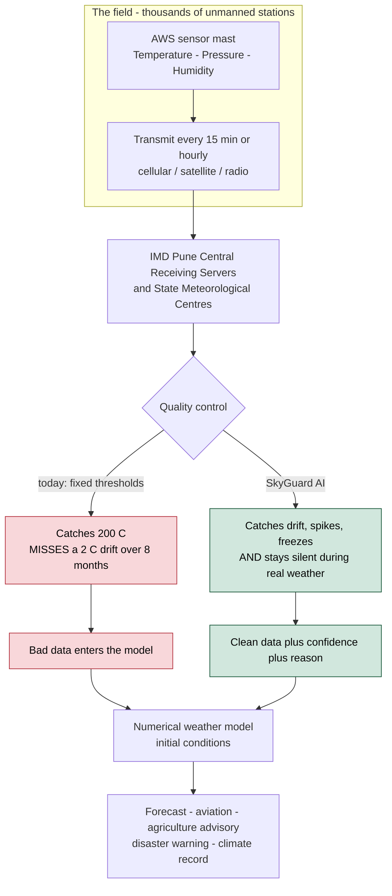
```mermaid
flowchart TD
    subgraph FIELD["The field - thousands of unmanned stations"]
        S1["AWS sensor mast<br/>Temperature - Pressure - Humidity"]
        S1 --> TX["Transmit every 15 min or hourly<br/>cellular / satellite / radio"]
    end

    TX --> RX["IMD Pune Central Receiving Servers<br/>and State Meteorological Centres"]
    RX --> QC{"Quality control"}

    QC -->|"today: fixed thresholds"| OLD["Catches 200 C<br/>MISSES a 2 C drift over 8 months"]
    QC -->|"SkyGuard AI"| NEW["Catches drift, spikes, freezes<br/>AND stays silent during real weather"]

    OLD --> BAD["Bad data enters the model"]
    NEW --> GOOD["Clean data plus confidence plus reason"]

    BAD --> M["Numerical weather model<br/>initial conditions"]
    GOOD --> M
    M --> OUT["Forecast - aviation - agriculture advisory<br/>disaster warning - climate record"]

    style OLD fill:#f8d7da,stroke:#b02a37,color:#000
    style NEW fill:#d1e7dd,stroke:#0f5132,color:#000
    style BAD fill:#f8d7da,stroke:#b02a37,color:#000
    style GOOD fill:#d1e7dd,stroke:#0f5132,color:#000
```

The left branch is the status quo. The right branch is what you are being asked to build. Everything in this document serves the right branch.


### The mandate

> Develop an AI/ML-based intelligent anomaly detection system capable of automatically identifying abnormal, inconsistent, or faulty observations from Automatic Weather Stations **in real time** using only the following parameters: Temperature (°C), Atmospheric Pressure (hPa), Relative Humidity (%).

### The seven stated objectives

| # | Objective | Where it is handled |
|---|---|---|
| 1 | Detect anomalies in real-time data streams | §16 architecture, all stages |
| 2 | Identify sensor faults, spikes, frozen values, communication errors | §8 taxonomy, §17–18 |
| 3 | Learn normal temporal and seasonal patterns | §19 temporal model |
| 4 | Multivariate consistency analysis among parameters | §18 physics, §10 |
| 5 | Confidence scores and explainable reasoning | §21, §22 |
| 6 | Predict sensor degradation and maintenance need | §23 |
| 7 | *(Optional)* Suggest corrected/imputed values | §21 |

### The expected outputs

Real-time anomaly alerts · severity and confidence scores · root-cause classification · visualisation dashboard · sensor health status · corrected data estimation (optional).

### The suggested technologies

The statement names two, and naming is a hint:

- **Explainable AI (SHAP/LIME)** — marked *"Preferable"*
- **Edge AI for low-power deployment on ESP32**

Both map to scored criteria. Implement both.

### The Grand Challenge

The statement closes with a question rather than a requirement:

> *"Can AI build a self-aware and self-healing weather observation network capable of delivering trustworthy atmospheric data under all environmental conditions?"*

Somebody wrote that hoping a team would answer it. Answering it explicitly is worth real marks under Innovation — see §26, Angle 3.

### The deliverable

> *"Fully executable code with example usage and a document explaining various use cases"*

Note what is **not** demanded: no trained model artefact, no deployment to IMD infrastructure. Executable code plus documentation. That is a light deliverable compared to most statements in the set.

---

## 4. The rubric, decoded

### Where the marks actually are

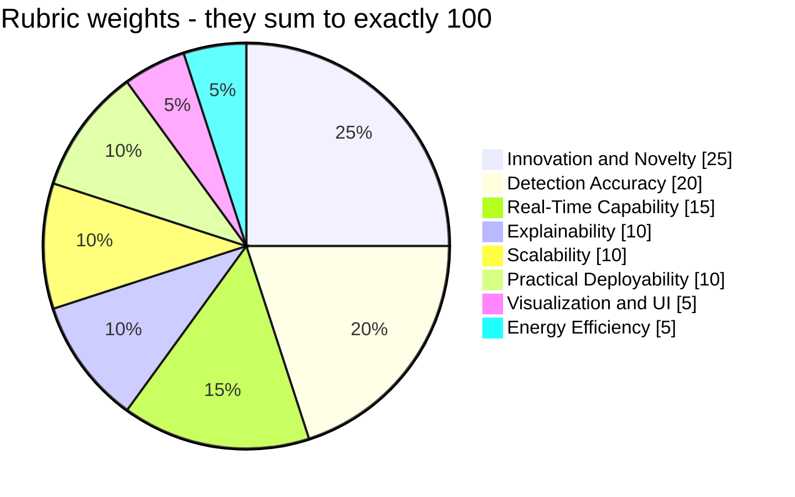
```mermaid
pie showData
    title Rubric weights - they sum to exactly 100
    "Innovation and Novelty" : 25
    "Detection Accuracy" : 20
    "Real-Time Capability" : 15
    "Explainability" : 10
    "Scalability" : 10
    "Practical Deployability" : 10
    "Visualization and UI" : 5
    "Energy Efficiency" : 5
```

Read what that picture says: **the model is worth one fifth.** The other four fifths are systems engineering plus one large innovation bet.


| Criterion | Weight | What actually earns it |
|---|---:|---|
| **Innovation & Novelty** | **25%** | A method that goes beyond published practice — see §13 and §26 |
| **Detection Accuracy** | 20% | Precision, recall, F1 on injected faults; and crucially, low false-alarm rate |
| **Real-Time Capability** | 15% | Streaming architecture with measured per-sample latency |
| **Explainability** | 10% | SHAP attributions per alert, plus human-readable reasons |
| **Scalability** | 10% | Evidence it works for thousands of stations, not one |
| **Practical Deployability** | 10% | Runs as a service, ingests real formats, documented, installable |
| **Visualization / UI** | 5% | Dashboard: live stream, alerts, sensor health |
| **Energy Efficiency** | 5% | Quantised model on ESP32 with a measured power figure |

### Read the shape of it

**Accuracy is only 20%.** IMD already knows anomaly-detection models are commodity. They are buying the *system* around the model — which is why the remaining 80% is distributed across engineering qualities.

**Forty percent — explainability, scalability, deployability, UI, energy — carries no research risk at all.** It is disciplined engineering. A careful team takes nearly all of it. Most competing teams will spend their entire effort on the model and leave that 40% on the table.

**Twenty-five percent is innovation, and it is a stated weight rather than a vibe.** That is unusual enough to be exploited deliberately. It also means a technically excellent but conventional submission caps out well below a merely-good submission with one genuine idea.

**Energy efficiency at 5% names ESP32.** A ₹300 board, a quantised model, one measured milliwatt figure. It is the cheapest 5% anywhere in SIH 2026.

### What this rubric implies about effort allocation

```
  Innovation (25%)      ████████████████████████░   two of the three angles in §26
  Accuracy (20%)        ████████████████████        the model, done competently
  Real-time (15%)       ███████████████             streaming design from day one
  Explainability (10%)  ██████████                  SHAP — roughly a day's work
  Scalability (10%)     ██████████                  architecture, then evidence
  Deployability (10%)   ██████████                  Docker, docs, real formats
  UI (5%)               █████                       one good dashboard
  Energy (5%)           █████                       ESP32 + one measurement
```

Do not let the model consume the project. It is worth one fifth.

---

## 5. How they will test you

The rubric carries a parenthetical that most readers will skim past:

> **"(To be evaluated in anomaly injected data)"**

They will take clean AWS observations, inject synthetic faults at known times, and score what you catch and what you miss.

**They have disclosed the scoring procedure.** The consequence is direct: build a fault-injection harness during development (§15) and you are testing against a replica of the real evaluation. You get labelled ground truth for free, you can compute precision and recall honestly, and you can tune the false-alarm rate deliberately.

Almost nothing else in the 155 statements hands you this. Use it.

One caution: because *they* choose the injection parameters and you choose yours, do not overfit to a single fault magnitude. Sweep across severities — a 0.5°C drift and a 20°C spike are different detection problems, and a system tuned only on the obvious ones will miss the subtle ones they include.

---
---

# Part III — Domain foundations

## 6. What an Automatic Weather Station is

### What an AWS is, and where its numbers go

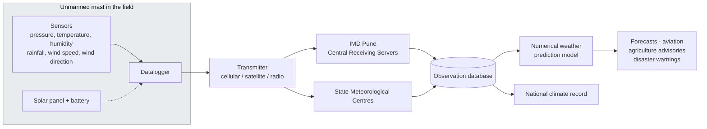
```mermaid
flowchart LR
    subgraph MAST["Unmanned mast in the field"]
        direction TB
        SEN["Sensors<br/>pressure, temperature, humidity<br/>rainfall, wind speed, wind direction"]
        LOG["Datalogger"]
        PWR["Solar panel + battery"]
        SEN --> LOG
        PWR -.-> LOG
    end
    LOG --> TX["Transmitter<br/>cellular / satellite / radio"]
    TX --> PUNE["IMD Pune<br/>Central Receiving Servers"]
    TX --> SMC["State Meteorological Centres"]
    PUNE --> DB[("Observation database")]
    SMC --> DB
    DB --> NWP["Numerical weather<br/>prediction model"]
    DB --> CLIM["National climate record"]
    NWP --> USE["Forecasts - aviation<br/>agriculture advisories<br/>disaster warnings"]

    style MAST fill:#e9ecef,stroke:#6c757d,color:#000
```

**This problem uses only three of those six sensors:** pressure, temperature, humidity. No wind, no rainfall.

**Network density matters to your design.** India runs roughly a third of the density the government considers necessary - the stated target is a station every 10 km in the plains and every 5 km in the hills, around 40,000 units. The spatial method in section 20 needs neighbours, and neighbour availability differs sharply between a dense plain and a sparse hill district. Handle the sparse case explicitly.

An unmanned installation, typically a mast carrying sensors, a datalogger, a power source (often solar with a battery) and a transmitter.

**What it measures.** A full IMD AWS records atmospheric pressure, air temperature, relative humidity, rainfall, wind speed and wind direction. **This problem uses only the first three.**

**How it reports.** At fixed intervals over cellular, satellite or radio. IMD monitors reception and quality round the clock at its Pune Central Receiving Servers and at State Meteorological Centres.

**How many.** India has roughly a third of the network density the government considers necessary — the stated target is an AWS every 10 km in the plains and every 5 km in the hills, around 40,000 units. This matters directly to your design: the spatial method in §20 needs neighbours, and neighbour availability varies a great deal between a dense plain and a sparse hill district. Handle the sparse case explicitly.

**Maintenance reality.** Units fail and stay failed. Reported cases include an entire 20-station state network non-functional for four or more months. This is not an abstract problem — it is precisely the failure the sensor-health forecasting in §23 addresses.

---

## 7. Why bad readings matter

### The two damage chains

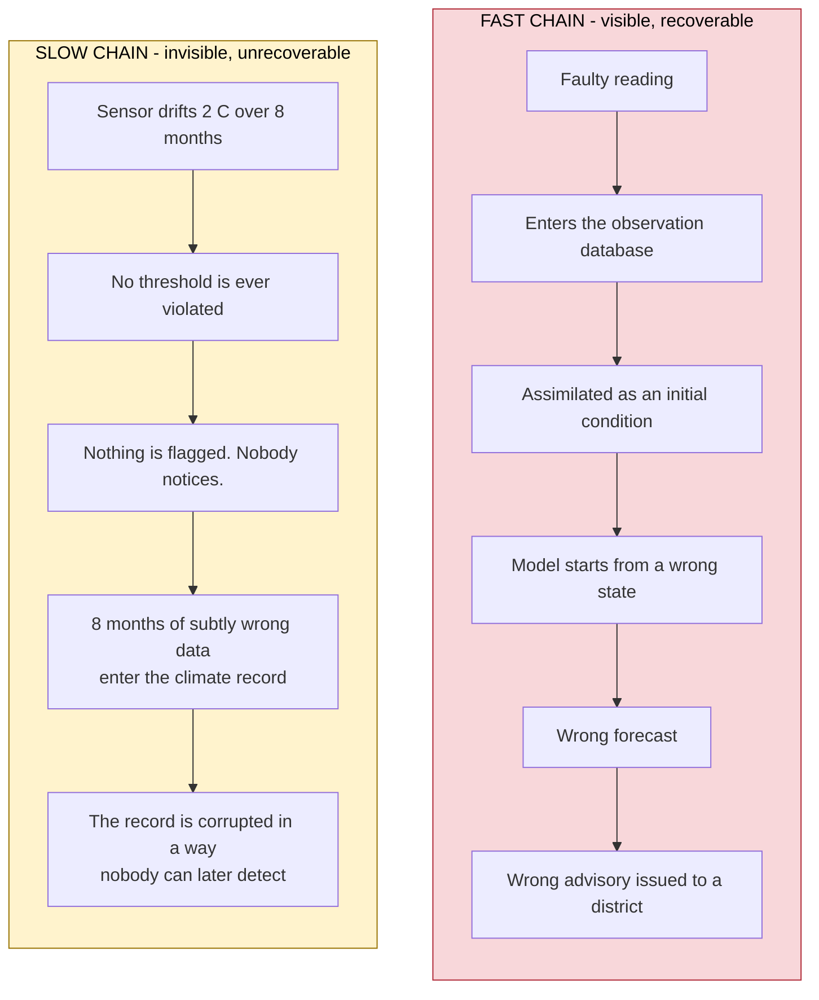
```mermaid
flowchart TD
    subgraph FAST["FAST CHAIN - visible, recoverable"]
        direction TB
        A1["Faulty reading"] --> A2["Enters the observation database"]
        A2 --> A3["Assimilated as an initial condition"]
        A3 --> A4["Model starts from a wrong state"]
        A4 --> A5["Wrong forecast"]
        A5 --> A6["Wrong advisory issued to a district"]
    end

    subgraph SLOW["SLOW CHAIN - invisible, unrecoverable"]
        direction TB
        B1["Sensor drifts 2 C over 8 months"] --> B2["No threshold is ever violated"]
        B2 --> B3["Nothing is flagged. Nobody notices."]
        B3 --> B4["8 months of subtly wrong data<br/>enter the climate record"]
        B4 --> B5["The record is corrupted in a way<br/>nobody can later detect"]
    end

    style FAST fill:#f8d7da,stroke:#b02a37,color:#000
    style SLOW fill:#fff3cd,stroke:#997404,color:#000
```

The slow chain is why this problem is filed under Disaster Management, and it is why drift detection is the technically valuable half of the work. The fast chain is annoying. The slow chain is permanent.

The chain from a bad number to a bad outcome is short:

```
faulty sensor reading
        ↓
enters the observation database
        ↓
assimilated as an initial condition in the forecast model
        ↓
the model starts from a wrong state
        ↓
wrong forecast
        ↓
wrong advisory issued to a district
```

And a second chain, slower but worse:

```
sensor drifts 2°C over eight months
        ↓
no threshold is ever violated, so nothing is flagged
        ↓
eight months of subtly wrong data enter the climate record
        ↓
the record is corrupted in a way nobody can later detect
```

That second chain is why this problem is filed under Disaster Management, and it is why drift detection is the technically valuable part of the work.

### What goes wrong physically

| Cause named in the statement | Physical mechanism |
|---|---|
| Sensor malfunction | Component degradation or outright failure |
| Communication failure | Lost, duplicated or corrupted packets |
| Calibration drift | Slow loss of accuracy while readings stay plausible |
| Power fluctuation | Brownouts producing garbage during the dip |
| Harsh environmental conditions | Salt, dust, insects, ice, lightning, radiation shield fouling |
| Data corruption | Bit errors in transmission or storage |

---

## 8. The anomaly taxonomy

### Deciding what kind of wrong you are looking at

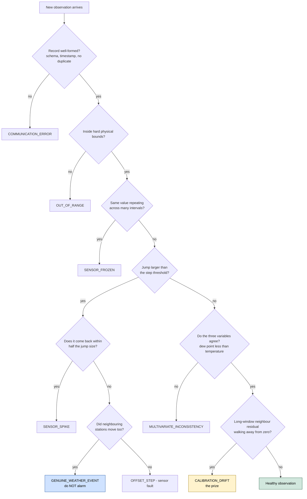
```mermaid
flowchart TD
    R["New observation arrives"] --> A{"Record well-formed?<br/>schema, timestamp, no duplicate"}
    A -->|no| CE["COMMUNICATION_ERROR"]
    A -->|yes| B{"Inside hard physical bounds?"}
    B -->|no| OOR["OUT_OF_RANGE"]
    B -->|yes| C{"Same value repeating<br/>across many intervals?"}
    C -->|yes| FR["SENSOR_FROZEN"]
    C -->|no| D{"Jump larger than<br/>the step threshold?"}
    D -->|yes| E{"Does it come back within<br/>half the jump size?"}
    E -->|yes| SP["SENSOR_SPIKE"]
    E -->|no| FQ{"Did neighbouring<br/>stations move too?"}
    FQ -->|yes| WX["GENUINE_WEATHER_EVENT<br/>do NOT alarm"]
    FQ -->|no| OFF["OFFSET_STEP - sensor fault"]
    D -->|no| G{"Do the three variables agree?<br/>dew point less than temperature"}
    G -->|no| MV["MULTIVARIATE_INCONSISTENCY"]
    G -->|yes| H{"Long-window neighbour residual<br/>walking away from zero?"}
    H -->|yes| DR["CALIBRATION_DRIFT<br/>the prize"]
    H -->|no| OK["Healthy observation"]

    style WX fill:#cfe2ff,stroke:#084298,color:#000
    style DR fill:#fff3cd,stroke:#997404,color:#000
    style OK fill:#d1e7dd,stroke:#0f5132,color:#000
```

Two boxes are highlighted for a reason. `GENUINE_WEATHER_EVENT` is the trap - flagging it destroys the data a forecaster most needs. `CALIBRATION_DRIFT` is the prize - published practice does not catch it. Everything in between is a solved problem you implement correctly and move past.


Each fault type has a distinct signature and wants a distinct detector. Building one model to catch all of them is the naive approach and it performs worse than the staged design in §16.

| Type | What it looks like | Detector | Difficulty |
|---|---|---|---|
| **Out-of-range** | Physically impossible value | Hard bounds | Trivial |
| **Spike** | One sample jumps impossibly, next returns to normal | Step check with bidirectional search (§12) | Easy |
| **Frozen / stuck** | Identical value repeated across many intervals | Rolling standard deviation below a floor | Easy, and commonly missed |
| **Communication error** | Gaps, duplicate timestamps, garbage | Schema and timestamp validation | Easy |
| **Multivariate inconsistency** | Each value plausible alone, combination impossible | Cross-variable physics (§10) | Moderate |
| **Calibration drift** | Slow bias; every reading plausible | Spatial comparison or long-run climatology | **Hard — this is the prize** |
| **Genuine weather event** | Large, fast, real change | Must **not** be flagged | **Hard — this is the trap** |

The last two rows are where the marks are. The first five are solved problems you implement correctly and move past.

---

## 9. The hard part: real weather vs sensor fault

### Two signals that look identical to a naive detector

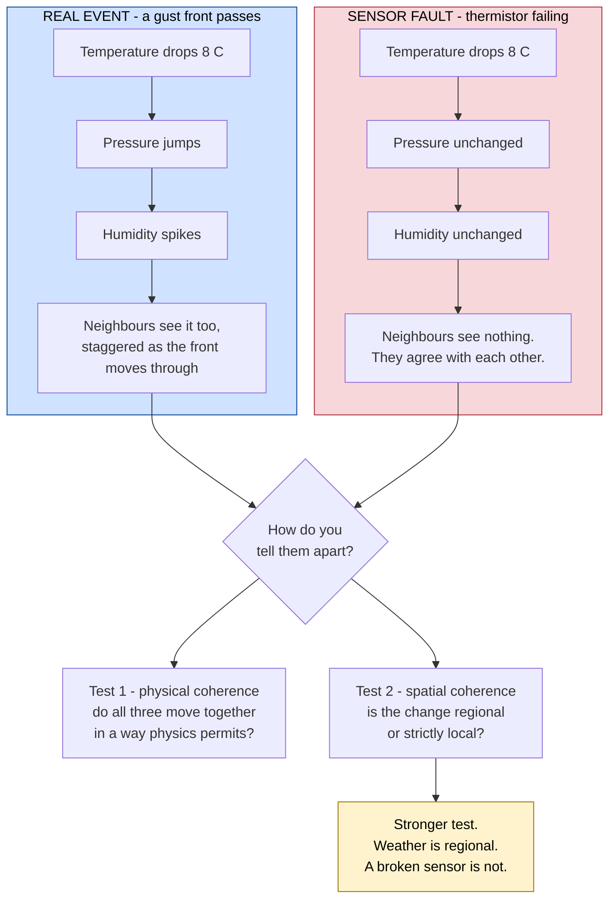
```mermaid
flowchart TD
    subgraph REAL["REAL EVENT - a gust front passes"]
        direction TB
        R1["Temperature drops 8 C"] --> R2["Pressure jumps"] --> R3["Humidity spikes"]
        R3 --> R4["Neighbours see it too,<br/>staggered as the front moves through"]
    end

    subgraph FAULT["SENSOR FAULT - thermistor failing"]
        direction TB
        F1["Temperature drops 8 C"] --> F2["Pressure unchanged"] --> F3["Humidity unchanged"]
        F3 --> F4["Neighbours see nothing.<br/>They agree with each other."]
    end

    R4 --> Q{"How do you<br/>tell them apart?"}
    F4 --> Q
    Q --> A1["Test 1 - physical coherence<br/>do all three move together<br/>in a way physics permits?"]
    Q --> A2["Test 2 - spatial coherence<br/>is the change regional<br/>or strictly local?"]
    A2 --> WIN["Stronger test.<br/>Weather is regional.<br/>A broken sensor is not."]

    style REAL fill:#cfe2ff,stroke:#084298,color:#000
    style FAULT fill:#f8d7da,stroke:#b02a37,color:#000
    style WIN fill:#fff3cd,stroke:#997404,color:#000
```

Magnitude cannot separate them - both are large and fast. Only coherence can.


Take a thunderstorm gust front passing a station. Within ten minutes:

- temperature drops sharply, often 8–10°C
- pressure jumps
- relative humidity spikes

To a naive detector this is a textbook multi-parameter sensor fault. It is in fact a textbook mesoscale weather event — and it is *exactly* the data a forecaster most needs. Flagging it is worse than useless.

Now take a failing temperature sensor producing a comparable drop. **Statistically almost identical. Opposite correct action.**

So magnitude cannot be the discriminator. Two things can:

**1. Physical coherence.** In a real gust front, all three parameters move together in a physically consistent way. A failing temperature sensor moves temperature while pressure and humidity carry on as before — and the derived dew point may become impossible. Internal consistency separates them.

**2. Spatial coherence.** Weather is a regional phenomenon. A gust front sweeps a corridor and *several* stations see it, staggered in time as it passes. A broken sensor is a strictly local event — one station disagrees with every neighbour simultaneously.

Spatial coherence is the stronger of the two, and it is the basis of §26 Angle 1.

`✶ Insight ─────────────────────────────────────`
This problem inverts the usual anomaly-detection objective. Recall is easy — flag everything unusual and you catch every fault. The statement explicitly asks for *"minimizing false alarms"*, which means precision is the binding constraint, and precision here requires physical reasoning rather than statistical sensitivity.
A detector that never fires during real weather is worth more to IMD than one with slightly higher recall, because a false alarm destroys good data while a missed subtle fault merely fails to improve it.
`─────────────────────────────────────────────────`

---

## 10. The physics of three variables

### What the three variables constrain about one another

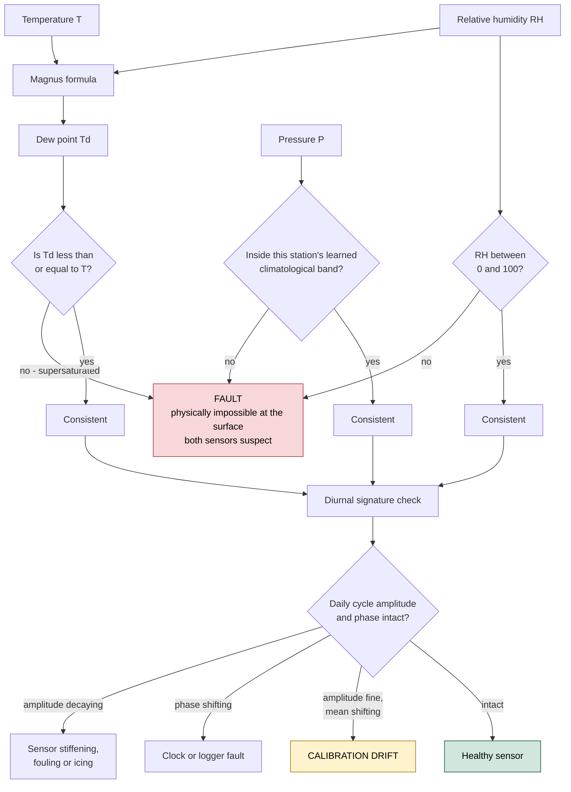
```mermaid
flowchart TD
    T["Temperature T"] --> MAG["Magnus formula"]
    RH["Relative humidity RH"] --> MAG
    MAG --> TD["Dew point Td"]
    TD --> CHK{"Is Td less than<br/>or equal to T?"}
    CHK -->|"no - supersaturated"| FAULT["FAULT<br/>physically impossible at the surface<br/>both sensors suspect"]
    CHK -->|yes| OK1["Consistent"]

    RH --> B{"RH between<br/>0 and 100?"}
    B -->|no| FAULT
    B -->|yes| OK2["Consistent"]

    P["Pressure P"] --> BAND{"Inside this station's learned<br/>climatological band?"}
    BAND -->|no| FAULT
    BAND -->|yes| OK3["Consistent"]

    OK1 --> DI["Diurnal signature check"]
    OK2 --> DI
    OK3 --> DI
    DI --> DIQ{"Daily cycle amplitude<br/>and phase intact?"}
    DIQ -->|"amplitude decaying"| DEG["Sensor stiffening,<br/>fouling or icing"]
    DIQ -->|"phase shifting"| CLK["Clock or logger fault"]
    DIQ -->|"amplitude fine,<br/>mean shifting"| DRIFT["CALIBRATION DRIFT"]
    DIQ -->|intact| HEALTHY["Healthy sensor"]

    style FAULT fill:#f8d7da,stroke:#b02a37,color:#000
    style DRIFT fill:#fff3cd,stroke:#997404,color:#000
    style HEALTHY fill:#d1e7dd,stroke:#0f5132,color:#000
```

**Not one of these checks needs a single row of training data.** That is what makes them cheap enough for an ESP32 and fast enough for the real-time criterion - and it is why the three-parameter restriction is an advantage rather than a limitation.

### The daily rhythm a healthy station shows

```
   TEMPERATURE                RELATIVE HUMIDITY          PRESSURE
   peaks mid-afternoon        inverse to temperature     semidiurnal tide

        /\                      \        /                /\      /\
       /  \                      \      /                /  \    /  \
      /    \                      \    /                /    \  /    \
   __/      \__                    \__/              __/      \/      \__
   06  12  18  24                06  12  18  24        06  12  18  24
       ^peak                          ^trough           ^two peaks per day

   A station that FLATTENS any of these has a stiffening or drifting sensor,
   even while every individual value still looks perfectly reasonable.
```


The three-parameter restriction reads like a limitation. It is in fact an advantage: with only three variables, the physical relationships between them are **fully enumerable**, and every one gives you a check that needs no training data at all.

### Dew point must not exceed temperature

Dew point is computed from temperature and relative humidity using the Magnus approximation:

```
γ(T, RH) = ln(RH/100) + (a·T)/(b + T)

Td = (b · γ) / (a − γ)

with a ≈ 17.27,  b ≈ 237.7 °C     (valid roughly 0–60 °C)
```

**`Td > T` is physically near-impossible at the surface.** Condensation nuclei are plentiful there, so supersaturated air condenses rather than persisting. A record showing it is a reliable fault signature.

This exact check is standard practice — WeatherReal calls it the *supersaturation check* and removes both parameters when it triggers (§12).

### Relative humidity is bounded

RH lies in `[0, 100]`. Beyond that is a fault. And a subtler signature: an RH sensor pinned at or near 100% for a long period in conditions that are demonstrably not saturated indicates a wet or failed capacitive element.

### Station pressure lives in a narrow band

Atmospheric pressure at a fixed station varies within a fairly tight range around a mean set by its altitude. Excursions of tens of hPa are instrument problems, not atmosphere. Learn each station's climatological band from its own history rather than hard-coding one.

### The diurnal signature

Healthy sensors carry a daily rhythm:

- **Temperature** peaks in mid-afternoon, minimum near dawn
- **Relative humidity** runs inversely to temperature — as air warms it moves further from saturation
- **Pressure** carries a **semidiurnal tide**, two maxima and two minima per day, driven by solar atmospheric heating and clearly visible at Indian latitudes

**A station that loses its diurnal signature has a stuck or drifting sensor even when every value looks reasonable.** This is a drift detector that needs no neighbours — useful precisely where the spatial method is weakest, in sparsely instrumented hill districts.

Implementation: fit the expected diurnal shape from the station's own history, then track how well recent data matches it. A collapsing amplitude or a shifting phase is a degrading sensor.

### The anti-correlation between T and RH

Over the daily cycle, temperature and relative humidity are strongly anti-correlated. Track the rolling correlation. When it breaks down at a station without a corresponding weather event, one of the two sensors is failing — and comparing each against its own diurnal fit tells you which.

---
---

# Part IV — The state of practice

This part matters more than it looks. Your Innovation 25% is judged against what already exists, so you need to know exactly what that is — and being able to name it in the pitch is itself a credibility signal to an IMD panel.

## 11. WMO standard quality control

### The standard battery, as a pipeline


```mermaid
flowchart LR
    OBS["Observation"] --> L1["At the station<br/>basic checks"]
    L1 --> L2["At the national Data Processing Centre<br/>elaborate repeat"]
    L2 --> CHECKS

    subgraph CHECKS["WMO check battery"]
        direction TB
        C1["Record structure validation"]
        C2["Range / plausibility limits"]
        C3["Step check - versus previous observation"]
        C4["Persistence / flat-line test"]
        C5["Spike test"]
        C6["Internal consistency - logical relations"]
        C7["Temporal consistency - longer period"]
        C8["Spatial consistency - against neighbours"]
    end

    CHECKS --> FLAG["Flagged observation<br/>with a reason code"]

    style CHECKS fill:#e9ecef,stroke:#6c757d,color:#000
```

WMO names three statistical tests specifically: the **flat line test**, the **step check** and the **spike test**. IMD follows these standards, which is exactly why implementing them faithfully - then positioning your AI layer as what goes *beyond* them - is an argument this panel is equipped to evaluate.

IMD follows WMO standards. WMO's guidelines for AWS data define a standard battery of checks, applied first at the station and then in more elaborate form at the national Data Processing Centre:

| Check | What it does |
|---|---|
| **Data record structure validation** | Is the record well-formed? |
| **Range / plausibility limits** | Is the value inside physical and climatological bounds? |
| **Step check** | Did the value change too much versus the previous observation? |
| **Persistence / flat-line test** | Has the value been constant for too long? |
| **Spike test** | Isolated implausible excursion |
| **Internal consistency** | Do logical relations among variables hold? |
| **Temporal consistency** | Does the value hold up over a longer measurement period? |
| **Spatial consistency** | Does the station agree with its neighbours? |

WMO specifically recommends three statistical tests: the **flat line test**, the **step check**, and the **spike test**.

**Why you should implement all of these.** Two reasons, both practical. First, they are cheap, deterministic and catch a large fraction of real faults with no inference cost — which directly serves your Real-Time 15% and Energy 5%. Second, and more important for the pitch: **framing your deterministic stages as a faithful WMO implementation, then positioning your AI layer as what goes beyond WMO, is exactly the argument an IMD judge is equipped to evaluate.** It says you understand their operational world rather than only your toolkit.

## 12. WeatherReal — published, implementable algorithms

### Neighbour selection, and why the quadrant rule exists

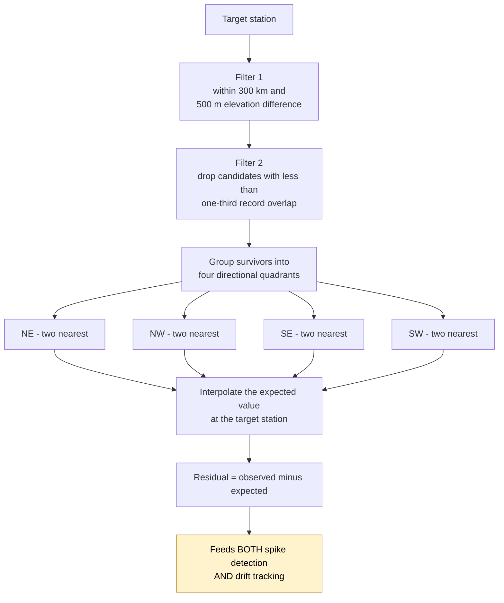
```mermaid
flowchart TD
    T["Target station"] --> F1["Filter 1<br/>within 300 km and<br/>500 m elevation difference"]
    F1 --> F2["Filter 2<br/>drop candidates with less than<br/>one-third record overlap"]
    F2 --> Q["Group survivors into<br/>four directional quadrants"]
    Q --> NE["NE - two nearest"]
    Q --> NW["NW - two nearest"]
    Q --> SE["SE - two nearest"]
    Q --> SW["SW - two nearest"]
    NE --> EST["Interpolate the expected value<br/>at the target station"]
    NW --> EST
    SE --> EST
    SW --> EST
    EST --> RES["Residual = observed minus expected"]
    RES --> USE["Feeds BOTH spike detection<br/>AND drift tracking"]

    style USE fill:#fff3cd,stroke:#997404,color:#000
```

```
   WITHOUT quadrants                   WITH quadrants

     . . . . .                              .        .
     . . . . .   T                        .   NW  NE   .
     . . . . .                                   T
                                          .   SW  SE   .
   Eight neighbours, all west.              .        .
   Any real east-west gradient
   reads as a fault at T.                 Two per quadrant.
                                          A gradient cancels out.
```

That is the whole reason for the rule. Without it, a station on the edge of a dense cluster is compared almost entirely against one direction, and a genuine spatial gradient is misread as a sensor fault.

### Spike detection - the bidirectional search

```
value
  |                    X   <-- flagged: jump exceeds threshold
  |                   / \
  |                  /   \
  |  ---------------     ---------------   returns to within HALF the jump
  |                                        => SPIKE  (transient fault)
  +-------------------------------------- time


value
  |                    X-----------------  jump exceeds threshold
  |                   /                    but never returns
  |                  /
  |  ---------------                       => STEP  (real weather, or offset fault)
  +-------------------------------------- time
```

That search is the entire difference between a spike and a genuine step change. A raw delta threshold flags both cases identically - reproduce the search instead.

Microsoft's **WeatherReal** benchmark publishes a concrete, open quality-control pipeline for in-situ station observations, with a public repository. These are not vague principles; they are algorithms with parameters you can implement directly.

### Neighbouring station check

The most useful piece for this project:

- Candidate neighbours: stations within **300 km** and **500 m elevation difference**
- Candidates with less than **one-third record overlap** with the target are discarded
- Remaining candidates are grouped into **four directional quadrants** (NE, NW, SE, SW)
- Up to **two nearest stations per quadrant** are selected

That quadrant rule exists to stop a cluster of stations on one side dominating the comparison and biasing the estimate — a subtlety worth reproducing and worth mentioning aloud, because it shows you read the method rather than the abstract.

### Spike check

- Fixed thresholds detect abnormal rate of change within a **3-hour window**
- When a record differs from the previous by more than the threshold, **both** records are flagged
- A **bidirectional search** then finds the end of the spike: it continues until the value jumps back in the opposite direction by more than the threshold, and the new value is close to the pre-spike record — specifically, differing by less than **half the initial spike change**

The bidirectional search is what separates a spike (goes out, comes back) from a genuine step change in the weather (goes out, stays out). Reproduce it.

### Persistence check

- Compute the standard deviation of values within a **variable-length sliding window**
- If it falls below an acceptable minimum, flag every record in the window

### Cross-variable supersaturation check

- Verify dew point does not exceed air temperature
- Where it does, remove **both** parameters — you know something is wrong but not which sensor

### How to use this

**Implement WeatherReal's pipeline as your published baseline, and say so.** Then measure how much your additions improve on it. That single decision does three things at once:

1. It gives your ablation a credible, citable reference point instead of a strawman
2. It proves you surveyed the field, which is the first thing a research-literate judge checks
3. It makes your innovation claim *specific* — "better than WeatherReal's neighbour check on drift, by this margin" — rather than generic

---

## 13. What the state of practice misses — your opening

### The gap, drawn

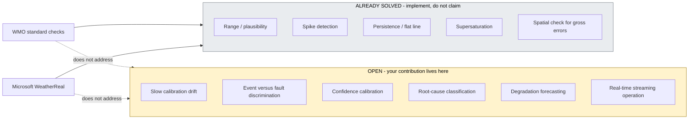
```mermaid
flowchart LR
    WMO["WMO standard checks"] --> SOLVED
    WR["Microsoft WeatherReal"] --> SOLVED

    subgraph SOLVED["ALREADY SOLVED - implement, do not claim"]
        direction TB
        A1["Range / plausibility"]
        A2["Spike detection"]
        A3["Persistence / flat line"]
        A4["Supersaturation"]
        A5["Spatial check for gross errors"]
    end

    subgraph OPEN["OPEN - your contribution lives here"]
        direction TB
        B1["Slow calibration drift"]
        B2["Event versus fault discrimination"]
        B3["Confidence calibration"]
        B4["Root-cause classification"]
        B5["Degradation forecasting"]
        B6["Real-time streaming operation"]
    end

    WMO -.->|"does not address"| OPEN
    WR -.->|"does not address"| OPEN

    style SOLVED fill:#e9ecef,stroke:#6c757d,color:#000
    style OPEN fill:#fff3cd,stroke:#997404,color:#000
```

The pattern to notice: published quality control is **retrospective and batch** - it cleans an archive after the fact. IMD is asking for something **real-time, self-explaining and predictive.** Five of the six open items are explicit objectives in the problem statement.

Having established what exists, here is the honest gap analysis. This is where your 25% comes from.

| Capability | WMO checks | WeatherReal | Your opportunity |
|---|:---:|:---:|---|
| Range / plausibility | ✓ | ✓ | Implement, don't claim |
| Spike detection | ✓ | ✓ | Implement, don't claim |
| Persistence / flat line | ✓ | ✓ | Implement, don't claim |
| Cross-variable consistency | ✓ | ✓ (supersaturation) | **Extend** — diurnal structure, T–RH correlation |
| Spatial consistency | ✓ (principle) | ✓ (algorithm) | **Extend** — apply to *drift*, not just spikes |
| **Slow calibration drift** | ✗ | ✗ | **Open** |
| **Event vs fault discrimination** | ✗ | ✗ | **Open** |
| **Confidence calibration** | ✗ | ✗ | **Open** |
| **Root-cause classification** | ✗ | ✗ | **Open** |
| **Sensor degradation forecasting** | ✗ | ✗ | **Open** |
| **Corrected-value imputation** | ✗ | partial | **Open** |
| **Real-time streaming operation** | ✗ (batch) | ✗ (batch) | **Open** |

Note the pattern. Published QC is **retrospective and batch** — it cleans an archive after the fact. IMD is asking for something **real-time, self-explaining and predictive**. Five of the seven open rows are explicit objectives in the problem statement.

The gap is real, it is stated by the customer, and it is addressable in your timeline.

---
---

# Part V — Data

## 14. Where to get AWS data

The `Dataset Link` field is empty, but the statement grants latitude:

> *"Participants may use historical AWS datasets, simulated anomalies, or streaming sensor data."*

| Source | What it gives you | Use it for |
|---|---|---|
| **NOAA Integrated Surface Database (ISD)** | Free global hourly station observations including Indian stations, carrying temperature, pressure and humidity | **The workhorse.** Training and evaluation |
| **Open-Meteo / Meteostat historical APIs** | Free, simple HTTP access to historical station data | Rapid prototyping |
| **IMD public portals** | The authentic Indian source | The demo, and format realism |
| **Your own ESP32 + BME280 sensor** | A live station on the demo table | Energy criterion, and an excellent physical prop |

**Practical caution.** IMD has restricted access to parts of its AWS/ARG data portal, which has been publicly criticised. Do not architect around guaranteed access to live IMD feeds. Build on NOAA ISD, and treat IMD data as a bonus for demo realism.

**What you actually need from the data:**

- Multiple stations with **known coordinates and elevation** — mandatory for the spatial method
- **Geographic density** — neighbours within 300 km, per WeatherReal's rule
- At least **one full year** per station, so the model sees seasonal structure
- **Sub-hourly if available**, since real-time claims are more convincing at higher frequency

Verify density early. If your chosen source is sparse over India, the spatial angle weakens and you should lean harder on the diurnal method in §10, which needs no neighbours.

## 15. The fault-injection harness

### The harness, and why it mirrors their scoring

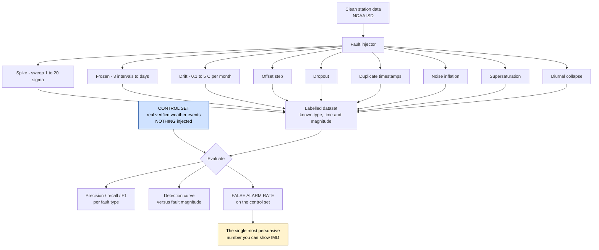
```mermaid
flowchart TD
    CLEAN["Clean station data<br/>NOAA ISD"] --> INJ["Fault injector"]

    INJ --> S1["Spike - sweep 1 to 20 sigma"]
    INJ --> S2["Frozen - 3 intervals to days"]
    INJ --> S3["Drift - 0.1 to 5 C per month"]
    INJ --> S4["Offset step"]
    INJ --> S5["Dropout"]
    INJ --> S6["Duplicate timestamps"]
    INJ --> S7["Noise inflation"]
    INJ --> S8["Supersaturation"]
    INJ --> S9["Diurnal collapse"]

    S1 --> LAB["Labelled dataset<br/>known type, time and magnitude"]
    S2 --> LAB
    S3 --> LAB
    S4 --> LAB
    S5 --> LAB
    S6 --> LAB
    S7 --> LAB
    S8 --> LAB
    S9 --> LAB

    CTRL["CONTROL SET<br/>real verified weather events<br/>NOTHING injected"] --> EVAL
    LAB --> EVAL{"Evaluate"}

    EVAL --> M1["Precision / recall / F1<br/>per fault type"]
    EVAL --> M2["Detection curve<br/>versus fault magnitude"]
    EVAL --> M3["FALSE ALARM RATE<br/>on the control set"]
    M3 --> WIN["The single most persuasive<br/>number you can show IMD"]

    style CTRL fill:#cfe2ff,stroke:#084298,color:#000
    style WIN fill:#fff3cd,stroke:#997404,color:#000
```

The statement says evaluation happens *"in anomaly injected data."* They disclosed the method - this harness is a replica of it, so you can tune the false-alarm rate deliberately instead of discovering it on the day.

**The control set is what most teams will skip.** Records containing real, verified extreme weather with nothing injected. Your false-alarm rate on that set is what proves you solved the discrimination problem in section 9.

Because they told you the evaluation is on anomaly-injected data, this harness is not a testing convenience — it is a replica of the scoring procedure. Build it in week one.

```
clean station data
        ↓
inject faults at known times, known types, known magnitudes
        ↓
labelled dataset  →  train  /  evaluate  /  tune false-alarm rate
```

### What to inject

| Fault | Parameters to sweep |
|---|---|
| **Spike** | Magnitude 1σ to 20σ; single-sample and multi-sample |
| **Frozen value** | Duration from 3 intervals to several days |
| **Drift** | Rate from 0.1 °C/month to 5 °C/month, linear and exponential |
| **Offset step** | Sudden constant bias — a recalibration gone wrong |
| **Dropout** | Missing records, single and in runs |
| **Duplicate timestamps** | Communication-layer faults |
| **Noise inflation** | Variance increase with no bias — early degradation |
| **Supersaturation** | Force `Td > T` |
| **Diurnal collapse** | Attenuate the daily amplitude progressively |

### The critical control set

**Inject nothing into a set of records containing real, verified extreme weather events** — a monsoon onset, a cyclone passage, a heatwave, a gust front. Your false-alarm rate on this set is the number that proves you solved §9. Report it separately and prominently. It is the single most persuasive figure you can put in front of an IMD judge.

### Sweep severity, do not pick one

A detector tuned on 10°C spikes will miss 1°C drift entirely. Report a **detection curve against fault magnitude**, not a single accuracy number. That curve is also a strong dashboard visual.

---
---

# Part VI — System design

## 16. Architecture

### The five stages, and what each one costs

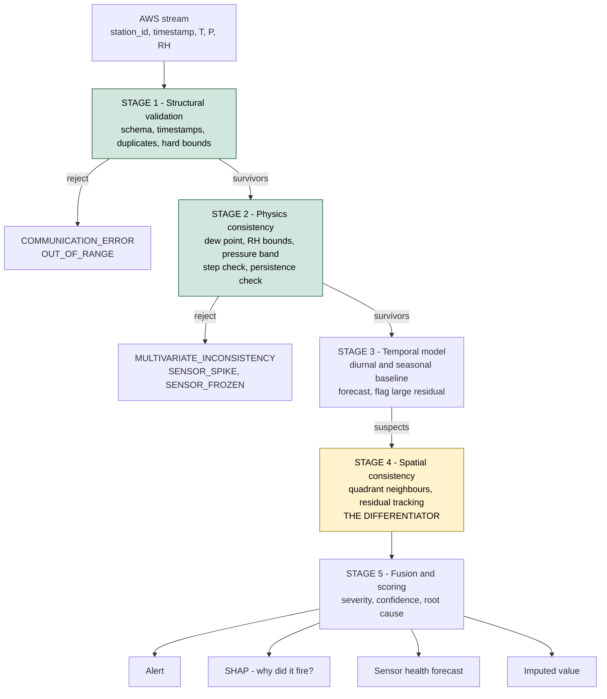
```mermaid
flowchart TD
    IN["AWS stream<br/>station_id, timestamp, T, P, RH"] --> S1

    S1["STAGE 1 - Structural validation<br/>schema, timestamps, duplicates, hard bounds"]
    S1 -->|"reject"| R1["COMMUNICATION_ERROR<br/>OUT_OF_RANGE"]
    S1 -->|"survivors"| S2

    S2["STAGE 2 - Physics consistency<br/>dew point, RH bounds, pressure band<br/>step check, persistence check"]
    S2 -->|"reject"| R2["MULTIVARIATE_INCONSISTENCY<br/>SENSOR_SPIKE, SENSOR_FROZEN"]
    S2 -->|"survivors"| S3

    S3["STAGE 3 - Temporal model<br/>diurnal and seasonal baseline<br/>forecast, flag large residual"]
    S3 -->|"suspects"| S4

    S4["STAGE 4 - Spatial consistency<br/>quadrant neighbours, residual tracking<br/>THE DIFFERENTIATOR"]
    S4 --> S5

    S5["STAGE 5 - Fusion and scoring<br/>severity, confidence, root cause"]
    S5 --> O1["Alert"]
    S5 --> O2["SHAP - why did it fire?"]
    S5 --> O3["Sensor health forecast"]
    S5 --> O4["Imputed value"]

    style S1 fill:#d1e7dd,stroke:#0f5132,color:#000
    style S2 fill:#d1e7dd,stroke:#0f5132,color:#000
    style S4 fill:#fff3cd,stroke:#997404,color:#000
```

### Why staged rather than one model

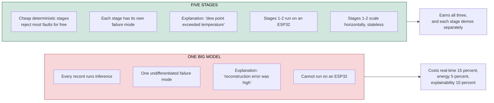
```mermaid
flowchart LR
    subgraph MONO["ONE BIG MODEL"]
        direction TB
        M1["Every record runs inference"]
        M2["One undifferentiated failure mode"]
        M3["Explanation: 'reconstruction error was high'"]
        M4["Cannot run on an ESP32"]
    end

    subgraph STAGED["FIVE STAGES"]
        direction TB
        T1["Cheap deterministic stages<br/>reject most faults for free"]
        T2["Each stage has its own failure mode"]
        T3["Explanation: 'dew point exceeded temperature'"]
        T4["Stages 1-2 run on an ESP32"]
        T5["Stages 1-2 scale horizontally, stateless"]
    end

    MONO --> BAD["Costs real-time 15 percent,<br/>energy 5 percent,<br/>explainability 10 percent"]
    STAGED --> GOOD["Earns all three,<br/>and each stage demos separately"]

    style MONO fill:#f8d7da,stroke:#b02a37,color:#000
    style STAGED fill:#d1e7dd,stroke:#0f5132,color:#000
```

Five reasons, and each maps to a scored criterion: **cost** (real-time and energy), **explainability** (a physical reason beats a reconstruction error), **diagnosability**, **scalability** (stateless early stages), and **demo value** (progressive sophistication rather than a black box).

```
  AWS stream:  station_id, timestamp, T (°C), P (hPa), RH (%)
            │
            ▼
  ┌──────────────────────────────────┐
  │ STAGE 1 — Structural validation  │  deterministic · microseconds
  │  schema · timestamp continuity   │  no training data
  │  duplicates · hard range bounds  │
  └───────────────┬──────────────────┘
                  │ survivors
                  ▼
  ┌──────────────────────────────────┐
  │ STAGE 2 — Physics consistency    │  deterministic · microseconds
  │  dew point ≤ temperature         │  no training data
  │  RH ∈ [0,100] · pressure band    │  WMO + WeatherReal checks
  │  step check · persistence check   │
  └───────────────┬──────────────────┘
                  │ survivors
                  ▼
  ┌──────────────────────────────────┐
  │ STAGE 3 — Temporal model         │  learned, per station
  │  diurnal + seasonal baseline     │
  │  forecast next value             │
  │  flag large residual             │
  └───────────────┬──────────────────┘
                  │ suspects
                  ▼
  ┌──────────────────────────────────┐
  │ STAGE 4 — Spatial consistency    │  ← THE DIFFERENTIATOR
  │  quadrant-selected neighbours    │
  │  expected value + residual       │
  │  weather = regional              │
  │  fault  = local                  │
  └───────────────┬──────────────────┘
                  ▼
  ┌──────────────────────────────────┐
  │ STAGE 5 — Fusion & scoring       │
  │  severity · confidence           │
  │  root-cause classification       │
  └───────────────┬──────────────────┘
       ┌──────────┼──────────┬─────────────────┐
       ▼          ▼          ▼                 ▼
    Alert     SHAP: why?  Sensor health   Imputed value
                          forecast        (optional)
```

### Why staged rather than one model

**Cost.** Stages 1 and 2 are deterministic and effectively free. They catch a large share of real faults before any inference runs. Only survivors reach the expensive learned stages. This is what makes the Real-Time 15% and Energy 5% achievable simultaneously — a single monolithic deep model would compromise both.

**Explainability.** Each stage produces a different *kind* of reason. "Dew point exceeded temperature" is a complete, checkable explanation. "The autoencoder reconstruction error was high" is not. Stage structure gives you the Explainability 10% almost for free.

**Diagnosability.** When something is wrong you know which stage produced it. A monolithic model gives you one undifferentiated failure.

**Scalability.** Stages 1–2 are stateless and scale horizontally without limit. Stage 3 is per-station and small. Only Stage 4 needs cross-station coordination. This structure *is* your Scalability 10% argument.

**Demo.** Each stage is separately demonstrable, so you can show progressive sophistication rather than a black box.

---

## 17. Stage 1 — Structural validation

Deterministic, no training, runs on every record.

- **Schema** — are all fields present and correctly typed?
- **Timestamp continuity** — expected interval, gaps, duplicates, out-of-order arrivals
- **Duplicate detection** — the same record transmitted twice
- **Hard range bounds** — physically impossible values (`RH` outside `[0,100]`; temperature outside plausible terrestrial extremes; pressure far outside any station's possible band)

This layer catches most communication-class faults and costs nothing. Emit a typed reason code with every rejection — those codes become your root-cause labels in Stage 5.

---

## 18. Stage 2 — Physics consistency

Still deterministic, still no training. This is where you implement the WMO battery and WeatherReal's algorithms.

| Check | Rule |
|---|---|
| **Supersaturation** | Compute `Td` via Magnus (§10); flag if `Td > T`; both parameters suspect |
| **Step check** | Flag change exceeding a per-parameter threshold within a 3-hour window; flag both records |
| **Spike confirmation** | Bidirectional search — spike ends when the value returns to within half the initial change |
| **Persistence** | Rolling standard deviation below a floor over a variable-length window; flag the whole window |
| **Climatological band** | Value outside this station's learned historical range for this month |
| **Rate plausibility** | Change faster than physically credible for this parameter |

Two implementation notes.

**Learn the thresholds, do not hard-code them.** A step threshold appropriate to coastal Kerala is wrong for Leh. Derive each station's thresholds from its own history percentiles. This is a small change that measurably improves the false-alarm rate and is worth a sentence in the pitch.

**Flag, do not delete.** Every stage should attach a flag and a reason, never silently drop a record. IMD needs the audit trail, and your dashboard needs the reasons.

---

## 19. Stage 3 — Temporal model

### Decomposing the signal

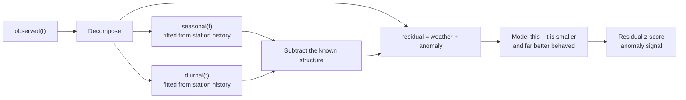
```mermaid
flowchart LR
    OBS["observed(t)"] --> DEC["Decompose"]
    DEC --> SEA["seasonal(t)<br/>fitted from station history"]
    DEC --> DIU["diurnal(t)<br/>fitted from station history"]
    DEC --> RES["residual = weather + anomaly"]
    SEA --> SUB["Subtract the known structure"]
    DIU --> SUB
    SUB --> RES
    RES --> MOD["Model this - it is smaller<br/>and far better behaved"]
    MOD --> Z["Residual z-score<br/>anomaly signal"]
```

Fitting and subtracting the known structure first is what makes a cheap model competitive with an expensive one. You are no longer asking a network to learn that afternoons are warm.

### Diurnal-signature tracking - a drift detector that needs no neighbours

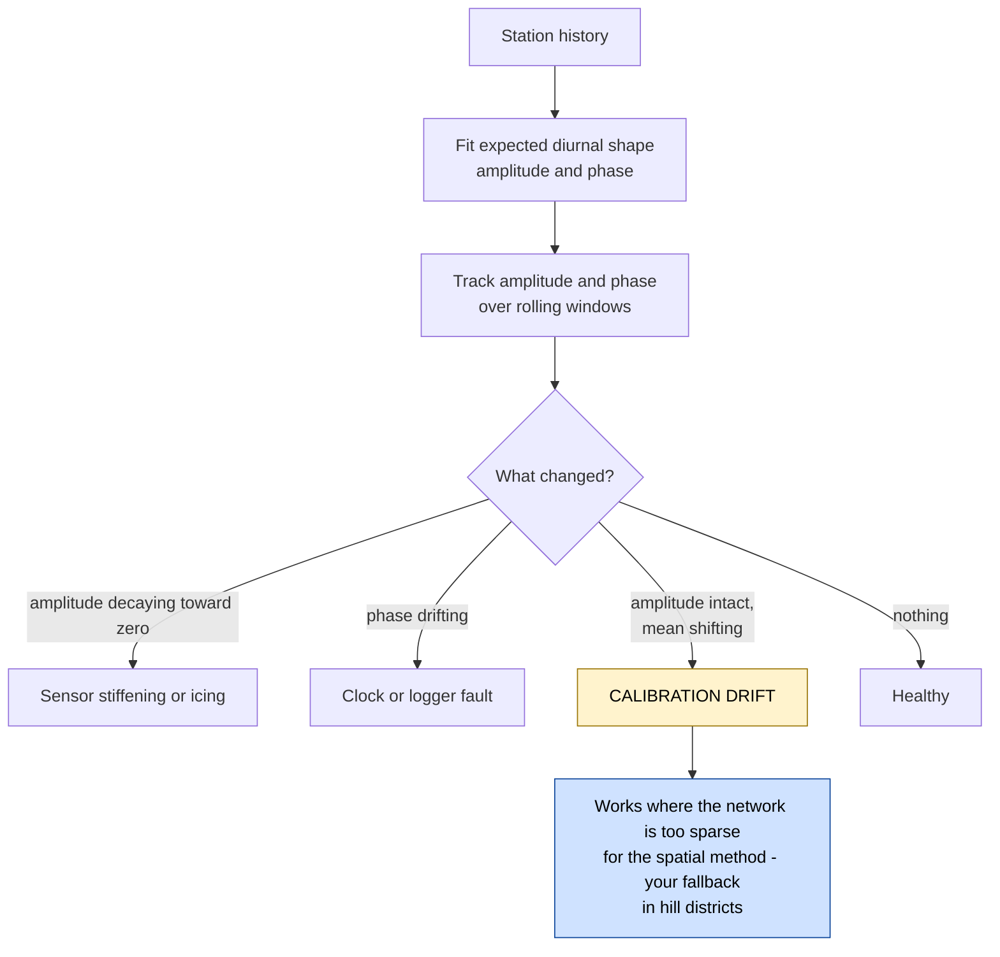
```mermaid
flowchart TD
    HIST["Station history"] --> FIT["Fit expected diurnal shape<br/>amplitude and phase"]
    FIT --> TRACK["Track amplitude and phase<br/>over rolling windows"]
    TRACK --> Q{"What changed?"}
    Q -->|"amplitude decaying toward zero"| A["Sensor stiffening or icing"]
    Q -->|"phase drifting"| B["Clock or logger fault"]
    Q -->|"amplitude intact,<br/>mean shifting"| C["CALIBRATION DRIFT"]
    Q -->|"nothing"| D["Healthy"]

    C --> USE["Works where the network is too sparse<br/>for the spatial method - your fallback<br/>in hill districts"]

    style C fill:#fff3cd,stroke:#997404,color:#000
    style USE fill:#cfe2ff,stroke:#084298,color:#000
```

The first learned component. Job: know what this station normally does at this time of day in this season, and measure how far reality departs from it.

### Baseline decomposition

```
observed(t) = seasonal(t) + diurnal(t) + weather(t) + noise
```

Fit `seasonal` and `diurnal` from station history. What remains is weather plus anomalies — a much smaller, better-behaved signal to model.

### Model options, cheapest first

| Approach | Notes |
|---|---|
| **Seasonal-diurnal climatology + residual z-score** | Interpretable, fast, no GPU. **Start here** — it is a strong baseline and often close to sufficient |
| **Isolation Forest** on residual features | Cheap, handles multivariate structure, no sequence modelling |
| **Prophet or SARIMA** | Good seasonality handling, forecast-based residuals |
| **Small LSTM/GRU autoencoder** | Reconstruction error as the anomaly score. Strongest, but heaviest — and it costs you explainability and energy |

**Recommendation.** Build the climatology baseline first and measure it. Add a learned model only if the ablation shows it earns its cost. On this rubric — accuracy 20%, energy 5%, explainability 10%, real-time 15% — a heavy model can easily be net-negative.

### Diurnal-signature tracking

Beyond point anomalies, track the **health of the diurnal cycle itself**: its amplitude and its phase, over rolling windows.

- Amplitude decaying toward zero → sensor stiffening or icing
- Phase drifting → clock or logger fault
- Amplitude intact but mean shifting → **calibration drift**

This is a drift detector requiring no neighbours, which makes it your fallback wherever the network is sparse. It is also a novel-feeling contribution, and it is cheap.

---

## 20. Stage 4 — Spatial consistency

### The differentiator, in one diagram

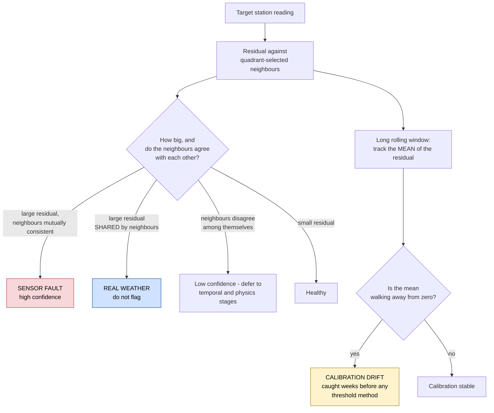
```mermaid
flowchart TD
    OBS["Target station reading"] --> RES["Residual against<br/>quadrant-selected neighbours"]
    RES --> Q{"How big, and<br/>do the neighbours agree<br/>with each other?"}

    Q -->|"large residual,<br/>neighbours mutually consistent"| F["SENSOR FAULT<br/>high confidence"]
    Q -->|"large residual<br/>SHARED by neighbours"| W["REAL WEATHER<br/>do not flag"]
    Q -->|"neighbours disagree<br/>among themselves"| L["Low confidence - defer to<br/>temporal and physics stages"]
    Q -->|"small residual"| OK["Healthy"]

    RES --> LONG["Long rolling window:<br/>track the MEAN of the residual"]
    LONG --> D{"Is the mean<br/>walking away from zero?"}
    D -->|yes| DRIFT["CALIBRATION DRIFT<br/>caught weeks before any<br/>threshold method"]
    D -->|no| STABLE["Calibration stable"]

    style F fill:#f8d7da,stroke:#b02a37,color:#000
    style W fill:#cfe2ff,stroke:#084298,color:#000
    style DRIFT fill:#fff3cd,stroke:#997404,color:#000
```

**One mechanism, two of the hardest requirements.** The same neighbour comparison that catches drift is what separates a gust front from a broken sensor.

### What drift looks like on a dashboard

```
  residual
  mean       HEALTHY STATION                DRIFTING STATION
  (30-day)

   +1.0 |                                  |                    ____
        |                                  |               ____/
    0.0 |~~~~~~~~~~~~~~~~~~~~~~~           |~~~~~~~~~~____/
        |                                  |
   -1.0 |                                  |
        +---------------------- time       +---------------------- time
         Jan  Mar  May  Jul                 Jan  Mar  May  Jul

   Every individual reading in BOTH stations passes every threshold.
   Only the residual mean separates them - and it separates them cleanly.
```

That slowly diverging line is the visual proof of your main contribution. Make it the centrepiece of the dashboard and of demo beat 3.

### Handling the sparse case

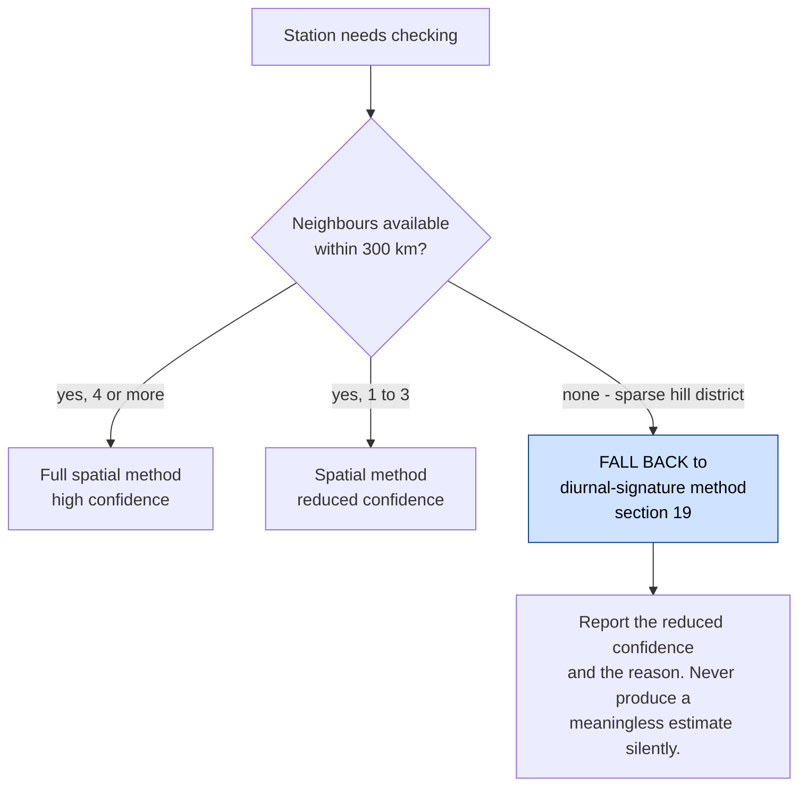
```mermaid
flowchart TD
    S["Station needs checking"] --> N{"Neighbours available<br/>within 300 km?"}
    N -->|"yes, 4 or more"| FULL["Full spatial method<br/>high confidence"]
    N -->|"yes, 1 to 3"| PART["Spatial method<br/>reduced confidence"]
    N -->|"none - sparse hill district"| FALL["FALL BACK to<br/>diurnal-signature method<br/>section 19"]
    FALL --> SAY["Report the reduced confidence<br/>and the reason. Never produce a<br/>meaningless estimate silently."]

    style FALL fill:#cfe2ff,stroke:#084298,color:#000
```

Demonstrating that fallback live is itself evidence of engineering maturity - and India's network genuinely is sparse in the hills, so a judge from IMD will look for it.

**The differentiator.** The problem statement's own example use case points directly at it:

> *"An AWS suddenly reports a temperature of 55°C with extremely high humidity and abnormal pressure variation while neighbouring stations show normal conditions."*

### The principle

```
Weather is regional.        A gust front crosses a corridor.
                            Several stations see it, staggered in time.

A sensor fault is local.    One station disagrees with every neighbour,
                            simultaneously, and the neighbours agree
                            with each other.
```

### The algorithm

Follow WeatherReal's neighbour selection, which is published and defensible:

1. **Candidates** — stations within 300 km and 500 m elevation difference
2. **Filter** — drop candidates with less than one-third record overlap
3. **Quadrants** — group into NE, NW, SE, SW
4. **Select** — up to two nearest per quadrant

Then:

5. **Estimate** the expected value at the target station by interpolating from selected neighbours — inverse-distance weighting is adequate; kriging is better if time allows; adjust temperature for elevation using a standard lapse rate
6. **Residual** = observed − expected
7. **Decide:**
   - Large residual, neighbours mutually consistent → **sensor fault**, high confidence
   - Large residual shared by neighbours → **real weather**, do not flag
   - Neighbours disagree among themselves → low confidence, defer to temporal and physics stages

### Extending it beyond published practice

WeatherReal applies the neighbour check to obvious errors. **Apply it to drift**, which nobody in the published pipelines does:

Track the **residual mean over a long rolling window**. A healthy station's residual mean hovers near zero. A drifting station's residual mean walks steadily away from zero while every individual reading stays inside every threshold.

**That is the mechanism that catches the fault threshold QC cannot see, and it is the single strongest thing in this project.** It is also visually unmistakable on a dashboard — a slowly diverging line — which makes it the ideal centrepiece for the demo.

### Handle the sparse case

Where India's network is thin — hill districts especially — neighbours may not exist within 300 km. The system must detect this and fall back to the diurnal-signature method (§19) with appropriately reduced confidence, rather than silently producing a meaningless estimate. Demonstrating that fallback is itself evidence of engineering maturity.

---

## 21. Stage 5 — Fusion, scoring and root cause

### How the evidence becomes one decision

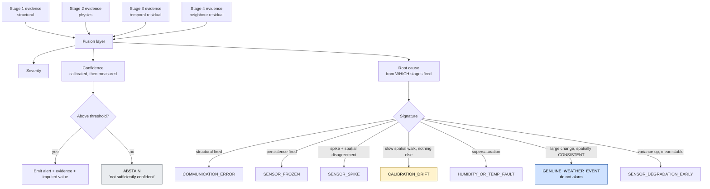
```mermaid
flowchart TD
    E1["Stage 1 evidence<br/>structural"] --> FUSE
    E2["Stage 2 evidence<br/>physics"] --> FUSE
    E3["Stage 3 evidence<br/>temporal residual"] --> FUSE
    E4["Stage 4 evidence<br/>neighbour residual"] --> FUSE

    FUSE["Fusion layer"] --> SEV["Severity"]
    FUSE --> CONF["Confidence<br/>calibrated, then measured"]
    FUSE --> RC["Root cause<br/>from WHICH stages fired"]

    RC --> T{"Signature"}
    T -->|"structural fired"| C1["COMMUNICATION_ERROR"]
    T -->|"persistence fired"| C2["SENSOR_FROZEN"]
    T -->|"spike + spatial disagreement"| C3["SENSOR_SPIKE"]
    T -->|"slow spatial walk, nothing else"| C4["CALIBRATION_DRIFT"]
    T -->|"supersaturation"| C5["HUMIDITY_OR_TEMP_FAULT"]
    T -->|"large change, spatially CONSISTENT"| C6["GENUINE_WEATHER_EVENT<br/>do not alarm"]
    T -->|"variance up, mean stable"| C7["SENSOR_DEGRADATION_EARLY"]

    CONF --> GATE{"Above threshold?"}
    GATE -->|yes| OUT["Emit alert + evidence + imputed value"]
    GATE -->|no| ABS["ABSTAIN<br/>'not sufficiently confident'"]

    style C6 fill:#cfe2ff,stroke:#084298,color:#000
    style C4 fill:#fff3cd,stroke:#997404,color:#000
    style ABS fill:#e9ecef,stroke:#6c757d,color:#000
```

Note that root cause is a **decision table over which stages fired**, not an opaque classifier. Say that plainly - interpretability here is a feature, and it costs you nothing to build.

Combine the evidence from all stages into one decision with one explanation.

### Output schema

```json
{
  "station_id": "42182",
  "timestamp": "2026-07-14T09:15:00Z",
  "parameter": "temperature",
  "observed": 55.2,
  "expected": 31.4,
  "flag": "ANOMALY",
  "severity": "HIGH",
  "confidence": 0.94,
  "root_cause": "SENSOR_FAULT",
  "evidence": [
    { "stage": "physics",  "check": "supersaturation",   "triggered": true,  "detail": "Td 56.1 > T 55.2" },
    { "stage": "temporal", "check": "residual_zscore",   "triggered": true,  "detail": "z = 8.7" },
    { "stage": "spatial",  "check": "neighbour_residual","triggered": true,
      "detail": "6 neighbours mutually consistent, mean 31.1 ± 0.8" }
  ],
  "imputed_value": 31.4,
  "imputation_source": "spatial_interpolation",
  "sensor_health": { "status": "DEGRADED", "drift_estimate_c_per_month": 0.42 }
}
```

### Root-cause classification

An explicit output requirement. Derive it from *which* stages fired — this is a small decision table, not a model:

| Signature | Root cause |
|---|---|
| Structural check fired | `COMMUNICATION_ERROR` |
| Persistence fired | `SENSOR_FROZEN` |
| Spike + spatial disagreement | `SENSOR_SPIKE` |
| Slow spatial residual walk, nothing else | `CALIBRATION_DRIFT` |
| Supersaturation | `HUMIDITY_OR_TEMP_SENSOR_FAULT` |
| Large change, spatially **consistent** | `GENUINE_WEATHER_EVENT` — do not alarm |
| Variance up, mean stable | `SENSOR_DEGRADATION_EARLY` |

The interpretability of this table is a feature. Say plainly that root cause is derived from deterministic evidence rather than predicted by an opaque classifier.

### Confidence, and calibrating it

Confidence must be **calibrated**, not decorative: when the system says 0.9, it should be right about 90% of the time. Measure expected calibration error and report it. Because your fault-injection harness gives labelled ground truth, calibration is directly measurable — and almost no competing team will bother, which makes it cheap differentiation.

### Imputation

Marked optional in the statement, which makes it discretionary marks under Innovation. Spatial interpolation from healthy neighbours is the natural estimator, with the temporal climatology as fallback. **Always label an imputed value as imputed** and record its source — never let a synthetic value enter the record indistinguishable from a measurement.

---

## 22. Explainability

Worth 10%, and the statement names SHAP and LIME as *preferable*. Two complementary layers:

**Deterministic reasons — from Stages 1, 2 and 4.** These are complete explanations on their own: *"Dew point 56.1°C exceeded air temperature 55.2°C, which is physically impossible"*, or *"six neighbouring stations agree on 31.1 ± 0.8°C."* No attribution method needed, and they are more convincing than any attribution plot because they are *reasons* rather than *correlations*.

**SHAP attributions — for the learned Stage 3.** Where a model produced the score, show which features drove it. Use `TreeExplainer` for Isolation Forest or gradient-boosted models — it is fast enough for near-real-time. Reserve `KernelExplainer` for offline analysis; it is too slow for the streaming path.

**Present both, per alert.** A judge should be able to click any alarm and read, in plain language, exactly why it fired — and see the SHAP bar chart underneath for the learned component.

---

## 23. Sensor health forecasting

### From per-record detection to network health

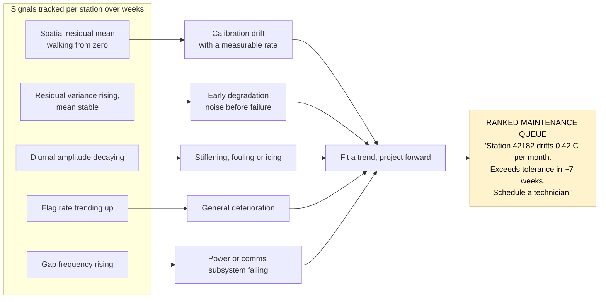
```mermaid
flowchart LR
    subgraph SIG["Signals tracked per station over weeks"]
        direction TB
        A["Spatial residual mean<br/>walking from zero"]
        B["Residual variance rising,<br/>mean stable"]
        C["Diurnal amplitude decaying"]
        D["Flag rate trending up"]
        E["Gap frequency rising"]
    end

    A --> M1["Calibration drift<br/>with a measurable rate"]
    B --> M2["Early degradation<br/>noise before failure"]
    C --> M3["Stiffening, fouling or icing"]
    D --> M4["General deterioration"]
    E --> M5["Power or comms subsystem failing"]

    M1 --> TREND["Fit a trend, project forward"]
    M2 --> TREND
    M3 --> TREND
    M4 --> TREND
    M5 --> TREND

    TREND --> OUT["RANKED MAINTENANCE QUEUE<br/>'Station 42182 drifts 0.42 C per month.<br/>Exceeds tolerance in ~7 weeks.<br/>Schedule a technician.'"]

    style OUT fill:#fff3cd,stroke:#997404,color:#000
```

This converts the project from a detector into a **network health management system** - a categorically different and more valuable thing. It also addresses a documented reality: Indian AWS units fail and stay failed, with reported cases of entire state networks down for four months or more.

Objective 6 in the statement, and the piece that answers the Grand Challenge.

Rather than classifying single records, track each station's **trajectory** over weeks and months:

| Signal | Meaning |
|---|---|
| Spatial residual mean walking from zero | Calibration drift, with a measurable rate |
| Residual variance rising, mean stable | Early degradation, noise before failure |
| Diurnal amplitude decaying | Sensor stiffening, fouling or icing |
| Flag rate per station trending up | General deterioration |
| Gap frequency rising | Power or communication subsystem failing |

Fit a trend to each, project it forward, and estimate time until the station crosses an unusability threshold.

**Output:** a ranked maintenance queue. *"Station 42182 is drifting at 0.42 °C/month and will exceed tolerance in approximately 7 weeks. Schedule a technician."*

This converts the project from a detector into a **network health management system**, which is a categorically different and more valuable thing — and it directly addresses the documented reality of Indian AWS units failing and staying failed for months (§6).

---

## 24. Edge deployment

### What runs where

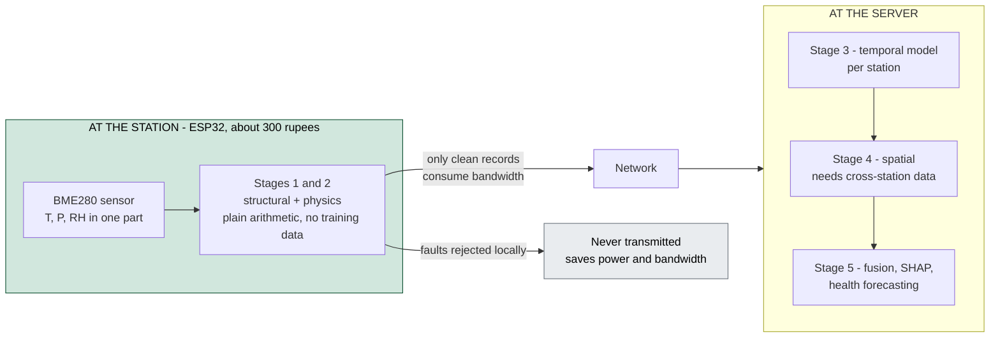
```mermaid
flowchart LR
    subgraph EDGE["AT THE STATION - ESP32, about 300 rupees"]
        direction TB
        SEN["BME280 sensor<br/>T, P, RH in one part"]
        ST12["Stages 1 and 2<br/>structural + physics<br/>plain arithmetic, no training data"]
        SEN --> ST12
    end

    ST12 -->|"only clean records<br/>consume bandwidth"| NET["Network"]
    ST12 -->|"faults rejected locally"| DROP["Never transmitted<br/>saves power and bandwidth"]

    NET --> SRV

    subgraph SRV["AT THE SERVER"]
        direction TB
        ST3["Stage 3 - temporal model<br/>per station"]
        ST4["Stage 4 - spatial<br/>needs cross-station data"]
        ST5["Stage 5 - fusion, SHAP,<br/>health forecasting"]
        ST3 --> ST4 --> ST5
    end

    style EDGE fill:#d1e7dd,stroke:#0f5132,color:#000
    style DROP fill:#e9ecef,stroke:#6c757d,color:#000
```

The split is not arbitrary: Stages 1-2 need no training data and no neighbours, so they are the only stages that *can* run at the edge. Stage 4 fundamentally cannot - it needs other stations.

**Report three measured numbers:** inference time per record, memory footprint, and current draw in milliamps. One measurement beats a paragraph of claims.

**The demo value exceeds the 5 percent.** A physical device on the table, sensing the actual room, streaming into your dashboard. Breathe on the humidity sensor and watch the dashboard respond.

Worth 5%, explicitly names ESP32, and costs about ₹300 plus a day.

**What to run on the device:** Stages 1 and 2. They are deterministic, tiny, need no training data, and catch a large share of faults. Running them at the station means bad data never consumes bandwidth or power to transmit — a genuine operational argument, not a gimmick.

**How:** ESP32 with a BME280 (temperature, pressure, humidity in one part). Stages 1–2 are plain arithmetic. If you want a learned component on-device, quantise a small model to int8 via TensorFlow Lite Micro.

**Measure and report:** inference time per record, memory footprint, and current draw in milliamps. One measured number beats a paragraph of claims.

**The demo value exceeds the 5%.** A physical device on the table, sensing the actual room, streaming into your dashboard, makes the entire system tangible in a way no slide achieves. Breathe on the humidity sensor and watch the dashboard respond.

---

## 25. Technology stack

Everything free and open source.

| Layer | Choice | Note |
|---|---|---|
| Language | Python 3.11+ | Match the ML ecosystem |
| Streaming | Kafka or Redis Streams | Needed for the Scalability 10% to be real rather than claimed |
| Stages 1–2 | Plain Python + NumPy | Deterministic, no framework |
| Stage 3 | scikit-learn (Isolation Forest), statsmodels, optionally PyTorch | Start simple |
| Stage 4 | scikit-learn, scipy.spatial, optionally PyKrige | Neighbour search and interpolation |
| Explainability | **SHAP** | Named in the statement |
| Storage | PostgreSQL + **TimescaleDB** | Purpose-built for time series; a defensible choice to name |
| API | FastAPI | Async, fast, pairs with the ML stack |
| Dashboard | React + Plotly, or Streamlit | Streamlit if the team is small — the UI is only 5% |
| Edge | ESP32 + BME280 + TensorFlow Lite Micro | Hardware ≈ ₹300 |
| Packaging | Docker Compose | Serves Deployability 10% directly |

**Deliberately avoided:** heavyweight deep learning frameworks for the core detector. On a rubric weighting accuracy at 20% while weighting energy, real-time and explainability at 30% combined, a large model is likely net-negative. Say this out loud in the pitch — a justified simplicity decision reads as engineering judgement, not as limitation.

---
---

# Part VII — Innovation

## 26. The three innovation angles

### The three angles, and which gap each closes

```mermaid
flowchart LR
    subgraph GAPS["Open gaps from section 13"]
        direction TB
        G1["Slow calibration drift"]
        G2["Event versus fault discrimination"]
        G3["Sparse-network coverage"]
        G4["Degradation forecasting"]
        G5["Corrected-value imputation"]
    end

    A1["ANGLE 1<br/>Spatial drift tracking<br/>STRONGEST - do this one"] --> G1
    A1 --> G2
    A2["ANGLE 2<br/>Physics constraints and<br/>diurnal-signature health"] --> G1
    A2 --> G3
    A3["ANGLE 3<br/>Self-healing network<br/>answers their Grand Challenge"] --> G4
    A3 --> G5

    G1 --> WIN["Innovation - 25 percent"]
    G2 --> WIN
    G3 --> WIN
    G4 --> WIN
    G5 --> WIN

    style A1 fill:#fff3cd,stroke:#997404,color:#000
    style WIN fill:#d1e7dd,stroke:#0f5132,color:#000
```

**Deliver two of the three.** All three is a scope risk; one alone is thin for a 25 percent criterion. Angle 1 is non-negotiable - it closes two gaps by itself.

Twenty-five percent — the largest single weight. Time-series anomaly detection has thousands of open-source implementations, so an LSTM autoencoder earns nothing here. Three angles, strongest first.

**Deliver two of the three.** All three is a scope risk; one alone is thin for 25%.

### Angle 1 — Spatial drift detection *(strongest — do this one)*

**The claim.** Published QC pipelines apply neighbour checks to gross errors. We apply neighbour-residual tracking to **slow calibration drift** — the fault class that threshold QC provably cannot detect, because no individual reading ever violates a threshold.

**The mechanism.** Track the long-window mean of the residual between a station and its quadrant-selected neighbours. A healthy station's residual mean sits near zero. A drifting station's walks steadily away.

**Why it is defensible as novel.** WMO defines spatial consistency as a principle; WeatherReal implements it for spikes and gross errors. Neither targets slow drift, and drift is the failure mode IMD actually loses data to.

**It simultaneously solves the false-alarm problem.** The same neighbour comparison that catches drift is what tells a gust front from a broken sensor (§9). One mechanism, two of the hardest requirements.

**Measure it:** drift detection rate versus drift rate, and lead time — how many weeks before a threshold method would eventually notice.

### Angle 2 — Physics-informed constraints and diurnal-signature health

**The claim.** With only three parameters, the physical relationships between them are fully enumerable. We exploit them as training-free detectors, and we extend beyond the standard supersaturation check to **diurnal-signature health** — tracking the amplitude and phase of each station's daily cycle as a drift indicator that needs no neighbours.

**Why it matters here specifically.** It is the strongest angle for an **IMD** panel, because it demonstrates meteorological understanding rather than only ML tooling. It costs almost nothing to compute, serving real-time and energy at the same time. And it works where the network is sparse, which is precisely where Angle 1 is weakest.

**Measure it:** detection rate for the physics stage alone, and the compute cost saved by rejecting records before the learned stages run.

### Angle 3 — Answer the Grand Challenge: the self-healing network

**The claim.** We close the loop end to end — **detect → explain → impute → forecast degradation → schedule maintenance** — turning per-record quality control into network health management.

**Why it lands.** They asked the question in the statement. Answering it directly is the most legible possible response to the Innovation criterion, and sensor-degradation forecasting is the piece essentially nobody else will build.

**Measure it:** degradation forecast lead time against actual failures in held-out history, plus the fraction of flagged records for which a usable imputed value was produced.

---

## 27. How to state the contribution

Do not say *"we built an anomaly detector."* Say this:

> "The published state of practice — WMO's standard checks and Microsoft's WeatherReal pipeline — is retrospective, batch, and targets gross errors. It reliably catches spikes, frozen values and out-of-range readings.
>
> It does not catch slow calibration drift, because no individual reading ever violates a threshold. Drift is the failure mode that silently corrupts the climate record.
>
> We implement the full published baseline, then add three things it lacks: neighbour-residual tracking that detects drift weeks before any threshold method, diurnal-signature health monitoring that works where the network is too sparse for neighbours, and degradation forecasting that turns detection into a maintenance schedule.
>
> Here is the ablation showing what each addition contributes, and here is our false-alarm rate on verified real weather events."

That paragraph is defensible, specific, cites prior work honestly, and claims exactly as much as you can prove — which is what makes it credible.

---
---

# Part VIII — Evaluation, build and demo

## 28. Metrics

### Detection

```
                    true positives
Precision  =  ──────────────────────────────
               true positives + false positives

                    true positives
Recall     =  ──────────────────────────────
               true positives + false negatives

                  precision × recall
F1         =  2 × ────────────────────
                  precision + recall
```

**Report per fault type**, not only in aggregate. An F1 of 0.85 that is 0.98 on spikes and 0.31 on drift is telling you — and the judge — something important. Report it before they find it.

### The false-alarm rate on real weather

**The headline number.** Fraction of verified genuine weather events incorrectly flagged. Target: near zero. This is the metric that proves you solved §9, and it is the one an IMD judge cares most about, because a false alarm destroys good data.

### Drift-specific

- **Detection rate versus drift rate** (°C/month) — a curve, not a point
- **Lead time** — how much earlier than a threshold method

### Calibration

Expected calibration error. When the system says 0.9, is it right 90% of the time?

### Real-time

End-to-end latency per record, **p50 and p95**. Also throughput in records per second, which is your scalability evidence.

### Efficiency

Inference time, memory footprint, and ESP32 current draw in milliamps.

---

## 29. The ablation

### The ablation ladder

```mermaid
flowchart TD
    A["A - Fixed thresholds only<br/>current IMD practice"] --> B
    B["B - plus WMO checks<br/>step, persistence, spike"] --> C
    C["C - plus WeatherReal pipeline<br/>including neighbour check<br/>PUBLISHED STATE OF PRACTICE"] --> D
    D["D - plus temporal model and<br/>diurnal-signature health<br/>CONTRIBUTION 2"] --> E
    E["E - plus spatial drift tracking<br/>CONTRIBUTION 1"] --> Fr
    Fr["F - plus degradation forecasting<br/>and imputation<br/>CONTRIBUTION 3"]

    A -.->|"drift F1 near zero"| X["The row that matters:<br/>A to C to E on the DRIFT column"]
    C -.->|"drift F1 near zero"| X
    E -.->|"drift F1 high"| X

    style C fill:#e9ecef,stroke:#6c757d,color:#000
    style E fill:#fff3cd,stroke:#997404,color:#000
    style X fill:#d1e7dd,stroke:#0f5132,color:#000
```

For every row report three numbers: **overall F1**, **F1 on drift specifically**, and **false-alarm rate on real weather events.**

If thresholds and published practice both score near zero on the drift column and your method does not, you have *demonstrated* the contribution rather than asserted it. If a layer does not help, remove it and report that - a judge who spots a component doing nothing will ask about it.

Same principle as any credible systems paper: show what each layer contributes. Run on the same injected test set.

| # | Configuration | What it isolates |
|---|---|---|
| **A** | Fixed thresholds only | Current IMD practice — the floor |
| **B** | + WMO checks (step, persistence, spike) | Standard practice |
| **C** | + WeatherReal pipeline incl. neighbour check | Published state of practice |
| **D** | + temporal model and diurnal-signature health | Contribution 2 |
| **E** | + spatial drift tracking | Contribution 1 |
| **F** | + degradation forecasting and imputation | Contribution 3 |

Report for each: F1 overall, F1 on drift specifically, and false-alarm rate on real weather events.

**The row that matters is A→C→E on the drift column.** If thresholds and published practice both score near zero on drift and your method does not, you have demonstrated the contribution rather than asserted it.

**If a layer does not help, remove it and report that.** Reporting a negative result honestly is more impressive than hiding it, and a judge who spots a component doing nothing will ask about it.

---

## 30. Build order

### Phase dependencies

```mermaid
flowchart TD
    B1["B1 - Data and harness<br/>ingest, injection, control set"] --> B2
    B1 --> B3
    B2["B2 - Deterministic stages<br/>WMO + WeatherReal"] --> B4
    B3["B3 - Temporal<br/>climatology, diurnal health"] --> B4
    B4["B4 - Spatial<br/>THE DIFFERENTIATOR"] --> B5
    B4 --> B6
    B5["B5 - Fusion, calibration, SHAP"] --> B10
    B6["B6 - Health forecasting"] --> B10
    B7["B7 - Streaming and scale"] --> B10
    B8["B8 - Dashboard"] --> B10
    B9["B9 - Edge / ESP32"] --> B10
    B10["B10 - Package and ablation"]

    B2 -.->|"ablation rows A, B"| AB["Ablation table"]
    B3 -.->|"row D"| AB
    B4 -.->|"row E"| AB
    B6 -.->|"row F"| AB

    style B1 fill:#f8d7da,stroke:#b02a37,color:#000
    style B4 fill:#fff3cd,stroke:#997404,color:#000
```

**B1 is the blocker - nothing can be measured without labels.** B2 and B3 must exist before the contribution can be quantified, because they are the ablation's baseline rows. B4 sits where there is still time to iterate on it. B7 through B9 collect 30 percent of the rubric in low-risk work that can absorb schedule compression.

**Never invert B4 and B8.** A polished dashboard over a conventional detector is a mid-table finish.

```
Phase 1 — Data and harness
    Ingest NOAA ISD · verify station density over India
    Build the fault-injection harness
    Assemble the real-weather control set
    → without labels, nothing downstream can be measured

Phase 2 — Deterministic stages
    Stages 1 and 2: structural + physics + WMO + WeatherReal
    Measure. This is ablation rows A, B and part of C.

Phase 3 — Temporal
    Climatology baseline first, measure, then a learned model
    only if it earns its cost. Diurnal-signature tracking.

Phase 4 — Spatial            ← the differentiator
    Neighbour selection, interpolation, residual tracking
    Then extend to long-window drift detection

Phase 5 — Fusion, explainability, health forecasting
    Confidence calibration · SHAP · root cause · degradation

Phase 6 — Streaming, dashboard, edge, packaging
    Real-time path · UI · ESP32 · Docker · docs
```

**Why this order.** Phase 1 gives you measurement — without it every later decision is guesswork. Phases 2 and 3 are your ablation baselines, so they must exist before the contribution can be quantified. Phase 4 is the differentiator, placed where there is still time to iterate on it. Phase 6 collects 30% of the rubric — real-time, deployability, UI, energy — and it is deliberately last because it is low-risk, well-understood work that can absorb schedule compression without damaging the core.

**Do not invert Phases 4 and 6.** A polished dashboard over a conventional detector is a mid-table submission.

---

## 31. Interface

```
┌────────────────────────────────────────────────────────────────────────┐
│  SkyGuard AI          Network: 1,248 stations    ● 12 alerts   ⚠ 34 degraded │
├──────────────────────┬─────────────────────────────────────────────────┤
│  STATION MAP         │   STATION 42182 — Pune AWS                      │
│                      │                                                 │
│    ● ● ○ ●           │   Temperature ──────────────────────────        │
│   ● ⚠ ● ● ○          │     observed  ────────╱╲──────                  │
│    ● ● ● ⚠ ●         │     expected  ────────────────  (neighbours)    │
│   ○ ● ● ● ●          │     ⚠ spike flagged 09:15                       │
│                      │                                                 │
│   ● healthy          │   Residual (30-day mean) ← DRIFT VIEW           │
│   ⚠ degraded         │      0 ──────╲                                  │
│   ○ offline          │              ╲──────╲──────  +0.42 °C/month     │
│                      │                                                 │
├──────────────────────┼─────────────────────────────────────────────────┤
│  ALERTS              │   WHY THIS FIRED                                │
│                      │                                                 │
│  09:15  42182  HIGH  │   ✓ Physics   Td 56.1 > T 55.2 — impossible     │
│    SENSOR_FAULT      │   ✓ Temporal  residual z = 8.7                  │
│    conf 0.94         │   ✓ Spatial   6 neighbours agree 31.1 ± 0.8     │
│                      │                                                 │
│  08:40  41024  LOW   │   SHAP  ▏temp_residual    ████████              │
│    GENUINE_WEATHER   │         ▏dewpoint_gap     ██████                │
│    not alarmed       │         ▏neighbour_delta  ████                  │
│                      │                                                 │
│  07:12  43110  MED   │   Imputed: 31.4 °C  (spatial interpolation)     │
│    CALIBRATION_DRIFT │   Health: DEGRADED — service in ~7 weeks        │
└──────────────────────┴─────────────────────────────────────────────────┘
```

Design notes:

- **The drift view is the centrepiece.** A slowly diverging residual line is the visual proof of your main contribution. Give it prominence.
- **Show a `GENUINE_WEATHER` entry that was correctly *not* alarmed.** It demonstrates the false-alarm requirement in the interface itself.
- **Every alert is clickable to a plain-language reason.** Deterministic reasons first, SHAP underneath.
- **The map carries network-level health**, which is your scalability story told visually.
- Keep it to one screen. The UI is worth 5% — make it clean, then stop.

---

## 32. The demo script

### The demo, beat by beat

```mermaid
sequenceDiagram
    autonumber
    actor J as Judge
    participant D as Dashboard
    participant E as ESP32 on the table
    participant S as SkyGuard backend

    E->>D: live stream, real sensor data
    Note over D: BEAT 1 - system is alive<br/>Real-time 15 pct, UI 5 pct

    J->>S: inject a spike
    S->>S: Stage 2 physics catches it<br/>no model inference needed
    S->>D: alert + reason "dew point exceeded temperature"
    Note over D: BEAT 2 - Accuracy 20 pct<br/>Explainability 10 pct

    J->>S: inject a slow drift
    S->>D: every reading passes every threshold
    S->>S: neighbour residual mean walks from zero
    S->>D: ALERT weeks before any threshold method
    Note over D: BEAT 3 - Innovation 25 pct<br/>THE MOMENT THAT WINS THE ROOM

    J->>S: replay a real gust front
    S->>S: neighbours saw it too
    S->>D: NO ALARM - and explains why
    Note over D: BEAT 4 - false-alarm requirement<br/>answered live

    J->>D: open sensor health
    D->>J: ranked maintenance queue<br/>"42182 needs a technician in 7 weeks"
    Note over D: BEAT 5 - Grand Challenge answered

    J->>D: scale and edge
    D->>J: throughput for 1000+ stations<br/>ESP32 milliamp figure
    Note over D: BEAT 6 - Scalability, Deployability, Energy
```

**Beats 3 and 4 are the whole pitch.** Everything else is competent execution many teams will match. Those two are what almost nobody will have.

Six beats, roughly five minutes, every beat mapped to a scored criterion.

**1. Live stream (20s)** — dashboard running, real data flowing, network map green. The ESP32 on the table is one of the stations. → *Real-time 15%, UI 5%*

**2. Inject a spike (30s)** — caught instantly by Stage 2 physics, no model inference. Show the reason: dew point exceeded temperature. → *Accuracy 20%, Explainability 10%*

**3. Inject a slow drift (60s)** — **the moment that wins the room.** Show that every reading passes every threshold. Show IMD's current method seeing nothing. Then show the neighbour-residual line walking away from zero, and the alert firing weeks before any threshold would. → *Innovation 25%*

**4. Replay a real weather event (45s)** — an actual gust front or monsoon onset. Large, fast, multi-parameter change. **The system does not alarm**, and explains why: the neighbours saw it too. → *The false-alarm requirement, answered live*

**5. Sensor health and maintenance queue (45s)** — the ranked list of stations by predicted time-to-failure. *"Station 42182 needs a technician in seven weeks."* → *Innovation 25%, Grand Challenge answered*

**6. Scale and edge (40s)** — throughput number for 1,000+ stations; the ESP32 running Stages 1–2 at a measured milliamp figure. Breathe on the sensor and let the dashboard react. → *Scalability 10%, Deployability 10%, Energy 5%*

Close on one slide: the ablation table, with the drift column highlighted.

**Beat 3 and beat 4 are the whole pitch.** Everything else is competent execution that many teams will match. Those two are what almost nobody will have.

---

## 33. Definition of Done

Ready when a judge who has never seen it can, unaided:

- [ ] watch live data stream into the dashboard
- [ ] inject a spike and see it caught with a physical reason
- [ ] inject a frozen sensor and see it caught
- [ ] inject a slow drift, confirm no threshold is violated, and see it caught anyway
- [ ] see how many weeks earlier that was than a threshold method
- [ ] replay a real weather event and see the system correctly stay silent
- [ ] click any alert and read a plain-language reason
- [ ] see SHAP attributions for the learned component
- [ ] see a confidence value, and see the calibration curve behind it
- [ ] see root-cause classification distinguishing fault types
- [ ] see an imputed corrected value, clearly labelled as imputed
- [ ] see the ranked sensor-maintenance queue
- [ ] see throughput evidence for a network of thousands
- [ ] see the ESP32 running the deterministic stages with a measured power figure
- [ ] see the ablation table with per-fault-type results
- [ ] read the per-fault-type metrics, including the ones you scored worst on

Any unticked box is an engineering gap, not a presentational detail.

---

## 34. What not to do

| Do not | Because |
|---|---|
| Build one big deep model for everything | Costs real-time, energy and explainability — 30% combined — to buy part of 20% |
| Skip the WMO and WeatherReal baseline | Your innovation claim becomes unmeasurable and your ablation has no floor |
| Report only aggregate accuracy | Hides the drift weakness a judge will find |
| Tune on one fault magnitude | A detector tuned on 10°C spikes misses 1°C drift entirely |
| Forget the real-weather control set | The false-alarm rate is your most persuasive number |
| Hard-code thresholds globally | Kerala and Leh need different bounds; learn them per station |
| Silently delete flagged records | IMD needs the audit trail; flag with a reason instead |
| Let an imputed value look like a measurement | Always label it and record its source |
| Build the dashboard before the detector | 5% of the rubric consuming the schedule |
| Claim spatial methods work everywhere | India's network is sparse in hill districts — show the fallback instead |
| Present uncalibrated confidence | A number nobody validated is worse than no number |
| Say "we used AI/ML" as the innovation | The innovation is drift detection and event discrimination, not the toolkit |

---
---

# Part IX — Risk

## 35. Risk register

| # | Risk | Impact | Mitigation |
|---|---|---|---|
| 1 | **Innovation judged subjectively despite the 25% weight** | The largest criterion is not fully controllable | Deliver two of three angles; state contributions explicitly (§27); back each with an ablation row |
| 2 | **Base task is heavily covered in open source** | A conventional submission scores mid-table | Drift + event discrimination is the differentiator; a plain autoencoder is not |
| 3 | **Station density too sparse for the spatial method** | Angle 1 weakens | Verify density in Phase 1; diurnal-signature fallback (§19); demonstrate the fallback explicitly |
| 4 | **No official dataset — you choose your own** | Possible mismatch with their evaluation data | Use NOAA ISD; sweep fault severities widely; do not overfit to one magnitude |
| 5 | **IMD portal access is restricted** | Live Indian data may be unavailable | Architect on NOAA ISD; treat IMD data as demo garnish |
| 6 | **Real-time claim unmeasured** | 15% asserted rather than shown | Instrument latency from Phase 1; report p50 and p95 |
| 7 | **Scalability claimed but not shown** | 10% asserted rather than shown | Use a real streaming layer; run a multi-thousand-station load test |
| 8 | **Drift detection needs long history** | Slow to validate | Use historical archives, not live capture; simulate drift onto real data |
| 9 | **ESP32 work expands** | 5% consumes disproportionate time | Timebox to one day; Stages 1–2 only; one measured power figure |
| 10 | **Lower prestige than space or satellite problems** | Genuinely true | It buys a thinner field — that is the trade, and it is a good one |

---

## 36. Open questions

Resolve these before building. Each changes a decision downstream.

1. **What station density does NOAA ISD actually give over India?** Decides how strong Angle 1 can be. Answer this first — it is the highest-leverage unknown in the project.
2. **Which IMD data is publicly reachable today?** Affects demo realism only, not the architecture.
3. **What reporting interval do you target?** Hourly is easy to source; 15-minute makes real-time claims more convincing.
4. **Can you identify verified historical weather events over your stations?** Needed for the real-weather control set, which produces your most persuasive metric.
5. **Who owns which stage (§16)?** The six stages parallelise cleanly across a team — Phase 1 is the shared blocker, everything after can run concurrently.
6. **ESP32 in hand?** ₹300 and a few days' shipping. Order it in week one or drop the 5% deliberately rather than by accident.

---
---

# Appendix A — Rubric traceability matrix

Every criterion, the component that earns it, the evidence the judge sees.

| Criterion | Weight | Component | Evidence in the demo |
|---|---:|---|---|
| **Innovation & Novelty** | 25% | Spatial drift tracking (§20), diurnal-signature health (§19), degradation forecasting (§23) | Demo beat 3 and 5; ablation rows C→E→F |
| **Detection Accuracy** | 20% | Stages 1–5 | Per-fault-type precision/recall/F1; detection curve vs magnitude |
| **Real-Time Capability** | 15% | Streaming pipeline (§25), cheap early stages (§16) | Live stream; p50/p95 latency; throughput |
| **Explainability** | 10% | Deterministic reasons + SHAP (§22) | Clickable alert → plain-language reason + attribution chart |
| **Scalability** | 10% | Stateless early stages, per-station models (§16) | Network map; multi-thousand-station load test |
| **Practical Deployability** | 10% | Docker Compose, real formats, docs (§25) | One-command startup; ingests real ISD/IMD files |
| **Visualization / UI** | 5% | Dashboard (§31) | The interface itself, drift view foremost |
| **Energy Efficiency** | 5% | ESP32 running Stages 1–2 (§24) | Physical device on the table; measured milliamps |
| *(implicit)* **False-alarm minimisation** | — | Spatial + physics discrimination (§9, §20) | Demo beat 4 — real weather correctly not alarmed |
| *(implicit)* **Grand Challenge** | — | Detect → explain → impute → forecast (§23) | Demo beat 5 — maintenance queue |

---

# Appendix B — Sources

**Primary source — use this one.**
- `docs/00_Official_Problem_Statement.md` — verbatim text from `sih_2026_problem_statements.json`, record 26073

**Quality-control standards and methods**
- WMO — *Guidelines on Quality Control Procedures for Data from Automatic Weather Stations*; defines range, step, persistence, spike, internal-consistency and spatial-consistency checks
- WMO — *Guidelines on validation procedures for meteorological data from automatic weather stations*
- Microsoft — **WeatherReal: A Benchmark Based on In-Situ Observations for Evaluating Weather Models**, arXiv 2409.09371 — published neighbour-selection, spike, persistence and cross-variable algorithms
- WeatherReal repository — https://github.com/microsoft/WeatherReal-Benchmark
- HadISD — a quality-controlled global synoptic database, arXiv 1210.7191 — a further QC reference

**Data sources**
- NOAA Integrated Surface Database (ISD)
- Open-Meteo and Meteostat historical station APIs
- IMD public data portals — note access restrictions (§14)

**Operational context**
- Press Information Bureau / Ministry of Earth Sciences — IMD AWS network, monitoring at Pune Central Receiving Servers and State Meteorological Centres
- Reporting on AWS network density targets (10 km plains / 5 km hills) and on extended station outages

---

*End of document.*
