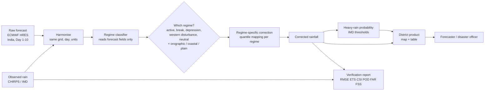

# PS26080 — Guide for the PPT team

**Regime-Aware AI Post-Processing of Monsoon Rainfall Forecasts** · MoES / NCMRWF · Software · Theme: Smart Automation

Written 29 Sep 2026. The portal closes **30 Sep 2026**. The deck is a PDF of at most six slides, on the official template.

You do not need any meteorology or machine learning to use this document. Part 2 teaches what you need, in plain words. Parts 6 and 7 give you the slide text and a list of what to avoid. Parts 3 to 5 explain the idea well enough that you can answer questions about it.

### Contents

1. [Read this first: what is real and what is not](#1-read-this-first)
2. [Primer: eleven ideas in plain words](#2-primer)
3. [The problem and what the statement asks](#3-the-problem)
4. [Our idea, step by step](#4-our-idea)
5. [How we will prove it works](#5-how-we-prove-it)
6. [The deck, slide by slide](#6-the-deck-slide-by-slide)
7. [Rules for the slides](#7-rules-for-the-slides)
8. [Questions the judges will ask, with answers](#8-judge-questions)
9. [Visuals to make](#9-visuals-to-make)
10. [Glossary](#10-glossary)
11. [Checklist before you export](#11-checklist)

---

## 1. Read this first

We are submitting an **idea**, and there is no working system yet. That is normal for this round. What matters is that every statement on a slide is true, so a judge who checks one claim finds it holds.

| Colour | Meaning | Examples |
|---|---|---|
| **Green: say it freely** | It is a fact about the world or about the data, and we checked it | The forecast data is public. Errors differ by monsoon phase. IMD's rainfall categories. The statement asks for six named metrics. |
| **Amber: say it as a plan** | It is what we will build. Use "we will", "the system will", or "planned". | The classifier, the correction, the district map, the report |
| **Red: do not say it** | We have no measurement, or it is not possible | "Improves accuracy by 30%". "Validated on NCUM". "Better than NCMRWF's current method". "Tested on 10 years". Any number we did not compute. |

There is one exception, and it is a good one. Before the deadline one person will run a small measurement (see the technical spec, section 14) and hand you one true line for slide 4. If that line arrives, use it exactly as given, including its caveat. If it does not arrive, slide 4 says what we will measure and how. Both versions are honest and both are fine.

**Where the numbers come from.** Only from `results/report.json` once the code has run. Nobody types a number into a slide from memory, a chat message, or another team's deck.

## 2. Primer

Eleven ideas. Read them in order; each uses the ones before it.

### 2.1 A weather forecast is a calculation, run by a computer

A **weather model** takes today's measured state of the atmosphere (temperature, wind, moisture everywhere) and steps it forward in time using physics. The result is a forecast for each day ahead, on a **grid**, a chessboard laid over the map, with a number in each square. The model we use is ECMWF's **IFS HRES**, one of the best in the world. India's own is NCMRWF's **NCUM**. The raw output is called the **raw NWP forecast** (NWP means numerical weather prediction).

### 2.2 The forecast is wrong in predictable ways

Models are not perfect. The physics is approximated and the grid squares are large (about 28 km wide at 0.25 degree). Because the mistakes come from the same approximations each time, they repeat. A model may be too wet over one region, or may always underestimate the heaviest downpours. A consistent, repeating error is called a **bias**.

Because it repeats, it can be measured from the past and removed from the future. Removing it is **bias correction**, or **post-processing**: taking the raw forecast and adjusting it using what we learned from past mistakes. It does not change the physics; it fixes the output.

### 2.3 Rainfall is the hardest thing to forecast

Rain is patchy, rare in some places, and violent in a small area. A forecast of 40 mm for a district that received 90 mm is a serious miss, yet on average the model may look fine. So forecasters care most about **heavy rain**, not the average.

### 2.4 The monsoon has moods, called regimes

From June to September the Indian monsoon does not rain steadily. It moves between states, and a **weather regime** is one of those recurring states. The statement names these.

| Regime | Plain meaning |
|---|---|
| **Active monsoon** | A wet spell: widespread, heavy rain over central India |
| **Break monsoon** | A dry spell in the middle of the season. Rain moves to the foothills of the Himalayas and drops over the rest of India |
| **Depression / monsoon low** | A spinning low-pressure system, usually born over the Bay of Bengal, that drags heavy rain across central and eastern India as it moves inland |
| **Western disturbance** | A winter and spring weather system arriving from the west, bringing rain and snow to north India |
| **Orographic rain** | Air pushed up a mountain slope cools and drops its rain there. The Western Ghats and the Himalayan foothills get their heaviest rain this way |
| **Coastal rain** | Rain shaped by the sea: onshore winds, sea breeze, coastal troughs |

The first four are states of the whole atmosphere and change from day to day. The last two are about where the rain falls relative to mountains and coast. Our design treats them as two separate labels (a moment label and a place label).

### 2.5 The core idea: one correction does not fit all moods

A model that is too wet in a break and too dry in an active spell will look unbiased if you average both, and the average fix does nothing right. The statement's challenge is: **first work out which mood we are in, then fix the forecast for that mood.**

An everyday comparison: a teacher who marks every class on one curve. If one class is very strong and another very weak, one curve is unfair to both. Marking each class on its own curve is fairer. The "class" is the regime.

### 2.6 How we correct: quantile mapping, "grading on a curve"

Sort all past forecasts by how much rain they promised, and sort all past observations by how much fell. A forecast of 30 mm that sits at the 90th percentile of forecasts should be matched with the rain amount at the 90th percentile of what really fell, say 42 mm. That is **quantile mapping**: it lines up the forecast's distribution with reality's, so a raw value is translated into the value that historically went with it.

We do this separately for each regime, place type and lead time. That is the "regime-aware" part. When a regime has too little history in one place, we step back to a broader group with more data, and the output records which level it used.

### 2.7 Probabilities matter as much as amounts

Forecasters and disaster officers ask "what is the chance of heavy rain?" more than "how many millimetres?" We add a second model that gives, for each district and day, the **probability that rain will exceed IMD's thresholds**. These are official categories for 24 hours of rain:

| Category | Rain in 24 hours |
|---|---|
| Heavy | 64.5 to 115.5 mm |
| Very heavy | 115.6 to 204.4 mm |
| Extremely heavy | 204.5 mm and above |

### 2.8 Truth, and why we need it

To learn from past mistakes and to grade ourselves, we need to know what really fell. We call that **truth**. We use **CHIRPS**, a public dataset that combines satellite estimates with rain gauges. IMD has its own gridded rainfall data, better for India, which we will use if we can download it. Both are far better than using another model as truth, because that would mean grading a model with a model.

### 2.9 Lead time

**Lead time** is how far ahead the forecast looks. Day 1 is tomorrow, Day 10 is ten days out. Forecasts get worse with lead time, and so do our corrections, so we report results per lead.

### 2.10 The six scoring numbers the statement names

The statement asks for a verification report with six metrics. Each answers a plain question.

| Metric | Full name | The question it answers | Best value |
|---|---|---|---|
| **RMSE** | Root mean square error | How big are the errors in millimetres, with big misses counting extra? | 0 (lower is better) |
| **POD** | Probability of detection | Of the heavy-rain events that happened, what share did we warn about? | 1 |
| **FAR** | False alarm ratio | Of the warnings we gave, what share were wrong? | 0 |
| **CSI** | Critical success index | Overall hit rate counting both misses and false alarms | 1 |
| **ETS** | Equitable threat score | Like CSI, but subtracts the hits you would get by luck | 1 (0 means no better than chance) |
| **FSS** | Fractions skill score | Was the rain roughly in the right place, allowing for a small position error? | 1 |

Why FSS exists: a forecast that puts a storm 50 km from where it fell scores zero on POD and CSI, though it was useful. FSS gives partial credit for near misses. Forecasters at NCMRWF use it, so it is worth explaining in one sentence.

We add two more: **Brier skill score** (are our probabilities good?) and a **reliability diagram** (when we say 40%, does it happen 40% of the time?).

### 2.11 "Out of sample": the honest way to score

If you tune a system on some years and grade it on the same years, it looks great and proves nothing. We hold out one whole monsoon season at a time, fit on the rest, and grade on the one we held out. Seven seasons of data exist (2016 to 2022), so we do this seven times. This is **leave-one-monsoon-out validation**, and the phrase is worth using on the slide because it tells a scientist we did it properly.

## 3. The problem

### In one minute

Every day, forecasters at NCMRWF and IMD issue rainfall forecasts that decide where flood teams stand by. The raw model output has known errors, and the errors depend on the weather situation. Today a single correction is often applied to all situations. Heavy rain, the part that matters most, is where this fails most often.

### What the statement asks for

The statement wants an AI system that identifies the weather regime and then applies a matching correction. It lists five outcomes, and each one becomes something we can show.

| # | The statement says | In our words | Where it lands in the deck |
|---|---|---|---|
| 1 | Weather regime classifier: active, break, depression, coastal/orographic | A component that says which mood the weather is in | Slides 2, 3 |
| 2 | Bias-corrected rainfall forecast, improved over raw NWP | The corrected forecast | Slides 2, 4 |
| 3 | Heavy-rainfall probability above operational thresholds | The chance of heavy rain, per district | Slides 2, 5 |
| 4 | District-level rainfall product, table or map | A district map and table anyone can read | Slides 2, 5 |
| 5 | Verification report with RMSE, ETS, CSI, POD, FAR, FSS | A scorecard that grades us against the raw model | Slides 3, 4 |

### What we may not change

- The idea details: the deck must answer the template's headings in order.
- The scope: rainfall, monsoon regimes, correction of an existing forecast.
- The claim: the deck must say what we compare against (the raw forecast).

### Where we have room

- The product's name and tagline.
- The wording and the pictures.
- Which of our innovations we lead with.

## 4. Our idea

### 4.1 One sentence

> **A two-step system that first reads the weather mood from the forecast, then corrects the rainfall with a fix made for that mood, and reports how much better it did against the raw model on seasons it had not seen.**

### 4.2 The flow

The one point to remember: the classifier reads the **forecast**, not the rain that fell. On the day of a real forecast we do not know what rain will fall, so a system that peeked at observed rain would look perfect and be useless. Saying this on a slide is a strong signal of care.

### 4.3 The five stages, in plain words

**Stage 1. Gather.** Download seven years of past ECMWF forecasts and the rain that actually fell. Both are public. Line them up so that a forecast for 14 July is compared with the rain that fell on 14 July.

**Stage 2. Label the past.** For each past day, decide which mood it was in, using published scientific rules (for example, an active spell is a run of days when central India's rain was well above normal). These labels are the answer key for training.

**Stage 3. Teach the classifier.** Train a model that looks at the forecast (winds, pressure, moisture, forecast rain) and predicts the mood. Its own accuracy is reported: some moods are easy to spot, others are not, and accuracy falls at longer lead times. We say so.

**Stage 4. Correct.** For each mood and place type, learn the translation from forecast rain to real rain, and apply it. If the classifier is unsure, or there is not enough history for that mood, fall back to a broader correction. Every corrected number remembers which level it used.

**Stage 5. Serve.** Turn the corrected grid into what people use: a district map with a mood badge, a table that can be downloaded, probabilities for heavy rain, and a scorecard. A daily job can rerun the whole thing on the latest public forecast.

### 4.4 The test that decides our headline claim

We compare four things on held-out seasons:

| Step | What it is | What it tells us |
|---|---|---|
| A | Raw forecast | The baseline |
| B | One correction for all days | What ordinary bias correction gives |
| C | **Regime-specific correction** (our idea) | What knowing the mood adds |
| D | C plus a probability model for heavy rain | What machine learning adds for extremes |

The scientific claim in the title is the gap between B and C. We do not yet know how big it is, or whether it is positive. If it turns out small, the correct statement is that the corrected forecast and the probabilities still improve on raw, and that regimes help explain the errors. The deck's wording must not promise more than the test will deliver, so use "designed to" and "we will measure" until a number exists.

### 4.5 What makes it different

Say these only in the form given.

1. **Mood first, fix second.** The statement's own two-step idea, built and tested as separate parts, with a test of whether the first step is worth having.
2. **Built for heavy rain.** Separate attention to the tail: probabilities for IMD's official categories, and scoring with metrics designed for rare events.
3. **Honest scoring.** Seven monsoon seasons, each held out once, with confidence intervals. The system reports where it does not help.
4. **Explains itself.** Each district shows the mood, the correction level used, and how many past cases stand behind it.
5. **Runs on public data, ready for NCUM.** Proven on ECMWF data anyone can download; NCMRWF's own model plugs in through an adapter when they provide their archive.

Do not say "first", "novel algorithm" or "state of the art". Regime-based bias correction is a known idea in the research literature. We win on rigour and product, and a judge from NCMRWF will know the literature.

## 5. How we prove it works

### 5.1 The scorecard

The report will show, for raw and corrected forecasts side by side: RMSE, POD, FAR, CSI, ETS and FSS, at each IMD heavy-rain threshold, for Day 1 to Day 10, and split by mood. That is the statement's own yardstick, so a judge can check us against what they asked for.

### 5.2 Pass and fail, decided in advance

PRD section 8 lists the tests we must pass. The important ones:

- Corrected forecast beats raw on RMSE and on the heavy-rain scores in the held-out seasons.
- Heavy-rain probabilities are better than climatology and their reliability diagram sits near the diagonal.
- The classifier beats guessing the most common mood by a clear margin.
- The regime-aware correction versus the single correction is reported, whichever way it falls.

### 5.3 Limits to know

- CHIRPS underestimates very heavy rain. Gains at the extreme end may be understated, or hard to see.
- Only seven seasons of forecasts exist, so intervals are wide.
- NCMRWF's own model output is not public, so we cannot test on it.
- Some regimes (depressions, western disturbances) occur on few days per season, so results for them will be uncertain.
- The daily-rain day boundary differs between datasets (a UTC day versus IMD's 03 UTC to 03 UTC day), a known source of small errors.

You do not need to hide any of these. Naming two of them on slide 4 makes the whole deck more believable.

## 6. The deck, slide by slide

Template rules, from the official file:

- Six slides at most, **including the title slide**.
- Use the official template. Keep its headings unchanged and in order.
- Points, diagrams, infographics and pictures, not paragraphs.
- Export as **PDF only** and upload that.
- Delete the "Important Pointers" slide from the upload.

The judges are atmospheric scientists at NCMRWF. They reward: a named baseline, real verification numbers, honest limits, and knowing the Indian context (active and break spells, IMD categories, NCUM).

Text under "Ready-to-paste" can go straight onto the slide. Items in **[brackets]** are placeholders to fill in on the day.

---

### Slide 1. Title

| Field | Content |
|---|---|
| Problem Statement ID | 26080 |
| Problem Statement Title | Regime-Aware AI Post-Processing of Monsoon Rainfall Forecasts |
| Theme | Smart Automation |
| PS Category | Software |
| Team ID | **[from the portal]** |
| Team Name | **[as registered on the portal]** |

Optional under the title: a short product name and tagline, for example *"Same forecast, right fix for the weather."* Any mismatch with the portal (ID, theme, category) can get an entry screened out, so copy them from the portal page.

**Visual:** a faded India map with district outlines in the background. Keep it quiet.

**Speaker note:** none, this is a label slide.

---

### Slide 2. Proposed Solution

The template asks for: the detailed explanation, how it addresses the problem, and the innovation and uniqueness.

**Ready-to-paste text**

**THE PROBLEM**
- Rain forecast errors over India change with the weather: active monsoon, break, depression, mountain and coastal rain.
- One bias correction for all situations averages opposite errors, and under-forecasts the heavy rain that matters most.

**OUR SOLUTION**
- **Step 1:** a classifier reads the forecast and names the weather regime.
- **Step 2:** a correction made for that regime adjusts the raw rainfall.
- **Step 3:** a probability model gives the chance of heavy, very heavy and extremely heavy rain (IMD thresholds).
- **Outputs:** corrected rainfall (Day 1-10) · regime map · district rain table and map · heavy-rain probability · verification report (RMSE, ETS, CSI, POD, FAR, FSS).

**INNOVATION AND UNIQUENESS**
- Regime first, correction second, tested against a single correction so we know regime-awareness is worth it.
- Built for heavy rain: IMD category probabilities and event scores, not only average error.
- Each district shows its regime, the correction used, and the evidence behind it.
- Open data today, NCUM-ready through an adapter.

**Visual:** the flow diagram from section 4.2, simplified to five boxes: Raw forecast → Regime → Correction → Probability → District product. Add the small tag *"illustrative"* to any map that does not come from real output.

**Speaker note (about 45 seconds).** "Forecasters get the model's rainfall, and the model's errors are different in an active spell than in a break. So we do what the statement suggests: read the weather regime first, then correct the rain for that regime. On top of that we give probabilities for IMD's heavy-rain categories, and a district product an officer can act on. And we check whether knowing the regime helps at all, against a single correction."

**Can change:** wording, which innovation points to lead with, the picture.
**Risky:** saying "replaces the NCMRWF forecast" (say "assists forecasters"), "first ever", any percentage.

---

### Slide 3. Technical Approach

The template asks for: technologies, and methodology and process with a flow chart, images or a working prototype.

**Technologies (compact grid)**

| Layer | Tools |
|---|---|
| Data | ECMWF IFS HRES and ERA5 (WeatherBench2, public) · CHIRPS rainfall · IMD gridded rainfall (if available) · NOAA GFS and ECMWF open data for live runs |
| Processing | Python · xarray · zarr · NumPy · GeoPandas |
| Models | Rule-based regime labels · LightGBM classifier · regime-stratified quantile mapping · LightGBM heavy-rain probability with isotonic calibration |
| Verification | RMSE · ETS · CSI · POD · FAR · FSS · Brier skill score · block-bootstrap intervals |
| App | FastAPI · React · MapLibre · a daily job |

**Methodology (flow chart, left to right)**

`Raw forecast + observed rain` → `Harmonise (grid, day, units, land mask)` → `Label past regimes (published rules)` → `Regime classifier (forecast fields only)` → `Regime-specific quantile mapping (with fallback)` → `Heavy-rain probability` → `District product` → `Verification by held-out monsoon season`

**Side box, "How we grade":** one monsoon season held out at a time, seven times. Ladder: raw → one correction → **regime-aware** → plus probability model. *Each rung is kept only if it beats the one before on unseen seasons.*

**Visual:** the flow chart, in one row, with icons. Mark the two places we guard against cheating: "forecast fields only" and "held-out seasons".

**Speaker note (about 45 seconds).** "Data is public: ECMWF's forecasts and observed rain. We label past regimes with published rules, train a classifier that only sees the forecast, and correct rainfall with quantile mapping per regime. Every result is graded on a monsoon season the system never saw, seven times over, against the raw model and against a single correction."

**Can change:** the tool list, the diagram style.
**Risky:** naming a tool we will not use; drawing an arrow from observed rain into the classifier (it makes the design look like it leaks).

---

### Slide 4. Feasibility and Viability

The template asks for: the feasibility analysis, challenges and risks, and strategies for overcoming them.

**Feasibility**
- All inputs are public and free: forecasts, reanalysis, rainfall.
- Tabular-scale machine learning: trains in minutes on a laptop or a free notebook, no GPU.
- The entire pipeline is small enough for a 36-hour finale build.
- **[MEASURED LINE, if it arrives:** e.g. "Held-out season 2020, Day 1-3, 1.5 degree: raw vs corrected [metric] [value] vs [value]; one season, indicative." Use exactly the text supplied with the number.**]**
- **[IF NO MEASUREMENT YET:** "First held-out result will come from the same pipeline; PRD fixes the pass criteria in advance."**]**

**Challenges and risks**

| Challenge | Strategy |
|---|---|
| Regime rules are simplified stand-ins for expert judgement | Published definitions, sensitivity tests on the thresholds, classifier accuracy reported per lead |
| Few heavy-rain days per regime | Pool nearby cells, fall back to broader groups, percentile thresholds, always report sample sizes |
| Rain truth underestimates extremes | Use IMD gridded data if reachable; report relative gains only where it is not |
| Only seven seasons of forecast data | Leave-one-monsoon-out validation, honest intervals, no tuning on the test season |
| NCUM output is not public | Prove on ECMWF; adapter interface for NCUM once NCMRWF shares an archive |

**Visual:** a small two-column table as above. Optionally a feasibility gauge with three items ticked: public data, small compute, small team.

**Speaker note (about 40 seconds).** "Everything we need is public and small. The hard parts are not compute: they are few heavy-rain days per regime, and a rain truth that underestimates extremes. We handle each by stepping back to broader groups and by saying plainly where a result is uncertain."

**Can change:** which risks to list (keep at least four).
**Risky:** claiming zero risk, or any number without its caveat.

---

### Slide 5. Impact and Benefits

The template asks for: the impact on the target audience, and the benefits (social, economic, environmental and so on).

**Who benefits**
- **Forecasters (NCMRWF, IMD):** a second opinion that says which regime it corrected for and why.
- **State and district disaster officers:** district tables with the chance of heavy rain, in plain language.
- **Agromet advisory units:** more reliable daily rain amounts for sowing and irrigation advice.

**Benefits**
- **Social:** earlier, better-targeted warnings for the districts most exposed to heavy-rain floods and landslides.
- **Economic:** fewer unnecessary evacuations and pre-positioning costs from false alarms, and better crop-decision timing.
- **Scientific:** a public, reproducible verification of regime-based correction over India.
- **Operational:** a daily automated run that plugs into NCMRWF's model output.

**Important:** do not put a rupee figure, a percentage or a lives-saved number here unless a source is cited on slide 6. If you want one, cite a published estimate, with the link, and label it as context, not as our result.

**Visual:** a simple "from → to" strip: raw model grid → corrected grid → district card ("Heavy rain likely 62%, active spell"). Use the word *illustrative* on the district card if it is not real output.

**Speaker note (about 40 seconds).** "The person who acts on the forecast is a district officer, not a modeller. They need a number for their district, the chance of heavy rain, and a reason. That is what the product gives them, and it does it on data available every day."

---

### Slide 6. Research and References

The template asks for: details and links of reference and research work.

**Paste this list, and verify every link before export.**

- Statement source: SIH 2026, PS26080, MoES / NCMRWF.
- Rajeevan, Gadgil, Bhate (2010). *Active and break spells of the Indian summer monsoon.* J. Earth Syst. Sci. (regime definition)
- Roberts and Lean (2008). *Scale-selective verification of rainfall accumulations from high-resolution forecasts of convective events.* Monthly Weather Review. (FSS)
- Rasp et al. (2024). *WeatherBench 2: A benchmark for the next generation of data-driven global weather models.* (data and baselines)
- Funk et al. (2015). *The climate hazards infrared precipitation with stations (CHIRPS).* Scientific Data. (rain truth)
- Pai et al. (2014). *Development of a new high spatial resolution (0.25 x 0.25) long period (1901-2010) daily gridded rainfall data set over India.* Mausam. (IMD gridded rainfall)
- IMD rainfall intensity categories (heavy 64.5-115.5 mm, very heavy 115.6-204.4 mm, extremely heavy 204.5 mm or more in 24 hours).
- Public data: WeatherBench2 (gs://weatherbench2), CHIRPS (data.chc.ucsb.edu), NOAA GFS and ECMWF open data on AWS.

**Visual:** none, or a small logo strip of the public data sources. Do not use logos of organisations without checking permission.

If the deck later cites a rival or a comparison, only cite what we can link.

---

## 7. Rules for the slides

1. **A number on a slide must have come from `results/report.json`, or from a source we cite.** No numbers from memory.
2. **Say what we compare against.** "Improved" always has "than the raw forecast" or "than a single correction" after it.
3. **Plan versus done.** Use "we will build" or "designed to" for anything not yet built. Do not use past tense for code that does not exist.
4. **Never say we tested on NCUM or NCMRWF data.** We did not, and could not.
5. **Never say "AI" as though it explained something.** Say what the model does: "a classifier that predicts the regime from the forecast".
6. **Mark any picture that is not real output as illustrative.** A mock map with invented rainfall must say so on the picture.
7. **Do not call regime correction our invention.** It is a known idea. Say what we add: testing it against a single correction, focusing on heavy rain, and a product around it.
8. **Do not imply the classifier is accurate at Day 10.** It will not be. If you show accuracy, show it per lead time.
9. **Match the portal exactly on slide 1.** PS ID, theme, category, team ID, team name.
10. **No paragraphs.** Three lines of text is a lot.
11. **Keep the template headings unchanged.**
12. **PDF only.** Re-open the exported PDF and read every slide before uploading.

## 8. Judge questions

Answer in one or two sentences. If we do not know, say so and say how we would find out.

| Question | Answer |
|---|---|
| How do you know regime-aware beats a normal bias correction? | We test it directly: the design compares a single correction against the regime-aware one on held-out seasons and reports the gap with a confidence interval. If the gap is small we say so. |
| How do you define the regimes? | From published rules: active and break from central India rainfall anomalies, depressions from low-level circulation and pressure with track cross-checks, western disturbances from upper-level troughs, and orographic and coastal from terrain, coast and wind. Thresholds are fixed once and tested for sensitivity. |
| Does the classifier use the rain that fell? | No. It reads forecast fields only, so it works the same way on a live forecast. |
| What data do you train on? | Seven years of ECMWF HRES forecasts (2016-2022) and CHIRPS observed rainfall, both public. |
| Have you tested on NCUM? | No, it is not public. The system has an adapter so it can be fitted to NCUM once NCMRWF provides an archive. |
| Isn't CHIRPS a poor truth for heavy rain? | It underestimates the extremes, yes. We use IMD gridded rainfall when we can get it, and otherwise state the limit and rely on relative comparisons. |
| Why quantile mapping and not a neural network? | It is transparent, works with small samples, and keeps rain non-negative and ordered. We add machine learning where it earns its place: the probability of heavy rain. |
| How do you handle regimes with few examples? | We step back to a broader group and record which level was used. The interface shows it. |
| How do you avoid overfitting to seven seasons? | Each season is held out once and never used to tune. We report intervals and per-fold results, and we avoid parameter search on the test seasons. |
| How is it useful to an officer? | A district gets an amount, the chance of heavy rain, the regime and the strength of evidence behind the number. |
| What is your improvement? | **[Only the measured line, if one exists; otherwise:]** We have fixed in advance how it will be measured and will report the result whichever way it goes. |
| What about temperature, wind? | Out of scope for this statement. The same pipeline can be applied to other variables later. |
| Who are the users? | Forecasters, district disaster officers and agromet advisory units. |
| What are the limits? | Few heavy-rain days per regime, an imperfect rain truth, seven seasons of data, and no NCUM test yet. |
| Does it run daily? | Planned: a job fetches the latest public forecast and produces the district product. |

## 9. Visuals to make

Draw these in the deck's own style, not as screenshots of a code diagram tool.

| Visual | Slide | Content |
|---|---|---|
| **Problem picture** | 2 | Two small India maps or two bar rows: the same model, too wet in a break and too dry in an active spell. Label: *illustrative* |
| **Flow diagram** | 2, 3 | Section 4.2, redrawn with icons |
| **Regime strip** | 2 or 3 | Six small icons: active, break, depression, western disturbance, orographic, coastal, each with a five-word caption from section 2.4 |
| **Guard-rails callout** | 3 | Two badges: "reads forecast only", "held-out seasons" |
| **District card** | 5 | Name, corrected mm, chance of heavy rain, regime badge, evidence count. Label *illustrative* unless from real output |
| **Scorecard placeholder** | 4 | A small table with the six metrics and "raw vs corrected" columns. **Empty cells say "measured at finale"** unless real numbers exist |
| **Ladder** | 3 | Four steps: raw, one correction, regime-aware, plus probability |

**Colour and type.** Follow the SIH template. If you need an accent, use the Field Atlas palette from SatQuery for consistency (`167/docs/06_Design_System.md`): stone background, ink text, one accent. Rain amounts use one sequential colour ramp (light to dark blue). Errors use a two-colour diverging ramp. Do not use red and green together, so colour-blind readers are not lost.

## 10. Glossary

| Term | Plain meaning |
|---|---|
| **Active spell / break spell** | A wet or dry stretch inside the monsoon season |
| **Adapter** | A small piece of code that reads another model's data format |
| **Bias** | A repeating average error |
| **Bias correction / post-processing** | Adjusting a forecast using what past errors taught us |
| **CHIRPS** | A public rainfall dataset from satellites and gauges |
| **Classifier** | A model that picks a label from a list |
| **Confidence interval** | The range within which the true value probably lies |
| **CSI, ETS, POD, FAR, FSS, RMSE** | The six scoring metrics, see section 2.10 |
| **Depression** | A spinning low-pressure system that brings heavy rain |
| **District product** | Forecast summarised per district |
| **ECMWF, IFS HRES** | The European weather centre and its high-resolution model |
| **ERA5** | A best-estimate record of past weather |
| **Fallback** | Using a broader correction when a specific one lacks data |
| **Grid** | The chessboard of squares a model forecasts on |
| **Held-out** | Kept out of training so it can be used to grade |
| **IMD** | India Meteorological Department |
| **Lead time** | How many days ahead the forecast looks |
| **Leakage** | Accidentally letting the answer into the training, making results look too good |
| **NCMRWF** | National Centre for Medium Range Weather Forecasting |
| **NCUM** | NCMRWF's own weather model |
| **NWP** | Numerical weather prediction, the physics-based forecast |
| **Orographic** | Caused by air rising over mountains |
| **Probability of exceedance** | The chance that rain will be above a stated amount |
| **Quantile mapping** | Matching the forecast's ups and downs to reality's |
| **Regime** | A recurring weather state |
| **Reliability diagram** | A chart showing whether stated chances match how often events happen |
| **Truth** | Our best record of what actually happened |
| **Western disturbance** | A winter-spring weather system from the west |

## 11. Checklist

Before export:

- [ ] Slide 1 matches the portal: PS ID 26080, theme, category, team ID, team name
- [ ] At most six slides, including the title
- [ ] Template headings unchanged and in order
- [ ] No paragraphs; three short lines at most per point
- [ ] Every number is from `results/report.json` or has a cited source
- [ ] The slide-4 measured line, if used, is copied word for word with its caveat
- [ ] No claim of NCUM validation, no "improves by X%" without a measurement
- [ ] Every non-real picture is marked *illustrative*
- [ ] No claim of being first, novel algorithm or state of the art
- [ ] At least four risks on slide 4 with strategies
- [ ] Every reference link opened and checked
- [ ] The "Important Pointers" slide removed
- [ ] Exported as PDF, reopened, every slide read once
- [ ] Live submission count re-pulled on 29 and 30 Sep (a check for the team, not for the slides)

After the screening result, for the finale: read `TECHNICAL_SPEC.md` section 15 and add a demo script for the two moments that work best on stage. The first is switching between raw and corrected for one heavy-rain day and pointing at the district that changed. The second is the reliability diagram, with the sentence "when we say 60 percent, it happens about 60 percent of the time" only if the plot supports it.

Related documents: [`PRD.md`](PRD.md) · [`TECHNICAL_SPEC.md`](TECHNICAL_SPEC.md) · the sibling idea [`../081/WORKFLOW_AND_DECK.md`](../081/WORKFLOW_AND_DECK.md) shares most of its data with this one.
