# PS26167 — SatQuery AI: Complete Deep Analysis

**Smart India Hackathon 2026 · Indian Space Research Organisation · Software · Space Technology**

---

## About this document

This is the merged, corrected and expanded analysis of problem statement 26167. It replaces two earlier drafts:

| Earlier file | Size | What happened to it |
|---|---|---|
| `PS26167_Deep_Analysis.md` | 66 KB, 94 sections | Content preserved in full, reorganised, translated to one consistent language, citations re-anchored |
| `PS26167_SatQuery_AI_Deep_Analysis_ULTRA_DETAILED.md` | 147 KB, 94 "Points" | 64% of that file was duplicate boilerplate — eight template blocks repeated up to 94 times each. The boilerplate is gone. Everything unique in it is preserved here |

Both drafts were also cleaned of artefacts left behind by the tool that generated them: 43 tracking parameters on URLs, 14 unrendered citation tokens, and 21 invalid private-use Unicode characters.

**Who this is written for.** Someone who has never opened a satellite image. Every term is defined the first time it is used. If you already know remote sensing, skip Part III.

**A note on honesty.** No benchmark number in this document is invented. Where a result belongs, you will find a blank placeholder like `XX.X`. Fill those in only after you have run the experiment. A judge who catches one fabricated number stops believing the other twenty.

---

## Table of contents

**Part I — Orientation**
1. [The problem in one page](#1-the-problem-in-one-page)
2. [Glossary — every term, explained from zero](#2-glossary--every-term-explained-from-zero)

**Part II — What ISRO actually asks for**
3. [Requirement decomposition](#3-requirement-decomposition)
4. [The three input modes](#4-the-three-input-modes)
5. [The five mandatory capabilities](#5-the-five-mandatory-capabilities)
6. [What the problem statement does *not* say](#6-what-the-problem-statement-does-not-say)

**Part III — Domain foundations**
7. [Optical and multispectral imagery](#7-optical-and-multispectral-imagery)
8. [SAR, explained from zero](#8-sar-explained-from-zero)
9. [Co-registration](#9-co-registration)
10. [GeoTIFF, and why the format matters](#10-geotiff-and-why-the-format-matters)
11. [VQA, captioning and grounding](#11-vqa-captioning-and-grounding)
12. [Change detection — the five levels](#12-change-detection--the-five-levels)
13. [Why a generic GPT or Gemini is not enough](#13-why-a-generic-gpt-or-gemini-is-not-enough)

**Part IV — The datasets**
14. [BigEarthNet.txt](#14-bigearthnettxt)
15. [VRSBench](#15-vrsbench)
16. [RSVQA](#16-rsvqa)
17. [CDVQA](#17-cdvqa)
18. [The hidden ISRO/SAC evaluation set](#18-the-hidden-isrosac-evaluation-set)
19. [How the datasets fit together](#19-how-the-datasets-fit-together)
20. [Data leakage — the mistake that quietly inflates your scores](#20-data-leakage--the-mistake-that-quietly-inflates-your-scores)

**Part V — System architecture**
21. [The architectural principle](#21-the-architectural-principle)
22. [Full architecture](#22-full-architecture)
23. [Layer 1 — Ingestion and validation](#23-layer-1--ingestion-and-validation)
24. [Layer 2 — Query understanding](#24-layer-2--query-understanding)
25. [Layer 3 — The agentic router](#25-layer-3--the-agentic-router)
26. [Layer 4 — The specialist model suite](#26-layer-4--the-specialist-model-suite)
27. [Layer 5 — Evidence fusion](#27-layer-5--evidence-fusion)
28. [Layer 6 — Answer generation without hallucination](#28-layer-6--answer-generation-without-hallucination)
29. [The execution trace, and the chain-of-thought rule](#29-the-execution-trace-and-the-chain-of-thought-rule)
30. [Modules and technology stack](#30-modules-and-technology-stack)

**Part VI — Models and training**
31. [Do not train from scratch — LoRA explained](#31-do-not-train-from-scratch--lora-explained)
32. [Base model candidates](#32-base-model-candidates)
33. [The data ladder](#33-the-data-ladder)
34. [Training curriculum](#34-training-curriculum)
35. [Router training data](#35-router-training-data)
36. [Hardware](#36-hardware)

**Part VII — Evaluation**
37. [Metrics, with the formulas explained](#37-metrics-with-the-formulas-explained)
38. [The ablation that makes this read as research](#38-the-ablation-that-makes-this-read-as-research)
39. [The results dashboard](#39-the-results-dashboard)
40. [Stress-testing for the hidden evaluation](#40-stress-testing-for-the-hidden-evaluation)

**Part VIII — Build and demo**
41. [Build order](#41-build-order)
42. [Interface design](#42-interface-design)
43. [The demo sequence](#43-the-demo-sequence)
44. [Definition of Done](#44-definition-of-done)
45. [What not to do](#45-what-not-to-do)

**Part IX — Risk**
46. [Risk register](#46-risk-register)
47. [Open questions to resolve before building](#47-open-questions-to-resolve-before-building)

**Appendices**
- [A. Requirement traceability matrix](#appendix-a--requirement-traceability-matrix)
- [B. Sources](#appendix-b--sources)

---
---

# Part I — Orientation

## 1. The problem in one page

### The paradigm shift, in one picture

```mermaid
flowchart TD
    subgraph TODAY["TODAY - fragmented, expert-gated"]
        direction LR
        T1["Satellite image"] --> T2["GIS / remote-sensing expert"]
        T2 --> T3["Chooses a tool<br/>land cover? detection?<br/>change? VQA?"]
        T3 --> T4["Configures parameters"]
        T4 --> T5["Isolated task report"]
    end

    subgraph SATQ["SatQuery AI - query-driven"]
        direction LR
        S1["Satellite image or images"] --> S3["SatQuery platform"]
        S2["Plain-language question"] --> S3
        S3 --> S4["Agentic router<br/>classifies task, validates inputs"]
        S4 --> S5["Specialist remote-sensing models"]
        S5 --> S6["Evidence fusion + confidence"]
        S6 --> S7["Grounded answer<br/>+ map overlay<br/>+ execution trace"]
    end

    style TODAY fill:#f8d7da,stroke:#b02a37,color:#000
    style SATQ fill:#d1e7dd,stroke:#0f5132,color:#000
```

**The sentence that should govern every decision:** do not build a chatbot that looks at satellite images. Build a remote-sensing analysis system that happens to accept natural language.

### The situation today

Satellite imagery is used every day for agricultural monitoring, disaster management, urban planning, forest monitoring, water-resource assessment, infrastructure mapping and environmental analysis. The images exist and many are free.

The problem is that using them requires an expert. Today's remote-sensing AI tools are built one task at a time:

- Model A does land-cover classification
- Model B does building detection
- Model C counts objects
- Model D detects change between two dates
- Model E answers questions about an image

To get an answer out of that collection, a person has to know which model applies, how satellite sensors behave, how GIS software works, and what parameters to set. A district officer who simply wants to know *"has construction increased near this reservoir since 2024?"* cannot get that answer without a specialist sitting next to them.

### What ISRO wants built

A system where the person types that question in ordinary language, uploads their imagery, and gets back an answer **plus the visual evidence for it** — with the system deciding on its own which analysis to run.

```
Today:
  Satellite image → GIS expert → chooses tool → configures it → reads output → report

SatQuery AI:
  Satellite image + plain-language question → system picks the right specialist model
      → runs it → checks the result → answer + highlighted regions + confidence
```

### The one sentence that should govern every decision you make

> **Do not build "a chatbot that looks at satellite images." Build "a remote-sensing analysis system that happens to accept natural language."**

This distinction decides your architecture, your experiments, your interface and your pitch. A chatbot with an image upload button will lose. A disciplined analysis pipeline with a conversational front door can win.

### Why this problem is genuinely hard

Three requirements push it well past a normal hackathon project:

1. **It needs two sensor types.** Optical imagery and radar imagery are physically different kinds of measurement, and the system has to reason across both together.
2. **It needs time.** Two images of the same place on different dates, and an understanding of what changed between them and where.
3. **It needs to choose.** The system must select which specialist model to run based on the question and the images supplied — and must be able to *refuse* when the inputs do not support the question asked.

Any one of these is a solid project. The problem statement asks for all three, orchestrated.

---

## 2. Glossary — every term, explained from zero

Read this once. Every term below appears throughout the document.

| Term | Plain meaning |
|---|---|
| **Remote sensing** | Measuring something without touching it. Here: photographing or radar-scanning the Earth from a satellite. |
| **Optical imagery** | A picture made from sunlight reflected off the ground — like a camera photo, taken from orbit. Needs daylight, blocked by cloud. |
| **Multispectral** | An image with more colour channels than the three a normal camera records. A satellite may capture 12 or 13 bands, including infrared bands that the human eye cannot see but that reveal vegetation health and water content. |
| **Band** | One channel of an image. A normal photo has 3 (red, green, blue). Sentinel-2 has 13. |
| **SAR** | Synthetic Aperture Radar. The satellite sends a radar pulse down and measures what bounces back. Works at night and sees through cloud. Explained fully in §8. |
| **Backscatter** | How much radar energy bounced back from a surface. Rough or metallic surfaces bounce a lot; smooth water bounces almost none. |
| **Sentinel-1 / Sentinel-2** | Free European satellites. Sentinel-1 carries SAR; Sentinel-2 carries a multispectral optical camera. Most public datasets in this project use them. |
| **Cartosat-2S / RISAT** | Indian satellites. Cartosat-2S is high-resolution optical; RISAT carries SAR. ISRO's hidden evaluation set uses pairs from these. |
| **Bi-temporal pair** | Two images of the *same place* at *two different times*. |
| **Cross-modal pair** | Two images of the same place at (roughly) the same time from *two different sensor types* — here, one optical and one SAR. |
| **Co-registered** | Two images aligned so that the same pixel position in both refers to the same spot on the ground. Explained in §9. |
| **Georeferenced** | The image knows where it is on Earth — each pixel can be converted to a latitude and longitude. |
| **CRS / EPSG** | Coordinate Reference System. The definition of how the flat image maps onto the round Earth. `EPSG:4326` is the common latitude/longitude system. |
| **Geotransform** | The six numbers stored in a GeoTIFF that convert a pixel position `(x, y)` into a real-world coordinate. |
| **GeoTIFF** | An image file that carries its CRS, geotransform and band information inside it. See §10. |
| **Land cover / LULC** | What is physically on the ground — forest, water, built-up area, cropland. LULC is "Land Use / Land Cover". |
| **VQA** | Visual Question Answering. Give a model an image and a question, get an answer. See §11. |
| **Captioning** | The model writes a sentence describing the whole image. |
| **Grounding** | The model draws a box or mask around the specific thing the question refers to. The answer is a *location*, not a sentence. |
| **Bounding box** | Four numbers `(x1, y1, x2, y2)` describing a rectangle on the image. |
| **Mask** | A per-pixel map marking which pixels belong to a thing. More precise than a box. |
| **IoU** | Intersection over Union. A score from 0 to 1 measuring how well a predicted box overlaps the correct one. See §37. |
| **Change detection** | Comparing two dates to find what is different. |
| **LLM** | Large Language Model. Handles text. |
| **VLM** | Vision-Language Model. Handles images *and* text together. |
| **Fine-tuning** | Taking a model someone else already trained and continuing training it on your own data so it learns your domain. |
| **Domain adaptation** | Fine-tuning specifically to move a model from a general domain (ordinary photographs) to a specialised one (satellite imagery). |
| **LoRA / PEFT** | A cheap way to fine-tune. You freeze the big model and train a small number of extra parameters. See §31. |
| **Agentic** | The system decides *what to do* — which tool to run, in what order — rather than following a fixed script. |
| **Router** | The component that reads the question and picks the tool. |
| **Tool registry** | A fixed list of the tools the router is allowed to choose from. It cannot invent new ones. |
| **Execution trace** | The visible record of what the system decided and ran. This is what ISRO scores. |
| **Chain-of-thought** | A model's internal step-by-step reasoning text. Explicitly *not* evaluated here — see §29. |
| **Hallucination** | The model stating something confidently that is not supported by the data. |
| **Ablation** | An experiment where you remove one component to measure how much it actually contributed. See §38. |
| **Benchmark** | A public dataset with fixed correct answers, used so different teams' results can be compared fairly. |

---
---

# Part II — What ISRO actually asks for

> Everything in this part is quoted or paraphrased from `docs/00_Official_Problem_Statement.md`, which is the verbatim text extracted from the official JSON. Do not rely on third-party mirrors of the problem statement.

## 3. Requirement decomposition

The statement asks for **an interactive GUI or web application with an agentic remote-sensing AI backend**.

It must:

1. Accept supported image inputs and natural-language queries
2. Select the appropriate specialist workflow
3. Return evidence-grounded textual *and* visual results

And the deliverables listed are: *"An interactive GUI or web application with an agentic remote-sensing AI backend, Codes and models including test and demonstration."*

Note that phrase — **codes and models**. You are handing over trained weights, not only a running demo. This has a consequence most teams miss: **check the licence of every base model you build on.** A model under a research-only or non-commercial licence may be awkward to deliver to a government agency. Resolve this before you start training, not after.

### The novelty clause

The statement is unusually explicit about where the innovation is supposed to live:

> "The novelty of SatQuery AI lies in its agentic, query-driven framework. Instead of applying a single generic VLM, the system selects and executes suitable remote-sensing specialist models, validates inputs, combines their outputs, and returns an evidence-grounded response."

Read that carefully. ISRO is not asking you to invent a new vision-language architecture. It is asking you to build an **orchestration layer** that makes a set of specialist models usable through language, with the inputs validated and the outputs grounded in evidence. That is a systems-engineering problem more than a research problem — which is good news for a hackathon.

---

## 4. The three input modes

### The three input modes

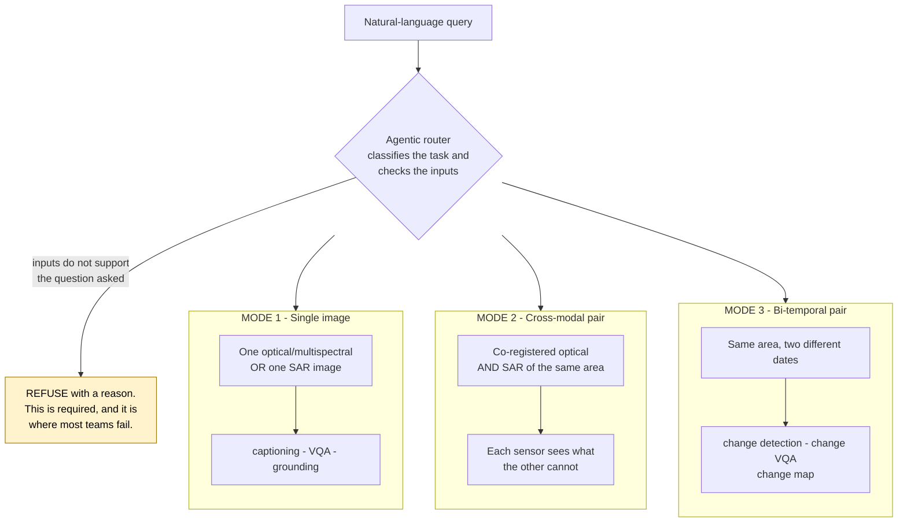

All three are required. This is not a menu.

**Accepted formats:** GeoTIFF or TIFF for geospatial imagery; PNG and JPEG **only** for the prescribed public benchmark datasets. That second clause means your system cannot be built around ordinary picture files.

The system must handle three distinct input configurations. This is not a menu to choose from; all three are required.

### Mode 1 — Single image

One optical/multispectral image **or** one SAR image.

```
[ one image ] + [ question ] → answer
```

Used for: captioning, visual question answering, text-guided region grounding.

### Mode 2 — Cross-modal pair

A co-registered optical/multispectral image **and** a SAR image of the same geographic area.

```
[ optical ] ┐
            ├→ joint analysis → answer using both
[ SAR ]     ┘
```

The point is that each sensor sees something the other cannot. Optical shows colour and vegetation; SAR shows structure and roughness and works through cloud. Together they give a more reliable answer than either alone.

Example query from the statement: *"Use the optical and SAR images together to identify built-up and water-covered regions."*

### Mode 3 — Bi-temporal pair

Two spatially corresponding images of the same area from **different dates**.

```
[ image at T1 ] ┐
                ├→ change analysis → what changed, and where
[ image at T2 ] ┘
```

Example query from the statement: *"What changed between these two dates, and where did the change occur?"*

### Accepted formats

- **GeoTIFF or TIFF** for geospatial imagery — this is the primary path
- **PNG and JPEG accepted only for the prescribed public benchmark datasets**

That second line matters. It means your system cannot be built around ordinary picture files. It has to handle real geospatial rasters with coordinate systems and multiple bands. PNG support exists only so that you can run the public benchmarks, which ship as ordinary images.

---

## 5. The five mandatory capabilities

### The five mandatory capabilities, and what proves each

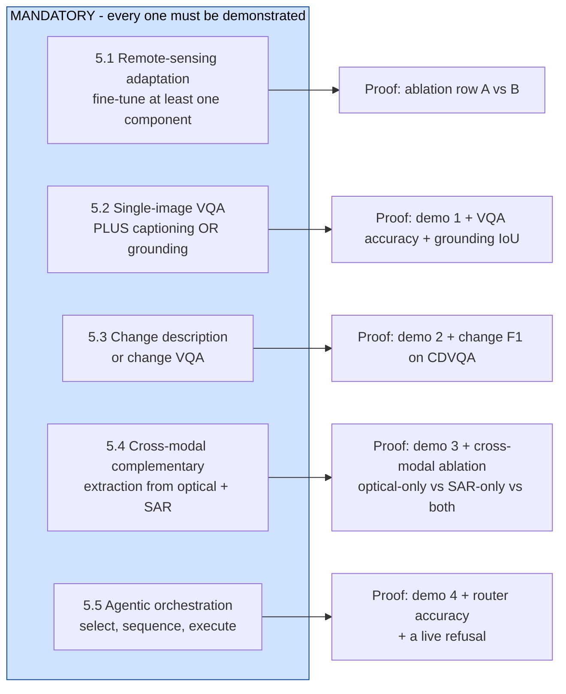

**On 5.2 - choose grounding over captioning.** A judge verifies a box in one second; a caption needs reading and interpretation. A box also carries coordinates, which feed the map, the GeoJSON export and the evidence layer. A caption carries nothing you can attach to anything.

**On 5.4 - the word is *complementary*.** Running the same analysis twice and printing both results does not satisfy it. You must show that combining the two produced something neither gave alone.

The statement uses the word "shall" and "mandatory" for these. Every one must be demonstrated.

### 5.1 Remote-sensing adaptation

> "At least one visual or vision-language component must be fine-tuned or otherwise adapted using BigEarthNet.txt or the any open source training data."

You must train something. A system assembled entirely from off-the-shelf models with clever prompting does not satisfy this clause. Note the wording is permissive about *which* data — "BigEarthNet.txt or any open source training data" — but not about *whether* you adapt.

### 5.2 Single-image baseline

> "Visual question answering shall be mandatory. Each solution must additionally implement either captioning/scene description or text-guided region grounding."

So: **VQA is compulsory, plus one of captioning or grounding.**

**Recommendation: choose grounding, not captioning.**

The reasoning is about what a judge can verify in ten seconds. Captioning produces a sentence — the judge has to read it, and then decide whether they agree, which is subjective and slow. Grounding produces a box drawn on the image — the judge looks at it and instantly knows whether the system found the right thing. Grounding also feeds the evidence layer directly, because a box has coordinates. A caption has nothing to attach to a map.

### 5.3 Multi-image change analysis

> "Change description or change-based visual question answering from a bi-temporal image pair shall be mandatory. A spatial change map may also be generated where reference masks are available."

Mandatory: describing or answering questions about change. Optional: the pixel-level change map.

### 5.4 Cross-modal pair analysis

> "The system must extract complementary information from a co-registered optical/multispectral and SAR image pair."

The word to notice is **complementary**. It is not enough to run the same analysis twice and print both results. You have to show that combining the two produced something neither gave alone. This is where §38's ablation earns its keep: measure optical-only, SAR-only, and optical+SAR, and show the third is better.

### 5.5 Agentic orchestration

> "The system must automatically select, sequence, and execute the appropriate specialist models or tools according to the query and input configuration."

Three verbs: **select**, **sequence**, **execute**. Sequencing matters — some questions need two tools run in order, not just one tool picked.

The statement then lists what the controller must do:

- interpret the query and classify the requested task
- check the number, modality, format, metadata, and compatibility of the input images
- select one or more models or tools from a predefined registry
- configure only permitted task parameters and execute the selected workflow
- combine textual and spatial outputs, estimate confidence, and return visual evidence
- provide an auditable execution summary containing the selected task, model/tool names, and key parameters

Read that as a specification for your router. Each bullet is a component you must build, and each is separately observable in your interface.

Note **"configure only permitted task parameters"** and **"from a predefined registry"**. The agent is deliberately constrained. It picks from a fixed list and sets a fixed set of knobs. It does not write code and it does not invent tools. Build it that way and say so — an unconstrained agent is a liability in a system meant for a space agency.

---

## 6. What the problem statement does *not* say

Three gaps in the official text. All three are real; all three change how you should prepare.

### 6.1 The judging criteria table is missing

Under *Evaluation/Judging Criteria*, the official text contains this literally:

```
Add 'Evaluation/Judging Criteria' table here
```

The placeholder was never replaced. What the statement *does* say is only:

> "Final evaluation will use prescribed public benchmark test subsets and an ISRO/SAC evaluation dataset. Scores will be normalised before combining different metrics."

**Consequence.** You do not know the weights. You cannot tell whether VQA accuracy, grounding IoU, change F1, cross-modal gain or routing accuracy carries the most marks.

**What to do about it.** Do not over-invest in any single capability hoping it is the heavy one. Aim for a balanced, defensible score across all five mandatory capabilities, and make each one separately visible in your results table. A system that is respectable everywhere survives any weighting; a system that is brilliant at one thing and weak at three loses under most weightings.

Also: check the official SIH portal before the event, in case the table has since been published.

### 6.2 The dataset field is truncated

The `Dataset Link` field in the official JSON is cut off mid-word at `VRSBench — for r`. This is not a copying mistake — across all 226 records in the file, the longest dataset field is exactly 355 characters, which is the length of this one. The export truncated them all.

**Consequence.** Only the BigEarthNet.txt guidance survived. ISRO's specific instructions for VRSBench, RSVQA and CDVQA — which splits to use, which links — were cut off and are not in your copy of the data.

**What to do about it.** Recover the full field from the official portal. Until then, default to each benchmark's own officially published test split, which is the safe assumption anyway.

### 6.3 The BigEarthNet reference — verified, resolves correctly

The statement gives `https://arxiv.org/abs/2603.29630` as the BigEarthNet.txt paper. **This has been checked and it resolves**: *BigEarthNet.txt: A Large-Scale Multi-Sensor Image-Text Dataset and Benchmark for Earth Observation*, arXiv 2603.29630, published 1 April 2026.

It confirms the figures used throughout Part IV — 464,044 co-registered Sentinel-1 SAR and Sentinel-2 multispectral images with approximately 9.6 million text annotations, covering geographically anchored LULC captions, visual question answering pairs, and referring-expression instructions for bounding-box prediction. No further verification needed.

---
---

# Part III — Domain foundations

If you already work with satellite data, skip to Part IV.

## 7. Optical and multispectral imagery

An optical satellite works like a camera. Sunlight hits the ground, some of it reflects back up, and the sensor records how much arrived in each wavelength band.

Different materials reflect differently, and that is what makes the image informative:

- Healthy vegetation reflects strongly in near-infrared and weakly in red — this contrast is how vegetation indices work
- Water absorbs most infrared, so it appears very dark in those bands
- Concrete and metal have their own distinctive signatures

A normal photograph gives you three bands. Sentinel-2 gives you thirteen, including several infrared bands. Those extra bands are the reason a satellite image is more informative than a photograph of the same place — and also the reason a model trained on ordinary photographs is not ready for one.

**Two limitations, and they are the whole reason SAR exists:** optical imaging needs daylight, and cloud blocks it completely. During a monsoon flood — exactly when you most want to see the ground — optical imagery is often useless.

---

## 8. SAR, explained from zero

### Why SAR sees what optical cannot

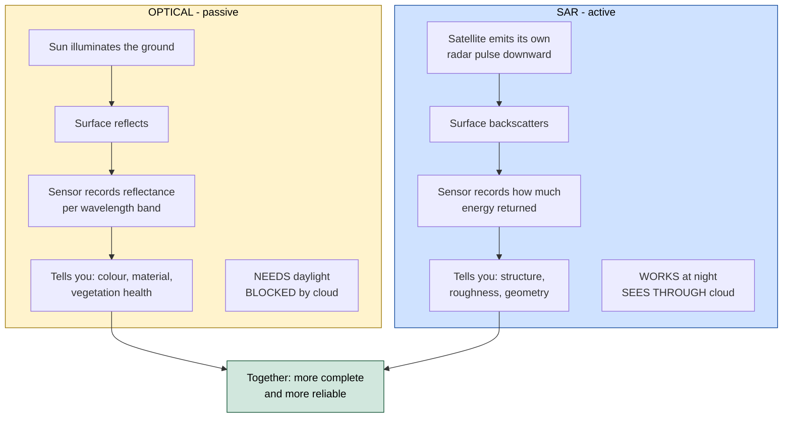

### Backscatter - what SAR brightness actually means

```
   SURFACE              RADAR RETURN                 APPEARS
   ------------------   --------------------------   ----------
   Calm water           very low - reflects away     very dark
   Smooth bare soil     low                          dark
   Vegetation           medium - scatters diffusely  mid-grey
   Buildings, metal     very high - corner reflect   very bright
```

### Two cases that prove the complementarity

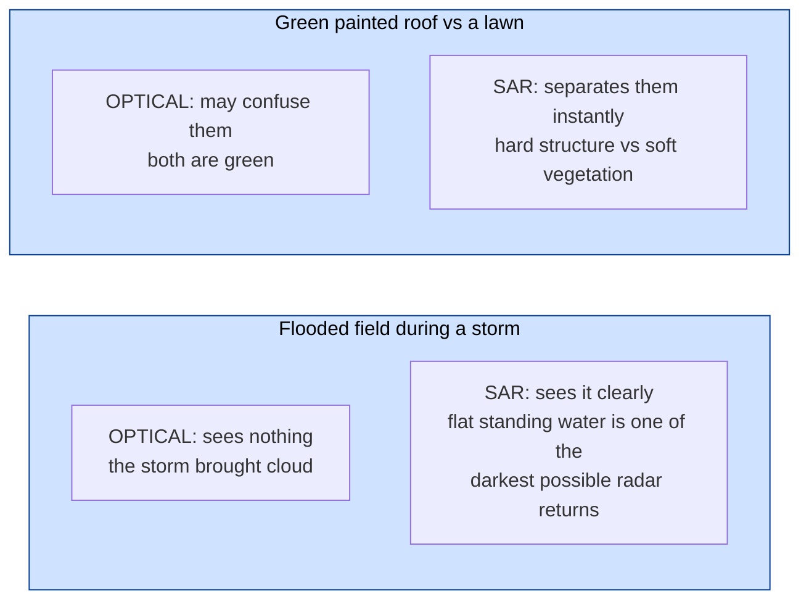

**The mistake almost every team will make:** SAR is single-channel and usually displayed as greyscale, so it is tempting to save it as a grey PNG and feed it to the optical model. A model trained on ordinary photographs reads bright pixels as "bright things" rather than "high backscatter" and produces confident nonsense. If an ISRO judge asks how you handle SAR and the honest answer is "we saved it as a grey image", that is a bad moment.

**SAR = Synthetic Aperture Radar.**

Instead of waiting for sunlight, the satellite emits its own radar pulse downward and measures what comes back. That single design difference gives it two properties optical imaging cannot have:

- **It works at night**, because it brings its own illumination
- **It sees through cloud**, because radar wavelengths pass through water vapour

### What SAR actually measures

Not colour. **Backscatter** — how much radar energy returned.

| Surface | Backscatter | Appearance |
|---|---|---|
| Calm water | Very low — the pulse reflects away from the sensor | Very dark |
| Smooth bare soil | Low | Dark |
| Vegetation | Medium — scatters in many directions | Mid-grey |
| Buildings, metal | Very high — corners reflect straight back | Very bright |

So SAR tells you about **structure, roughness and geometry**, where optical tells you about **colour and material**.

### Why this is complementary, not redundant

Consider a flooded field.

- **Optical** may see nothing at all, because the flood came with the storm and the storm brought cloud.
- **SAR** sees it clearly, because flat standing water is one of the darkest possible radar returns.

Now consider distinguishing a green painted roof from a lawn.

- **Optical** may confuse them — both are green.
- **SAR** separates them immediately — the roof is a hard structure with high backscatter, the lawn is not.

This is exactly the complementarity the problem statement is asking you to exploit.

### The mistake almost every team will make

SAR images are usually single-channel and are commonly displayed as greyscale. It is therefore very tempting to convert the SAR file to a grey PNG and feed it to the same vision model you use for optical images.

**Do not do this.** A model trained on ordinary photographs will interpret bright pixels as "bright things" rather than "high backscatter" and will produce confident nonsense. SAR has its own noise characteristics — speckle — and its own physics. It needs either a SAR-specific encoder or a component genuinely adapted on SAR data.

If a judge from ISRO asks how you handle SAR and the honest answer is "we saved it as a grey image", that is a bad moment. Conversely, being able to explain backscatter correctly is one of the cheapest ways to establish credibility with this particular panel.

---

## 9. Co-registration

Two images are **co-registered** when the same pixel position in both refers to the same point on the ground.

```
Optical(x, y)  ←→  SAR(x, y)     must be the same place on Earth
```

If they are misaligned by even a few pixels, every cross-modal or change conclusion becomes unreliable — the system will report "change" where in fact the two images are simply offset from each other.

### The important nuance most analyses miss

The problem statement says the ISRO/SAC evaluation set contains **"pre-georeferenced and co-registered"** Cartosat-2S and RISAT pairs.

**Alignment is already done for you on the data you are scored against.**

So do not build a research-grade image-registration engine. That is a large effort spent on a problem the examiner has removed. What you *do* need:

1. A **validation check** — confirm that an incoming pair really is aligned, and refuse or warn if it is not
2. A **light alignment path** for your own demo imagery, which you may assemble yourself from unaligned sources

Treat co-registration as an input-validation concern, not as a core research contribution. Then use the effort you saved on the parts that are actually scored.

---

## 10. GeoTIFF, and why the format matters

A JPEG contains pixels. A GeoTIFF contains pixels **plus**:

- the **CRS** — which coordinate system the image uses
- the **geotransform** — the six numbers that convert pixel `(x, y)` into real-world coordinates
- **band information** — how many channels and what each represents
- arbitrary metadata — sensor, acquisition date, processing level

This is what upgrades your system from a toy to a tool. Because of the geotransform, when your grounding model returns a box at pixels `(120, 50, 220, 170)`, you can convert it into an actual latitude and longitude, draw it on a map, and export it as GeoJSON that opens in QGIS.

The difference in what your system can answer:

| Without geotransform | With geotransform |
|---|---|
| "There is a change." | "There is a change, centred at 23.41°N 85.32°E, covering approximately 4.7 hectares." |

The second answer is useful to someone doing a job. The first is a demo.

**Practical note.** Handle GeoTIFF with `rasterio` or GDAL. Read the CRS, read the geotransform, verify the band count, and reject files that fail. A malformed raster must produce a clear error message, never a crash.

---

## 11. VQA, captioning and grounding

The three single-image tasks. The problem statement requires VQA plus one of the other two.

### Visual Question Answering

```
image + question → answer
```

Examples on satellite imagery:

- *"How many buildings are visible?"* → `17`
- *"Is there a river in this image?"* → `Yes`
- *"What type of land dominates this region?"* → `Agricultural land`

This is a long-established research task in remote sensing — the RSVQA benchmark was built specifically for it.

### Captioning

```
image → descriptive sentence
```

> *"An agricultural area containing several rectangular fields separated by unpaved roads, with a small settlement in the north-east corner."*

### Grounding

```
image + text description → location of the thing described
```

The user says *"show me the residential buildings"* and the system returns boxes or masks around them.

### Why grounding beats captioning for this project

Three reasons, in order of importance:

1. **A judge can verify it instantly.** A box is either around the right thing or it is not. A caption requires reading and interpretation.
2. **It produces coordinates.** A box converts through the geotransform into a real geographic location, which feeds your map, your GeoJSON export and your evidence layer. A caption produces text that cannot be attached to anything.
3. **It is measurable with a hard number.** Grounding is scored with IoU, an objective metric. Captioning is scored with BLEU or CIDEr, which are weak proxies that judges rightly distrust.

---

## 12. Change detection — the five levels

### The five levels of a change answer

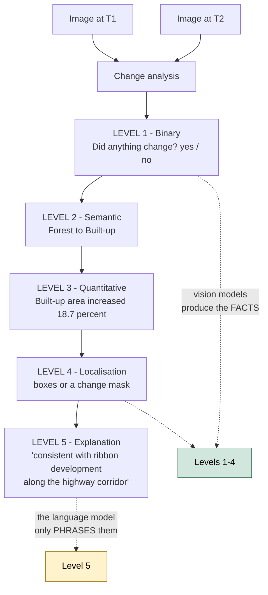

**Note the direction of information flow.** Vision models produce the facts; the language model phrases them. Never the reverse - that is the whole anti-hallucination architecture in one sentence.

```
   Image difference   is NOT   Change understanding
```

Subtracting one image from another tells you pixels changed. It cannot tell you a field became a warehouse, because a seasonal crop change and a construction project produce similar pixel differences.

When a user asks *"what changed?"*, there are five progressively harder answers. Know which one you are producing.

| Level | Question answered | Output |
|---|---|---|
| **1. Binary** | Did anything change? | `Yes` / `No` |
| **2. Semantic** | What kind of change? | `Forest → Built-up` |
| **3. Quantitative** | How much? | `Built-up area increased 18.7%` |
| **4. Localisation** | Where exactly? | Boxes or a change mask |
| **5. Explanation** | What does it mean? | *"The increase in built-up area along the highway corridor is consistent with ribbon development."* |

Levels 1–4 come from vision models. **Level 5 is where your language model earns its place** — and note the direction of information flow. The vision models produce the facts; the language model phrases them. Never the reverse.

### The distinction that separates a real system from a demo

```
Image difference  ≠  Change understanding
```

Subtracting one image from another shows you that pixels changed. It cannot tell you that a field became a warehouse, because a seasonal crop change and a construction project can produce similar pixel differences. Semantic interpretation on top of localisation is what the problem statement is actually asking for.

The public **CDVQA** benchmark exists precisely because this is a recognised research problem — you are not inventing it from nothing.

---

## 13. Why a generic GPT or Gemini is not enough

The temptation is obvious: send the image to a frontier multimodal model and print the reply. The problem statement forecloses it explicitly:

> "A general-purpose large language model (LLM) or vision-language model (VLM) cannot be expected to perform these specialised tasks reliably without adaptation to remote-sensing imagery, sensor characteristics, and domain-specific terminology."

and closes with:

> "A generic LLM or VLM without remote-sensing adaptation will not satisfy the requirements."

That is a scoring rule, not advice. But it is also technically true, for six reasons:

1. **Multispectral bands.** A general VLM accepts three channels. Satellite imagery has thirteen. Everything outside RGB is discarded before the model sees it.
2. **SAR is not a photograph.** Backscatter interpreted as brightness produces confident errors.
3. **Scale.** In an ordinary photo, a building fills the frame. In a 10 m-per-pixel satellite image it is four pixels. Models trained on everyday photographs have no prior for this.
4. **Overhead viewpoint.** Almost all general training data is horizontal. Top-down is a different visual world.
5. **Geographic coordinates carry meaning.** A general model has no concept of a CRS.
6. **Vocabulary.** Terms like backscatter, NDVI, co-registration, LULC class, speckle. General models use them loosely; a remote-sensing panel notices.

**Where a general model still belongs:** as the *language* layer at the very end, converting structured, verified results into a fluent sentence — and as the query interpreter at the front. Never as the thing that looks at the pixels and decides what is there.

---
---

# Part IV — The datasets

## 14. BigEarthNet.txt

**Role: the primary dataset for remote-sensing adaptation.** The problem statement names it directly.

> "BigEarthNet.txt will serve as the primary dataset for adapting image–text representations to multisensor remote-sensing data."

### What it contains

- **464,044 co-registered Sentinel-1 (SAR) and Sentinel-2 (multispectral) image pairs**
- approximately **9.6 million image–text annotations** across those pairs
- annotation types including captions, VQA-style pairs, referring expressions for bounding-box prediction, spatial relations and land-cover information
- metadata fields including `s1_name`, `patch_id`, `input`, `output`, `type`, `category`, `split`, `latitude`, `longitude`, `country`, `season`, climate zone

### The number you must state correctly

Do **not** say *"it has 9.6 million satellite images."* That is wrong and an ISRO panel will catch it.

- **464,044** is the number of image *pairs*
- **~9.6 million** is the number of *text annotations* attached to those pairs

Getting this right is a small thing that signals you actually opened the dataset. Getting it wrong signals you read a summary of it.

### Size, and the trap

The annotation table alone is roughly 467 MB. The associated imagery pushes the full collection to somewhere around 145 GB.

**Do not start by downloading everything.** Use streaming, selective subsets and cached shards. A team that spends its first day downloading 145 GB has lost a day.

### One subtlety worth knowing

The BigEarthNet.txt annotations were not all written by hand. The project describes several generation methods — manual, template-based, web-scraped, LLM-generated, with manual quality checking. Treat the dataset as **structured multimodal supervision**, not as a corpus of individually handwritten human captions. This matters when you design validation: do not treat every annotation as unimpeachable ground truth.

### Why it fits this problem unusually well

BigEarthNet.txt is one of the few public resources that connects, in one place:

- optical/multispectral imagery
- SAR imagery
- co-registration between the two
- natural-language text
- spatial relationships and remote-sensing concepts

That is close to a list of this problem statement's requirements. It is the right primary dataset, and ISRO chose it for a reason.

---

## 15. VRSBench

**Role: single-image evaluation.**

*Versatile Vision-Language Benchmark for Remote Sensing Image Understanding.*

- 29,614 remote-sensing images
- 29,614 human-verified detailed captions
- 52,472 object references
- 123,221 VQA pairs

It evaluates captioning, visual grounding and VQA — an almost exact match for your single-image baseline, including the grounding capability you should be choosing over captioning.

The question categories cover object existence, quantity, position, category, colour, scene type, shape, size, direction and reasoning.

**How to use it:** primarily as a **benchmark for model selection**, not as your main training set. Run each candidate base model against it, record the score, pick the best starting point. That comparison is also a slide in your final presentation.

---

## 16. RSVQA

**Role: baseline VQA sanity check.**

One of the foundational remote-sensing VQA datasets, published in two resolutions.

**RSVQA-LR (low resolution):**
- 772 images at 256 × 256 pixels
- 10 m spatial resolution
- 77,232 question–answer pairs
- Question types: object presence, comparison, rural/urban classification, counting
- Published split approximately 77.8% train / 11.1% validation / 11.1% test

**RSVQA-HR (high resolution):** a companion set built on very-high-resolution aerial imagery.

Together they span a useful range from coarse satellite-scale to fine aerial-scale imagery, which is a reasonable proxy for the gap between Sentinel-2 (10 m) and Cartosat-2S (sub-metre).

**Discipline:** use the prescribed public evaluation protocol. Do not invent a convenient private metric. For every run, log the question, reference answer, predicted answer, normalised answer, correctness, question type, model version and confidence — then report **per-category** accuracy, not just one overall number. A single aggregate figure hides exactly the weaknesses a judge will probe.

---

## 17. CDVQA

**Role: multi-temporal change evaluation.** *Change Detection Visual Question Answering.*

- 2,968 image pairs at 512 × 512 pixels
- more than 122,000 QA pairs
- Published split: 1,600 pairs / 65,967 QA for training; 400 pairs / 16,441 QA for validation; 968 pairs across two test sets

Typical questions:

- *Did the area change?*
- *What type of land cover changed?*
- *How much did the building area increase?*
- *Which class experienced the largest change?*

This is your evaluation set for the mandatory change-analysis capability, and it maps directly onto levels 1–3 of §12.

---

## 18. The hidden ISRO/SAC evaluation set

This is the one that decides the outcome, and you will never see it.

From the statement:

> "The ISRO/SAC evaluation set will contain pre-georeferenced and co-registered Cartosat-2S optical and RISAT SAR image pairs, with task-specific reference answers, labels, bounding boxes, or masks, as applicable. Evaluation annotations will not be disclosed to participating teams."

### What this changes

**You cannot optimise against the final labels.** Any effort spent squeezing the last percentage point out of a public benchmark may not transfer.

Your real objective is therefore **distribution robustness** — performing acceptably on imagery you have never seen, from Indian satellites you have not trained on, at resolutions that differ from your training data.

This is a good constraint. It penalises benchmark-gaming and rewards teams who built something that genuinely works.

### The domain gap you are facing

| | Your training data | The hidden evaluation |
|---|---|---|
| Optical source | Sentinel-2, ~10 m | Cartosat-2S, sub-metre |
| SAR source | Sentinel-1 | RISAT |
| Geography | Global, Europe-heavy | Indian |
| Resolution | Coarse | Fine |

Anything you can do to narrow that gap is worth more than a benchmark point. Where Indian imagery is publicly available — Bhuvan, for instance — validating against it is time well spent.

### The stress-test suite

Build an internal test set that deliberately varies:

- different geographic areas from those trained on
- very small and very large target objects
- low-contrast and high-contrast scenes
- cloud and haze, where relevant
- deliberate registration perturbations — shift one image two pixels and confirm the system notices
- optical-only, SAR-only, and optical+SAR
- very small changes and very large changes
- deliberately ambiguous questions, where the correct behaviour is to ask for clarification or abstain

A system that survives this has a real chance against the hidden set. A system tuned only on public benchmarks does not.

---

## 19. How the datasets fit together

### The dataset pipeline

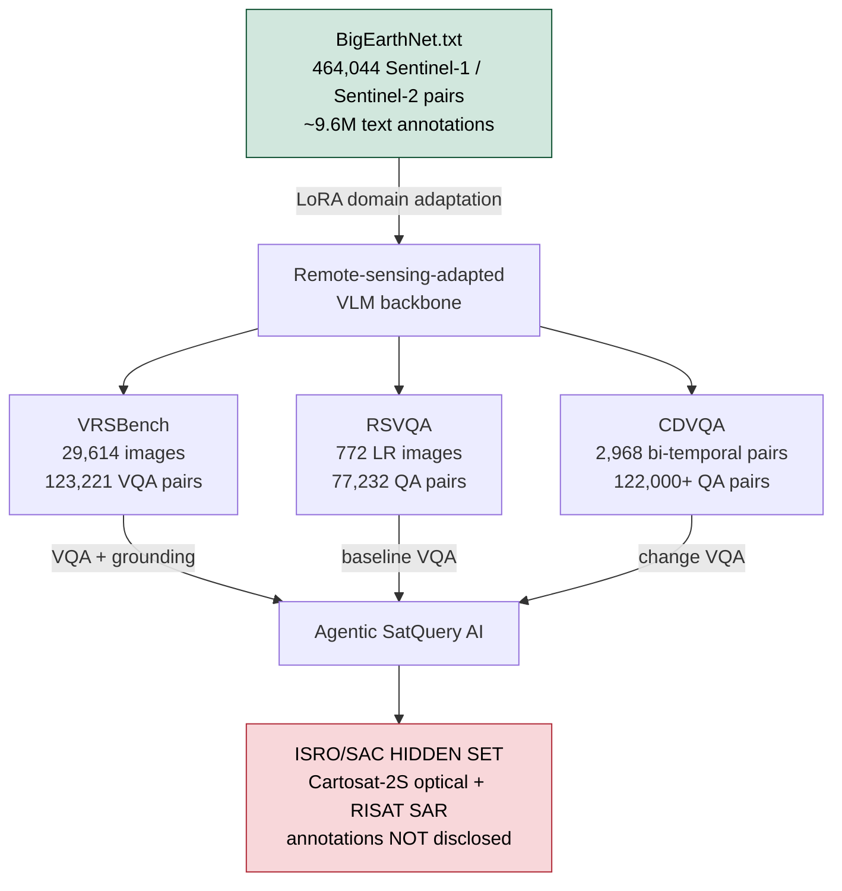

A useful way to hold it: **BigEarthNet.txt is the school. VRSBench, RSVQA and CDVQA are the practice exams. The ISRO/SAC set is the real exam you have never seen.**

### The domain gap you are actually facing

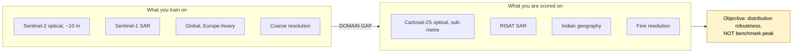

Anything narrowing that gap is worth more than a benchmark point. Where Indian imagery is publicly available - Bhuvan, for instance - validating against it is time well spent.

```
                    ┌──────────────────────────┐
                    │     BigEarthNet.txt      │
                    │  464,044 S1/S2 pairs     │
                    │  ~9.6M text annotations  │
                    └────────────┬─────────────┘
                                 │
                                 ▼   DOMAIN ADAPTATION (LoRA)
                                 │
                    ┌──────────────────────────┐
                    │ Remote-sensing-adapted   │
                    │      VLM backbone        │
                    └────────────┬─────────────┘
                                 │
         ┌───────────────────────┼───────────────────────┐
         ▼                       ▼                       ▼
    ┌──────────┐           ┌──────────┐            ┌──────────┐
    │ VRSBench │           │  RSVQA   │            │  CDVQA   │
    │ VQA +    │           │ baseline │            │ change   │
    │ grounding│           │   VQA    │            │   VQA    │
    └────┬─────┘           └────┬─────┘            └────┬─────┘
         │                      │                       │
         └───────────────────────┼───────────────────────┘
                                 │   BENCHMARKING
                                 ▼
                    ┌──────────────────────────┐
                    │   Agentic SatQuery AI    │
                    └────────────┬─────────────┘
                                 │
                                 ▼   FINAL, UNSEEN
                    ┌──────────────────────────┐
                    │  ISRO/SAC hidden set     │
                    │  Cartosat-2S + RISAT     │
                    └──────────────────────────┘
```

### Roles in one table

| Dataset | Purpose | Scale | Your use |
|---|---|---|---|
| **BigEarthNet.txt** | Multisensor image–text adaptation | 464,044 pairs, ~9.6M annotations | **Training** — domain adaptation |
| **VRSBench** | General RS vision-language understanding | 29,614 images, 123,221 VQA | **Benchmark** — VQA + grounding, model selection |
| **RSVQA** | Remote-sensing VQA | 772 LR images / 77,232 QA, plus HR | **Benchmark** — baseline VQA sanity check |
| **CDVQA** | Temporal change VQA | 2,968 pairs / >122k QA | **Benchmark** — change understanding |
| **ISRO/SAC** | Real-world final evaluation | Not public | **Cannot access** — design for generalisation |

A useful way to hold it in your head: BigEarthNet.txt is the *school*, VRSBench and RSVQA and CDVQA are the *practice exams*, and the ISRO/SAC set is the *real exam you have never seen*.

---

## 20. Data leakage — the mistake that quietly inflates your scores

### How random splits silently inflate your score

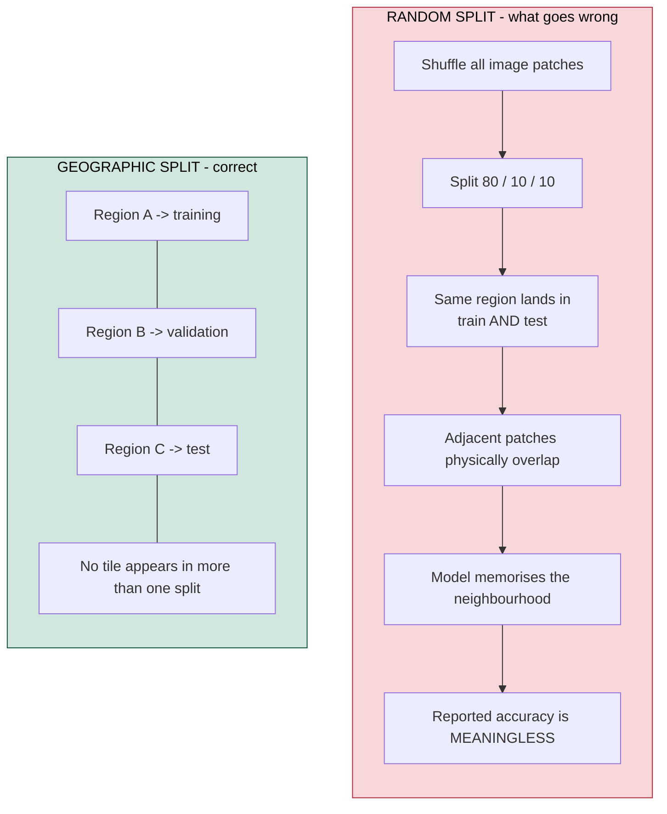

Satellite datasets are geographically structured - adjacent patches share a tile, a city, an acquisition. RSVQA itself uses tile-level splitting for exactly this reason. **Where a benchmark publishes an official split, use the official split**; deviating invalidates any comparison you draw.

This is the most common way a team ends up with excellent numbers and a system that fails on the day.

Satellite datasets are **geographically structured**. Adjacent image patches often come from the same satellite tile, the same city, the same acquisition. If you shuffle all your images and split them randomly, you will very likely end up with:

- the same region in both training and test
- the same tile in both
- a patch in test that physically overlaps a patch in training

Your model then scores well because it has effectively memorised the neighbourhood, and your reported accuracy is meaningless.

### The fix

Split by **geography**, not by image.

```
Region A  →  training
Region B  →  validation
Region C  →  test
```

No tile appears in more than one split. RSVQA itself uses tile-level splitting for exactly this reason.

And where a benchmark publishes an official split, **use the official split**. It exists so results are comparable across teams, and deviating from it invalidates any comparison you draw.

---
---

# Part V — System architecture

## 21. The architectural principle

### The one decision that governs everything

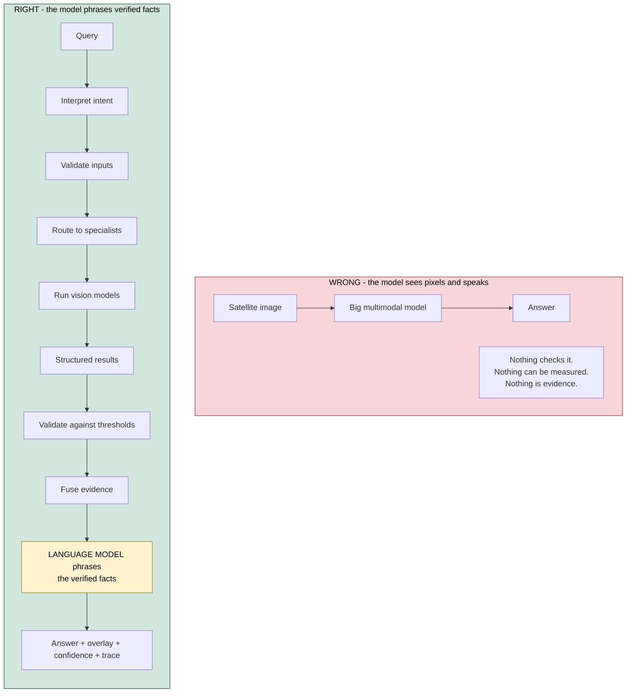

In the right-hand arrangement the language model sits at the **end** and is handed facts rather than pixels. It cannot invent a building count, because it never counted anything - a vision model did, and the number was checked before the sentence was written.

Everything in this part follows from one rule:

> **The language model is not the system. It is one constrained component inside a controlled pipeline.**

Two arrangements. The first loses.

```
  WRONG
  ─────
  satellite image ──► big multimodal model ──► answer

  The model sees pixels and says whatever it says. Nothing checks it.
  Nothing can be measured. Nothing can be shown as evidence.
```

```
  RIGHT
  ─────
  query ──► interpret ──► validate inputs ──► route to specialist(s)
        ──► run specialist vision models ──► structured results
        ──► validate against thresholds ──► fuse evidence
        ──► language model phrases the verified facts
        ──► answer + map overlay + confidence + execution trace
```

In the second arrangement, the language model is at the *end*, and it is handed facts rather than pixels. It cannot invent a building count because it never counted anything — a vision model did, and the number was checked before the sentence was written.

This single decision is what makes the system auditable, measurable and defensible, and it is the difference between the two arrangements in every conversation with a judge.

---

## 22. Full architecture

```
                              USER
                               │
                               ▼
                  ┌────────────────────────┐
                  │    Web application     │
                  │   React / Next.js      │
                  │   + map viewer         │
                  └───────────┬────────────┘
                              │ REST / WebSocket
                              ▼
                  ┌────────────────────────┐
                  │   Input validator      │   Layer 1
                  │   GeoTIFF / TIFF       │
                  │   CRS, bands, metadata │
                  └───────────┬────────────┘
                              │
                              ▼
                  ┌────────────────────────┐
                  │   Query interpreter    │   Layer 2
                  │   intent + constraints │
                  └───────────┬────────────┘
                              │
                              ▼
                  ┌────────────────────────┐
                  │    Agentic router      │   Layer 3
                  │  task + compatibility  │
                  │  + tool selection      │
                  └───────────┬────────────┘
                              │
        ┌──────────────┬──────┴───────┬──────────────┐
        ▼              ▼              ▼              ▼
   ┌─────────┐   ┌───────────┐  ┌──────────┐  ┌────────────┐
   │ RS-VQA  │   │ Grounding │  │  Change  │  │Optical-SAR │   Layer 4
   │  model  │   │   model   │  │  model   │  │   fusion   │
   └────┬────┘   └─────┬─────┘  └────┬─────┘  └─────┬──────┘
        │              │             │              │
        └──────────────┴──────┬──────┴──────────────┘
                              ▼
                  ┌────────────────────────┐
                  │   Evidence fusion      │   Layer 5
                  │   + confidence         │
                  │   + threshold gate     │
                  └───────────┬────────────┘
                              │
                              ▼
                  ┌────────────────────────┐
                  │  Pixel → geo transform │
                  │  boxes → GeoJSON       │
                  └───────────┬────────────┘
                              │
                              ▼
                  ┌────────────────────────┐
                  │   Answer generator     │   Layer 6
                  │   (constrained LLM)    │
                  └───────────┬────────────┘
                              │
        ┌──────────────┬──────┴───────┬──────────────┐
        ▼              ▼              ▼              ▼
     Text          Map overlay    Confidence   Execution trace
     answer                                          │
        └──────────────┴──────────────┴──────────────┘
                              ▼
                     Downloadable report
```

Supporting stores sit alongside: **PostgreSQL + PostGIS** for metadata, geometry and results; **object storage** for the imagery itself.

---

## 23. Layer 1 — Ingestion and validation

The first thing that touches a user's file. Its job is to turn an uploaded raster into a known-good, standardised tensor, or to reject it with a clear message.

```
GeoTIFF / TIFF upload
        ↓
header validation (rasterio / GDAL)         — is it a valid raster?
        ↓
CRS and EPSG verification                    — does it know where it is?
        ↓
geotransform extraction                      — origin, pixel size, extent
        ↓
sensor and band identification               — RGB? NIR? SWIR? SAR VV/VH?
        ↓
radiometric normalisation                    — comparable value ranges
        ↓
tiling / patching and alignment              — model-sized inputs
        ↓
standardised tensor  →  router
```

**Requirements this layer satisfies:** the statement's *"check the number, modality, format, metadata, and compatibility of the input images"*, and *"Input upload and compatibility checking"* in the expected solution.

**Design rule:** a malformed file must never crash the pipeline. It must produce a specific, readable error — *"This file has no coordinate reference system. Change analysis needs georeferenced imagery."* That sentence is itself demo material; it shows the system understands its own preconditions.

---

## 24. Layer 2 — Query understanding

Takes the user's sentence and produces a structured intent.

Input: *"What changed between these two dates, and where did the change occur?"*

Output:

```json
{
  "task": "change_analysis",
  "sub_tasks": ["change_description", "change_localisation"],
  "modality_required": "bi_temporal",
  "needs_spatial_evidence": true,
  "spatial_constraint": null
}
```

The interpreter also extracts constraints where present — *"in the northern half"*, *"within 2 km of the river"*, *"only built-up areas"* — which later become filters on the results.

This is a legitimate use of a language model: converting fuzzy human phrasing into a fixed schema. It is not looking at any pixels.

---

## 25. Layer 3 — The agentic router

### The router - classify, validate, select, sequence

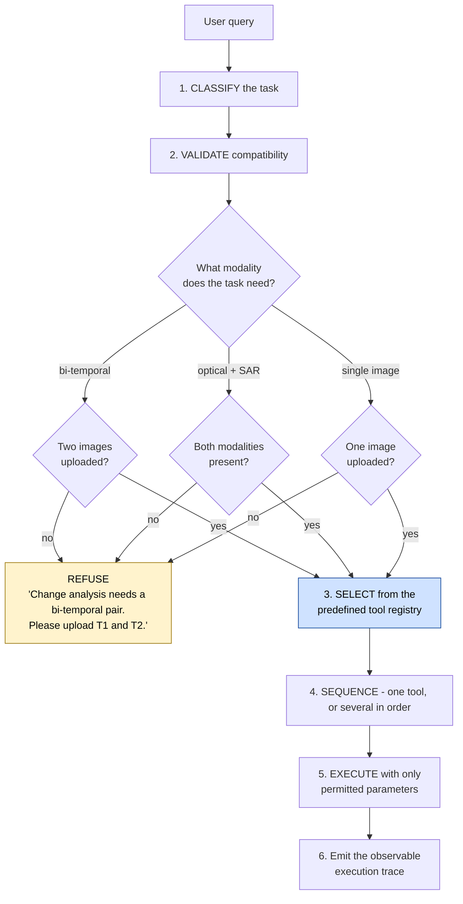

**Demonstrate the refusal in your demo.** Fifteen seconds, and it proves the system reasons about its inputs rather than pattern-matching keywords. Most competing demos will fail this test live - upload one image, ask "what changed between these two images", and watch them run the change model on a duplicated input.

**The agent is deliberately constrained.** It picks from a fixed registry and sets a fixed set of knobs. It does not write code and it does not invent tools. Build it that way and say so - an unconstrained agent is a liability in a system meant for a space agency.

The component the problem statement calls the novelty. It does three things in order.

### 25.1 Classify the task

| User query | Router output |
|---|---|
| *"How many buildings are in this image?"* | `{ "task": "vqa", "modality": "single_image", "needs_grounding": false }` |
| *"Highlight all stadiums."* | `{ "task": "grounding", "modality": "single_image", "needs_boxes": true }` |
| *"What changed between these images?"* | `{ "task": "change_analysis", "modality": "bi_temporal", "needs_change_map": true }` |
| *"Use both images to identify built-up and water regions."* | `{ "task": "cross_modal", "modalities": ["optical", "sar"] }` |

### 25.2 Validate compatibility — and refuse when necessary

This is the part that most teams will skip, and it is explicitly in the specification.

```
                    query analysed
                          │
                          ▼
              ┌───────────────────────┐
              │ what modality needed? │
              └───────────┬───────────┘
        ┌─────────────────┼─────────────────┐
        ▼                 ▼                 ▼
   bi-temporal       optical+SAR       single image
        │                 │                 │
        ▼                 ▼                 ▼
   2 images?         both present?      1 image?
    │      │           │      │          │     │
   yes     no         yes     no        yes    no
    │      │           │      │          │     │
    ▼      ▼           ▼      ▼          ▼     ▼
   run   REFUSE       run   REFUSE      run  REFUSE
```

If the user uploads one image and asks *"what changed between these two images?"*, the system must **not** run the change model on a duplicated input and produce a confident, meaningless answer. It must say:

> *"Change analysis needs a bi-temporal pair. Please upload an image for T1 and an image for T2."*

**Demonstrate this refusal in your demo.** It takes fifteen seconds and it proves the system reasons about its inputs rather than pattern-matching keywords. Most competing demos will fail this test live.

### 25.3 Select from a fixed registry

The agent picks from a predefined list. It cannot invent a tool.

```python
TOOLS = {
    "rs_vqa": {
        "tasks":      ["single_vqa"],
        "modalities": ["optical", "sar"],
        "inputs":     ["single_image", "question"],
        "outputs":    ["text", "confidence"],
    },
    "grounding": {
        "tasks":      ["grounding"],
        "modalities": ["optical"],
        "inputs":     ["single_image", "text"],
        "outputs":    ["boxes", "confidence"],
    },
    "change_vqa": {
        "tasks":      ["temporal_change", "temporal_change_vqa"],
        "modalities": ["optical_pair"],
        "inputs":     ["image_t1", "image_t2", "question"],
        "outputs":    ["text", "change_regions", "confidence"],
    },
    "optical_sar": {
        "tasks":      ["cross_modal"],
        "modalities": ["optical_sar_pair"],
        "inputs":     ["optical", "sar", "question"],
        "outputs":    ["text", "evidence", "confidence"],
    },
}
```

Every entry declares what it accepts and what it returns. The router matches the classified task and the validated inputs against this table. A constrained registry is both safer and easier to explain than a free-form agent — and the problem statement asks for exactly this: *"select one or more models or tools from a predefined registry"*.

### 25.4 Sequence, where needed

Some questions need more than one tool. *"Is there any new construction?"* on a bi-temporal pair needs change detection **and** building grounding, then a combined answer. The registry approach handles this naturally: the router returns a list, not a single choice.

---

## 26. Layer 4 — The specialist model suite

Four specialists, one per capability.

| Specialist | Handles | Input | Output |
|---|---|---|---|
| **RS-VQA** | Questions about a single image | image + question | text answer + confidence |
| **Grounding** | *Where is X?* | image + text | boxes/masks + confidence |
| **Change** | Bi-temporal analysis | T1 + T2 + question | text + changed regions + confidence |
| **Optical-SAR fusion** | Cross-modal reasoning | optical + SAR + question | text + per-modality evidence |

### On the SAR specialist

Worth restating because it is where most teams will cut a corner: SAR needs its own encoder or a genuinely SAR-adapted component. See §8. The shortcut — converting SAR to greyscale and feeding it to the optical model — is scientifically weak and easy for an ISRO panel to expose.

### On fusion strategy

There are three broad ways to combine optical and SAR, in increasing order of sophistication:

1. **Late fusion** — run each modality separately, combine the conclusions. Simplest, most robust, easiest to explain, and it gives you the per-modality evidence you need for the ablation. **Start here.**
2. **Feature-level fusion** — concatenate or cross-attend the two feature maps before the prediction head. Stronger, needs training.
3. **Cross-modal attention** — a joint model attending across both. Strongest, most expensive.

Late fusion also has a presentational advantage: you can show the judge *"optical said this, SAR said that, here is how we combined them"*, which is exactly the "complementary information" the statement asks you to demonstrate.

**Conflict handling.** When optical and SAR disagree, do not silently pick one. Report the disagreement and lower the confidence. A system that says *"optical suggests vegetation, SAR suggests a hard structure — confidence reduced"* is more trustworthy than one that quietly guesses.

---

## 27. Layer 5 — Evidence fusion

Every specialist writes into **one normalised evidence format**. This schema is the bridge between the machine-learning half of the system and the product half.

```json
{
  "claim": "Built-up area increased",
  "confidence": 0.82,
  "source": {
    "model": "change-v2",
    "version": "1.3"
  },
  "spatial_evidence": [
    {
      "geometry": "POLYGON((...))",
      "crs": "EPSG:4326",
      "score": 0.91
    }
  ],
  "temporal_evidence": {
    "before": "T1",
    "after": "T2"
  }
}
```

Because everything is normalised, the fusion layer can do its real job: threshold on confidence, resolve conflicts between specialists, aggregate multiple pieces of evidence into one claim, and hand a clean structure to the answer generator.

### Pixel to ground

Spatial evidence must be converted from image coordinates to Earth coordinates before it leaves this layer:

```
box in pixels (x1, y1, x2, y2)
        ↓  inverse affine geotransform
geographic coordinates (lat/lon extents)
        ↓
GeoJSON polygon, EPSG:4326
        ↓
map overlay  +  downloadable file
```

Store the results in PostGIS. That gives you spatial queries for free — *"show all detected changes within this district"* becomes a database query rather than new code.

---

## 28. Layer 6 — Answer generation without hallucination

### The anti-hallucination path

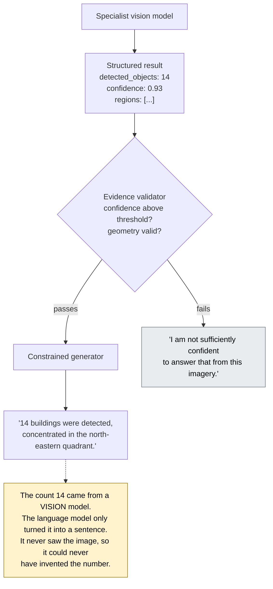

**Abstention is a feature, not a shortfall.** A system that says "I cannot answer that reliably" when confidence is low is more valuable than one that always answers. Build the threshold, expose it in the interface, demonstrate it deliberately - and then measure it, because abstention precision belongs in your results table alongside accuracy.

The language model's only job is to phrase facts it has been handed.

```
specialist model
        ↓
structured result   { "detected_objects": 14, "confidence": 0.93, "regions": [...] }
        ↓
evidence validator  — is confidence above threshold? is the geometry valid?
        ↓
   ┌────┴────┐
   ▼         ▼
 passes    fails
   │         │
   ▼         ▼
constrained  "I am not sufficiently confident to answer that from this imagery."
generator
   │
   ▼
"14 buildings were detected, concentrated in the north-eastern quadrant."
```

The count `14` came from a vision model. The language model turned it into a sentence. **It never had the opportunity to invent a number**, because it was never shown the image.

### Abstention is a feature

A system that says *"I cannot answer that reliably"* when confidence is low is more valuable than one that always answers. Build the threshold, expose it in the interface, and demonstrate it deliberately during the demo. Then measure it — abstention precision belongs in your results table alongside accuracy.

### Reliability rules

- **Input validation** — a malformed GeoTIFF must not crash the pipeline
- **Model fallback** — if a specialist fails, fall back to a secondary model and say so in the trace
- **Confidence thresholds** — below threshold, abstain rather than guess
- **Evidence requirement** — no claim is generated without a supporting model output behind it

---

## 29. The execution trace, and the chain-of-thought rule

The problem statement is unusually specific here:

> "The controller may perform internal task planning; however, only the observable execution trace, including the selected task, models or tools, permitted parameters, and outputs will be evaluated. Internal reasoning text is neither required nor evaluated."

Two instructions in one sentence.

**Do show the execution trace.** It is scored.

```
Execution summary
  ✓ Input validated       2 GeoTIFF, EPSG:4326, co-registration confirmed
  ✓ Task identified       change_analysis + change_localisation
  ✓ Tool selected         change_vqa  (v1.3)
  ✓ Parameters            threshold=0.5, min_region_px=64
  ✓ Result                3 changed regions, 4.7 ha total
  ✓ Confidence            0.91
  ✓ Evidence              change_map.geojson
```

**Do not show internal reasoning.** Streaming a wall of *"Hmm, let me think about what the user might mean..."* is not evaluated, adds latency, and — worse — invites the judge to find a flaw in reasoning that has no bearing on the output. Many teams will do this because it looks impressive. It is explicitly not what is being marked.

The trace is a factual audit log: what was chosen, what was run, with what parameters, producing what. That is what "auditable" means here.

---

## 30. Modules and technology stack

### The twelve modules

Useful as a work-breakdown structure for splitting the team.

| # | Module | Depends on |
|---|---|---|
| 1 | GeoTIFF/TIFF ingestion | — |
| 2 | Remote-sensing preprocessing | 1 |
| 3 | Remote-sensing-adapted VLM | — |
| 4 | VQA specialist | 3 |
| 5 | Grounding specialist | 3 |
| 6 | Change detection specialist | 2 |
| 7 | Optical–SAR fusion | 2 |
| 8 | Agentic router | 4, 5, 6, 7 |
| 9 | Evidence fusion | 4–7 |
| 10 | GIS visualisation | 9 |
| 11 | Evaluation and benchmarking | 4–8 |
| 12 | Report generation | 9, 10 |

Note that module 8 depends on 4–7. **The router cannot be built first**, and building it early is a trap — see §41.

### Stack

| Layer | Choice | Why |
|---|---|---|
| **Frontend** | Next.js, React, TypeScript, Tailwind | Standard, fast to build |
| **Map / raster viewer** | OpenLayers or MapLibre GL; Cesium if 3D is wanted | OpenLayers has the strongest GeoTIFF support |
| **Backend** | Python, FastAPI | Same language as the ML stack; async-friendly |
| **ML** | PyTorch, Hugging Face Transformers, PEFT | LoRA support comes from PEFT |
| **Geospatial** | rasterio, GDAL, GeoPandas, Shapely | Reading rasters, geometry operations |
| **Vision** | OpenCV | Preprocessing, tiling |
| **Agent** | **Custom Python router first**, LangGraph only if genuinely needed | See note below |
| **Database** | PostgreSQL + PostGIS | Spatial queries; far better than MongoDB here |
| **Object storage** | S3-compatible | Never store rasters as database blobs |

**On the agent framework.** Start with a plain Python router — a function that reads the structured intent and returns a list of tool names. It is 200 lines, you can debug it, and you can explain it in one slide. Reach for LangGraph only when you have a concrete orchestration need it solves. An agent framework adopted early adds a dependency, hides your logic behind someone else's abstraction, and gives you nothing to point at when a judge asks how routing works.

---
---

# Part VI — Models and training

## 31. Do not train from scratch — LoRA explained

### What LoRA actually does

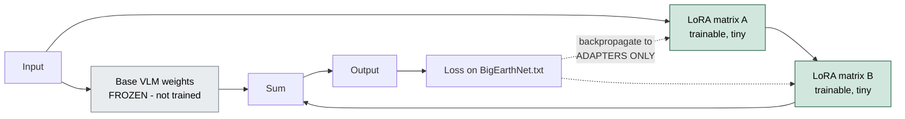

A large model is a stack of very large weight matrices. Normal fine-tuning updates all of them, needing memory proportional to the whole model. LoRA freezes the originals and adds a *pair of small matrices* alongside each one - and trains only those.

**The consequences that matter to you:** far less GPU memory, much faster training, adapters measured in megabytes rather than gigabytes (so you can keep several and swap between them), and cheap experimentation - train three adapters on three data mixes and compare.

**This one technique is what makes the mandatory adaptation requirement achievable on hardware you actually have.**

Training a vision-language model from zero requires enormous compute and enormous data. It is not a hackathon activity and nobody expects it.

What you do instead:

```
pretrained VLM  →  freeze most weights  →  insert small trainable adapters
                →  train adapters on BigEarthNet.txt  →  remote-sensing-adapted VLM
```

### What LoRA actually does

**LoRA** — Low-Rank Adaptation. The intuition, without the mathematics:

A large model is a stack of very large weight matrices. Fine-tuning normally means updating all of them, which needs memory proportional to the whole model. LoRA instead freezes the original matrices and adds a *pair of small matrices* alongside each one. Only those small matrices are trained. During the forward pass, the model uses the original weights plus the small learned adjustment.

```
     ┌────────────────────────┐
     │  Base VLM (frozen)     │──────┐
     └────────────────────────┘      │
                                     ├──►  forward pass  ──►  loss
     ┌──────────┐   ┌──────────┐     │                         │
     │ LoRA  A  │──►│ LoRA  B  │─────┘                         │
     │(trainable)│  │(trainable)│                              │
     └─────▲────┘   └─────▲────┘                               │
           └──────────────┴──── backpropagate to adapters only ┘
```

The practical consequences:

- **far less GPU memory** — you are storing gradients for a tiny fraction of the parameters
- **much faster training**
- **small artefacts** — an adapter is megabytes, not gigabytes, so you can keep several and swap between them
- **easy experimentation** — train three adapters on three data mixes and compare

`PEFT` (Parameter-Efficient Fine-Tuning) is the Hugging Face library that implements this.

This one technique is what makes the mandatory adaptation requirement achievable on hardware you actually have.

---

## 32. Base model candidates

Do not commit before you have measured. Evaluate candidates on VRSBench, then choose.

| Family | Notes |
|---|---|
| **Qwen-VL** | Strong open vision-language family, good multilingual support |
| **InternVL** | Strong on fine-grained visual detail |
| **LLaVA and derivatives** | Well documented, large community, easy starting point |
| **Remote-sensing-specific VLMs (GeoChat-class)** | Already partly adapted to overhead imagery — likely the best starting point, but check licences |

The selection procedure is itself a presentation slide:

```
candidate A  →  VRSBench test  →  accuracy XX.X
candidate B  →  VRSBench test  →  accuracy XX.X
candidate C  →  VRSBench test  →  accuracy XX.X
                                  ↓
                          pick the best, then adapt
```

**Check the licence of whichever you pick.** You are delivering "codes and models" to a government agency.

---

## 33. The data ladder

BigEarthNet.txt has around 9.6 million annotations. **Do not attempt to train on all of them.**

Climb a ladder instead, measuring at each rung:

```
100k samples  →  baseline  →  measure
     ↓
500k samples  →  measure  →  did it improve?
     ↓
1M samples    →  measure  →  did it improve?
     ↓
scale further only while the curve is still rising
```

The question you are answering is *"how much accuracy does each additional 100k samples buy?"* Once that curve flattens, more data is wasted time.

### Suggested task-balanced starting subset

| Task type | Samples |
|---|---|
| VQA | 50–100k |
| Captioning | ~50k |
| Spatial reasoning | ~50k |
| Grounding | ~50k |
| Optical–SAR | 100k+ |

Balance matters more than volume. A model trained on 500k samples that are 90% captioning will be poor at grounding.

### Preprocessing pipeline

```
raw datasets (BigEarthNet.txt, VRSBench, RSVQA, CDVQA)
        ↓
integrity and geo-corruption filter          — drop broken samples
        ↓
spatial deduplication and overlap removal    — see §20
        ↓
schema harmonisation to one JSONL format
        ↓
task and question taxonomy normalisation     — one vocabulary across sources
        ↓
geographic tile-level train/val/test split   — see §20
        ↓
tokenised training records
```

### Unified training record

Everything, from every source, normalised into one shape:

```json
{
  "image": {
    "optical": "S2A_MSIL2A_20240115_T43RGN.tif",
    "sar":     "S1B_IW_GRDH_20240115_T43RGN.tif"
  },
  "task": "vqa",
  "question": "Is there arable land next to pasture?",
  "answer": "yes",
  "latitude": 52.1,
  "longitude": 13.4,
  "country": "Germany",
  "season": "summer",
  "split": "train"
}
```

And for grounding:

```json
{
  "image": { "optical": "..." },
  "task": "grounding",
  "query": "Find buildings",
  "boxes": [[120, 50, 220, 170]],
  "split": "train"
}
```

One schema for all sources means one data loader, one validation path, and one place to fix a bug.

---

## 34. Training curriculum

Train in stages, easiest first, each building on the last.

| Stage | Data | Goal |
|---|---|---|
| **1. General RS adaptation** | BigEarthNet.txt | Image–text alignment, LULC vocabulary, spatial concepts, multisensor representation |
| **2. Single-image understanding** | VRSBench + RSVQA | VQA, grounding, captioning |
| **3. Temporal reasoning** | CDVQA | Pairwise comparison, change detection, change explanation |
| **4. Cross-modal alignment** | BigEarthNet.txt S1/S2 pairs | Optical–SAR feature alignment |
| **5. Router** | Synthetic (see §35) | Query → task → tool dispatch |

Stage 1 is the mandatory adaptation requirement (§5.1). Stages 2–4 map to the three specialist capabilities. Stage 5 is the orchestration layer, and it comes last for the reason given in §41.

---

## 35. Router training data

The router does not need a large model or a large dataset. Its job is narrow: given a sentence, name the task.

```json
{ "query": "How many buildings are visible?",        "task": "VQA",       "input_type": "single" }
{ "query": "What changed between these images?",     "task": "CHANGE",    "input_type": "bi_temporal" }
{ "query": "Highlight all residential buildings.",   "task": "GROUNDING", "input_type": "single" }
{ "query": "Compare the optical and SAR readings.",  "task": "CROSS_MODAL","input_type": "optical_sar" }
```

**5,000 to 20,000 synthetic examples are enough** for the initial router.

### Why synthetic data is legitimate here

Because the router makes no claim about the imagery. It never looks at a pixel. It answers one question — *which tool should run?* — and that question is entirely about language.

So generate paraphrases in bulk:

```
"What changed?"           ┐
"What is different?"      │
"Compare these two."      ├──►  CHANGE
"Show new structures."    │
"Identify any changes."   ┘
```

Include deliberate hard cases: queries that are ambiguous, queries that name a task the uploaded images cannot support, and queries that need two tools. Those are the ones that will come up in the demo.

**Report router accuracy as a number.** It is a headline result and it is cheap to measure.

---

## 36. Hardware

You do not need a large cluster for the prototype.

| Purpose | Requirement |
|---|---|
| **Prototyping and LoRA adaptation** | One GPU with 16–24 GB, using mixed precision and gradient accumulation |
| **Larger-scale fine-tuning** | Multiple GPUs help, but are not required for a working system |
| **Inference at the demo** | Plan explicitly — see below |

### Plan the demo machine now

This is the question that sinks projects on the day. Answer it in week one, not on the morning of the demo:

**What runs on the machine you will actually carry into the venue?**

Decide early whether you are demonstrating on a local GPU laptop or against a remote server, and if remote, what happens when the venue network is congested — which it will be. Have a fallback: quantised models, smaller variants, and a set of pre-computed results for the exact demo images, so a network failure degrades your demo instead of ending it.

---
---

# Part VII — Evaluation

## 37. Metrics, with the formulas explained

You cannot claim the system works. You have to measure it.

### VQA — accuracy

```
              number of correct answers
Accuracy  =  ───────────────────────────
                 total questions
```

Report **per question category** as well as overall. An 80% average that is 95% on presence questions and 40% on counting questions is telling you something important, and a judge will find it if you do not report it first.

### Grounding — Intersection over Union

IoU measures how well a predicted box overlaps the correct one.

```
           area( predicted ∩ ground truth )
IoU  =  ────────────────────────────────────
           area( predicted ∪ ground truth )
```

- `1.0` = perfect overlap
- `0.5` = the conventional threshold for "correct enough"
- `0.0` = no overlap at all

```
   ground truth        prediction         intersection ∩
   ┌────────┐          ┌────────┐         ┌────┐
   │████████│          │  ██████│         │ ██ │      IoU = ∩ / ∪
   │████████│          │  ██████│         │ ██ │
   └────────┘          └────────┘         └────┘
```

Report **mAP@0.5** — the standard detection metric — alongside raw IoU.

### Change detection — F1

Precision is how many of your detected changes were real. Recall is how many real changes you found. F1 balances them:

```
                precision × recall
F1  =  2  ×  ──────────────────────
                precision + recall
```

Also report change IoU and change-localisation accuracy.

### Captioning

CIDEr, BLEU, ROUGE if you implement captioning at all — but treat them as weak signals. They measure word overlap, not correctness. Prefer task-aligned metrics wherever you have the choice, which is another argument for choosing grounding over captioning (§5.2).

### Router — dispatch accuracy

```
                     correctly routed queries
Router accuracy  =  ──────────────────────────
                        total queries
```

Simple, honest, and directly evidences the orchestration requirement.

### Calibration

When the system says 0.9 confidence, is it right about 90% of the time? Measure expected calibration error. A well-calibrated confidence is what makes the abstention behaviour in §28 meaningful rather than decorative.

### Latency

Report p50 and p95 end-to-end. A judge will not wait 90 seconds. Know your numbers and optimise the demo path.

---

## 38. The ablation that makes this read as research

### The ablation ladder

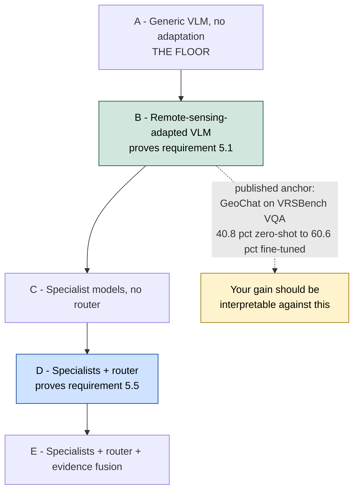

Then ask the honest question: **does each layer actually improve correctness or reliability?** If yes, your architecture has empirical justification. If a layer does not help, remove it or redesign it - and report that, because reporting a negative result honestly is more impressive than hiding it.

### The cross-modal ablation - proving *complementary*

```
   Optical only     XX.X
   SAR only         XX.X
   Optical + SAR    XX.X   <-- must be higher than both, or your fusion does nothing
```

Requirement 5.4 asks you to show complementary information. This three-row table is the proof. If the third row is not higher, you need to know that before the judges do.

This is the single highest-value experiment in the project. It converts "we built a system" into "we demonstrated that each component contributes."

Run five configurations on the same test set:

| # | Configuration | What it isolates |
|---|---|---|
| **A** | Generic VLM, no adaptation | The floor |
| **B** | Remote-sensing-adapted VLM | What adaptation bought — **evidences requirement §5.1** |
| **C** | Specialist models, no router | What specialisation bought |
| **D** | Specialists + router | What orchestration bought — **evidences requirement §5.5** |
| **E** | Specialists + router + evidence fusion | What grounding and validation bought |

Then ask the honest question:

> Does each layer actually improve correctness or reliability?

If yes, your architecture has empirical justification and you have a defensible claim. **If a layer does not help, remove it or redesign it** — that finding is also worth reporting, and reporting it honestly is more impressive than hiding it.

### The cross-modal ablation

Run the same comparison for the fusion requirement, because §5.4 asks you to show **complementary** information:

| Configuration | Accuracy |
|---|---|
| Optical only | `XX.X` |
| SAR only | `XX.X` |
| Optical + SAR | `XX.X` |

If the third row is not higher than the first two, your fusion is not doing anything and you need to know that before the judges do.

**Do not fill in these tables with plausible-looking numbers.** Run the experiments.

---

## 39. The results dashboard

One screen, shown at the end of the demo. Populate only from real runs.

```
Single-image VQA        ████████████████   XX.X %
Grounding IoU           ██████████████     XX.X
Change F1               █████████████      XX.X
Change VQA              ██████████████     XX.X %
Cross-modal gain        ████████           +X.X points over best single modality
Router accuracy         ███████████████    XX.X %
Calibration error       ███                X.XX
Abstention precision    ██████████████     XX.X %
p50 latency             XX s
p95 latency             XX s
```

Alongside it, the baseline comparison:

| System | RS adaptation | Specialists | Agent | Evidence | Temporal | Optical-SAR |
|---|:---:|:---:|:---:|:---:|:---:|:---:|
| Generic VLM | ✗ | ✗ | ✗ | Weak | Weak | Weak |
| Adapted VLM | ✓ | ✗ | ✗ | Medium | Medium | Medium |
| Specialist pipeline | ✓ | ✓ | ✗ | Strong | Strong | Strong |
| **SatQuery (target)** | **✓** | **✓** | **✓** | **Strong** | **Strong** | **Strong** |

---

## 40. Stress-testing for the hidden evaluation

Covered in §18. To restate as a checklist, because it is the part that determines your real score:

- [ ] Held-out geographic regions, never seen in training
- [ ] Very small and very large target objects
- [ ] Low-contrast and high-contrast scenes
- [ ] Cloud and haze
- [ ] Deliberate registration perturbation — shift one image and confirm the system notices
- [ ] Optical-only inputs
- [ ] SAR-only inputs
- [ ] Optical + SAR pairs
- [ ] Very small changes
- [ ] Very large changes
- [ ] Ambiguous queries where abstention or clarification is the correct behaviour
- [ ] Malformed and missing-CRS files
- [ ] Mismatched inputs — a change question with only one image supplied
- [ ] Higher-resolution Indian imagery, if obtainable, to probe the Sentinel → Cartosat gap

---
---

# Part VIII — Build and demo

## 41. Build order

### Build order, and why the agent comes last

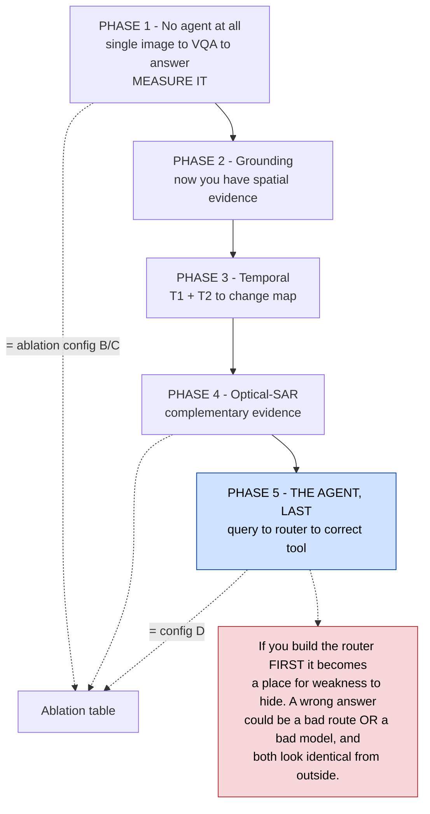

Build and **measure each specialist standing alone**. Then add the router and measure how often it dispatches correctly. Now every failure has exactly one address - and phases 1 to 4 hand you the ablation for free.

**What this implies about preparation:** the order above is not a 36-hour plan. Phases 1 to 4 involve dataset preparation, LoRA training runs and benchmark evaluation - weeks of work before the event. Arrive with trained adapters, benchmarked specialists and the ablation table already populated. The hours at the venue are for integration, interface, demo path and rehearsal.

The order matters, and getting it wrong is the most expensive mistake available.

```
Phase 1 — No agent at all
    single image  →  VQA  →  answer
    Prove the base capability works. Measure it.

Phase 2 — Grounding
    single image  →  grounding  →  boxes
    Now you have spatial evidence to attach to answers.

Phase 3 — Temporal
    T1 + T2  →  change  →  change map + description

Phase 4 — Optical-SAR
    optical + SAR  →  fusion  →  complementary evidence

Phase 5 — The agent, last
    query  →  router  →  correct tool
```

### Why the agent must come last

If you build the router first, it becomes a place for weakness to hide. When an answer is wrong you will not be able to tell whether the router picked the wrong tool or the right tool performed badly. Both failures look identical from the outside.

Build and **measure each specialist standing alone**. Then add the router, and measure how often it dispatches correctly. Now every failure has exactly one address.

This also gives you your ablation for free: phases 1–4 *are* configurations B and C in §38.

### What this implies about preparation

The build order above is not a 36-hour plan. Phases 1–4 involve dataset preparation, LoRA training runs and benchmark evaluation — that is preparation work done in the weeks before the event. Arrive with trained adapters, benchmarked specialists and the ablation table already populated. The hours at the venue are for integration, the interface, the demo path and rehearsal — not for starting a training run.

---

## 42. Interface design

Three panels.

```
┌──────────────┬────────────────────────────────┬──────────────────┐
│  UPLOAD      │        IMAGE / MAP VIEWER      │      CHAT        │
│              │                                │                  │
│ ▸ Image T1   │   ┌──────────────────────┐     │ Ask about this   │
│ ▸ Image T2   │   │                      │     │ imagery...       │
│ ▸ Optical    │   │   raster + overlays  │     │                  │
│ ▸ SAR        │   │   boxes, change mask │     │ "What changed?"  │
│              │   │                      │     │                  │
│ ─────────    │   └──────────────────────┘     │ ──────────────   │
│ CRS: 4326    │                                │ Change detected: │
│ Bands: 13    │   [optical] [SAR] [change]     │ 3 major regions  │
│ Aligned: ✓   │   layer toggles                │ Confidence: 92%  │
│              │                                │                  │
│              │                                │ [View evidence]  │
│              │                                │ [Show map]       │
│              │                                │ [Export report]  │
└──────────────┴────────────────────────────────┴──────────────────┘
                                                 ┌────────────────┐
                                                 │ EXECUTION TRACE│
                                                 │ ✓ validated    │
                                                 │ ✓ task: change │
                                                 │ ✓ tool: cd_vqa │
                                                 │ ✓ conf: 0.91   │
                                                 └────────────────┘
```

Design notes:

- The **map is the centre of the screen**, not the chat. This is a geospatial tool with a conversational interface, and the layout should say so before anyone speaks.
- Overlays are **toggleable layers** so the judge can compare before/after and see the change mask over either.
- The **execution trace is always visible**, not hidden behind a menu. It is scored.
- Show input metadata — CRS, band count, alignment status. It signals that the system read the file properly.
- **Export** produces both a report and the GeoJSON. A GIS user wants the geometry, not a screenshot.

---

## 43. The demo sequence

**Do not open by explaining your architecture.** Open by using the system. Architecture comes after they have seen it work.

**Demo 1 — Single-image VQA and grounding (60 seconds)**
Upload one optical image. Ask *"how many buildings are there?"* Get the answer. Then ask *"highlight them"* and show the boxes drawn on the image.
→ *Evidences §5.2: VQA plus a second single-image capability.*

**Demo 2 — Temporal change (60 seconds)**
Upload two images from different years. Ask *"what changed?"* Show before, after, and the change mask, with the affected area in hectares.
→ *Evidences §5.3.*

**Demo 3 — Optical + SAR (60 seconds)**
Upload a co-registered pair. Ask *"what does SAR reveal that the optical image does not?"* Show the optical evidence, the SAR evidence, and the combined interpretation.
→ *Evidences §5.4, and this is the one most competing teams will not have.*

**Demo 4 — Agentic routing, including a refusal (45 seconds)**
Show the execution trace across the previous three queries — different questions, different tools selected automatically. Then upload a single image and ask *"what changed between these two images?"* Let the system refuse and explain why.
→ *Evidences §5.5, and the refusal is the moment that separates you from the demos that only pattern-match keywords.*

**Demo 5 — The numbers (45 seconds)**
The results dashboard and the ablation table. *"Adaptation bought us this much. The router bought us this much. Here is the cross-modal gain."*
→ *Evidences §5.1 and turns a demo into a result.*

Roughly five minutes. Every mandatory capability demonstrated, in order, with evidence.

---

## 44. Definition of Done

The system is ready when a judge who has never seen it can, unaided:

- [ ] upload a valid optical image
- [ ] ask a natural-language question and receive a correct answer
- [ ] request grounding and see the correct region highlighted
- [ ] upload two temporal images
- [ ] ask what changed and see a spatial change result
- [ ] upload an optical + SAR pair
- [ ] ask a cross-modal question and see complementary evidence from both
- [ ] watch the system select tools automatically, without being told which to use
- [ ] inspect the execution trace
- [ ] see a confidence value and the evidence behind the answer
- [ ] see the system refuse a question its inputs cannot support
- [ ] download a report and the GeoJSON
- [ ] see benchmark results and the ablation table
- [ ] understand, from what they have seen, why this is better than a generic VLM

Any unticked box is a remaining engineering gap, not a presentational detail.

---

## 45. What not to do

| Do not | Because |
|---|---|
| Build a generic model wrapper (`image → GPT → answer`) | Explicitly disqualified by the statement, and technically weak (§13) |
| Train a large model from scratch | Wastes the entire timeline; LoRA exists (§31) |
| Download all 145 GB before doing anything | Costs a day; use subsets and streaming (§14) |
| Build only a beautiful interface | The statement is technically heavy; a pretty shell over nothing loses |
| Accept only RGB JPEGs | Fails the geospatial scope; GeoTIFF is the required path (§10) |
| Treat SAR as a greyscale photograph | Scientifically wrong and easy for the panel to expose (§8) |
| Skip temporal analysis | Mandatory (§5.3) |
| Skip optical–SAR analysis | Mandatory (§5.4) |
| Build the router before the specialists | It hides model weakness and destroys your ablation (§41) |
| Let the language model invent spatial evidence | The whole architecture exists to prevent this (§28) |
| Display fake chain-of-thought | Not evaluated, adds latency, invites attack (§29) |
| Let the agent execute arbitrary tools | The statement requires a predefined registry (§25.3) |
| Tune on hidden evaluation data | You cannot — and designing as if you could is the failure mode (§18) |
| Invent benchmark numbers | One caught fabrication invalidates everything else you claim |
| Pitch "AI" as the innovation | The innovation is the orchestrated workflow (§3) |

---
---

# Part IX — Risk

## 46. Risk register

| # | Risk | Impact | Mitigation |
|---|---|---|---|
| 1 | **Judging weights unknown** — the criteria table is missing from the PS (§6.1) | Cannot optimise; may over-invest in the wrong capability | Balance across all five mandatory capabilities; make each separately visible; re-check the portal before the event |
| 2 | **Domain gap** — trained on Sentinel, scored on Cartosat-2S/RISAT (§18) | Public benchmark scores may not transfer | Stress-test suite; validate on Indian imagery where available; prefer robustness over benchmark peak |
| 3 | **SAR handled as greyscale** | Scientifically weak; exposed instantly by an ISRO panel | Dedicated SAR encoder or genuinely SAR-adapted component (§8) |
| 4 | **Data leakage from random splits** (§20) | Inflated scores, real failure on the day | Geographic tile-level splits; use official benchmark splits |
| 5 | **Router built too early** (§41) | Failures become undiagnosable; ablation impossible | Specialists first, measured standing alone; router last |
| 6 | **Venue compute or network fails** (§36) | Demo cannot run | Local quantised fallback; pre-computed results for the exact demo images |
| 7 | **Model licence blocks delivery** (§3) | Deliverable includes "codes and models" | Check licences before training, not after |
| 8 | **Scope overrun** — five mandatory capabilities is a lot | Nothing finished to a demonstrable standard | Build order in §41; each phase independently demoable, so an overrun degrades scope rather than breaking the demo |
| 9 | **Latency too high for a live demo** (§37) | Judge disengages | Measure p50/p95 early; optimise the demo path; quantise |
| 10 | **Truncated dataset field** — VRSBench/RSVQA/CDVQA guidance missing (§6.2) | May use wrong splits | Recover the full field from the portal; default to official published splits |

---

## 47. Open questions to resolve before building

Answer these first. Each one changes a decision downstream.

1. **Has the judging-criteria table been published?** Check the official portal. It changes where effort goes.
2. **What is the full, untruncated `Dataset Link` field?** It contains ISRO's specific instructions for three of the four benchmarks.
3. **Which base model, and under what licence?** Benchmark on VRSBench, then confirm the licence permits delivery.
4. **What hardware is available at the venue, and what is the offline fallback?**
5. **Is any Cartosat-2S or RISAT sample imagery publicly obtainable?** Even a handful of scenes would let you probe the domain gap directly.
6. **Which team member owns which of the twelve modules (§30)?** Module 8 depends on 4–7; sequence the assignments accordingly.

*(Resolved: the BigEarthNet arXiv identifier was verified — see §6.3.)*

---
---

# Appendix A — Requirement traceability matrix

Every mandatory requirement, the component that satisfies it, the evidence that proves it.

| Requirement (from the PS) | § | Component | Proof for the judge |
|---|---|---|---|
| GeoTIFF/TIFF input; PNG/JPEG only for benchmarks | 4 | Ingestion (M1) | Metadata panel showing CRS, bands, geotransform |
| Input compatibility checking | 5.5 | Validator (M1) + Router (M8) | Live refusal of a mismatched query |
| Remote-sensing adaptation, at least one component | 5.1 | Adapted VLM (M3) | Ablation row A vs B |
| Single-image VQA — **mandatory** | 5.2 | VQA specialist (M4) | Demo 1; VQA accuracy, per-category |
| One additional single-image task | 5.2 | Grounding specialist (M5) | Demo 1; grounding IoU, mAP@0.5 |
| Change description or change VQA — **mandatory** | 5.3 | Change specialist (M6) | Demo 2; change F1 on CDVQA |
| Spatial change map — optional | 5.3 | Change specialist (M6) | Change mask overlay |
| Cross-modal complementary extraction | 5.4 | Optical-SAR fusion (M7) | Demo 3; cross-modal ablation table |
| Agentic select, sequence, execute | 5.5 | Router (M8) | Demo 4; router accuracy |
| Tool selection from a predefined registry | 5.5 | Tool registry (M8) | The registry, shown as code |
| Only permitted parameters configured | 5.5 | Router (M8) | Parameters listed in the execution trace |
| Combine outputs, estimate confidence, return visual evidence | 5.5 | Evidence fusion (M9) | Map overlays with confidence values |
| Auditable execution summary | 5.5 | Trace (M8/M9) | Always-visible trace panel |
| Interactive GUI or web application | 3 | Frontend (M10) | The application itself |
| Downloadable reports | 3 | Report generator (M12) | Exported PDF and GeoJSON |
| Codes and models delivered | 3 | Repository | Repository with weights, tests, licence audit |

---

# Appendix B — Sources

**Primary source — use this one.**
- `docs/00_Official_Problem_Statement.md` — verbatim text extracted from `sih_2026_problem_statements.json`, record 26167

**Datasets**
- BigEarthNet.txt project — https://txt.bigearth.net/
- BigEarthNet.txt on Hugging Face — `BIFOLD-BigEarthNetv2-0/BigEarthNet.txt`
- BigEarthNet.txt paper — *BigEarthNet.txt: A Large-Scale Multi-Sensor Image-Text Dataset and Benchmark for Earth Observation*, arXiv 2603.29630, 1 April 2026 — **verified, resolves**
- VRSBench project — https://vrsbench.github.io/
- VRSBench repository — https://github.com/lx709/VRSBench
- VRSBench, NeurIPS 2024 Datasets and Benchmarks Track
- RSVQA project — https://rsvqa.sylvainlobry.com/
- RSVQA paper — `arxiv.org/abs/2003.07333`
- CDVQA — *Change Detection Meets Visual Question Answering*

**Context**
- ISRO/SAC SIH page — https://vedas.sac.gov.in/vcms/en/sih2024.html

**Deliberately not cited:** third-party mirrors of the SIH problem statements. Earlier drafts of this analysis relied on one. It currently agrees with the official text, but it is an unnecessary dependency and a silent source of drift. Everything requirement-related in this document traces to Appendix B's primary source.

---

*End of document.*
