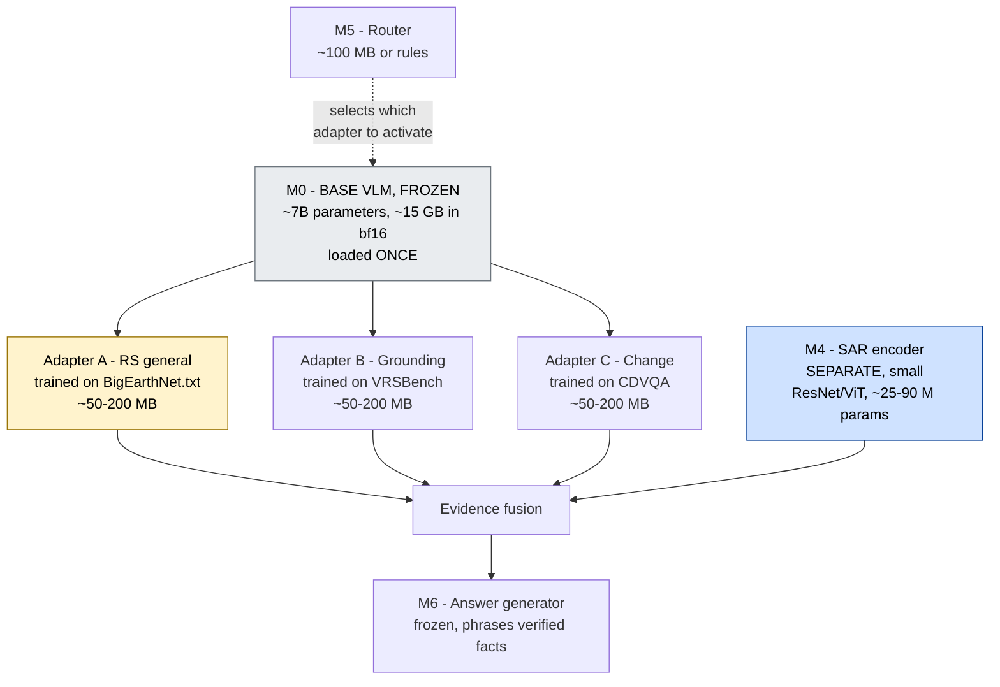
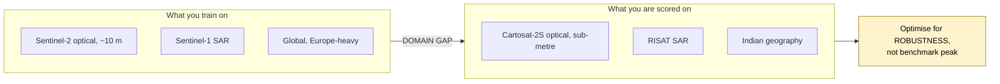
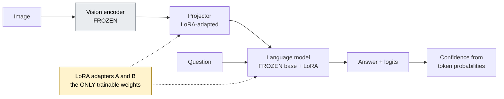
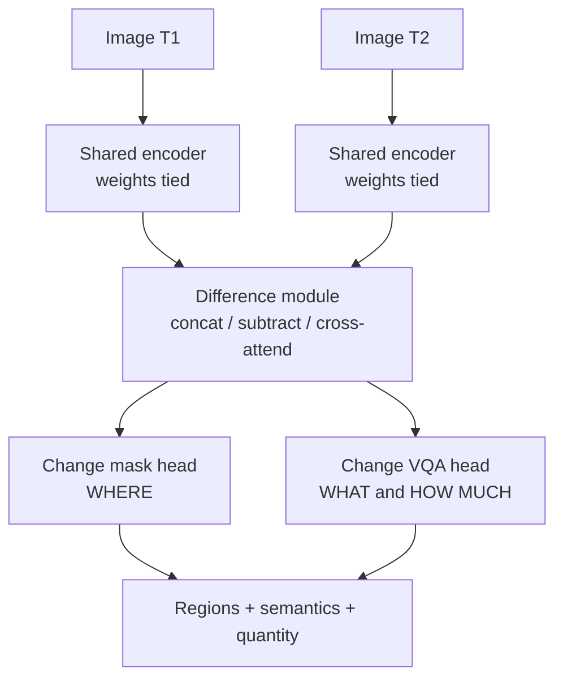
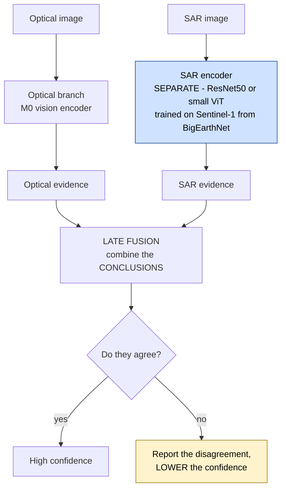
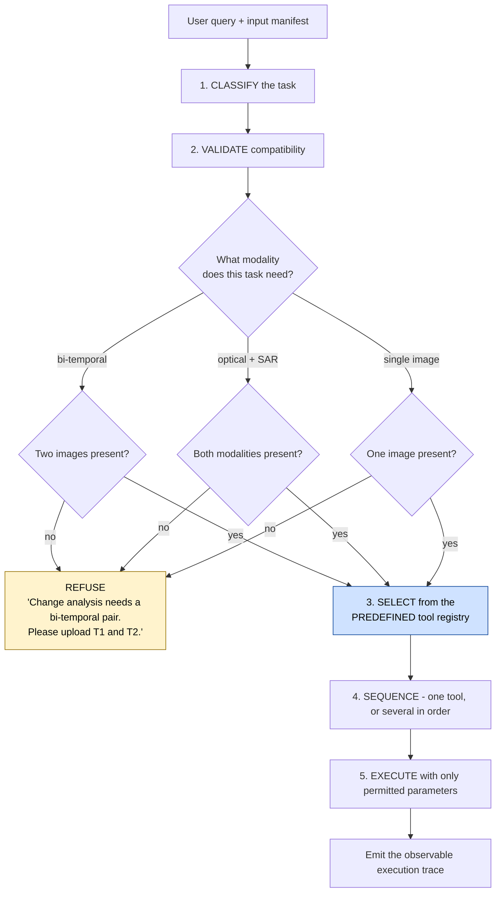
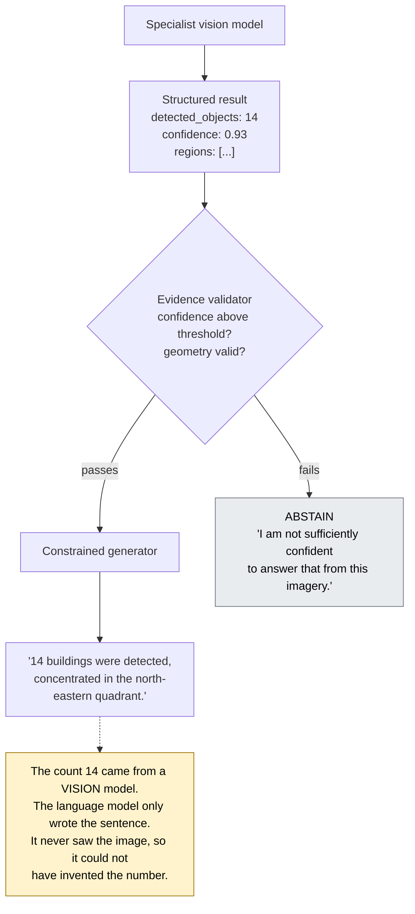
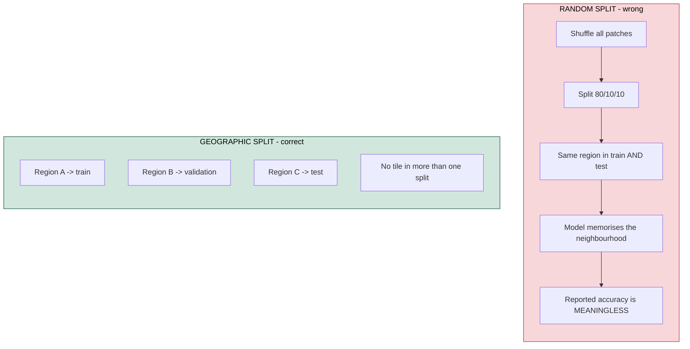
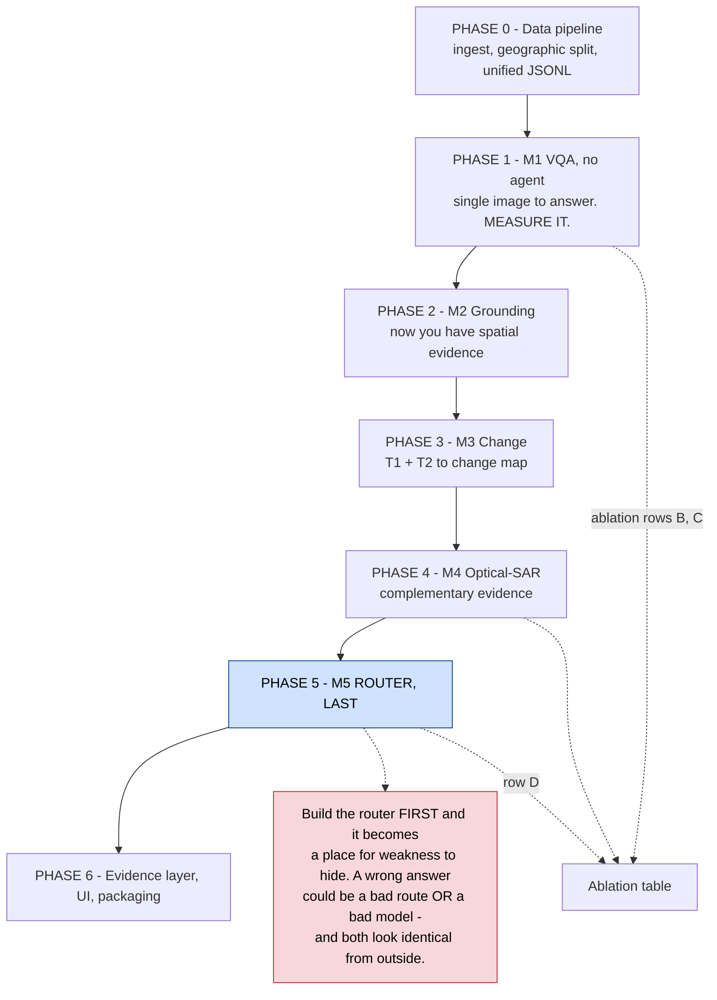

# PS26167 — Model Specification & Build Contract

**A self-contained handoff document.** Everything an engineer or an AI agent needs to build SatQuery AI without reading any other file.

---

## 0. Context — read this first if you have no other context

### What is being built

**SatQuery AI**, for Smart India Hackathon 2026, Problem Statement **26167**, posted by the **Indian Space Research Organisation (ISRO)**, Department of Space. Category: Software. Theme: Space Technology.

**The product in one sentence:** a web application where a user uploads satellite imagery, asks a question in ordinary English, and the system automatically selects and runs the right specialist remote-sensing model, then returns an answer with visual evidence, a confidence score, and an auditable record of what it ran.

### The governing design rule

> **Do not build a chatbot that looks at satellite images. Build a remote-sensing analysis system that happens to accept natural language.**

Concretely, this means the language model sits at the **end** of the pipeline and is handed verified structured facts to phrase. It never looks at pixels and decides what is there. Vision models produce facts; the language model writes sentences about them. **Never the reverse.**

### What ISRO mandates (all five are compulsory)

| # | Requirement | Verbatim from the problem statement |
|---|---|---|
| 1 | **Remote-sensing adaptation** | *"At least one visual or vision-language component must be fine-tuned or otherwise adapted using BigEarthNet.txt or the any open source training data."* |
| 2 | **Single-image baseline** | *"Visual question answering shall be mandatory. Each solution must additionally implement either captioning/scene description or text-guided region grounding."* |
| 3 | **Multi-image change analysis** | *"Change description or change-based visual question answering from a bi-temporal image pair shall be mandatory."* |
| 4 | **Cross-modal pair analysis** | *"The system must extract complementary information from a co-registered optical/multispectral and SAR image pair."* |
| 5 | **Agentic orchestration** | *"The system must automatically select, sequence, and execute the appropriate specialist models or tools according to the query and input configuration."* |

Plus: input compatibility checking, confidence estimation, visual evidence, an auditable execution summary, and an interactive GUI or web application.

### Three critical constraints

1. **A generic LLM/VLM will not satisfy the requirements.** The statement says so explicitly. You must train something.
2. **Only the observable execution trace is evaluated.** The statement: *"Internal reasoning text is neither required nor evaluated."* Show what was selected and run — never display fabricated chain-of-thought.
3. **The judging weights are unknown.** The official text contains an unreplaced placeholder, `Add 'Evaluation/Judging Criteria' table here`. There is **no stated accuracy threshold**. Balance across all five mandatory capabilities rather than optimising one.

### Input and output contract

```
INPUTS
  Imagery : GeoTIFF or TIFF (primary path)
            PNG / JPEG accepted ONLY for prescribed public benchmark datasets
  Modes   : (a) single image - optical/multispectral OR SAR
            (b) cross-modal pair - co-registered optical + SAR, same area
            (c) bi-temporal pair - same area, two dates
  Query   : free-text natural language

OUTPUTS
  Text answer
  Visual evidence  : bounding boxes / masks / change map, on a map
  Geo-coordinates  : GeoJSON, EPSG:4326
  Confidence score
  Execution trace  : task selected, models/tools run, parameters, outputs
  Downloadable report
```

---

## 1. Model inventory — the direct answer

**You build 6 components. You train 4 of them. You train nothing from scratch.**

| # | Component | Type | Trained? | Serves requirement |
|---|---|---|---|---|
| **M0** | **Base VLM** | Pretrained, **frozen** | No — downloaded | Foundation for M1–M3 |
| **M1** | **RS-adapted VQA** | LoRA adapter on M0 | **Yes** ← *the mandatory adaptation* | 1, 2 |
| **M2** | **Grounding** | LoRA adapter on M0 | Yes | 2 |
| **M3** | **Change / Change-VQA** | LoRA adapter on M0 + Siamese difference head | Yes | 3 |
| **M4** | **SAR encoder + fusion** | Separate small encoder, late fusion | Yes (light) | 4 |
| **M5** | **Router** | Small text classifier | Yes (trivial) | 5 |
| **M6** | **Answer generator** | M0's language head, or a small open LLM | **No** | Output layer |

### The key architectural decision: one base, many adapters

Do **not** load four separate 7-billion-parameter models. Load **one** frozen base and hot-swap small LoRA adapters.



**Why this matters:**

| | Four separate models | One base + adapters |
|---|---|---|
| VRAM at inference | ~60 GB | **~15 GB** (or ~6 GB quantised) |
| Disk | ~60 GB | ~15 GB + a few hundred MB |
| Training cost | 4 full fine-tunes | 3 LoRA runs |
| Swap time | reload the model | milliseconds |

**M4 (SAR) must stay separate.** SAR is not a photograph — see §6.

---

## 2. Datasets — exact sources

Every source below has been verified to exist.

| Dataset | Used by | Source | Size | Role |
|---|---|---|---|---|
| **BigEarthNet.txt** | M1 | HF: `BIFOLD-BigEarthNetv2-0/BigEarthNet.txt`<br/>Project: https://txt.bigearth.net/<br/>Paper: arXiv 2603.29630 | annotations ~467 MB; **full imagery ~145 GB** | **Training** — the mandatory adaptation |
| **VRSBench** | M2 | HF: `xiang709/VRSBench`<br/>GitHub: https://github.com/lx709/VRSBench<br/>Project: https://vrsbench.github.io/ | 29,614 images | Training + benchmark: VQA, grounding, captioning |
| **RSVQA** | M1 | https://rsvqa.sylvainlobry.com/<br/>Paper: arXiv 2003.07333 | LR: 772 images / 77,232 QA | Benchmark: baseline VQA |
| **CDVQA** | M3 | GitHub: https://github.com/YZHJessica/CDVQA<br/>Paper: arXiv 2112.06343 | 2,968 pairs @ 512×512<br/>122,000+ QA | Training + benchmark: change VQA |
| **ISRO/SAC hidden set** | — | Not public | unknown | Final evaluation. **You cannot access it** |
| **Router data** | M5 | **You generate it** | 5–20k rows | Training |

### BigEarthNet.txt in detail

- **464,044** co-registered Sentinel-1 (SAR) + Sentinel-2 (multispectral) image pairs
- **~9.6 million** text annotations across those pairs
- Annotation types: geographically anchored LULC captions, VQA pairs, referring-expression instructions for bounding-box prediction
- Fields: `s1_name`, `patch_id`, `input`, `output`, `type`, `category`, `split`, `latitude`, `longitude`, `country`, `season`, climate zone

**State the numbers correctly.** 464,044 is the number of image *pairs*. ~9.6M is the number of *text annotations*. Saying "9.6 million satellite images" is wrong and an ISRO panel will catch it.

**Do NOT download all 145 GB.** Stream from Hugging Face, or take a task-balanced subset of 100–200k annotations. A team that spends day one downloading has lost day one.

### The hidden evaluation set — plan around it

The statement says the ISRO/SAC set contains **pre-georeferenced and co-registered Cartosat-2S optical and RISAT SAR pairs**, with annotations **not disclosed**.



Two consequences: **co-registration is already done for you on the scored data** — do not build a research-grade registration engine, only a validation check. And **do not tune to squeeze the last point out of a public benchmark**; it may not transfer.

---

## 3. M0 — Base VLM

**Not trained. Downloaded and frozen.**

| Candidate | Hugging Face ID | Notes |
|---|---|---|
| **GeoChat** ⭐ | `MBZUAI/geochat-7B` | Already remote-sensing adapted, LLaVA-1.5 architecture, CVPR 2024. Supports grounding natively. **Best starting point** |
| Qwen2-VL-7B | `Qwen/Qwen2-VL-7B-Instruct` | Strong general VLM, excellent tooling |
| InternVL2-8B | `OpenGVLab/InternVL2-8B` | Strong on fine-grained detail |
| LLaVA-1.5-7B | `llava-hf/llava-1.5-7b-hf` | Baseline, well documented |

### Selection procedure — do this, do not guess

```
for each candidate:
    load frozen
    run on VRSBench test split
    record VQA accuracy and grounding Acc@0.5
pick the highest, then adapt it
```

That comparison table is also a slide in your final presentation.

**Check the licence before committing.** The deliverable is *"Codes and models including test and demonstration"* — you are handing trained weights to a government agency. A research-only licence is a problem you want to find in week one, not week ten.

---

## 4. M1 — RS-adapted VQA *(the mandatory component)*

**This is the model that satisfies requirement 1. If you build nothing else, build this.**

### Contract

```
INPUT   image tensor (single optical/multispectral or SAR), question string
OUTPUT  { "answer": str, "confidence": float }
```

### Architecture



### How LoRA works, for anyone unfamiliar

A large model is a stack of very large weight matrices. Normal fine-tuning updates all of them, which needs memory proportional to the whole model. **LoRA freezes the originals and adds a pair of small matrices alongside each one, training only those.** The forward pass uses the original weights plus the small learned adjustment.

Result: far less GPU memory, much faster training, and adapters measured in megabytes rather than gigabytes — so you can keep several and swap between them.

### Training configuration

```yaml
model:
  base: MBZUAI/geochat-7B      # or your benchmarked winner
  load_in_4bit: true            # QLoRA - halves memory, needed on 16 GB
lora:
  r: 8                          # rank 4-8 for the VL projector
  alpha: 16
  dropout: 0.05
  target_modules: [q_proj, k_proj, v_proj, o_proj]
training:
  precision: bf16
  gradient_checkpointing: true
  per_device_batch_size: 1
  gradient_accumulation_steps: 32   # effective batch 32
  learning_rate: 2e-4
  epochs: 3
  warmup_ratio: 0.03
data:
  source: BIFOLD-BigEarthNetv2-0/BigEarthNet.txt
  subset: 100000                # climb the ladder - see below
  split: geographic             # CRITICAL - see section 9
```

### The data ladder — do not train on all 9.6M

```
100k samples  ->  train  ->  measure
     |
500k samples  ->  measure  ->  did it improve?
     |
1M samples    ->  measure  ->  did it improve?
     |
scale further ONLY while the curve is still rising
```

Suggested task-balanced first subset: VQA 50–100k · captioning ~50k · spatial reasoning ~50k · grounding ~50k · optical–SAR 100k+. **Balance matters more than volume** — 500k samples that are 90% captioning produces a model that cannot ground.

### Unified training record format

Normalise every source into one shape so there is one data loader and one place to fix bugs.

```json
{
  "image": {
    "optical": "S2A_MSIL2A_20240115_T43RGN.tif",
    "sar":     "S1B_IW_GRDH_20240115_T43RGN.tif"
  },
  "task": "vqa",
  "question": "Is there arable land next to pasture?",
  "answer": "yes",
  "latitude": 52.1,
  "longitude": 13.4,
  "country": "Germany",
  "season": "summer",
  "split": "train"
}
```

### Targets

| Metric | Target | Anchor |
|---|---|---|
| VQA accuracy (VRSBench) | **55–62%** | GeoChat fine-tuned achieves **60.6%**; GPT-4V achieves 65.6% |
| **Adaptation gain (zero-shot → adapted)** | **+10 to +20 points** | GeoChat's published gain: **40.8% → 60.6% = +19.8** |

**Report the gain, not just the absolute.** "We improved VQA from 41% to 58% through remote-sensing adaptation" evidences requirement 1 directly. "We achieved 58%" evidences nothing.

---

## 5. M2 — Grounding

**Requirement 2 offers a choice: captioning OR grounding. Choose grounding.**

Three reasons: a judge verifies a box in one second while a caption needs reading and interpretation; a box carries coordinates that feed the map, the GeoJSON export and the evidence layer, whereas a caption carries nothing you can attach to anything; and grounding is scored with IoU, an objective metric, while captioning uses BLEU/CIDEr, which are weak proxies judges rightly distrust.

### Contract

```
INPUT   image tensor, text description ("the water body", "residential buildings")
OUTPUT  { "boxes": [[x1,y1,x2,y2], ...], "scores": [float], "labels": [str] }
```

Boxes are then converted from pixels to geographic coordinates via the GeoTIFF geotransform — see §11.

### Targets — read these carefully

| Metric | Realistic target | Published anchor |
|---|---|---|
| Grounding Acc@0.5 | **30–45%** | GeoChat best: **39.6%** overall |
| — on unique objects | up to ~55% | GeoChat fine-tuned: **55.1%** |
| — on non-unique objects | ~25–30% | GeoChat fine-tuned: **28.5%** |

**State of the art at "draw a box around the thing" is roughly 40%.** If you reach 40% you have matched a peer-reviewed baseline. Teams abandon this problem because they hit 40% and assume failure. They have not failed.

---

## 6. M3 — Change / Change-VQA

### Contract

```
INPUT   image_t1, image_t2 (same area, different dates), optional question
OUTPUT  { "answer": str, "changed_regions": [polygon],
          "change_type": str, "area_change": float, "confidence": float }
```

### Architecture — Siamese encoder plus difference head



### The five levels of a change answer

| Level | Question | Output | Source |
|---|---|---|---|
| 1 | Did anything change? | yes / no | vision |
| 2 | What changed? | `Forest → Built-up` | vision |
| 3 | How much? | `+18.7% built-up` | vision |
| 4 | Where? | boxes / mask | vision |
| 5 | What does it mean? | *"consistent with ribbon development"* | **language model** |

**Levels 1–4 come from vision models. Only level 5 is the language model — and it is phrasing facts, not inventing them.**

The distinction that separates a real system from a demo: **image difference ≠ change understanding.** Subtracting images tells you pixels changed; it cannot tell you a field became a warehouse, because a seasonal crop change and a construction project produce similar pixel differences.

---

## 7. M4 — SAR encoder and optical–SAR fusion

**Requirement 4. This is where most competing teams will cut a corner.**

### The mistake to avoid

SAR images are single-channel and usually displayed as greyscale, so it is tempting to save the SAR file as a grey PNG and feed it to the optical model.

**Do not do this.** A model trained on ordinary photographs reads bright pixels as "bright things" rather than "high backscatter" and produces confident nonsense. SAR has its own physics and its own speckle noise. If an ISRO judge asks how you handle SAR and the honest answer is "we saved it as a grey image", that is a bad moment.

### What SAR actually measures

| Surface | Backscatter | Appears |
|---|---|---|
| Calm water | very low — reflects away | very dark |
| Smooth bare soil | low | dark |
| Vegetation | medium — diffuse scatter | mid-grey |
| Buildings, metal | very high — corner reflection | very bright |

Optical tells you **colour and material**. SAR tells you **structure, roughness and geometry**. That is the complementarity requirement 4 asks you to demonstrate.

### Architecture — late fusion first



**Start with late fusion**, for three reasons: it is simplest and most robust; it keeps per-modality evidence separable, which is exactly what you need for the cross-modal ablation; and it lets you show a judge *"optical said this, SAR said that, here is how we combined them."*

Feature-level fusion and cross-modal attention are stronger but need training and destroy the separability. Escalate only if time allows.

**Conflict handling:** when optical and SAR disagree, do not silently pick one. A system that says *"optical suggests vegetation, SAR suggests a hard structure — confidence reduced"* is more trustworthy than one that quietly guesses.

### The ablation that proves requirement 4

```
Optical only     XX.X
SAR only         XX.X
Optical + SAR    XX.X   <- must exceed both, or your fusion does nothing
```

If the third row is not higher, you need to know before the judges do.

---

## 8. M5 — Router *(the component ISRO calls the novelty)*

The statement:

> *"The novelty of SatQuery AI lies in its agentic, query-driven framework. Instead of applying a single generic VLM, the system selects and executes suitable remote-sensing specialist models, validates inputs, combines their outputs, and returns an evidence-grounded response."*

### This is NOT a large model

A small text classifier, or a small LLM with a constrained output schema. It never looks at a pixel. It answers one question: *which tool should run?*

### Contract

```
INPUT   query string, input manifest (how many images, which modalities, metadata)
OUTPUT  { "task": str, "tools": [str], "params": {...}, "valid": bool, "reason": str }
```

### The five jobs, in order



### The tool registry — the agent picks from a fixed list, never invents

```python
TOOLS = {
    "rs_vqa": {
        "tasks":      ["single_vqa"],
        "modalities": ["optical", "sar"],
        "inputs":     ["single_image", "question"],
        "outputs":    ["text", "confidence"],
        "adapter":    "adapter_A_rs_general",
    },
    "grounding": {
        "tasks":      ["grounding"],
        "modalities": ["optical"],
        "inputs":     ["single_image", "text"],
        "outputs":    ["boxes", "confidence"],
        "adapter":    "adapter_B_grounding",
    },
    "change_vqa": {
        "tasks":      ["temporal_change", "temporal_change_vqa"],
        "modalities": ["optical_pair"],
        "inputs":     ["image_t1", "image_t2", "question"],
        "outputs":    ["text", "change_regions", "confidence"],
        "adapter":    "adapter_C_change",
    },
    "optical_sar": {
        "tasks":      ["cross_modal"],
        "modalities": ["optical_sar_pair"],
        "inputs":     ["optical", "sar", "question"],
        "outputs":    ["text", "evidence", "confidence"],
        "adapter":    None,          # uses M4 directly
    },
}
```

Every entry declares what it accepts and what it returns. The router matches the classified task and the validated inputs against this table. **A constrained registry is both safer and easier to explain than a free-form agent** — and the statement explicitly asks for *"a predefined registry"* and *"only permitted task parameters."*

### Training data — you generate it

```json
{"query": "How many buildings are visible?",       "task": "VQA",         "input_type": "single"}
{"query": "What changed between these images?",    "task": "CHANGE",      "input_type": "bi_temporal"}
{"query": "Highlight all residential buildings.",  "task": "GROUNDING",   "input_type": "single"}
{"query": "Compare the optical and SAR readings.", "task": "CROSS_MODAL", "input_type": "optical_sar"}
```

**5,000–20,000 synthetic examples are enough.** Generate paraphrases in bulk — *"what changed?" / "what is different?" / "compare these two" / "show new structures"* all map to `CHANGE`. Include deliberate hard cases: ambiguous queries, queries naming a task the uploaded images cannot support, and queries needing two tools.

**Synthetic data is legitimate here** because the router makes no claim about the imagery. It never looks at a pixel — the question is entirely about language.

**Target: 90%+ routing accuracy.** Easy problem, cheap to measure, and it evidences requirement 5 with a number.

### Demonstrate the refusal live

Upload one image, ask *"what changed between these two images?"*, and let the system refuse. Fifteen seconds, and it proves the system reasons about its inputs rather than pattern-matching keywords. **Most competing demos will fail this test** — they will run the change model on a duplicated input and produce a confident, meaningless answer.

---

## 9. M6 — Answer generator, and the anti-hallucination rule

**Not trained.** Uses M0's language head or a small open LLM.

Its only job is to phrase facts it has been handed.



**Abstention is a feature.** A system that says "I cannot answer that reliably" when confidence is low is more valuable than one that always answers. Build the threshold, expose it in the interface, demonstrate it deliberately, and measure abstention precision alongside accuracy.

---

## 10. Data-leakage rule — this will silently ruin your numbers

Satellite datasets are **geographically structured**. Adjacent patches share a tile, a city, an acquisition. Shuffle randomly and you get the same region in train and test — the model memorises the neighbourhood and your reported accuracy becomes meaningless.



**Split by geography, at tile level.** RSVQA itself does this. And where a benchmark publishes an official split, **use the official split** — deviating invalidates any comparison you draw.

---

## 11. Supporting components (not models, but required)

### Ingestion and validation

```
GeoTIFF / TIFF upload
   -> header validation (rasterio / GDAL)   is it a valid raster?
   -> CRS and EPSG verification              does it know where it is?
   -> geotransform extraction                origin, pixel size, extent
   -> sensor and band identification         RGB? NIR? SWIR? SAR VV/VH?
   -> radiometric normalisation
   -> tiling / patching
   -> standardised tensor -> router
```

A malformed file must never crash the pipeline. It must produce a specific, readable error — *"This file has no coordinate reference system. Change analysis needs georeferenced imagery."* That sentence is itself demo material.

### Pixel → geographic conversion

```
box in pixels (x1, y1, x2, y2)
   -> inverse affine geotransform
geographic coordinates (lat/lon)
   -> GeoJSON polygon, EPSG:4326
   -> map overlay + downloadable file
```

This is what upgrades the system from a toy to a tool:

| Without geotransform | With geotransform |
|---|---|
| "There is a change." | "There is a change, centred at 23.41°N 85.32°E, covering ~4.7 hectares." |

### Evidence schema — one normalised format from every model

```json
{
  "claim": "Built-up area increased",
  "confidence": 0.82,
  "source": { "model": "change-v2", "version": "1.3" },
  "spatial_evidence": [
    { "geometry": "POLYGON((...))", "crs": "EPSG:4326", "score": 0.91 }
  ],
  "temporal_evidence": { "before": "T1", "after": "T2" }
}
```

### Execution trace — this is scored; display it

```
Execution summary
  ✓ Input validated       2 GeoTIFF, EPSG:4326, co-registration confirmed
  ✓ Task identified       change_analysis + change_localisation
  ✓ Tool selected         change_vqa (v1.3)
  ✓ Parameters            threshold=0.5, min_region_px=64
  ✓ Result                3 changed regions, 4.7 ha total
  ✓ Confidence            0.91
  ✓ Evidence              change_map.geojson
```

**Do not display internal reasoning.** Streaming *"Hmm, let me think about what the user might mean..."* is not evaluated, adds latency, and invites the judge to attack reasoning that has no bearing on the output. Many teams will do this because it looks impressive. It is explicitly not what is marked.

---

## 12. Compute requirements

### Training

| Tier | Hardware | VRAM | Verdict |
|---|---|---|---|
| Minimum | Kaggle 2×T4 / Colab free T4 | 16 GB | Works with **QLoRA** + gradient checkpointing. Free, ~30 GPU-h/week on Kaggle |
| **Recommended** ✅ | RTX 3090 / 4090 / A5000 | **24 GB** | Qwen2-VL-7B + LoRA measured at **~20 GB** on a 4090 |
| Fast | A100 40 GB (Colab Pro+) | 40 GB | Larger batches |
| Reference run | 4×A6000 | — | 3 epochs in ~4 h wall-clock, 16 GPU-hours |

**Memory-saving techniques:** QLoRA 4-bit (roughly halves memory) · gradient checkpointing · gradient accumulation · bf16 · LoRA rank 4–8 · smaller image resolution.

### Storage

| Item | Size | Strategy |
|---|---|---|
| BigEarthNet annotations | ~467 MB | Download |
| BigEarthNet imagery | ~145 GB | **Stream or subset** |
| VRSBench / RSVQA / CDVQA | manageable | Full |
| **Practical working set** | **~30–50 GB** | External SSD is enough |

### Inference at the demo

| | Requirement |
|---|---|
| Quantised 7B (4-bit) | **6–8 GB VRAM** |
| Runs on | RTX 4060 / 4070 laptop |
| Fallback | CPU — slow but works |

**Quantise before December, test on the actual venue laptop, and pre-compute results for every demo image** so a failure degrades the demo rather than ending it.

---

## 13. Build order — the agent comes LAST



Build and **measure each specialist standing alone**, then add the router and measure dispatch accuracy. Now every failure has exactly one address — and phases 1–4 hand you the ablation for free.

---

## 14. Evaluation

### Metrics

```
                    correct answers
VQA accuracy  =  ──────────────────────      report PER CATEGORY, not just overall
                    total questions

                 area(predicted ∩ ground truth)
Grounding IoU =  ──────────────────────────────    threshold 0.5 = "correct"
                 area(predicted ∪ ground truth)

                    precision × recall
Change F1     =  2 × ──────────────────
                    precision + recall

                     correctly routed queries
Router accuracy =  ────────────────────────────
                        total queries
```

Also: **calibration** (when it says 0.9, is it right 90% of the time?), **abstention precision**, and **latency p50/p95** — a judge will not wait 90 seconds.

### The ablation that turns a demo into a result

| # | Configuration | Isolates |
|---|---|---|
| A | Generic VLM, no adaptation | The floor |
| B | RS-adapted VLM (M1) | **Proves requirement 1** |
| C | Specialists, no router | What specialisation bought |
| D | Specialists + router (M5) | **Proves requirement 5** |
| E | + evidence fusion | What grounding bought |

**Published anchor for row A→B: GeoChat 40.8% → 60.6% = +19.8 points.** Your gain should be interpretable against that.

**If a layer does not help, remove it and report that.** Reporting a negative result honestly is more impressive than hiding it.

---

## 15. Repository layout

```
satquery/
├── data/
│   ├── ingest/             # HF streaming, GeoTIFF readers
│   ├── harmonise/          # all sources -> unified JSONL
│   ├── splits/             # GEOGRAPHIC tile-level splitting
│   └── manifests/
├── models/
│   ├── base/               # M0 loader, 4-bit quantisation
│   ├── adapters/
│   │   ├── train_rs_vqa.py       # M1  <- the mandatory one
│   │   ├── train_grounding.py    # M2
│   │   └── train_change.py       # M3
│   ├── sar/                # M4 encoder + late fusion
│   └── router/             # M5 classifier + synthetic data generator
├── pipeline/
│   ├── validate.py         # GeoTIFF, CRS, bands, compatibility
│   ├── registry.py         # the tool registry
│   ├── orchestrator.py     # classify -> validate -> select -> execute
│   ├── evidence.py         # normalised schema, pixel->geo, confidence
│   └── trace.py            # execution summary
├── eval/
│   ├── benchmarks.py       # VRSBench, RSVQA, CDVQA runners
│   ├── ablation.py         # configs A-E
│   └── stress.py           # domain-shift suite
├── web/                    # Next.js + MapLibre/OpenLayers
├── configs/
├── docker-compose.yml
└── README.md
```

### Stack

| Layer | Choice |
|---|---|
| Backend | Python 3.11, FastAPI |
| ML | PyTorch, HF Transformers, **PEFT** (LoRA), bitsandbytes (4-bit) |
| Geospatial | rasterio, GDAL, GeoPandas, Shapely |
| Database | PostgreSQL + **PostGIS** |
| Object storage | S3-compatible — never store rasters as DB blobs |
| Frontend | Next.js, React, TypeScript, **OpenLayers** (best GeoTIFF support) |
| Agent | **Plain Python router first.** LangGraph only if a concrete need appears |

**On the agent framework:** start with a plain Python function that reads the structured intent and returns a list of tool names. It is ~200 lines, you can debug it, and you can explain it in one slide. A framework adopted early hides your logic behind someone else's abstraction and gives you nothing to point at when a judge asks how routing works.

---

## 16. Hard rules — violate none of these

| Rule | Why |
|---|---|
| Never call a generic VLM "adaptation" | The statement disqualifies it explicitly |
| Never let the language model invent spatial evidence | Vision models produce facts; the LLM only phrases them |
| Never fabricate a benchmark number | Leave `XX.X` until an experiment fills it. One caught fabrication invalidates everything |
| Never split data randomly | Geographic tile-level splits only — see §10 |
| Never treat SAR as a greyscale photograph | Scientifically wrong, and an ISRO panel will expose it |
| Never build a research-grade co-registration engine | The scored data arrives pre-registered. Validate only |
| Never display fake chain-of-thought | Explicitly not evaluated; adds latency; invites attack |
| Never let the agent execute arbitrary tools | The statement requires a predefined registry |
| Never build the router before the specialists | It hides model weakness and destroys the ablation |
| Never build the UI before the pipeline is proven | The statement is technically heavy |
| Never accept only RGB JPEGs | GeoTIFF is the required path |
| Never download all 145 GB | Stream or subset |
| Never pitch "AI" as the innovation | The innovation is the orchestrated, auditable workflow |

---

## 17. Definition of Done

The system is ready when a judge who has never seen it can, unaided:

- [ ] upload a valid optical image and receive a correct answer to a natural-language question
- [ ] request grounding and see the correct region highlighted
- [ ] upload two temporal images, ask what changed, and see a spatial change result
- [ ] upload an optical + SAR pair and see complementary evidence from both
- [ ] watch the system select tools automatically, without being told which
- [ ] **see the system refuse a question its inputs cannot support**
- [ ] inspect the execution trace
- [ ] see a confidence value and the evidence behind the answer
- [ ] download a report and the GeoJSON
- [ ] see benchmark results and the ablation table
- [ ] understand, from what they have seen, why this beats a generic VLM

Any unticked box is an engineering gap, not a presentational detail.

---

## 18. Verified sources

**Problem statement**
- `PS26167/docs/00_Official_Problem_Statement.md` — verbatim from `sih_2026_problem_statements.json`, record 26167. **The source of truth.**

**Datasets**
- BigEarthNet.txt — https://txt.bigearth.net/ · HF `BIFOLD-BigEarthNetv2-0/BigEarthNet.txt` · arXiv 2603.29630 *(verified: published 1 April 2026)*
- VRSBench — https://vrsbench.github.io/ · https://github.com/lx709/VRSBench · HF `xiang709/VRSBench` · arXiv 2406.12384 · NeurIPS 2024
- RSVQA — https://rsvqa.sylvainlobry.com/ · arXiv 2003.07333
- CDVQA — https://github.com/YZHJessica/CDVQA · arXiv 2112.06343

**Base models**
- GeoChat — HF `MBZUAI/geochat-7B` · https://github.com/mbzuai-oryx/GeoChat · arXiv 2311.15826 · CVPR 2024
- Qwen2-VL — HF `Qwen/Qwen2-VL-7B-Instruct`
- InternVL2 — HF `OpenGVLab/InternVL2-8B`

**Benchmark anchors used in this document**
- VRSBench VQA: MiniGPT-v2 37.1% · GeoChat zero-shot **40.8%** · GeoChat fine-tuned **60.6%** · GPT-4V 65.6%
- VRSBench grounding Acc@0.5: GeoChat best **39.6%** · fine-tuned unique **55.1%** · non-unique **28.5%**
- LoRA VRAM: Qwen2-VL-7B + LoRA measured at ~20 GB on an RTX 4090 (24 GB)

---

*End of specification.*
