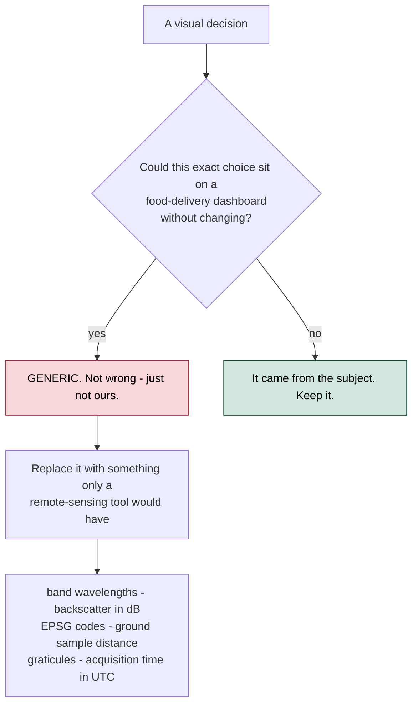
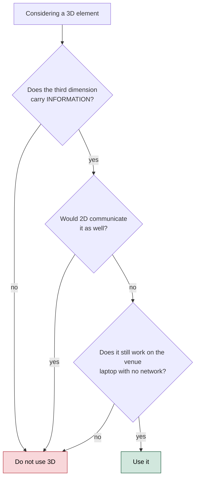
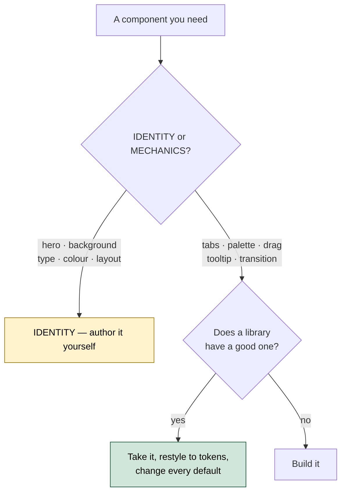

# PS26167 — Design System

**The visual identity for SatQuery AI, and the rules that keep it from drifting.**

Written before the interface, so it directs the build rather than describing whatever happened. The reference implementation is [`../mvp/web/index.html`](../mvp/web/index.html).

---

## 1. Direction

> **An instrument, not a dashboard.**

The reference world is a survey office: cartographic plates, an optical bench, a spectrometer readout. Not a SaaS admin panel, and not a "space-themed" dark UI with stars in the background.

That distinction has a practical test, and every visual decision is run through it:



The subject supplies an unusually rich vocabulary and **the data is already in the file**. Showing the CRS, the band count, the sensor and the acquisition timestamp costs nothing and cannot be mistaken for a template.

### The theme is light, and that is a decision

Dark-first is the default for developer and monitoring products, which is exactly why it is not the choice here. Two reasons beyond differentiation:

1. **Imagery reads truer on a light ground.** A false-colour composite or a SAR scene surrounded by black picks up an artificial glow; surrounded by paper-grey it reads as a plate on a desk.
2. **Every competing SIH space-tech submission will be dark.** A judge on their fortieth demo has seen forty dark navy interfaces.

---

## 2. Colour

The palette is derived from remote sensing itself, not from a UI trend.

In a **false-colour infrared composite** — the iconic remote-sensing image — healthy vegetation renders crimson, water renders near-black, built-up areas render cyan-grey, bare soil renders tan. Those four are the domain's own signature colours, and three of them become tokens.

```css
:root {
  /* ground and surfaces — cool map paper, never pure white */
  --paper:      #F3F5F4;
  --surface:    #FFFFFF;
  --surface-2:  #E9EDEB;
  --rule:       #D3DAD7;
  --rule-2:     #B9C3BF;

  /* ink — near-black with a green bias, like map ink */
  --ink:        #0F1613;
  --ink-2:      #4A5551;
  --ink-3:      #7C8783;

  /* accent — the water/SAR signature. Interactive states only */
  --accent:     #0E7C86;
  --accent-2:   #0A5C64;
  --accent-bg:  #DDEEF0;

  /* modality — optical is warm (visible light), SAR is cool (radar) */
  --optical:    #B8763A;
  --sar:        #2C7A8C;
  --fusion:     #6B5CA5;

  /* semantic — separate from the accent, always */
  --nir:        #C4342A;   /* change detected · attention */
  --good:       #2F7D5A;
  --warn:       #A1740F;
}
```

### Rules

| Rule | Why |
|---|---|
| **Semantic colour is never the accent colour** | If "interactive" and "warning" share a hue, neither reads |
| **`--optical` and `--sar` are reserved** | They identify a modality. Never decorative |
| **`--nir` means change or refusal, nothing else** | Change maps conventionally use red. Spending it on a button destroys that |
| **Never pure white as the page ground** | `#FFF` is for raised surfaces only. The page is paper |

---

## 3. Typography

Three faces, three jobs. All on Google Fonts, all free.

| Role | Face | Why this one |
|---|---|---|
| **Display** | **Bricolage Grotesque** | Genuinely variable — optical-size *and* width axes. Distinctive without being decorative, and not yet everywhere |
| **Body / UI** | **IBM Plex Sans** | Designed for engineering documentation. Reads institutional and technical — ISRO-adjacent rather than startup-adjacent |
| **Data** | **IBM Plex Mono** | Coordinates, EPSG codes, timestamps, confidence, band counts, the execution trace |

**Explicitly not used:** Inter, Space Grotesk, Poppins. Not bad faces — the default of every AI-generated interface, and instantly recognisable as such.

### The rule that matters more than the choice

> **Anything that is a *value* is set in mono, with `font-variant-numeric: tabular-nums`.**

A latitude, a band number, a backscatter figure in dB, a model version, a confidence score. All of it is *data* and should be set as data.

This single decision does more for the instrument feel than any background effect, and it is invisible if you get it wrong — the interface just quietly reads as generic.

### Scale

```
display-l   clamp(28px, 4vw, 42px)   Bricolage 600, -0.02em
display-m   20px                     Bricolage 600, -0.01em
body        14px / 1.55              Plex Sans 400
label       11px                     Plex Sans 500, 0.08em, uppercase
data        12px / 1.4               Plex Mono 400, tabular-nums
data-s      10.5px                   Plex Mono 400, tabular-nums
```

---

## 4. Spatial system

Depth communicates hierarchy. On a geospatial interface it is literal: basemap → imagery → overlays → controls.

| Level | Use | Treatment |
|---|---|---|
| 0 | Page ground | `--paper`, flat |
| 1 | Panels | `--surface`, 1px `--rule`, no shadow |
| 2 | Raised — active panel, results | `--surface` + `0 1px 2px rgba(15,22,19,.04), 0 8px 24px rgba(15,22,19,.06)` |
| 3 | **Floating over the scene** | The *only* place glass is permitted |

### Glass is permitted exactly twice

Glassmorphism has become selective and surgical, and that is how it is used here — on genuinely floating surfaces only:

1. The toolbar floating over the 3D scene
2. The command palette

**Nowhere else.** Not on cards, not on panels, not on the query bar. A `backdrop-filter` applied to a panel that is not floating over anything is decoration pretending to be depth.

---

## 5. Layout

A bento composition — asymmetric modular regions rather than a uniform grid.

```
┌─────────────────────────────────────────────────────────────────┐
│  identity        scene metadata · CRS · bands · status          │  instrument header
├────────────┬──────────────────────────────────┬─────────────────┤
│            │                                  │                 │
│  INPUTS    │      THE MODALITY STACK          │  EXECUTION      │
│            │      (3D — the primary view)     │  TRACE          │
│  optical   │                                  │                 │
│  SAR       │      optical  ─────────          │  always visible │
│  T1 / T2   │        fusion ─────────          │  never hidden   │
│            │           SAR ─────────          │                 │
│  metadata  │                                  │  EVIDENCE       │
│            │      [drag to separate]          │                 │
├────────────┴──────────────────────────────────┴─────────────────┤
│  ask about this imagery…                            [ analyse ] │
└─────────────────────────────────────────────────────────────────┘
```

**The scene is the interface, not a widget inside it.** The largest region is the imagery. Chat is a bar at the bottom, not a sidebar that dominates — this is an analysis tool with a conversational door, not a chatbot with a picture.

**The execution trace is always visible.** It is scored, per ADR-008. Putting it behind a tab hides the thing being marked.

---

## 6. Motion

| Element | Motion | Duration |
|---|---|---|
| Panel state change | opacity + 4px translate | 180 ms, `cubic-bezier(.2,.7,.3,1)` |
| Stack explode | position lerp | follows the slider, no easing |
| Evidence appearing | scale 0.96 → 1, opacity | 240 ms, staggered 40 ms |
| Idle scene | 0.02 rad/s rotation, stops on first interaction | — |
| Trace line arriving | 6px translate + opacity | 140 ms |

**Everything respects `prefers-reduced-motion`.** Idle rotation stops, transitions become instant.

**No animation that does not encode something.** No floating particles, no parallax, no scroll-jacking. Movement in this interface means the data moved.

---

## 7. The 3D policy

Three.js is used for exactly one thing, and it earns its place.



### Approved: the modality stack

Three textured planes in space — **optical**, **fusion**, **SAR** — that the user pulls apart by dragging.

This is not decoration. Requirement 5.4 asks the system to demonstrate that optical and SAR carry **complementary** information. Most teams will show that as a table of numbers. Here a judge separates two physical planes and sees it:

- The **optical** plane has cloud over part of the scene. Under the cloud: nothing.
- The **SAR** plane has no cloud — radar penetrates it — and the built-up cluster is bright, because corner reflectors return strongly.
- The **fusion** plane shows structures detected *under the cloud*, which neither modality gives alone.

**That is the mandatory requirement made visible in one gesture**, and it is the strongest thing in the interface.

### Rejected

Particle-field heroes. Spinning wireframe globes with no data on them. Animated shader backgrounds behind text. A 3D logo. Each costs load time, battery and accessibility, and says nothing.

### Technical

- `three@0.180.0` from `cdn.jsdelivr.net/npm/` via import map — version pinned, verified to resolve
- `OrbitControls` and `CSS2DRenderer` from the matching addons path
- Textures generated procedurally on canvas at runtime — **no image files, no network at demo time**
- Renderer capped at `devicePixelRatio 2`, `powerPreference: "high-performance"`
- Everything degrades: if WebGL is unavailable the stack becomes three stacked 2D panels and the interface still works

---

## 8. Component sourcing

> ### Borrow interaction. Author identity.

| Source | What it is | Take | Never take |
|---|---|---|---|
| [React Bits](https://reactbits.dev) | 165+ animated components. Motion, GSAP, Three.js, OGL. CLI copies **source** into the project | Mechanics — `AnimatedContent`, transitions, scroll reveals | The shader backgrounds. `Silk`, `Iridescence`, `LiquidChrome` are instantly recognisable |
| [21st.dev](https://21st.dev) | 12,000+ components in shadcn registry format, React + Tailwind, 700+ authors | Solved primitives — command palette, tabs, tooltip, drag | The most-bookmarked hero blocks. They appear on hundreds of sites |

Both copy source rather than adding a dependency, so anything taken can be restyled. **Restyle it to these tokens — always.** A component left on its defaults is a component a judge will recognise.



**Record what was borrowed and from where**, in this section, as it happens. A judge asking "did you build this?" deserves a straight answer.

*Current status: nothing borrowed. The reference implementation is authored, because at its scale the identity surfaces are most of it.*

---

## 9. Anti-patterns

The list exists so a teammate at 2 a.m. does not reintroduce what was deliberately avoided.

| Do not | Why |
|---|---|
| Dark navy ground with a purple-blue gradient | The generic AI look. Every competing space-tech demo will have it |
| Glass on cards and panels | Glass means floating. Panels do not float |
| Inter or Space Grotesk | Recognisable as the default. See §3 |
| Proportional figures for data | Coordinates that shift width between frames read as sloppy |
| Particles, starfields, animated shader backgrounds | Cost without meaning. See §7 |
| Emoji as section markers | Reads as a slide deck, not an instrument |
| Hiding the execution trace behind a tab | It is scored. See ADR-008 |
| An answer without confidence and evidence beside it | The whole architecture exists to prevent that. See ADR-007 |
| Presenting staged output as live inference | Label it. An undisclosed simulation ends credibility when found |
| Rounded-lg on everything | One radius everywhere flattens hierarchy. Radius is a signal, spend it |

---

## 10. Accessibility

- Body text meets WCAG AA against `--paper`; `--ink-3` is used only for non-essential labels at ≥11px
- Every interactive element has a visible `:focus-visible` ring in `--accent`, 2px, 2px offset
- The 3D scene is not the only path to any information — the same content is in the trace and evidence panels
- `prefers-reduced-motion` honoured throughout
- Modality is never encoded by colour alone; each plane carries a text label

---

## 11. Related

| Document | Covers |
|---|---|
| [`04_Documentation_Plan.md`](04_Documentation_Plan.md) | Why this document exists and when it was due |
| [`05_System_Design.md`](05_System_Design.md) | Containers, components, runtime views |
| [`ADR/008-trace-not-chain-of-thought.md`](ADR/008-trace-not-chain-of-thought.md) | Why the trace is shown and reasoning is not |
| [`../mvp/web/index.html`](../mvp/web/index.html) | The reference implementation of everything above |
