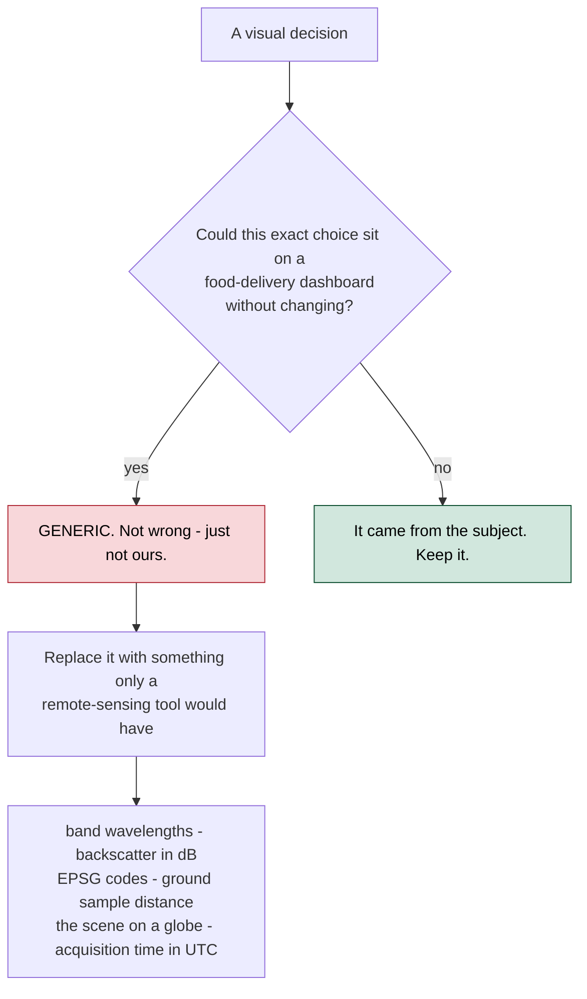
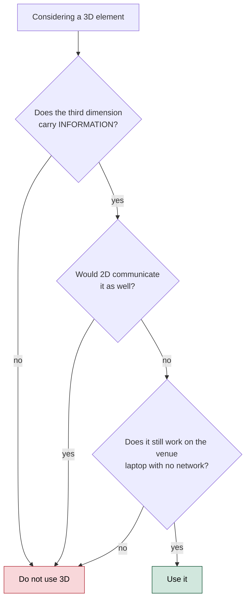
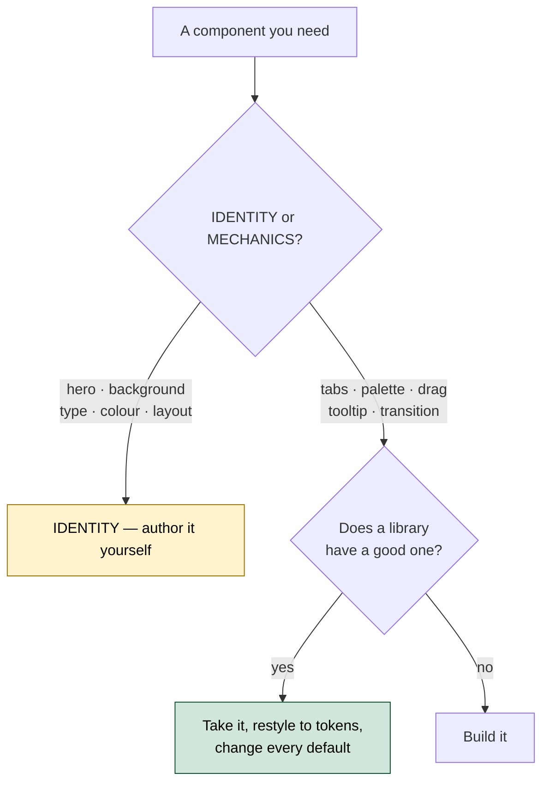

# PS26167 — Design System

**The visual identity for SatQuery AI, and the rules that keep it from drifting.**

Written before the interface, so it directs the build rather than describing whatever happened. The implementation is [`../web/`](../web/); its tokens live in `web/src/index.css`.

---

## 1. Direction

> **A field atlas: an analysis tool that reads like a well-made map.**

*Revised 19 September 2026.* The first direction, an "editorial instrument" (campaign-scale grotesque headlines, crop marks, a vocabulary marquee), read as a fashion lookbook and was dropped. The reference world now is two working Earth-observation products, **Earth Genome / Earth Index** and **Picterra**: warm light ground, a bold serif for headlines, square one-pixel ink frames, imagery shown large, and one bright action colour. From Earth Genome: the stone ground, the serif, the square frames, the pixel-art Earth, the numbered steps. From Picterra: full-bleed imagery bands and the "from X to Y" promise.

The practical test from the first direction still applies to every decision:



The subject supplies an unusually rich vocabulary and **the data is already in the file**. Showing the CRS, the band count, the sensor and the acquisition timestamp costs nothing and cannot be mistaken for a template.

### The theme is light, and that is a decision

Dark-first is the default for developer and monitoring products, which is exactly why it is not the choice here:

1. **Imagery reads truer on a light ground.** A false-colour composite or a SAR scene surrounded by black picks up an artificial glow; framed on warm stone it reads as a plate on a desk.
2. **Every competing SIH space-tech submission will be dark.** A judge on their fortieth demo has seen forty dark navy interfaces.

---

## 2. Colour

Implemented as Tailwind theme tokens in `web/src/index.css`; the names below are those tokens.

```css
@theme {
  /* ground and surfaces — warm stone, never pure white */
  --color-paper:     #EFEEEC;
  --color-surface:   #F8F7F5;   /* cards, panels */
  --color-surface-2: #E4E2DE;   /* the map table under the workstation */
  --color-rule:      #D5D2CC;
  --color-rule-2:    #B6B1A9;

  /* ink — deep teal-black */
  --color-ink:       #0E2129;
  --color-ink-2:     #45565D;
  --color-ink-3:     #7A878C;

  /* action and interaction */
  --color-sun:       #FFC000;   /* the one primary action per screen; selection */
  --color-accent:    #3B7552;   /* forest green — links, focus, data bars */
  --color-sage:      #9CC384;   /* quiet second accent — target bands */

  /* modality marks — validated as a set, see Rules */
  --color-optical:   #B8763A;
  --color-sar:       #1F6FD1;
  --color-fusion:    #B04AA0;

  /* semantic */
  --color-nir:       #C4342A;   /* change detected · refusal */
  --color-good:      #2F7D5A;
  --color-warn:      #9C700C;
}
```

### Rules

| Rule | Why |
|---|---|
| **Yellow is spent once per screen** | It marks the primary action (Ask the imagery, Analyse) or a selection. Spread across a page, it stops pointing at anything |
| **Semantic colour is never the accent colour** | If "interactive" and "warning" share a hue, neither reads |
| **Modality hues are reserved marks, never fills** | They identify a modality. The set passes the dataviz validator on all pairs against `--paper` (worst CVD ΔE 8.2), and fusion stays clear of `--nir` (ΔE 16.3). The first SAR/fusion pair failed (deutan ΔE 5.8) and was re-stepped on 19 Sep 2026 |
| **`--nir` means change or refusal, nothing else** | Change maps conventionally use red. Spending it on a button destroys that |
| **Never pure white** | The page is stone; cards are one step lighter |

---

## 3. Typography

Three faces, three jobs. All self-hosted through Fontsource; nothing is fetched at runtime (OPS-06).

| Role | Face | Why this one |
|---|---|---|
| **Headlines** | **Source Serif 4** (variable, optical size), 700 | The closest free match to the bold text serif Earth Genome sets its headlines in. It reads as atlas or field guide, not as a startup |
| **Body / UI** | **Geist** (variable) | Plain, neutral sans. Earth Genome's own UI face |
| **Data** | **IBM Plex Mono** | Coordinates, EPSG codes, timestamps, confidence, band counts, the execution trace |

**Explicitly not used:** Inter, Space Grotesk, Poppins. Not bad faces, but they're the default of every generated interface.

### The rule that matters more than the choice

> **Anything that is a *value* is set in mono, with `font-variant-numeric: tabular-nums`.**

A latitude, a band number, a backscatter figure in dB, a model version, a confidence score. All of it is data and is set as data.

### Scale

```
t-hero      clamp(44px, 6.2vw, 84px)   Source Serif 4 700, -0.025em, 1.02
t-section   clamp(32px, 3.8vw, 52px)   Source Serif 4 700, -0.02em, 1.08
t-display   set per use                Source Serif 4 700, -0.01em, 1.15
body        16px / 1.55                Geist 400
label       12px                       Source Serif 4 700, 0.06em, uppercase — section eyebrows
data        12–15px                    Plex Mono 400, tabular-nums
```

---

## 4. Surfaces

| Level | Use | Treatment |
|---|---|---|
| 0 | Page ground | `--paper`, flat |
| 1 | Cards, panels, plates | `.frame`: 1px `--ink`, **square corners**, `--surface` |
| 2 | Floating — query bar, popovers, palette | `.frame` + `.raised` (one soft shadow) |
| — | Map table | `--surface-2` behind the workstation's cards, `.graticule` dot grid behind a plate |

**Square corners everywhere.** The frame is the signature: a one-pixel ink rule around imagery, cards and buttons. Rounded corners are only for the 4px data end of a chart bar (dataviz mark spec).

Buttons are flat blocks (`.btn-sun` primary, `.btn-ink` secondary, `.btn-line` tertiary), never pills. Glass (`.glass`) remains for the toolbar floating over the 3D stack, and nowhere else.

---

## 5. Layout

**Landing** follows Earth Genome's rhythm: hero (promise left, globe right, measured readout under the actions) → three promises → *What you can ask* (four capability cards, each deep-linking into the workstation) → *How it works* (six numbered click-through steps, each the real RQ-4 run) → a full-bleed optical/SAR comparison → the refusal as a split card → results → *Built on* → an ink CTA band.

**Workstation**: framed cards on a map table.

```
┌─────────────────────────────────────────────────────────────────┐
│  Workstation  [optical + SAR pair]  23.41°N 85.33°E  EPSG  GSD  │  scene header card
├────────────┐ ┌──────────────────────────────┐ ┌─────────────────┤
│  DEMO      │ │  Plate · Stack · Compare     │ │ ANSWER &        │
│  SCENES    │ │                              │ │ EVIDENCE        │
│            │ │        the imagery           │ │ [thumb] claim   │
│  INPUTS    │ │   (the largest region)       │ │ [thumb] claim   │
│  optical   │ │                              │ ├─────────────────┤
│  SAR       │ └──────────────────────────────┘ │ EXECUTION TRACE │
│  T1 / T2   │ ┌──────────────────────────────┐ │ always visible  │
│            │ │ ⌕ ask about this imagery [Analyse] │             │
└────────────┘ └──────────────────────────────┘ └─────────────────┘
```

**The scene is the interface, not a widget inside it.** The query is a bar under the scene, not a chat sidebar.

**Evidence and trace are both always visible** (UI-03, UI-04; the trace is scored per ADR-008). Evidence rows carry an imagery thumbnail cropped to the claim's region, as Earth Index shows its results.

---

## 6. Motion

| Element | Motion | Duration |
|---|---|---|
| Panel state change | opacity + 4px translate | 180 ms, `cubic-bezier(.2,.7,.3,1)` |
| Stack explode | position lerp | follows the slider, no easing |
| Evidence appearing | scale 0.96 → 1, opacity | 240 ms, staggered 40 ms |
| Idle scene | 0.02 rad/s rotation, stops on first interaction | — |
| Trace line arriving | 6px translate + opacity | 140 ms |

**Everything respects `prefers-reduced-motion`.** Idle rotation stops, transitions become instant.

**No animation that does not encode something.** No floating particles, no parallax, no scroll-jacking. Movement in this interface means the data moved.

---

## 7. The 3D policy

Three.js is used for two things, and each earns its place.



### Approved: the modality stack

Three textured planes in space — **optical**, **fusion**, **SAR** — that the user pulls apart by dragging.

This is not decoration. Requirement 5.4 asks the system to demonstrate that optical and SAR carry **complementary** information. Most teams will show that as a table of numbers. Here a judge separates two physical planes and sees it:

- The **optical** plane has cloud over part of the scene. Under the cloud: nothing.
- The **SAR** plane has no cloud — radar penetrates it — and the built-up cluster is bright, because corner reflectors return strongly.
- The **fusion** plane shows structures detected *under the cloud*, which neither modality gives alone.

**That is the mandatory requirement made visible in one gesture**, and it is the strongest thing in the interface.

### Approved: the landing globe

A dot-matrix Earth in square pixels (`web/src/components/landing/Globe.tsx`), added 19 Sep 2026. It passes the flowchart above because it carries information: land from Natural Earth, **India** in yellow (drawn to the Survey of India boundary, all of J&K), and a marker on the **exact scene** every number on the landing was measured from. The third dimension lets a judge turn it to find that scene. It is lazy-loaded after the headline, stops drifting on first touch or under reduced motion, and without WebGL draws the same dots flat on a 2D canvas. The land mask is a 2 KB PNG baked once by `tools/make_landmask.py`, so nothing is fetched at demo time.

### Rejected

Particle-field heroes. Spinning wireframe globes with no data on them (the landing globe above carries the scene and India, and is still subject to this rule). Animated shader backgrounds behind text. A 3D logo. Each costs load time, battery and accessibility, and says nothing.

### Technical

- `three@0.180.0` from `cdn.jsdelivr.net/npm/` via import map — version pinned, verified to resolve
- `OrbitControls` and `CSS2DRenderer` from the matching addons path
- Textures generated procedurally on canvas at runtime — **no image files, no network at demo time**
- Renderer capped at `devicePixelRatio 2`, `powerPreference: "high-performance"`
- Everything degrades: if WebGL is unavailable the stack becomes three stacked 2D panels and the interface still works

---

## 8. Component sourcing

> ### Borrow interaction. Author identity.

| Source | What it is | Take | Never take |
|---|---|---|---|
| [React Bits](https://reactbits.dev) | 165+ animated components. Motion, GSAP, Three.js, OGL. CLI copies **source** into the project | Mechanics — `AnimatedContent`, transitions, scroll reveals | The shader backgrounds. `Silk`, `Iridescence`, `LiquidChrome` are instantly recognisable |
| [21st.dev](https://21st.dev) | 12,000+ components in shadcn registry format, React + Tailwind, 700+ authors | Solved primitives — command palette, tabs, tooltip, drag | The most-bookmarked hero blocks. They appear on hundreds of sites |

Both copy source rather than adding a dependency, so anything taken can be restyled. **Restyle it to these tokens — always.** A component left on its defaults is a component a judge will recognise.



**Record what was borrowed and from where**, in this section, as it happens. A judge asking "did you build this?" deserves a straight answer.

*Current status: nothing borrowed. The reference implementation is authored, because at its scale the identity surfaces are most of it.*

---

## 9. Anti-patterns

The list exists so a teammate at 2 a.m. does not reintroduce what was deliberately avoided.

| Do not | Why |
|---|---|
| Dark navy ground with a purple-blue gradient | The generic AI look. Every competing space-tech demo will have it |
| Glass on cards and panels | Glass means floating. Panels do not float |
| Inter or Space Grotesk | Recognisable as the default. See §3 |
| Proportional figures for data | Coordinates that shift width between frames read as sloppy |
| Particles, starfields, animated shader backgrounds | Cost without meaning. See §7 |
| Emoji as section markers | Reads as a slide deck, not an instrument |
| Hiding the execution trace behind a tab | It is scored. See ADR-008 |
| An answer without confidence and evidence beside it | The whole architecture exists to prevent that. See ADR-007 |
| Presenting staged output as live inference | Label it. An undisclosed simulation ends credibility when found |
| Rounded-lg on everything | One radius everywhere flattens hierarchy. Radius is a signal, spend it |

---

## 10. Accessibility

- Body text meets WCAG AA against `--paper`; `--ink-3` is used only for non-essential labels at ≥11px
- Every interactive element has a visible `:focus-visible` ring in `--accent`, 2px, 2px offset
- The 3D scene is not the only path to any information — the same content is in the trace and evidence panels
- `prefers-reduced-motion` honoured throughout
- Modality is never encoded by colour alone; each plane carries a text label

---

## 11. Related

| Document | Covers |
|---|---|
| [`04_Documentation_Plan.md`](04_Documentation_Plan.md) | Why this document exists and when it was due |
| [`05_System_Design.md`](05_System_Design.md) | Containers, components, runtime views |
| [`ADR/008-trace-not-chain-of-thought.md`](ADR/008-trace-not-chain-of-thought.md) | Why the trace is shown and reasoning is not |
| [`../mvp/web/index.html`](../mvp/web/index.html) | The reference implementation of everything above |
