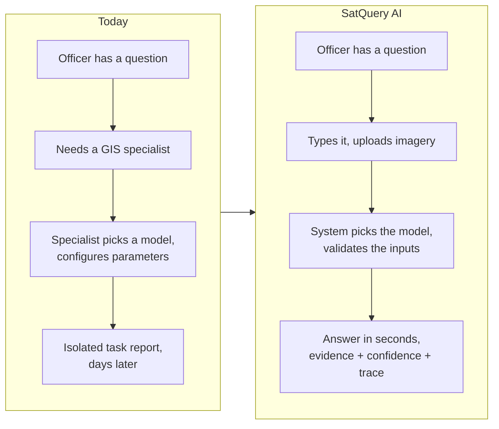

# PS26167 — Product Requirements Document

**SatQuery AI** — an agentic vision-language assistant for multimodal remote-sensing imagery.
Smart India Hackathon 2026 · Indian Space Research Organisation · Software · Space Technology

| | |
|---|---|
| **Version** | 1.0 — full rewrite, consolidated from the document set |
| **Date** | 2026-09-11 |
| **Status** | PS26167 is the team's project (`10_Decision_Record.md` §1) |
| **Owners** | **Mridul** — models, training, benchmarks · **Shreyash** — everything else: ingestion, orchestration, evidence, API, interface, evaluation harness, delivery |
| **Companion** | [`08_TRD.md`](08_TRD.md) turns every requirement here into an atomic, testable, traced requirement |
| **Source of truth** | [`00_Official_Problem_Statement.md`](00_Official_Problem_Statement.md). When this document says "the PS requires", it is quoting that file |

### How this document was built

Nothing here is new invention. Every section consolidates material already argued elsewhere, and cites where:

| Source | What it contributes |
|---|---|
| `00` | The requirement, verbatim, and the three defects in the official text |
| `01` | Users, the domain, datasets, the six-layer architecture, evaluation, demo, risk |
| `03` | The six model components, their contracts, training configuration, targets, hard rules |
| `04` §4 | The design direction and the component-sourcing rule |
| `05` | Containers, deployment environments, runtime paths, quality-attribute scenarios |
| `06` | The visual identity, layout, 3D policy and accessibility floor |
| `09` | Feasibility (compute, bandwidth, licences) and the measurement-integrity rules |
| `10` | Settled decisions, targets, corpus, dates, standing rules |
| `ADR/001–010` | Why each structural decision was made and what was rejected |

Where two sources disagree, the later decision wins and the disagreement is stated — `10_Decision_Record.md` supersedes earlier documents on corpus, scope and targets.

---

## 1. Summary

A user uploads satellite imagery, asks a question in plain language, and the system selects and runs the right remote-sensing specialist model, checks that the imagery can actually support the question, and returns an answer with the visual evidence behind it, a confidence value, and an auditable record of what it ran (`03` §0).

The rule that governs every decision in this document:

> **Do not build a chatbot that looks at satellite images. Build a remote-sensing analysis system that happens to accept natural language.** (`01` §1)

Concretely: vision models produce the facts; the language layer only phrases them. Never the reverse (ADR-007).

---

## 2. The problem

### 2.1 Today

A district officer wants to know whether construction has increased near a reservoir since 2024. Answering that costs them a specialist. The imagery exists and much of it is free, but extracting an answer requires knowing which model applies, how sensors behave, how GIS software works, and which parameters to set. The tooling is built one task at a time — land-cover classification here, building detection there, change detection somewhere else — and none of it accepts a question (`00` Background, `01` §1).

**The gap is not model capability. It is that no interface accepts a question, checks whether the imagery can answer it, and shows its working.**

### 2.2 Why this is hard

Any one of these is a respectable project; the PS asks for all three, orchestrated (`01` §1):

1. **Two sensor types.** Optical records reflected sunlight — colour and material. SAR emits its own pulse and records backscatter — structure and roughness, through cloud and at night. They are different physical measurements and must be reasoned over together.
2. **Time.** Two images of the same place on different dates, and an understanding of *what* changed and *where* — not merely that pixels differ.
3. **Choice, including refusal.** The system must select the specialist from the question and the inputs, and must refuse when the inputs cannot support the question.

### 2.3 Why a generic VLM does not solve it

The PS forecloses it — *"A generic LLM or VLM without remote-sensing adaptation will not satisfy the requirements"* — and it is also technically true (`01` §13): general VLMs accept three channels where satellites carry thirteen; they read SAR brightness as "bright things" rather than backscatter; a building is four pixels at 10 m; the viewpoint is overhead; a CRS means nothing to them; and the vocabulary (backscatter, NDVI, speckle, LULC) is used loosely. A general model still belongs — at the front, interpreting the query, and at the end, phrasing verified facts. Never as the thing that looks at pixels and decides what is there.

---

## 3. What ISRO requires

### 3.1 The five mandatory capabilities

| # | Capability | PS wording (abridged, `00`) |
|---|---|---|
| **R1** | Remote-sensing adaptation | At least one visual or vision-language component fine-tuned or adapted using BigEarthNet.txt **or any open-source training data** |
| **R2** | Single-image baseline | VQA mandatory, **plus** captioning/scene description **or** text-guided region grounding |
| **R3** | Multi-image change analysis | Change description or change-based VQA from a bi-temporal pair mandatory; a spatial change map where reference masks exist |
| **R4** | Cross-modal pair analysis | Extract **complementary** information from a co-registered optical/multispectral + SAR pair |
| **R5** | Agentic orchestration | Automatically select, sequence and execute specialist models or tools according to the query and input configuration |

The controller duties the PS lists under R5: interpret and classify the query; check number, modality, format, metadata and compatibility of inputs; select one or more tools from a **predefined registry**; configure **only permitted** parameters and execute; combine textual and spatial outputs, estimate confidence, return visual evidence; emit an auditable execution summary (task, tool names, key parameters).

### 3.2 The expected solution

An interactive GUI or web application with an agentic remote-sensing AI backend, including: **input upload and compatibility checking**; a remote-sensing-adapted vision-language component; specialist tools for VQA, captioning or grounding, change understanding and optical–SAR analysis; an agentic controller; **visual evidence, confidence information, execution summaries and downloadable reports**. Deliverables: the application, and *"codes and models including test and demonstration"* — trained weights are handed over, which makes licences a delivery requirement (`01` §3).

### 3.3 Input scope

| Mode | Inputs | Used for |
|---|---|---|
| Single image | one optical/multispectral **or** one SAR image | VQA, grounding (captioning not chosen — ADR-002) |
| Cross-modal pair | co-registered optical/MS **and** SAR, same area | joint extraction, complementary information |
| Bi-temporal pair | same area, two dates | change detection, description, change VQA |

**Formats:** GeoTIFF/TIFF is the primary path. PNG/JPEG are accepted **only** for the prescribed public benchmarks. The system therefore cannot be built around ordinary picture files (`01` §4).

### 3.4 How it will be evaluated

Prescribed public benchmark test subsets — **VRSBench and RSVQA** for single-image tasks, **CDVQA** for change VQA — plus an **ISRO/SAC evaluation set** of pre-georeferenced, co-registered **Cartosat-2S optical and RISAT SAR** pairs whose annotations are not disclosed. Scores are normalised before combining. Only the **observable execution trace** is evaluated for orchestration; internal reasoning is neither required nor evaluated (`00`).

### 3.5 What the PS does not say — and what that changes

| Gap | Consequence for the product |
|---|---|
| **The judging-criteria table is an unfilled placeholder** (`Add 'Evaluation/Judging Criteria' table here`) | Weights are unknown. Build a balanced, separately-visible result for all five capabilities rather than over-investing in one (`01` §6.1) |
| **The `Dataset Link` field is truncated at 355 characters** | ISRO's guidance for VRSBench, RSVQA and CDVQA is missing. Default to each benchmark's official split; recover the field from the portal (`01` §6.2) |
| **The scored imagery is Indian, sub-metre, and unseen** | The objective is distribution robustness, not benchmark peak. Co-registration is already done on scored data — validate it, do not solve it (`01` §18) |

---

## 4. Users

| User | Situation | Needs | Success looks like |
|---|---|---|---|
| **District / disaster officer** | Operational decisions; no GIS training | An answer without a GIS course | Asks in plain language; gets an answer with a map, an area in hectares and a confidence value |
| **Remote-sensing analyst** | Knows the domain; routine questions eat time | Speed, with auditability | Skips manual model selection; inspects exactly which tool ran with which parameters, and checks it |
| **ISRO/SAC evaluator** | Scores the system on undisclosed Cartosat-2S/RISAT pairs | Evidence the system is correct, not just fluent | Every claim traces to a measurement; the trace shows task, tools and parameters |
| **SIH judge** | Tenth demo of the day, ten minutes | To understand it without a manual | The refusal and the cross-modal recovery are each visible in one gesture |

**Jobs to be done**

1. *"Tell me what is in this image"* — land cover, counts, presence, extent.
2. *"Show me where"* — the water body, the buildings, the thing I named, on a map, in real coordinates.
3. *"What changed between these dates, and where?"* — with the kind of change, not just its existence.
4. *"Use both sensors"* — especially when cloud blinds the optical image.
5. *"Tell me when you can't answer"* — refuse on incompatible inputs, abstain on low confidence.
6. *"Give me something I can hand on"* — GeoJSON that opens in QGIS, and a report with the evidence and the trace.

---

## 5. Goals and non-goals

### Goals

| # | Goal |
|---|---|
| G1 | Satisfy all five mandatory capabilities, each separately demonstrable and separately measured |
| G2 | Every answer carries evidence, a calibrated confidence, and an auditable trace |
| G3 | Refuse questions the inputs cannot support; abstain when confidence is too low |
| G4 | Evidence the remote-sensing adaptation by a **measured gain over zero-shot**, not an absolute score |
| G5 | Run a complete demo on one laptop with **no network** at the venue |
| G6 | Report only what was measured; disclose every constructed scenario in the material a judge reads |

### Non-goals

| Excluded | Why |
|---|---|
| Captioning | The PS offers a choice; grounding is taken — ADR-002 |
| Research-grade co-registration | Scored data arrives pre-registered. Validate, do not solve — `01` §9 |
| Training a foundation model | LoRA adaptation of a frozen base only — ADR-001, `01` §31 |
| A free-form agent / agent framework | The PS asks for a predefined registry and permitted parameters — ADR-004 |
| Displaying chain-of-thought | Explicitly not evaluated — ADR-008 |
| Authentication, multi-tenancy, production deployment | Not deliverables; no marks — `05` §8 |
| Real-time satellite tasking, mobile app | Not asked for |
| Full BigEarthNet imagery (155 GB) and M2–M4 adapters before submission | Deferred by `10` §1, §7 |

---

## 6. Success metrics

### 6.1 Model targets — anchored to published results

From `10_Decision_Record.md` §3 and `03` §4–§5. **Do not adopt targets above these**: 80 % VQA is above GPT-4V, and a target above the state of the art turns a good result into a perceived failure.

| Metric | Target | Published anchor |
|---|---|---|
| VQA accuracy, VRSBench | **55–62 %** | GeoChat fine-tuned 60.6 %; GPT-4V 65.6 % |
| **Adaptation gain, zero-shot → adapted** | **+10 to +20 points** | GeoChat 40.8 % → 60.6 % = +19.8 |
| Grounding Acc@0.5 (post-M1) | 30–45 % | GeoChat best 39.6 % overall |
| Router dispatch, **held-out paraphrases** | ~0.85 | — |

**The evidence is the gain, not the score.** An adapted number with no zero-shot baseline beside it proves nothing about adaptation (`10` §2).

### 6.2 System targets

| Metric | Target | Source |
|---|---|---|
| Single-image query, venue laptop, no network | < 8 s p95 | `05` QA-1 |
| Bi-temporal or cross-modal query | < 15 s p95 | `05` QA-2 |
| Refusal | < 1 s, **no model invoked** | `05` QA-3 |
| Adapter swap between requests | < 200 ms | `05` QA-8 |
| 4-bit model load on a 6 GB laptop GPU | no OOM | `05` QA-7 |
| Calibration | ECE reported; 0.9 confidence ≈ 90 % correct | `05` QA-6 |
| Cross-modal ablation | optical + SAR beats **both** single modalities | `03` §7, ADR-005 |
| Abstention precision | reported alongside accuracy | `01` §28, §37 |

### 6.3 Demonstration success

A judge who has never seen the system can complete every item in §19 unaided.

---

## 7. Product principles

| # | Principle | Consequence | Source |
|---|---|---|---|
| P1 | **Vision models produce facts; the language layer phrases them** | The answer generator receives validated evidence records and never pixels, so it cannot invent a number | ADR-007 |
| P2 | **Show the trace, never chain-of-thought** | A factual audit log — task, tools, parameters, outputs — always visible | ADR-008, PS |
| P3 | **Refuse rather than guess** | Incompatible inputs are refused before any model runs, with what to upload instead | `01` §25.2 |
| P4 | **Abstain below threshold** | A low-confidence answer is declined, and abstention is measured | `01` §28 |
| P5 | **Constrained agent** | Tools come only from a predefined registry; only permitted parameters are set | ADR-004, PS |
| P6 | **SAR is not a photograph** | SAR has its own encoder path; never a greyscale PNG into an optical model | ADR-003 |
| P7 | **Report what was measured** | No invented numbers; placeholders stay `XX.X` until a run fills them; a metric measured on its own construction is not a metric | `10` §9, `03` §16 |
| P8 | **Disclose constructed scenarios where the judge reads** | Synthetic imagery and deliberately constructed demo scenes are stated on screen and in the slides, not only in source | `10` §9 |

---

## 8. Scope

### 8.1 In scope

| # | Capability | Maps to | Owner |
|---|---|---|---|
| C1 | Remote-sensing adaptation (M1, LoRA on a benchmarked base) | R1 | Mridul |
| C2 | Single-image VQA + text-guided grounding | R2 | Mridul (models) · Shreyash (integration) |
| C3 | Bi-temporal change description, change VQA, change map | R3 | Mridul (models) · Shreyash (integration) |
| C4 | Optical–SAR complementary extraction (separate SAR encoder, late fusion) | R4 | Mridul (models) · Shreyash (integration) |
| C5 | Agentic router: classify, validate, select, sequence, execute | R5 | Shreyash |
| C6 | Ingestion, upload, compatibility checking, refusal | Expected Solution | Shreyash |
| C7 | Evidence fusion, confidence, abstention, answer phrasing, execution trace | R5, Expected Solution | Shreyash |
| C8 | Outputs: map overlay, GeoJSON, downloadable report | Expected Solution | Shreyash |
| C9 | Interactive web application | Expected Solution | Shreyash |
| C10 | Evaluation: benchmarks, ablation, calibration, stress suite, results view | Evaluation | Mridul (model numbers) · Shreyash (harness, honesty, display) |

### 8.2 The refusal matrix

The product's trust story in one table (`01` §25.2, `05` §5.2):

| Task asked | Inputs needed | If missing |
|---|---|---|
| Single-image VQA / grounding | ≥ 1 image (a pair or bi-temporal set also satisfies it) | Refuse: *"Upload at least one image."* |
| Change analysis | a bi-temporal pair | Refuse: *"Change analysis needs a bi-temporal pair. Upload an image for T1 and an image for T2."* |
| Cross-modal analysis | a co-registered optical + SAR pair | Refuse: *"Upload a co-registered optical image and a SAR image of the same area."* |
| Anything, on a file with no CRS where geography matters | a georeferenced raster | Refuse with the missing field named |
| Target outside the vocabulary | — | Proceed, then abstain at the confidence gate |

A single-image task is satisfiable by a **superset** of inputs — asking to highlight water while an optical–SAR pair is loaded is ordinary, and refusing it would make validation look broken rather than careful.

---

## 9. Capability requirements

Product-level behaviour. `08_TRD.md` holds the testable version of each.

### C1 — Remote-sensing adaptation *(the disqualifying requirement)*

**The user gets** answers from a model that measurably understands overhead imagery better than the generic base it started from.
**How** — one frozen base VLM, chosen by zero-shot benchmark (ADR-010); one LoRA adapter (M1, RS-adapted VQA) trained with QLoRA on **VRSBench** (`10` §4); gain reported against the measured zero-shot baseline. One adapted component satisfies the PS; M2–M4 are post-submission (`10` §1, rule 5).
**Accepts when** the zero-shot and adapted scores on the same VRSBench test split are both reported, with the gain, and the adapted component is what serves VQA in the running system.

### C2 — Single-image VQA and grounding

**The user gets** answers to counting, presence, area and land-cover questions, and boxes around the thing they named, in real coordinates.
**How** — M1 answers; counts and areas come from a vision model's measurement, not from language (P1); M2 grounds text to boxes, converted through the geotransform to EPSG:4326.
**Accepts when** a count is backed by labelled regions, boxes appear on the map with hectares, and the GeoJSON opens in QGIS at the right place.

### C3 — Change analysis

**The user gets** what changed, where, how much, and what kind — the five levels of a change answer (`01` §12): binary, semantic (forest → built-up), quantitative (+18.7 %), localised (mask or boxes), and explained — the last one phrased by the language layer from the first four.
**How** — M3: Siamese encoder, difference module, mask and change-VQA heads (`03` §6). Misregistration lowers confidence rather than producing phantom change.
**Accepts when** changed regions carry area and a semantic class, the trend is quantified, and a misaligned pair is flagged rather than trusted.

### C4 — Optical–SAR cross-modal analysis *(the differentiator)*

**The user gets** what each sensor contributed **separately**, and what only the combination reveals — the canonical case being built-up area invisible to optical under cloud but recovered by SAR.
**How** — M4: separate SAR encoder (ADR-003), late fusion of conclusions (ADR-005); disagreement is reported and lowers confidence rather than being silently resolved.
**Accepts when** the answer states per-sensor evidence, quantifies cloud cover, reports what SAR recovered beneath it, and the cross-modal ablation shows optical + SAR beating both single modalities.

### C5 — Agentic orchestration *(the stated novelty)*

**The user gets** the right tool without naming it, and a visible record of the choice.
**How** — a plain Python router (ADR-004): classify → validate → select from a fixed registry → sequence (more than one tool when the question needs it) → execute with permitted parameters only. Built **last**, after each specialist is measured standing alone (`03` §13), so every failure has one address.
**Accepts when** the five representative queries in the PS each reach the correct tool, a mismatched input is refused with no model invoked, and dispatch accuracy is reported on held-out paraphrases.

### C6 — Ingestion, upload and compatibility

**The user gets** to hand the system their own file and be told plainly if it cannot be used.
**How** — upload → header validation → CRS/EPSG → geotransform → sensor and band identification → radiometric normalisation → tiling (`01` §23). Malformed input yields a readable, specific error — *"This file has no coordinate reference system. Change analysis needs georeferenced imagery."*
**Accepts when** a judge's own GeoTIFF is accepted, described (CRS, bands, GSD, sensor), and routed or refused on the same terms as the built-in scenes.

### C7 — Evidence, confidence, answer and trace

**The user gets** an answer they can check: each claim with its confidence, its source model and version, its geometry, and the step-by-step trace.
**How** — every specialist writes one normalised evidence record (`03` §11); the fusion layer gates on confidence, records conflicts, and hands only passing evidence to a constrained generator; below threshold the system abstains.
**Accepts when** no number appears in an answer that is not in an evidence record, abstention fires when nothing clears the gate, and the trace shows task, tools, parameters and outputs with no reasoning text.

### C8 — Outputs

**The user gets** a map overlay, a GeoJSON export, and a **downloadable report** — answer, evidence per claim, confidence, trace, method and parameters, and a "what this cannot establish" section.
**Accepts when** the report downloads from the interface and stands alone as a record of the run.

### C9 — The web application

See §11. **Accepts when** a first-time judge completes §19 unaided in ten minutes.

### C10 — Evaluation

**The user (judge, evaluator) gets** numbers they can trust: per-capability metrics, the A–E ablation, the cross-modal ablation, calibration, abstention precision, latency, and the stress-test suite — each reported only from real runs, with published anchors beside them.
**Accepts when** every reported figure is reproducible from a recorded run, and no ablation row is labelled as something it is not.

---

## 10. User stories and acceptance criteria

Each story maps to a demo beat (§13) and to TRD requirements.

**US-1 · Ask about one image.** *As an officer, I upload a scene and ask "how many built-up areas are visible?"*
Accepts when the count comes from labelled regions, the regions appear on the map in EPSG:4326, a confidence value is shown, and the trace names the tool and its parameters.

**US-2 · Locate a feature.** *As an analyst, I ask "highlight the water body".*
Accepts when boxes appear in geographic coordinates, each with an area in hectares, and the GeoJSON export opens in QGIS in the right place.

**US-3 · Compare two dates.** *As an officer, I supply two dates and ask what changed, and where.*
Accepts when changed regions are reported with area, the change is classified (construction vs regrowth) rather than only detected, and the built-up trend is quantified in percentage points.

**US-4 · Use both sensors.** *As an analyst, I ask the system to use optical and SAR together to identify built-up and water-covered regions.*
Accepts when the answer states what each sensor contributed separately, quantifies the cloud fraction on the optical image, and reports the area recovered by SAR beneath it.

**US-5 · Be refused.** *As a judge, I upload one image and ask what changed between two dates.*
Accepts when the system refuses, the trace shows the compatibility check failing, **no model is invoked**, and the message says what to upload instead.

**US-6 · Be told when the system is unsure.** *As an officer, I ask about something that is not in the scene.*
Accepts when the system abstains, says so, and makes no claim.

**US-7 · Bring my own file.** *As an evaluator, I upload my own GeoTIFF pair instead of using the built-in scene.*
Accepts when the files are accepted, their metadata is shown (CRS, bands, GSD, sensor, alignment), and the query is routed or refused on exactly the same terms as the built-in scenes.

**US-8 · Take the result away.** *As an analyst, I download the evidence and a report.*
Accepts when GeoJSON and a report download from the interface, and the report carries the answer, evidence per claim, confidence, trace, parameters, and what the analysis cannot establish.

**US-9 · See what the system is built on.** *As a judge, I want to know which datasets and models are in use.*
Accepts when all four named public datasets and the hidden ISRO/SAC set are listed with purpose, scale and source, and each dataset's and model's **actual** local state is shown — not an aspirational list.

**US-10 · See the numbers.** *As a judge, I want the evidence that each part of the architecture earns its place.*
Accepts when the results view shows per-capability metrics, the adaptation gain, the A–E ablation, the cross-modal ablation and calibration, each with its published anchor, and nothing that was not measured.

**US-11 · Ask the PS's own questions.** *As an evaluator, I ask the five representative queries from the problem statement.*
Accepts when each routes to the right capability and returns an evidence-grounded answer:

| # | Representative query (verbatim, `00`) | Expected capability |
|---|---|---|
| RQ-1 | *Describe the land-cover and major objects visible in this image.* | Single-image VQA |
| RQ-2 | *Highlight the water body referred to in the query.* | Grounding |
| RQ-3 | *What changed between these two dates, and where did the change occur?* | Change analysis + localisation |
| RQ-4 | *Use the optical and SAR images together to identify built-up and water-covered regions.* | Cross-modal analysis |
| RQ-5 | *Has the built-up area increased, decreased, or remained unchanged?* | Change analysis — trend (needs a bi-temporal pair; refuse otherwise) |

---

## 11. Experience requirements

Summarised from `06_Design_System.md` and `04` §4; those documents are authoritative for detail.

**Direction — an instrument, not a dashboard.** The reference world is a survey office: cartographic plates, an optical bench, a spectrometer readout. Every visual decision passes one test: *could this exact choice sit on a food-delivery dashboard unchanged?* If yes, it is generic — replace it with something only a remote-sensing tool would have: band wavelengths, backscatter in dB, EPSG codes, ground sample distance, acquisition time in UTC.

| Requirement | Rule |
|---|---|
| **Theme** | Light. Imagery reads truer on a light ground, and every competing space-tech submission will be dark (`06` §1) |
| **Colour** | Derived from remote sensing: optical warm, SAR cool, fusion violet, change/refusal red. Semantic colour is never the accent colour (`06` §2) |
| **Type** | Bricolage Grotesque (display), IBM Plex Sans (UI), IBM Plex Mono (data). **Every value — coordinate, band, dB, confidence, version — in mono with tabular numerals** (`06` §3) |
| **Layout** | Bento composition; the scene is the interface, not a widget; the query is a bar, not a dominating chat sidebar (`06` §5) |
| **Trace** | Always visible, never behind a tab — it is scored (ADR-008) |
| **Evidence** | Above the trace; every answer has confidence and evidence beside it (ADR-007) |
| **3D** | Used only where the third dimension carries information: the modality stack — optical, fusion and SAR as separable planes a judge pulls apart — makes R4's "complementary" visible in one gesture (`06` §7) |
| **Components** | Borrow interaction, author identity: take mechanics (palettes, tabs, drag, transitions) from React Bits / 21st.dev and restyle them to project tokens; never ship recognisable library heroes or shader backgrounds (`04` §4.3, `06` §8) |
| **Honesty on screen** | Synthetic imagery and constructed scenarios are disclosed permanently in the UI; pre-computed venue results are labelled in the trace (`05` §5.3) |
| **Accessibility** | WCAG AA body text; visible focus rings; `prefers-reduced-motion` honoured; the 3D scene is never the only path to information; modality never encoded by colour alone (`06` §10) |
| **Offline** | No CDN fonts, remote basemaps or model downloads at runtime (`05` §4) |

---

## 12. Data and model strategy

| Decision | Choice | Why | Source |
|---|---|---|---|
| Architecture | One frozen base VLM + swappable LoRA adapters; SAR encoder separate | ~15 GB (≈6 GB at 4-bit) instead of ~60 GB; per-capability ablation stays possible | ADR-001, ADR-003 |
| Base model | Chosen by zero-shot VRSBench benchmark — GeoChat-7B vs Qwen2-VL-7B-Instruct (both Apache-2.0) | A generic base leaves more gain to demonstrate; measure, don't assume | ADR-010, `10` §5, `09` §3 |
| M1 corpus | **VRSBench** (12.5 GB, VQA pairs, one of the scored benchmarks) | BigEarthNet.txt is 467 MB of annotations keyed into a separate 155 GB imagery set; the PS permits "any open source training data" | `10` §4 |
| Splits | Official benchmark splits unmodified; geographic tile-level splits for anything self-built; never random | Random splits on geographic data inflate scores and fail on the day | ADR-006 |
| Fusion | Late fusion first | Keeps per-modality evidence separable — required for the cross-modal ablation and for explaining it | ADR-005 |
| Router | Plain Python, rule-based stand-in → small classifier on 5–20k synthetic paraphrases; measured on held-out paraphrases | Constraint, not capability; explainable on one slide | ADR-004, `03` §8 |
| Answer layer | Constrained generator or templates, fed evidence only | Cannot invent a number | ADR-007 |
| Compute | Rented / free-tier GPU (Kaggle 2×T4, 16 GB, QLoRA, **fp16**); the corpus lives where the GPU lives | The development laptop has 4 GB VRAM against a 16 GB floor, on a ~1 MB/s link | `09` §3.1–3.2, `10` §6 |
| Venue inference | 4-bit quantised, 6–8 GB VRAM; pre-computed results for every demo scene as a labelled fallback | A 4-bit 7B does not fit a 4 GB laptop; a failure should degrade the demo, not end it | `03` §12, `05` §4 |
| Licences | Checked before training — the deliverable hands weights to a government agency | GeoChat and Qwen2-VL are Apache-2.0; LLaVA-1.5 is Llama-2 licensed | `09` §3 |

**Scope for the portal submission: M1 only.** M2 (grounding adapter), M3 (change adapter), M4 (SAR encoder training), RSVQA/CDVQA loaders and full BigEarthNet are post-submission (`10` §7).

---

## 13. The demo

Open by using the system; explain the architecture after it has been seen working (`01` §43). About five minutes:

| Beat | What happens | Proves |
|---|---|---|
| 1 · Single image (60 s) | Upload one optical image; *"how many buildings?"*; then *"highlight them"* — boxes on the map | R2 |
| 2 · Temporal (60 s) | Two dates; *"what changed?"* — before, after, change mask, hectares, change type | R3 |
| 3 · Optical + SAR (60 s) | *"What does SAR reveal that optical does not?"* — pull the modality stack apart; the area recovered beneath cloud | R4 |
| 4 · Agent + refusal (45 s) | The trace across beats 1–3 shows different tools chosen automatically; then one image + a change question — **refused, no model run** | R5 |
| 5 · Numbers (45 s) | Adaptation gain, A–E ablation, cross-modal ablation, calibration — each with its anchor | R1, and turns a demo into a result |

**Resilience** (`05` §4–§5.3): the model runtime is warmed before the judge arrives; if it is slow or down, staged scenes are served from pre-computed results **labelled as such in the trace**; anything else returns an honest degradation notice. Test on the actual venue laptop in November, not December.

**Disclosure.** Where a demo scene is constructed — synthetic pixels, or cloud deliberately placed over a settlement because that is where the sensors differ — say so on the slide. A constructed scenario is a stronger demo than a claimed accident, and it cannot be attacked (`10` §9, `09` §5.4).

---

## 14. Release plan

### 14.1 Phases

| Phase | Window | Deliverable | Audience | Source |
|---|---|---|---|---|
| **Selection** | now → portal deadline | Proposal on the prescribed sih.gov.in template, plus prototype evidence — ideally one screenshot of the adapted model answering a real question better than the unadapted one | Screeners reading hundreds of submissions | `04` §0, §6 |
| **Build** | Oct – Nov, if selected | M2–M4, benchmark loaders, stress suite, quantisation, venue test on the actual laptop in November | — | `03` §12–13, `05` §4 |
| **Grand Finale** | Dec | Integration, rehearsal, venue fallback — not construction | ISRO/SAC judges | `01` §41, `04` §0 |

### 14.2 Near-term checkpoints

From `10_Decision_Record.md` §8, with owners:

| Date | Must exist | Owner | If missing |
|---|---|---|---|
| 11 Sep | Presentation-honesty corrections: ablation labels describe what actually runs, constructed scenes disclosed | Shreyash | trivial — no excuse |
| **13 Sep** | **Zero-shot VQA baseline on VRSBench, both candidate bases** | Mridul | the real gate: needs no GPU training; if it slips, everything downstream slips |
| 18 Sep | M1 training complete or clearly converging | Mridul | reduce scope, or submit the specialist pipeline with honest framing |
| 22 Sep | Adapted number, stated gain, adapter serving the running system | Mridul + Shreyash | stop adding scope; consolidate |
| 24 Sep | Upload working end to end | Shreyash | — |
| 30 Sep | Submission per `10` §8 | both | — |

> **The deadline is unresolved.** `04` and the portal scrape say **20 September**; `10` §8 schedules to **30 September**. Several checkpoints above fall after 20 Sep. Confirm with the SPOC now. Until confirmed, plan the portal submission around what exists by 19 Sep — submitting a day early, per `04` §5 — and treat anything dated later as Build-phase work.

### 14.3 Model milestones

| Milestone | Content | When |
|---|---|---|
| M1 | RS-adapted VQA adapter, gain measured on VRSBench | Selection |
| M2 | Grounding adapter (VRSBench) | Build |
| M3 | Change adapter + Siamese difference head (CDVQA) | Build |
| M4 | SAR encoder trained on Sentinel-1, late fusion | Build |
| M5 | Router classifier on synthetic paraphrases, held-out accuracy | Build (rule-based stand-in before) |

---

## 15. Ownership

Two people with disjoint skills. The split follows the architecture's own seam — the model runtime is the only GPU-bound unit and sits behind a defined interface (`05` §2), so the two halves meet in one place.

| Mridul — models | Shreyash — everything else |
|---|---|
| Base-model benchmark and selection (M0) | Ingestion, upload, validation, refusal (C6) |
| M1 training and the adaptation gain; later M2–M4 | Router, registry, sequencing (C5) |
| SAR encoder and fusion model quality | Evidence layer, confidence gate, answer layer, trace (C7) |
| Training data preparation, splits, licences | API, outputs, report generation (C8) |
| Benchmark runs (VRSBench, later RSVQA/CDVQA) | Web application (C9) |
| Quantisation for the venue | Evaluation harness, ablation integrity, held-out router set, results view |
| | Venue deployment and the pre-computed fallback; documentation |

**The seam** is the model-runtime contract in `08_TRD.md` §4 — what an adapter pack contains, how it is loaded, and what each model returns. Agree it first, and prove it with a stub adapter before real weights exist, so the first real load does not happen under deadline pressure (`10` §6).

---

## 16. Risks

| # | Risk | Impact | Mitigation | Owner |
|---|---|---|---|---|
| 1 | No adapted model by the deadline | R1 unproven — the disqualifying gap | 13 Sep baseline gate; one adapter only; specialist pipeline stands on its own with honest framing | Mridul |
| 2 | Judging weights unknown | Cannot optimise | Balance all five capabilities; make each separately visible; re-check the portal | both |
| 3 | Domain gap: Sentinel → Cartosat-2S/RISAT | Public scores may not transfer | Robustness over peak; stress suite; Indian imagery (e.g. Bhuvan) where obtainable | Mridul |
| 4 | SAR handled as greyscale | Exposed instantly by an ISRO panel | Separate SAR path (ADR-003) | Mridul |
| 5 | Leakage from random splits | Inflated scores, failure on the day | Official splits; geographic tile-level splits (ADR-006) | Mridul |
| 6 | Router built too early | Failures undiagnosable; ablation impossible | Specialists first, measured alone; router last | Shreyash |
| 7 | A metric measured on its own construction | One caught number discredits every other | Held-out router set; honest ablation labels; formulas printed beside composites | Shreyash |
| 8 | Venue compute or network fails | Demo cannot run | 4-bit quantisation; offline by design; labelled pre-computed fallback; test on the venue laptop in November | Shreyash |
| 9 | Licence blocks delivery of weights | Deliverable includes models | Apache-2.0 base; check before training | Mridul |
| 10 | Kaggle traps: no bf16 on P100/T4; 9-hour sessions | A lost day each | fp16; checkpoint and resume from day one | Mridul |
| 11 | Latency too high live | Judge disengages | Measure p50/p95 early; warm the model; quantise | both |
| 12 | Scope overrun | Nothing finished well | Build order; each phase independently demoable; M1 only before submission | both |
| 13 | Deadline ambiguity (20 vs 30 Sep) | Work scheduled against the wrong date | Confirm with the SPOC now | Shreyash |
| 14 | Synthetic or constructed demo misread as deception | Credibility | Disclose on screen and on slides | Shreyash |

---

## 17. Dependencies and assumptions

**External dependencies — all build-time, none at runtime** (`05` §1): Hugging Face (base weights, BigEarthNet.txt, VRSBench); benchmark hosts (RSVQA — timed out when last checked, `09` §3; CDVQA on GitHub); rented or free-tier GPU; the SIH portal for the untruncated dataset field and any published rubric.

**Assumptions**

| # | Assumption | If wrong |
|---|---|---|
| A1 | Scored pairs arrive pre-georeferenced and co-registered | A light alignment path moves into scope |
| A2 | The venue provides no reliable network | Nothing changes — the system is offline by design |
| A3 | The venue laptop has a 6–8 GB GPU | CPU inference, a smaller base, or pre-computed results |
| A4 | Official benchmark splits are what ISRO will score against | Re-run evaluation on the recovered guidance |
| A5 | One adapted component satisfies R1 | Train a second adapter in Build |

---

## 18. Open questions

1. **Submission deadline — 20 or 30 September?** Confirm with the SPOC.
2. **Has the judging-criteria table been published?** Check the portal.
3. **What is the full `Dataset Link` field?** It holds ISRO's guidance for VRSBench, RSVQA and CDVQA.
4. **Which base model?** Decided by the 13 Sep zero-shot benchmark, not in advance.
5. **What hardware will the venue have?** Decides quantisation and fallback.
6. **Is any Cartosat-2S or RISAT imagery publicly obtainable?** Even a few scenes would probe the domain gap directly.

---

## 19. Definition of Done

The product is ready when a judge who has never seen it can, unaided (`01` §44, `03` §17):

- [ ] upload a valid optical image and receive a correct answer to a natural-language question
- [ ] request grounding and see the correct region highlighted
- [ ] upload two dates, ask what changed, and see a spatial change result
- [ ] upload an optical + SAR pair and see complementary evidence from both
- [ ] watch the system select tools automatically, without being told which
- [ ] see the system refuse a question its inputs cannot support
- [ ] inspect the execution trace
- [ ] see a confidence value and the evidence behind every answer
- [ ] download a report and the GeoJSON
- [ ] see benchmark results, the adaptation gain and the ablation tables
- [ ] understand, from what they have seen, why this beats a generic VLM

Any unticked box is an engineering gap, not a presentational detail.

---

## 20. Related documents

| Document | Covers |
|---|---|
| [`00_Official_Problem_Statement.md`](00_Official_Problem_Statement.md) | The requirement, verbatim — the source of truth |
| [`01_Complete_Deep_Analysis.md`](01_Complete_Deep_Analysis.md) | Domain, glossary (§2), datasets, architecture, evaluation, risk |
| [`03_Model_Specification.md`](03_Model_Specification.md) | The six model components: contracts, data, configs, targets |
| [`05_System_Design.md`](05_System_Design.md) | Containers, deployment, runtime paths |
| [`06_Design_System.md`](06_Design_System.md) | Visual identity and the 3D policy |
| [`08_TRD.md`](08_TRD.md) | Atomic, testable, traced requirements |
| [`09_External_Review_And_Recommendation.md`](09_External_Review_And_Recommendation.md) | Feasibility and measurement-integrity findings |
| [`10_Decision_Record.md`](10_Decision_Record.md) | Settled decisions, targets, dates — keep it current |
| [`ADR/`](ADR/) | Why each structural choice was made |
