# SatQuery AI — the presentation guide

**PS26167 · ISRO · Smart India Hackathon 2026 · written 19 September 2026**

This document is for anyone building the slides who has **not** worked on SatQuery. It assumes no knowledge of satellites, remote sensing or machine learning. Read it top to bottom once; after that, §18 gives a slide-by-slide outline that points back to the section and diagram each slide needs.

Every number in this document is either **measured** (and says where) or **a target** (and says so). Do not put a target on a slide as if it were a result. §19 lists the claims that must never appear.

---

## Contents

1. The problem in one minute
2. A primer — satellites, sensors and AI, in plain words
3. What ISRO asked for
4. Our answer in one sentence, and the rule behind it
5. How a question travels through the system
6. The agent — how SatQuery decides what to run
7. The four specialists
8. The models
9. The data
10. Evidence, confidence and the trace
11. The web application
12. What is real and what is simulated
13. What we have measured
14. What makes this different
15. Why we made the choices we made
16. Status and road to submission
17. Team, risks, judge questions
18. Slide-by-slide outline
19. Rules for the slides
20. Glossary

---

## 1. The problem in one minute

Satellites photograph the whole of India every few days. Much of that imagery is free. Yet a district officer who wants to know *"has construction increased near this reservoir since last year?"* cannot simply ask. They need a specialist who knows:

- which software to open,
- which of dozens of AI models fits the question,
- how that satellite's sensor behaves,
- which parameters to set.

Today's tools are built **one task at a time** — one model classifies land, another finds buildings, another spots change — and **none of them accepts a question**.

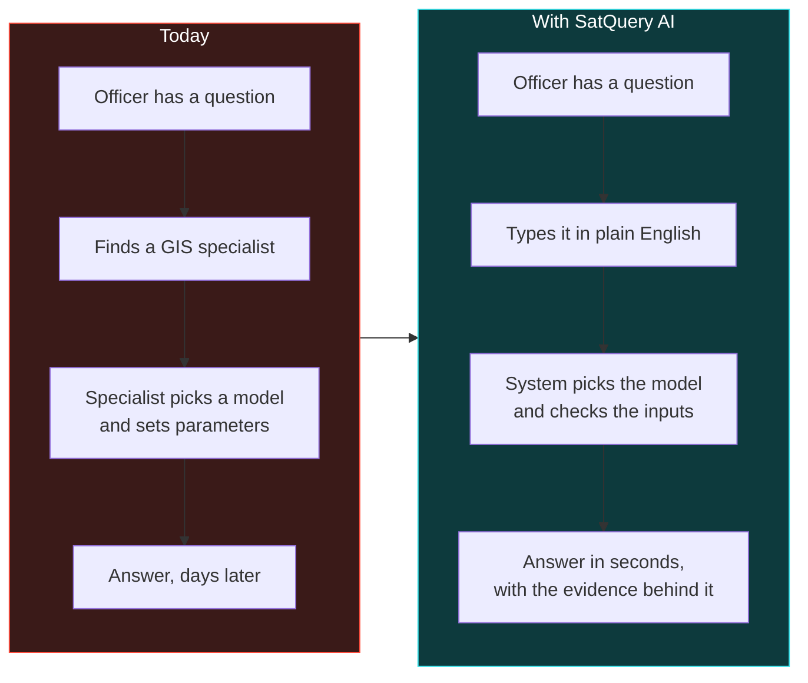

**The one-line pitch:** *The gap is not that AI cannot read satellite images. It is that no interface lets a non-expert ask a question.*

A second problem sits underneath. Many real questions **cannot be answered from one picture**:

- Clouds block ordinary cameras. Radar sees through them.
- "What changed?" needs two pictures from two dates.
- Some features are obvious to one sensor and invisible to another.

ISRO's problem statement is explicit that the **main focus** is reasoning across *pairs* of images — two sensors, or two dates — not just one.

---

## 2. A primer — satellites, sensors and AI, in plain words

Skip this section if you already know remote sensing. Everyone else: these are the ideas every later slide depends on.

### 2.1 Two kinds of satellite eyes

| | **Optical / multispectral** | **SAR (Synthetic Aperture Radar)** |
|---|---|---|
| Analogy | A camera | A bat's echolocation |
| How it works | Records sunlight reflected off the ground, in visible colours **and** in invisible bands such as near-infrared | Sends its own microwave pulse and records the echo |
| Sees through clouds? | **No** | **Yes** |
| Works at night? | **No** | **Yes** |
| What it's good at | Vegetation, water colour, land cover, "what does it look like" | Structure, roughness, buildings, water surfaces, "what shape is it" |
| What it looks like | A photograph | A grainy black-and-white texture with "speckle" noise |
| Indian examples | **Cartosat-2S** | **RISAT** |

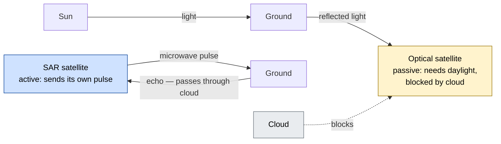

**Why this matters for the pitch:** optical and SAR are *complementary*. Where cloud hides the ground from the camera, the radar still sees it. A system that combines them answers questions neither can answer alone. That is requirement 4 and our strongest demo (§14).

### 2.2 Three input shapes

ISRO defines exactly three kinds of input. Every question the system receives comes with one of them.

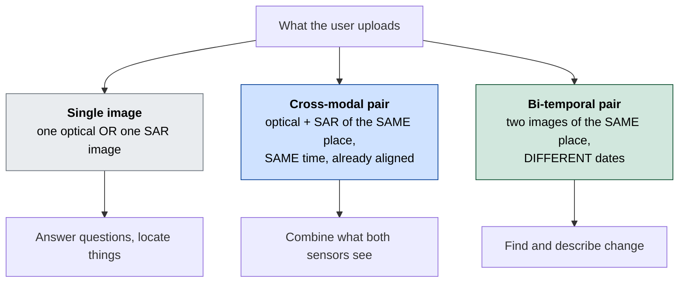

- **Co-registered** means the two images are aligned pixel for pixel — the same pixel in both covers the same patch of ground. ISRO says its test pairs arrive already aligned; our job is to *check* alignment, not to perform it.
- **GeoTIFF** is an image file that also records *where on Earth* each pixel is. This is how an answer can say "the water body is at 22.3° N, 70.1° E" rather than "top-left".

### 2.3 The AI vocabulary

| Term | Plain meaning |
|---|---|
| **VLM (vision-language model)** | An AI that takes an image and text together, and answers in text. GPT-4V is a well-known VLM |
| **VQA (visual question answering)** | Ask a question about an image, get an answer. *"How many ships are in this harbour?"* |
| **Grounding** | Ask for a thing, get its *location* back — a box or outline on the image. *"Highlight the water body."* |
| **Captioning** | Describe an image in a sentence. (ISRO allows grounding *or* captioning; we chose grounding — §15) |
| **Change detection** | Compare two dates, find what is different, and where |
| **Fine-tuning / adaptation** | Taking a general model and training it further on specialised data so it speaks the specialist's language |
| **Agent / agentic** | Software that *decides* which tools to run, in what order, for a given request — rather than running one fixed model |
| **Classical computer vision** | Hand-designed image algorithms (thresholds, filters, maths) — no training. Fast, explainable, and what runs today |

---

## 3. What ISRO asked for

The official text is in [`00_Official_Problem_Statement.md`](00_Official_Problem_Statement.md). It makes **five capabilities compulsory**. Missing any one is a failed submission.

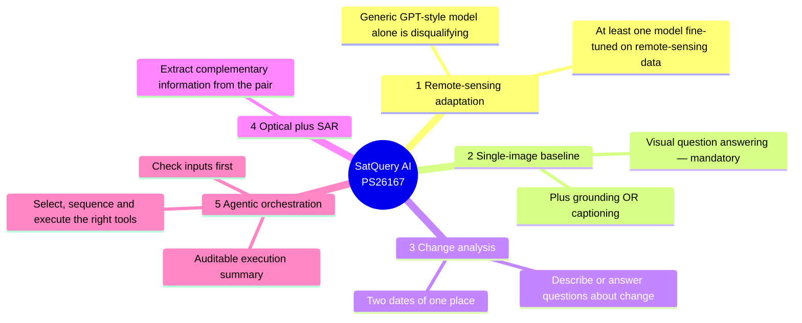

Plus, from the *Expected Solution* section: an interactive web application, input **upload and compatibility checking**, visual evidence, confidence, execution summaries and **downloadable reports**.

### The five questions ISRO uses as examples

These are the demo queries. The web app labels them **RQ-1 to RQ-5**.

| | Representative query (verbatim) | Capability |
|---|---|---|
| RQ-1 | *"Describe the land-cover and major objects visible in this image."* | Single-image VQA |
| RQ-2 | *"Highlight the water body referred to in the query."* | Grounding |
| RQ-3 | *"What changed between these two dates, and where did the change occur?"* | Change analysis |
| RQ-4 | *"Use the optical and SAR images together to identify built-up and water-covered regions."* | Optical + SAR |
| RQ-5 | *"Has the built-up area increased, decreased, or remained unchanged?"* | Change analysis |

### Three things hidden in the problem statement

1. **One sentence disqualifies most entries:** *"A generic LLM or VLM without remote-sensing adaptation will not satisfy the requirements."* Wrapping GPT-4V is not enough. Something must be trained on satellite data.
2. **Only the visible trace is scored.** *"Only the observable execution trace, including the selected task, models or tools, permitted parameters, and outputs will be evaluated. Internal reasoning text is neither required nor evaluated."* So we show *what ran*, not an AI "thinking out loud".
3. **The scoring table is missing.** The official text literally contains the unfilled placeholder `Add 'Evaluation/Judging Criteria' table here`. Nobody knows the weights, so we balance across all five capabilities rather than chasing one.

**Final evaluation** uses public benchmarks (VRSBench, RSVQA, CDVQA) and a **secret ISRO/SAC dataset** of Cartosat-2S optical + RISAT SAR pairs. We will never see its answers. That is why the design favours robustness over tuning to one benchmark.

---

## 4. Our answer in one sentence, and the rule behind it

> **SatQuery AI is a web application where you upload satellite imagery, ask a question in plain English, and the system picks and runs the right specialist model, checks the question can actually be answered from what you uploaded, and returns an answer with a map, a confidence score and a record of exactly what it ran.**

### The rule

> **Vision models produce the facts. The language layer only phrases them. Never the reverse.**

Most "chat with your image" systems let a language model look at the picture and say what it thinks is there. That model can confidently invent a number. In SatQuery, the part that writes sentences **is never given the image**. It is handed a list of checked measurements and turns them into a sentence. It cannot invent "12 ships" because it was never shown a picture to count from.

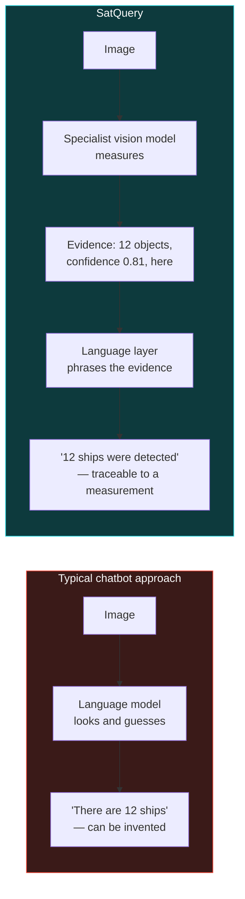

This is enforced **in the code itself**: the function that writes the answer (`pipeline.answer()`) accepts an evidence list and no image, and an automated test checks that it stays that way. It is a structural guarantee, not a promise.

**The slogan for the deck:** *"Not a chatbot that looks at satellite images — a remote-sensing analysis system that happens to accept natural language."*

---

## 5. How a question travels through the system

This is the single most important diagram in the deck. Every request follows the same fixed path.

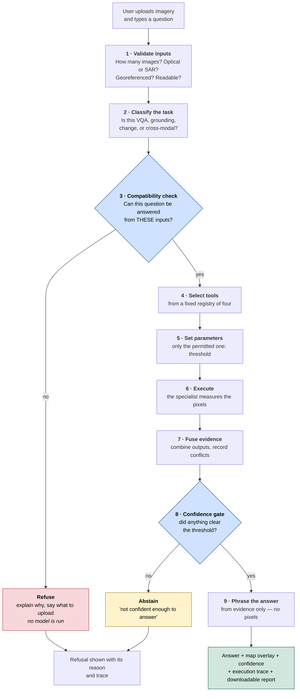

Every step writes a line into the **execution trace** (§10) — which step ran, what it decided, how long it took. This trace is what ISRO scores.

There are **three possible outcomes**, and two of them are the system saying "no":

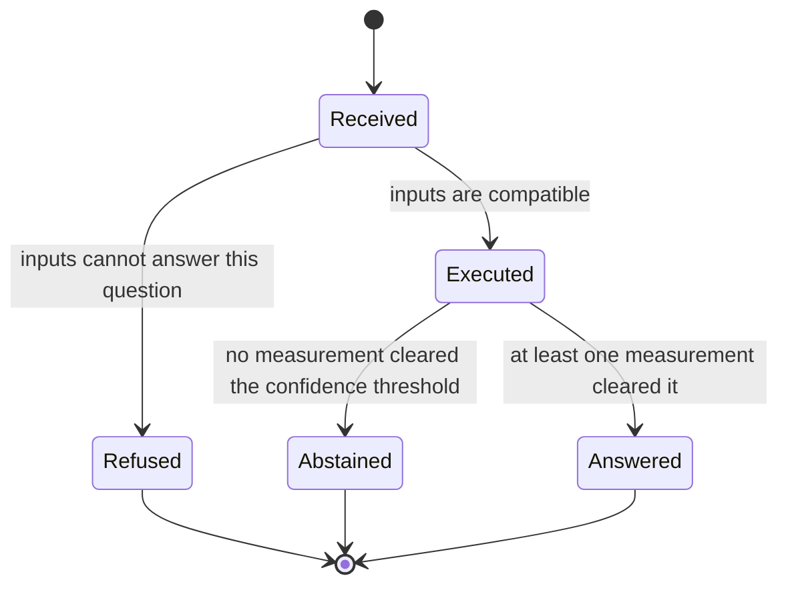

**Why the "no" paths matter:** a system that always answers is a system that sometimes answers wrongly with full confidence. Refusal and abstention are what make the "yes" answers trustworthy.

---

## 6. The agent — how SatQuery decides what to run

ISRO calls this part **the novelty**: *"Instead of applying a single generic VLM, the system selects and executes suitable remote-sensing specialist models, validates inputs, combines their outputs, and returns an evidence-grounded response."*

The router (`satquery/router.py`) does five jobs in strict order:

| # | Job | What it does | ISRO's words |
|---|---|---|---|
| 1 | **Classify** | Reads the question and decides the task | *"interpret the query and classify the requested task"* |
| 2 | **Validate** | Checks the uploaded images can support that task | *"check the number, modality, format, metadata, and compatibility"* |
| 3 | **Select** | Picks a tool from a fixed list — never invents one | *"select one or more models or tools from a predefined registry"* |
| 4 | **Sequence** | Decides the order if more than one tool is needed | *"select, sequence, and execute"* |
| 5 | **Execute** | Runs with permitted parameters only | *"configure only permitted task parameters"* |

### 6.1 The tool registry

The agent chooses from these four tools and nothing else.

| Tool | Answers | Needs | Returns |
|---|---|---|---|
| `rs_vqa` | Questions about one image | a single image | text + confidence |
| `grounding` | "Where is…" / "highlight…" | a single image | boxes on the map + confidence |
| `change_vqa` | "What changed…" | a bi-temporal pair | text + change regions + confidence |
| `optical_sar` | "Use both sensors…" | an optical + SAR pair | text + evidence + confidence |

The only parameter the agent may set is the **confidence threshold** (default 0.45, range 0–1). A fixed registry and a fixed parameter list are what make the system **auditable**: the trace can only ever name things that exist on this list.

### 6.2 How the router decides

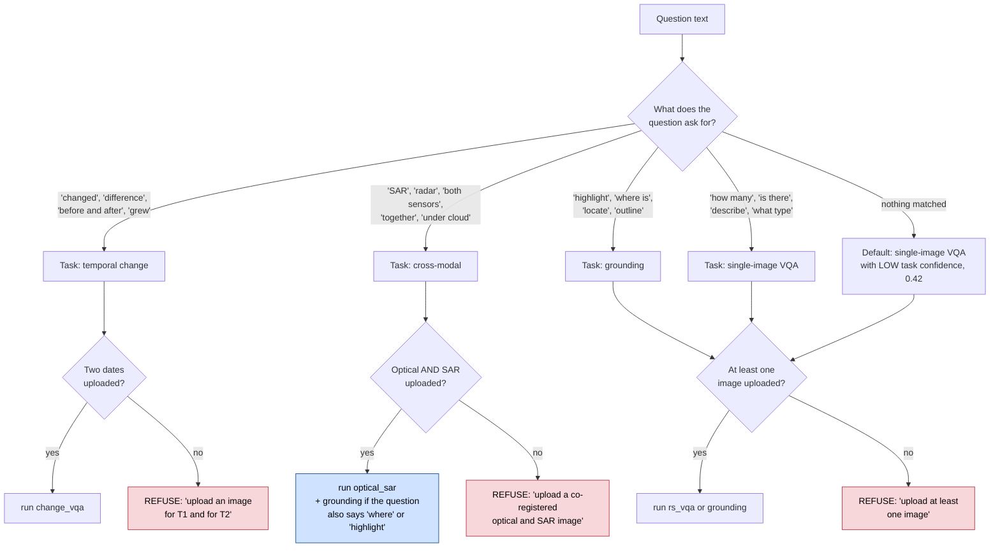

Two subtleties worth one sentence each on a slide:

- **A pair also satisfies a single-image question.** If someone uploads optical + SAR and asks "highlight the water body", that is fine — refusing would look broken. Refusal is only for genuine impossibility.
- **Tools can be chained.** A cross-modal question that also asks *where* runs fusion **then** grounding, in that order, and the trace shows both.

### 6.3 The refusal — the demo moment

Upload **one** image and ask *"what changed between these two dates?"*

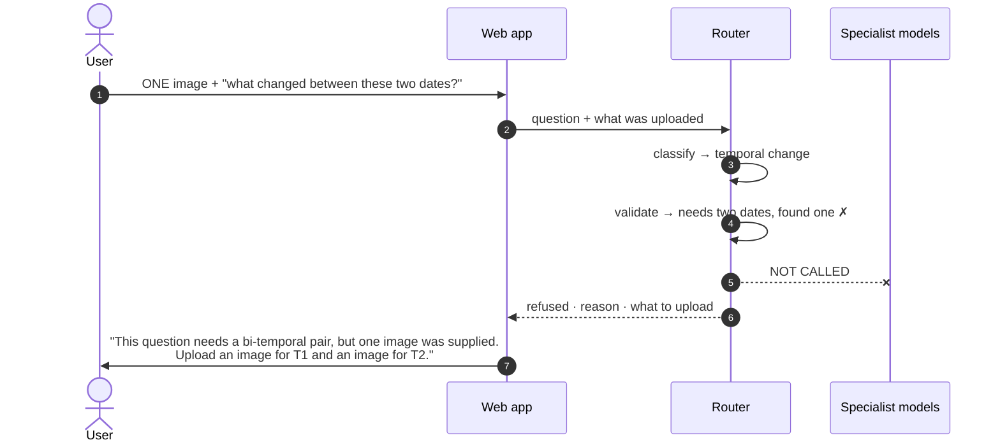

**No model runs.** Most systems would run the change model on the same image twice and return a confident, meaningless answer. This takes fifteen seconds to demo and is the clearest proof that the agent actually *checks* rather than just *routes*.

### 6.4 Why the router is plain code, not an "AI agent framework"

The router is a plain Python function (ADR-004), deliberately. The requirement is **constraint** — pick from a fixed list, set only permitted parameters, refuse the impossible — not open-ended creativity. A plain function is deterministic, testable, instant, and cannot hallucinate a tool that does not exist. Today it classifies with keyword rules. The specification plans a small trained text classifier with the same interface; swapping it is a one-line change and the trace records which one ran.

---

## 7. The four specialists

Each specialist handles one capability. Today every one runs **classical computer vision**: real algorithms on real pixels, no training. When trained model weights are loaded, the model proposes an answer and these measurements verify it (§8). Either way, **every number in an answer is computed from the image**.

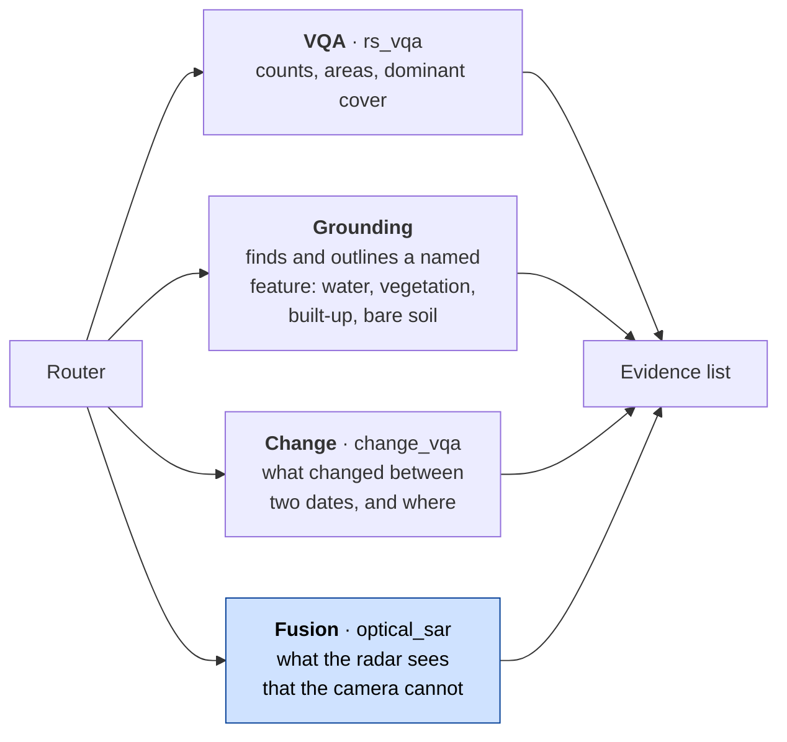

### 7.1 VQA — questions about one image
- *"How many…"* — thresholds a spectral index and counts connected regions.
- *"Is there…"* — the same threshold, then an area test.
- *"How much…"* — pixel count × ground area per pixel, in hectares.
- *"What is dominant…"* — compares land-cover shares from optical indices and radar.

### 7.2 Grounding — "highlight the water body"
Resolves the named target (water, vegetation, built-up, bare soil) and picks the physically right measurement:
- **Water:** NDWI, a water index from green and near-infrared light.
- **Vegetation:** NDVI, a greenness index.
- **Built-up:** radar brightness, because buildings reflect radar strongly.

It returns the outline as a georeferenced box and area.

### 7.3 Change — "what changed, and where?"
Aligns the two dates, measures how much every pixel moved in colour space (*change vector analysis*), picks the cut-off automatically (*Otsu's method*), cleans up noise, and returns the changed regions with their total area. For built-up trend questions it compares the built-up share at date 2 against date 1.

### 7.4 Fusion — optical + SAR together
The capability that shows why two sensors beat one:

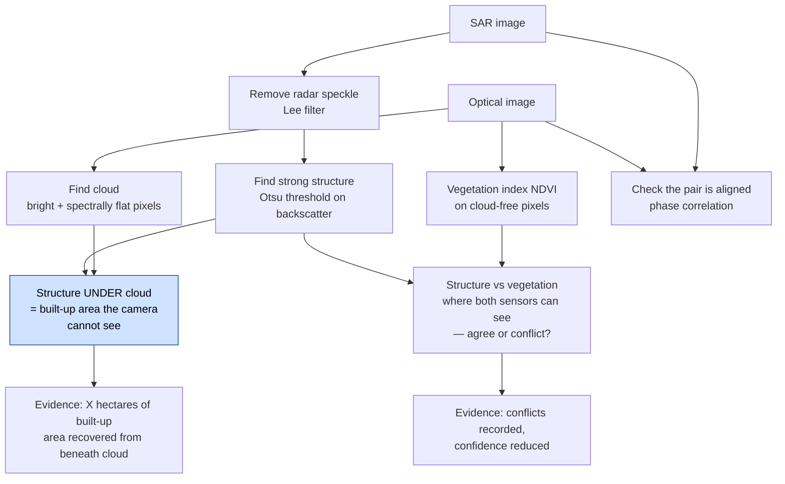

**The punchline:** ask RQ-4 with a cloudy optical image and a SAR image. The answer quantifies how much built-up area lies **under the cloud** — invisible to the camera, measured by the radar.

---

## 8. The models

**Covered in a separate model document**, sent alongside this one. It holds the model choices, training, datasets used for training and every model number. The deck's model slides should come from that document.

What this guide needs you to know about models is only where they plug in:

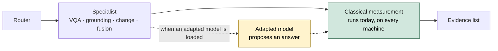

- Each specialist has a **socket** for an adapted model. When one is loaded, the model proposes and the classical measurement verifies; the numbers in the answer still come from pixels.
- When no model is loaded, the classical path runs alone, and the trace says so (`engine: classical` vs `neural+classical`).
- That socket is already built and tested with a stand-in, so connecting a trained model does not change anything else in this document.

---

## 9. The data

What the problem statement itself names. Which of these the models train on is in the model document.

| Dataset | What it is | Role named by ISRO |
|---|---|---|
| **BigEarthNet.txt** | Text annotations for co-registered Sentinel-1 radar + Sentinel-2 optical imagery | Primary dataset for remote-sensing adaptation (*"or any open source training data"* is also permitted) |
| **VRSBench** | Satellite images with captions, objects and question–answer pairs | Evaluates single-image captioning, grounding and VQA |
| **RSVQA** | Remote-sensing visual question answering benchmark | Evaluates single-image VQA |
| **CDVQA** | Change-detection question answering benchmark | Evaluates change-based VQA |
| **ISRO/SAC set** | Cartosat-2S optical + RISAT SAR pairs, pre-aligned, **answers never disclosed** | ISRO's final scoring |

**Accepted file formats:** GeoTIFF or TIFF for real imagery. PNG and JPEG only for the public benchmark datasets.

Because the ISRO/SAC set is secret and comes from Indian sensors that public data does not match, the design favours **robustness** over tuning to one benchmark: input validation, calibrated confidence and abstention all exist so the system behaves sensibly on data we have never seen.

---

## 10. Evidence, confidence and the trace

### 10.1 What comes back from every question

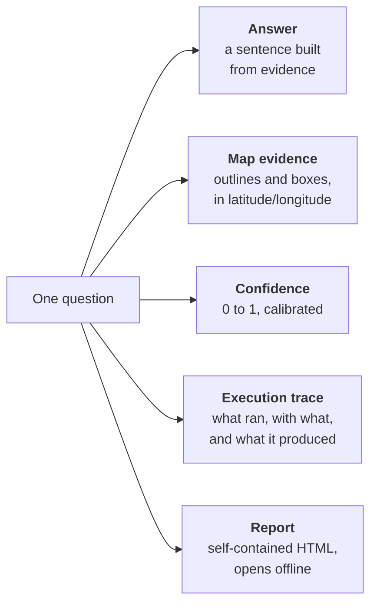

### 10.2 Evidence items
Every specialist returns a list of **claims**, each with:
- its value (for example "965.99 ha");
- a confidence;
- which sensor it came from;
- the method that produced it;
- a location in real-world coordinates (latitude/longitude, the EPSG:4326 system GPS uses).

When two sensors disagree, the conflict is **recorded** and confidence is lowered. It is never silently resolved.

### 10.3 Confidence that means something
A confidence of 0.9 should be right about 90 % of the time. This is called **calibration**, and it is measured by *expected calibration error* (ECE — lower is better). Our classical pipeline measures **ECE 0.0328**, meaning its stated confidence tracks its real accuracy closely. Below the threshold, the system **abstains** instead of guessing.

### 10.4 The execution trace — what ISRO scores

A real trace from a cross-modal question looks like this:

| # | Step | Detail |
|---|---|---|
| 1 | Input validated | 2 rasters · optical_sar |
| 2 | Task identified | cross_modal · matched /together/ |
| 3 | Compatibility check | optical_sar satisfies optical_sar |
| 4 | Tool selected | optical_sar (fusion_late_v0) |
| 5 | Parameters | threshold = 0.45 |
| 6 | Executed optical_sar | 4 evidence items · path classical |
| 7 | Confidence | 0.xx · 3/4 items passed the gate |
| 8 | Evidence returned | n georeferenced features · EPSG:4326 |

**What the trace deliberately does NOT contain:** any "AI reasoning" text. ISRO says internal reasoning is *"neither required nor evaluated"*. Many teams will show a model "thinking" — which is unscored, can be fabricated, and cannot be audited. We show only what actually executed (ADR-008).

---

## 11. The web application

Built with React and TypeScript, with a 3D view of the stacked sensor layers (three.js). It runs **entirely offline** — no map tiles, fonts or models fetched from the internet — because a venue demo cannot depend on the Wi-Fi.

| Page | What it shows |
|---|---|
| `/` **Landing** | The story. Scrolling wipes the radar image in under the cloud, replays RQ-4 through the pipeline stages, shows optical vs SAR side by side, and replays a live refusal |
| `/workstation` **Workstation** | The tool itself: drop zones for each image role, image / 3D stack / compare views, evidence above the trace, a query bar with the five ISRO queries, GeoJSON and report export |
| `/data` **Data & models** | The datasets and the model components, with their real current state |
| `/results` **Results** | Measurements, the ablation, calibration. Anything not yet measured reads `XX.X` — never a made-up number |
| `/report/:id` **Report** | The printable run report, downloadable as one self-contained file |

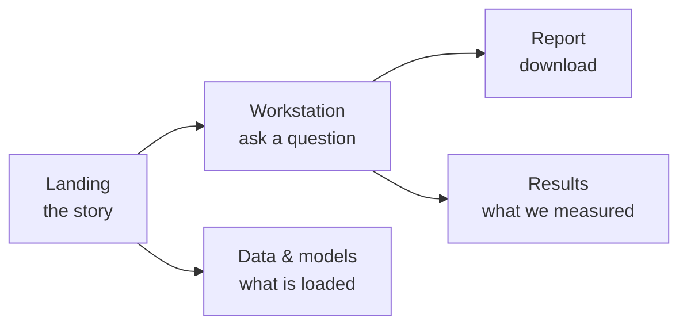

**Two engines, one interface.** Until the Python API service is finished, the web app answers with a **preview engine**: the same classical pipeline ported to TypeScript and running in the browser, on real pixels. Its results match the Python backend (for example, water grounding 965.99 ha, identical). Every answer is labelled with the engine that produced it, in the badge, the answer, the trace and the report.

**Uploads work in the web app today.** A projected GeoTIFF is reprojected and centred correctly, a malformed file gets a readable error, and a PNG is accepted without coordinates — all verified by 38 automated browser checks with zero console errors.

### How the pieces fit — target architecture

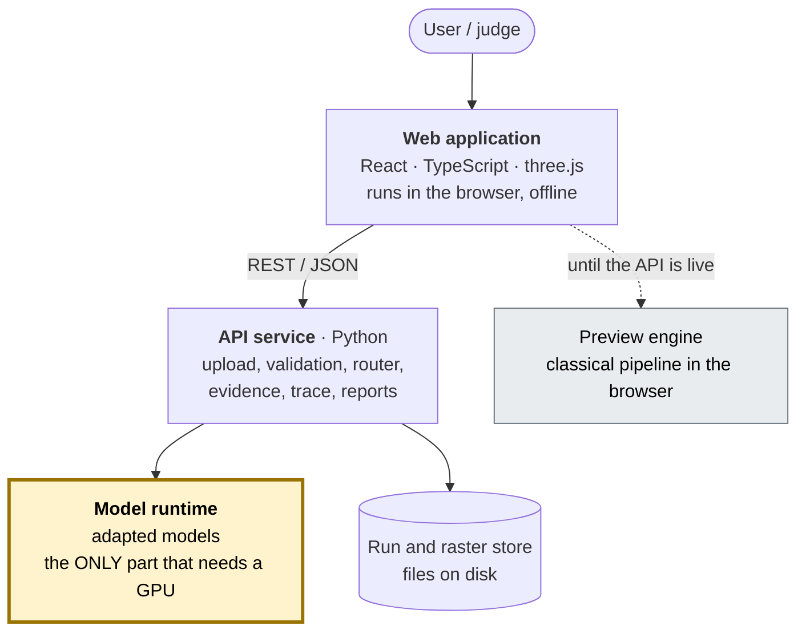

**Why the model runtime is separate:** it is the only part that needs a GPU, takes seconds to warm up, and can run out of memory. Isolated behind one interface, it can fail without taking the demo down — the rest of the system falls back to the classical path or to clearly-labelled pre-computed results (§17.2).

---

## 12. What is real and what is simulated

**Say this before a judge asks.** A judge who discovers an undisclosed simulation stops believing everything else.

| | Status |
|---|---|
| **The demo images' pixel values** | **Simulated.** Cartosat-2S and RISAT imagery is not publicly available, and ISRO's evaluation set is secret. Demo scenes come from a scene generator (`satquery/scene.py`) |
| **Where the cloud sits** | **Placed deliberately** over the built-up area, because that is exactly the case where optical and SAR disagree and fusion earns its keep. A designed test, not a lucky discovery — say so |
| **Every algorithm that reads the pixels** | **Real.** Speckle filtering, thresholds, connected components, change vector analysis, NDVI/NDWI, alignment checking, coordinate conversion, the router, the confidence gate |
| **Uploaded user images** | **Real.** The web app reads real GeoTIFFs |
| **Adapted models** | Status and numbers are in the separate model document. The socket that loads them is built and tested with a stand-in (§8) |

---

## 13. What we have measured

### 13.1 Classical pipeline — against ground truth the pipeline never reads

Reproduce with `python3 -m satquery.cli eval`.

| Task | Metric | Value | What it means |
|---|---|---|---|
| Water grounding | IoU | 1.0000 | Outline overlaps the true water area perfectly |
| Vegetation grounding | IoU | 0.9958 | Near-perfect overlap |
| SAR built-up detection | F1 | 0.9450 | Radar finds built-up area accurately |
| Bi-temporal change | F1 | 0.7698 | Change is found, with some errors at boundaries |
| Calibration | ECE | 0.0328 | Stated confidence matches real accuracy |
| Cross-modal query | Latency | ~90 ms at 512 px | Fast |

> **Caveat for the slide:** these are measured on **our simulated scenes**, so they show the method works on the populations it was designed for — not accuracy on real Cartosat imagery. Label them *"on synthetic test scenes"*.

### 13.2 Model numbers

In the separate model document. Use them from there, with the labels it gives them.

### 13.3 Deliberately **not** claimed

- **Router accuracy.** The current "100 %" is measured on the same 19 questions the rules were written from. That is a construction check, not accuracy. It will be reported once a separate held-out set of paraphrased questions exists.
- **Public benchmark scores** (RSVQA, CDVQA). Not run yet.

### 13.4 The ablation — what each layer adds

An *ablation* switches parts off one at a time to show what each contributes. Five configurations, A to E:

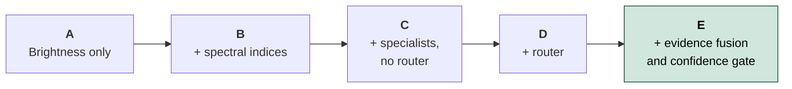

Every row is classical computer vision, and the row names say so. When trained models are connected, the rows are **replaced**, not renamed. The score column is a composite *capability* score (half mask accuracy, a quarter router, a quarter whether the question could be served at all) — **print that formula on the slide**; it is our own measure, not a standard one.

---

## 14. What makes this different

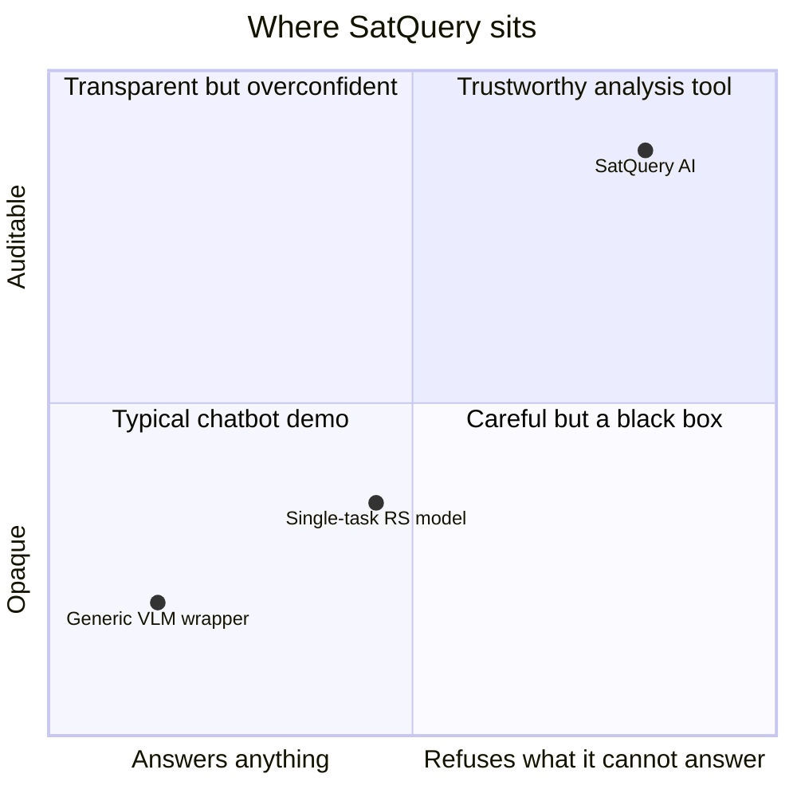

*(The positions are illustrative, not measured — present it as a positioning sketch.)*

| # | Differentiator | Why a judge should care | Demo |
|---|---|---|---|
| 1 | **It refuses impossible questions** — and runs no model when it does | Proves validation is real, not decorative. Most systems answer anyway | One image + "what changed?" |
| 2 | **It sees under clouds** by combining radar and optical | Directly shows requirement 4's "complementary information" as a number in hectares | RQ-4, pull the layers apart in 3D |
| 3 | **Facts from vision, words from language** — enforced in code | The answer cannot contain a number no measurement produced | Show one evidence item next to the sentence |
| 4 | **An auditable trace, not fake reasoning** | Matches exactly what ISRO says it scores | Open the trace panel |
| 5 | **Calibrated confidence and abstention** | "0.9" actually means about 90 % | Push the threshold up and watch it abstain |
| 6 | **Fully offline** | Survives venue Wi-Fi | Unplug the network during the demo |

---

## 15. Why we made the choices we made

Each of these is recorded as an Architecture Decision Record in [`ADR/`](ADR/), including the alternatives we rejected. They double as answers to judges' "why not…?" questions.

| ADR | Decision | The one-line reason |
|---|---|---|
| 002 | Grounding, not captioning, as the second single-image task | Grounding returns *where* — checkable against a mask. A caption is hard to score and easy to fake |
| 004 | Router is plain Python, not an agent framework | The requirement is constraint: fixed registry, fixed parameters, deterministic, testable |
| 005 | Late fusion for optical + SAR first | Each sensor is analysed separately, then combined. It is simpler, explainable, and conflicts stay visible |
| 006 | Train/test split by geography, never random | Neighbouring tiles leak; a random split measures memorisation |
| 007 | Language model phrases validated evidence only | Prevents invented numbers — the core product rule |
| 008 | Show the execution trace, hide chain-of-thought | The PS explicitly scores only the observable trace |
| 009 | PostGIS + object storage for scale *(proposed)* | Plain files for the submission; a spatial database when needed |

**"Why not just use GPT-4V?"** Three reasons, in order:
1. The PS disqualifies a generic model without remote-sensing adaptation.
2. It needs the internet and cannot run at the venue.
3. It can invent numbers. Our architecture structurally cannot (ADR-007).

---

## 16. Status and road to submission

### 16.1 Where each mandatory capability stands (19 Sep 2026)

| | Requirement | State |
|---|---|---|
| 1 | Remote-sensing adaptation | See the model document |
| 2 | Single-image VQA + grounding | **Working, classical** |
| 3 | Bi-temporal change | **Working, classical** |
| 4 | Optical–SAR analysis | **Working, classical** |
| 5 | Agentic orchestration | **Working** — classify, validate, refuse, select, execute, trace |
| — | Web app, upload, reports | **Working** in the web app on the preview engine; Python API service being completed |

### 16.2 Timeline

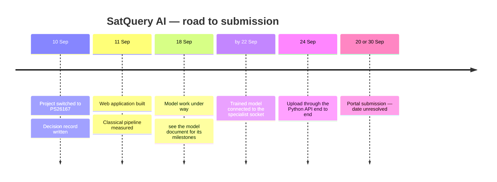

**The submission date is unresolved** between 20 and 30 September in our own records. Confirm it with the SPOC before planning the deck's final numbers. Whatever the date, the deck shows only numbers that exist on that day — never a projected figure.

### 16.3 Known gaps — be ready to say them

- The router's accuracy on unseen phrasings is not yet measured.
- RQ-5 (*"has the built-up area increased…"*) is routed to change analysis by the web app's preview router; the Python router still sends it to single-image VQA and needs the same rule.

---

## 17. Team, risks, judge questions

### 17.1 Ownership

| Area | Owner |
|---|---|
| Models — see the model document | Mridul |
| Everything else — router, validation, evidence, trace, API, web app, reports | Shreyash |
| The seam between them — `Pipeline(adapters=...)`, tested with a stand-in model | Joint |

### 17.2 Risks

| Risk | Mitigation |
|---|---|
| Trained model not connected before the deadline | The classical system is complete and honest on its own; the trace already says which engine ran |
| ISRO's secret data looks different from the public data | Design for robustness: geographic splits, calibrated confidence, abstention |
| Unknown judging weights | Balance across all five capabilities |
| Venue has no internet | No runtime network calls; everything local; pre-computed results clearly labelled as such |
| Model runtime crashes during the demo | Falls back without fabricating — see below |
| Simulated imagery read as a fake demo | Disclose it first (§12) |

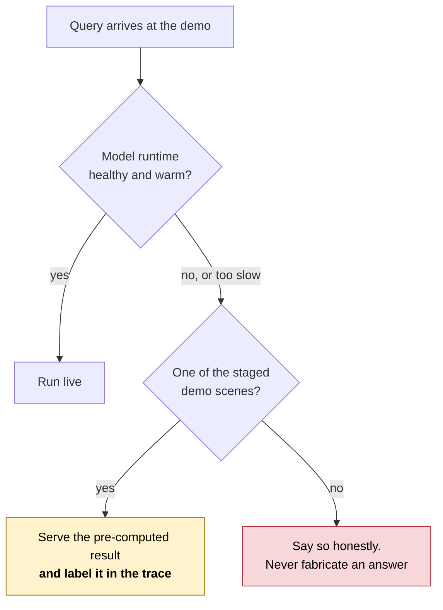

### 17.3 Questions judges will ask — and the answers

| Question | Answer |
|---|---|
| *Why not just use GPT-4V?* | Disqualified by the PS without adaptation; needs internet; can invent numbers. §15 |
| *Where is your fine-tuning?* | Answered from the separate model document |
| *How do you know the confidence is honest?* | Calibration is measured: ECE 0.0328. At the threshold it abstains rather than guesses |
| *Is this real imagery?* | Demo scenes are simulated because Cartosat/RISAT data is not public; every algorithm is real; uploads accept real GeoTIFFs. §12 |
| *What is "agentic" here?* | Classify → validate → select from a fixed registry → sequence → execute with permitted parameters, all in the trace. §6 |
| *Why show no reasoning?* | ISRO scores only the observable trace, and says reasoning text is "neither required nor evaluated". ADR-008 |
| *What if two sensors disagree?* | The conflict is recorded in the evidence and confidence is reduced — never silently resolved |
| *How does it handle the secret ISRO data?* | Geographic splits, calibrated confidence, abstention and input validation — built for data we have not seen |
| *Router 100 %?* | We do not claim it: it is measured on the questions the rules were written from. A held-out set is being built |

---

## 18. Slide-by-slide outline

A 15-slide main deck plus appendix. "Diagram" means the Mermaid block in the named section — render it (see the end of this section) or redraw it in the deck's style.

| # | Slide | Content | Source |
|---|---|---|---|
| 1 | **Title** | SatQuery AI · PS26167 · ISRO · team name · one-sentence answer | §4 |
| 2 | **The problem** | "No interface accepts a question." Today vs SatQuery | §1 diagram |
| 3 | **Why one image is not enough** | Optical vs SAR; cloud; two dates | §2.1 table + diagram |
| 4 | **What ISRO requires** | Five mandatory capabilities; the disqualifying sentence | §3 mind map |
| 5 | **Our answer and the rule** | "Vision produces facts, language phrases them." Chatbot vs SatQuery | §4 diagram |
| 6 | **How a question flows** | The nine-step pipeline and three outcomes | §5 flowchart |
| 7 | **The agent** | Five jobs, the fixed registry, the routing decision | §6.1 table + §6.2 diagram |
| 8 | **The refusal** | One image + "what changed?" — no model called | §6.3 sequence diagram |
| 9 | **Seeing under clouds** | Fusion flow; hectares recovered from beneath cloud | §7.4 diagram |
| 10 | **The models** | From the separate model document | — |
| 11 | **Where models plug in** | Specialist socket: classical verifies, model proposes | §8 diagram |
| 12 | **Evidence and trace** | What comes back; a real trace; no fake reasoning | §10 |
| 13 | **The product** | Workstation screenshot, pages, offline | §11 |
| 14 | **Honesty and measurement** | Real vs simulated; measured table; not claimed | §12, §13 |
| 15 | **Roadmap and team** | Timeline, ownership, what's next | §16.2, §17.1 |
| A1 | Appendix: design decisions | ADR table, "why not GPT-4V" | §15 |
| A2 | Appendix: datasets | Dataset table, split rule | §9 |
| A3 | Appendix: target architecture | Architecture diagram | §11 |
| A4 | Appendix: judge Q&A | §17.3 | §17.3 |

**Two live-demo moments** (build the deck around them):
1. **The refusal** (slide 8): one image, *"what changed between these two dates?"* → declined, no model called.
2. **The recovery** (slide 9): RQ-4 with the optical + SAR pair → built-up area quantified under the cloud; pull the 3D layer stack apart.

**Rendering the diagrams.**
- GitHub renders every Mermaid block in this file directly — open the file on GitHub and screenshot.
- For crisp vector images, paste a block into <https://mermaid.live> and export SVG or PNG.
- With Node installed: `npx -p @mermaid-js/mermaid-cli mmdc -i docs/11_Presentation_Guide.md -o shots/deck.svg` renders every block in the file to numbered SVGs.

---

## 19. Rules for the slides

These come from [`10_Decision_Record.md`](10_Decision_Record.md) §9. Breaking any one of them is the kind of mistake that makes a judge distrust every other number.

1. **Report what was measured, never what was targeted.** A target on a slide must say it is a target.
2. **Never claim router accuracy** until the held-out set exists.
3. **Label synthetic-scene metrics as synthetic.** "IoU 0.9958 on synthetic test scenes".
4. **Disclose the cloud placement** on the fusion slide.
5. **Never show an AI "thinking" panel.** Show the trace.
6. **Do not call the classical path "AI-generated" or "neural".** Every result is labelled with the engine that produced it; the deck must be too.
7. **Print the capability formula** wherever the ablation's capability score appears.
8. **Model numbers come from the model document,** with its labels, unchanged.

---

## 20. Glossary

| Term | Meaning |
|---|---|
| **Abstain** | Decline to answer because no measurement is confident enough |
| **Backscatter** | The strength of the radar echo; high for buildings and rough surfaces, low for calm water |
| **Bi-temporal** | Two images of one place on two dates |
| **Calibration / ECE** | Whether stated confidence matches real accuracy; ECE is the average mismatch — lower is better |
| **Cartosat-2S** | ISRO optical satellite, very high resolution |
| **Change vector analysis** | Measuring how far each pixel's colour moved between two dates |
| **Classical CV** | Hand-designed image algorithms; no training |
| **Co-registered** | Two images aligned so the same pixel covers the same ground |
| **EPSG:4326** | The latitude/longitude coordinate system GPS uses |
| **F1** | A 0–1 score balancing false alarms against misses |
| **GeoTIFF** | An image file that records where on Earth its pixels are |
| **Grounding** | Returning the location of a thing named in text |
| **IoU** | Overlap between predicted and true area divided by their union; 1.0 is perfect |
| **Lee filter** | A standard filter that removes radar "speckle" noise |
| **Multispectral** | Imagery with bands beyond visible colour, such as near-infrared |
| **NDVI / NDWI** | Indices from light bands that highlight vegetation / water |
| **Otsu's method** | Automatically picks the best threshold to split an image into two classes |
| **RISAT** | ISRO radar (SAR) satellite |
| **SAR** | Synthetic Aperture Radar: an active radar imager that sees through cloud and at night |
| **Speckle** | Grainy noise inherent to radar images |
| **Trace** | The step-by-step record of what the system actually ran |
| **VLM** | Vision-language model: image + text in, text out |
| **VQA** | Visual question answering |
| **VRSBench** | Remote-sensing benchmark with images, captions, objects and Q&A |

---

## Related documents

| Document | For |
|---|---|
| [`00_Official_Problem_Statement.md`](00_Official_Problem_Statement.md) | ISRO's exact words |
| [`05_System_Design.md`](05_System_Design.md) | Architecture in depth |
| [`07_PRD.md`](07_PRD.md) | Product requirements and user stories |
| [`10_Decision_Record.md`](10_Decision_Record.md) | What is settled, open and scheduled |
| [`ADR/`](ADR/) | Why each design choice was made |
