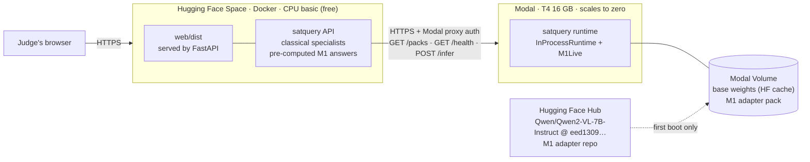

# SatQuery AI — Online Deployment Specification

| | |
|---|---|
| **Version** | 1.0 |
| **Date** | 2026-09-24 |
| **Owners** | **Shreyash** — API/UI host, runtime transport, code changes · **Mridul** — weights, Modal runtime parity |
| **Scope** | The *online* demo: a public link judges can open, with M0 + M1 answering live on a GPU |
| **Not in scope** | The venue build. `docker compose up` on the venue laptop stays offline (OPS-03, OPS-06) and is unchanged by this document |

---

## 1. Why this document exists

M0 (Qwen2-VL-7B-Instruct, frozen) with M1 (the QLoRA adapter) needs about
6 GB of VRAM in 4-bit. No free always-on host offers a GPU. The system is
already split so that only one component needs one:

- **API + interface** — CPU only. FastAPI, NumPy, the classical specialists,
  the built web bundle.
- **Model runtime** (`satquery runtime`) — the only process that loads M0 + M1.
  The API reaches it over HTTP when `SATQUERY_RUNTIME` is a URL
  (`satquery/runtime.py`, `HttpRuntime`).

So the online deployment is two hosts: a free CPU host that is always up, and
a GPU host that exists only while someone is using it. When the GPU host is
down or cold, every query still answers: classical measurement always, and
M1's pre-computed answers for known images (§6.2).

---

## 2. Topology



| Component | Host | Why this host |
|---|---|---|
| API + UI | **Hugging Face Spaces**, Docker SDK, *CPU basic* | Free, 2 vCPU / 16 GB RAM, builds the existing `Dockerfile` as is. 16 GB leaves room for uploads, unlike 512 MB free tiers |
| Model runtime | **Modal**, `gpu="T4"` | $30/month free credit on the Starter plan, scales to zero, HTTPS endpoints with built-in auth. **T4 is the GPU M1 was measured on** (Kaggle T4), so latency and numerics match the evaluated run |
| Base weights | Hugging Face Hub, pinned revision | Already where `M1Live` loads from; the revision is recorded in `pack.json` |
| Adapter weights | Hugging Face Hub, model repo | 20.2 MB, today only on Kaggle and laptops (`.gitignore` excludes `*.safetensors`). One durable home is needed before anything else |

---

## 3. The wire contract (exists today)

Served by `serve_runtime()` and called by `HttpRuntime`. The Modal app MUST
serve exactly this; nothing on the API side changes except §5's fixes.

| Route | Request | Reply |
|---|---|---|
| `GET /packs` | — | `{"packs": [AdapterPack.to_dict(), …]}` |
| `GET /health` | — | `{"ok": true, …describe(runtime)}` — includes `packs[adapter].mode` (`live` / `precomputed` / null) |
| `POST /infer` | `{"adapter", "task": "vqa", "question", "image_key", "image_png_b64"}` | `{"engine", "pack", "stub", "source": "live"\|"precomputed", "answer", "confidence"}` |
| errors | — | HTTP status + `{"error": {"code", "message", "remedy"}}` (`SatQueryError.payload()`) |

`image_key` is SHA-256 of the exact uint8 RGB pixels M1 sees, computed by the
API (`runtime.image_key`). PNG is lossless, so the runtime can recompute and
check it.

---

## 4. Components in detail

### 4.1 Weights — one durable home

| Artefact | Location | Size |
|---|---|---|
| Base M0 | `Qwen/Qwen2-VL-7B-Instruct`, revision `eed13092ef92e448dd6875b2a00151bd3f7db0ac` (from `pack.json`) | ~16 GB fp16 on disk, quantised to 4-bit at load |
| Adapter M1 | New HF model repo, e.g. `<team>/satquery-m1-rs-vqa`, holding `adapter_model.safetensors` + `adapter_config.json` + `pack.json` | 20.2 MB |

- Publish the adapter under the base model's licence (apache-2.0, per
  `pack.json`); cite VRSBench (CC-BY-4.0) on the model card. A public repo also
  satisfies the PS deliverable "codes and models".
- Record the adapter repo and commit in `models/MANIFEST.md`.

### 4.2 Modal runtime — `167/deploy/modal_runtime.py`

**Image**

- `modal.Image.debian_slim(python_version="3.11")`
- `pip_install`: `torch` (CUDA build), `transformers`, `accelerate`,
  `bitsandbytes`, `peft`, `pillow`, `numpy`, `fastapi`, `huggingface_hub` —
  **pinned to exact versions** (§5, P1-4).
- `add_local_python_source("satquery")` — the runtime is the repo's own
  `InProcessRuntime` + `M1Live`, not a re-implementation. Serving M1 any other
  way serves a model nobody measured (`M1Live` docstring).
- `add_local_dir("models/adapters/m1-rs-vqa")` for `pack.json`,
  `adapter_config.json`, `precomputed.jsonl`.

**Volume** `satquery-models`, mounted at `/models`

```
/models/hf/                          HF_HOME: the base model's cache
/models/adapters/m1-rs-vqa/          pack assembled here on first boot:
    pack.json, adapter_config.json,  (copied from the image)
    precomputed.jsonl
    adapter_model.safetensors        (downloaded from the adapter repo)
```

`M1Live` loads the adapter with `PeftModel.from_pretrained(pack.path)`, so the
pack directory must hold the weights beside `pack.json`. A one-off
`modal run deploy/modal_runtime.py::fetch` fills the volume; containers only
read it.

**Class**

| Setting | Value | Reason |
|---|---|---|
| `gpu` | `"T4"` | Evaluated hardware; 16 GB fits the 4-bit 7B with room |
| `max_containers` | `1` | Caps spend: one GPU, never a fleet |
| `min_containers` | `0` by default; `1` during a judging window (§7.2) | No warm pool = no idle charge |
| `scaledown_window` | 20 min | A judge who pauses does not pay a second cold start |
| `timeout` | 120 s per request | Covers a cold first request |
| concurrency | 1 input at a time | `generate` is serial on one GPU |
| `secrets` | `hf-token` (only if the adapter repo is private) | |
| `@modal.enter()` | build `InProcessRuntime("/models/adapters")`, then call the M1 model's `_load()` | The ~6 GB load happens once per container, before the first request, not inside it |

Parameter names follow the Modal SDK as of September 2026
(`min_containers`, `scaledown_window`; older releases called them
`keep_warm`, `container_idle_timeout`). Check them against the installed SDK.

**Endpoints** — one `@modal.asgi_app(requires_proxy_auth=True)` serving the
three routes of §3 through the shared handler (P0-3). Proxy auth means Modal
rejects any request without a valid `Modal-Key` / `Modal-Secret` header pair
before a container starts, so a leaked URL cannot spend credits.

### 4.3 API + UI — Hugging Face Space

- **SDK** Docker; the Space repository is the contents of `167/`
  (`Dockerfile`, `satquery/`, `web/`, `pyproject.toml`, the tracked
  `models/` files of P1-1).
- **Space README front-matter**: `sdk: docker`, `app_port: 8000` (the
  `Dockerfile` already serves on 8000).
- **Sync**: `git subtree push --prefix 167 space main` from the repo root, run
  by hand after each release on `main`. Never edit the Space directly: `main`
  is the only place work happens (root `README.md`).
- **Hardware**: CPU basic (free). The Space sleeps after ~48 h without
  visitors and wakes on the next visit. Storage is not persistent, so uploads
  and stored runs are lost on restart. That is acceptable for a demo; say so on
  the Data page if asked.

---

## 5. Code changes required before deploying

Each is a commit on `main` with a selftest check, mutation-tested like the rest.

| ID | Change | Why | Acceptance |
|---|---|---|---|
| **P0-1** | `InProcessRuntime.infer`: when the payload has `image_png_b64` and no `_rgb_u8`, decode it to uint8 RGB. If `image_key` is present, recompute it and reject a mismatch with `400 bad_image` | **Remote M1 is broken today.** `HttpRuntime` sends `image_png_b64`; `infer` reads `payload["_rgb_u8"]` → `KeyError` → the handler drops the connection → the API reports `runtime_unreachable`. Only a stub has ever crossed HTTP in tests | A real (non-stub) pack with a fake M1 model answers over `serve_runtime` end to end; the reply's `source` is `live` |
| **P0-2** | `HttpRuntime` sends `Modal-Key` / `Modal-Secret` from `SATQUERY_RUNTIME_KEY` / `SATQUERY_RUNTIME_SECRET` when set | Proxy auth (§4.2) | A server that requires the headers gets them; with the env unset, no headers are sent (venue unchanged) |
| **P0-3** | Move the route logic out of `serve_runtime`'s `Handler` into `handle(runtime, method, path, body) -> (status, dict)`, used by both the stdlib server and the Modal ASGI app | Two servers, one behaviour. Without this, the Modal app is a second implementation of the contract | Existing ARC-01 checks pass unchanged; the Modal app imports `handle` |
| **P1-1** | `evaluate.m1_adaptation` / `m1_calibration` resolve `models/` through `paths.home()`, not `Path(__file__)`; `.dockerignore` stops excluding `models/` wholesale and admits `models/adapters/*/pack.json`, `*/precomputed.jsonl`, `*/adapter_config.json`, `models/results/m1_calibration.jsonl` (never weights) | In the Docker image `satquery` is pip-installed into site-packages and `models/` is excluded, so the hosted Results page shows M1 as pending and has no calibration | `docker build` + `/api/evaluation` returns `adaptation.adapted == 66.0` and a non-null `m1_calibration` |
| **P1-2** | `FallbackRuntime(primary=HttpRuntime, local=InProcessRuntime)`: `infer` tries the remote; on `runtime_unreachable` / timeout, answers from the local pre-computed cache. `SATQUERY_RUNTIME=https://…` builds it when a local pack dir exists | NFR-05 / ADP-09: with the runtime down, known images must still get M1's pre-computed answer. Today a hosted API pointing at Modal has no local fallback | Selftest: remote down → a known image is answered `precomputed`; an unknown image → classical, trace says why |
| **P1-3** | `HttpRuntime.mode(adapter)` from `GET /health` (cached like `/packs`); `questions_for` from the local fallback cache | The Ctrl+K palette (`/api/m1/questions`) calls `runtime.mode`; `HttpRuntime` has none, so the palette says "M1 is not serving" while Modal serves live | Hosted palette shows "M1 runs live here" when Modal is warm |
| **P1-4** | Pin exact versions of torch / transformers / peft / bitsandbytes / accelerate for the runtime image in `deploy/requirements-runtime.txt`, and record them in `MANIFEST.md` | `models/requirements.txt` has only lower bounds; the evaluated run used whatever Kaggle had (transformers 5.18.0.dev0). A different stack can change answers | Parity test §8.1 passes on the pinned stack |
| P2-1 | `satquery warm <url>`: one `GET /health` plus one `POST /infer` on a demo photo, printing cold-start time | Before a judging window | Prints `ready in N s` |
| P2-2 | *(optional)* Save the 4-bit-quantised base to the volume and load that instead of quantising 16 GB at every cold start | Faster cold start | Parity test still 300/300 |

---

## 6. Behaviour

### 6.1 Normal path (Modal warm)

Judge asks an optical question → API runs the classical specialist → asks the
runtime (`HttpRuntime` → Modal) → M1 answers **live** on any image →
`engine: neural+classical`, trace says `M1 live`.

### 6.2 Degraded paths

| Situation | What the judge sees |
|---|---|
| Modal cold (first request after idle) | That query: classical answer, trace "runtime did not answer in 20 s". Container keeps loading; next query is live. Avoided entirely with §7.2 |
| Modal down / credits exhausted | Known images (demo photos): M1 **pre-computed**, labelled. Anything else: classical, trace says why (P1-2) |
| SAR input | Classical, always — M1 is optical-only (unchanged) |
| Space asleep | First page load takes ~30–60 s while the Space wakes |

Nothing hangs: `SATQUERY_RUNTIME_TIMEOUT` (20 s) bounds every remote call.

---

## 7. Operations

### 7.1 First deployment — in order

1. **Adapter to the Hub** (Mridul): push `adapter_model.safetensors`,
   `adapter_config.json`, `pack.json` to the adapter repo. Note repo + commit in
   `MANIFEST.md`.
2. **Code changes** P0-1…P1-4 on `main`; selftest green.
3. **Modal**: `pip install modal && modal setup`; create secret `hf-token` if
   the repo is private; `modal run deploy/modal_runtime.py::fetch` (fills the
   volume: ~16 GB base + adapter, one time); `modal deploy
   deploy/modal_runtime.py`; create a proxy-auth token in the Modal dashboard.
4. **Parity** (§8.1) against the deployed URL. Do not continue if it fails.
5. **Space**: create it (Docker SDK); set secrets `SATQUERY_RUNTIME`,
   `SATQUERY_RUNTIME_KEY`, `SATQUERY_RUNTIME_SECRET`; `git subtree push`.
6. **Acceptance** §8.2–8.5 against the Space URL.

### 7.2 Judging-window runbook

| When | Action |
|---|---|
| T − 15 min | Set `min_containers=1` (redeploy with `SATQUERY_WARM=1`, or `update_autoscaler`) → container loads M0 + M1 |
| T − 5 min | `satquery warm <modal-url>` → `ready`; open the Space → Data page shows *M1 · live* |
| During | Nothing. `max_containers=1` caps spend |
| T + end | Set `min_containers=0`; the container scales down after `scaledown_window` |

### 7.3 Budget

The free $30/month is about 27 T4-hours (third-party estimate; check
modal.com/pricing). Only GPU-seconds with a live container cost anything.

| Use | GPU time | Share of $30 |
|---|---|---|
| One-off `fetch` + parity run (300 answers) | ~0.5 h | ~2 % |
| One 3-hour judging window, warm throughout | 3.3 h | ~12 % |
| Ad-hoc visits (cold start + 20 min idle each) | ~0.4 h per visit | ~1.5 % each |

Set a spending limit of $30 in the Modal dashboard, so credit exhaustion
degrades to §6.2 rather than billing a card.

### 7.4 Watching it

- `/api/health` on the Space: `runtime_reachable`, `packs[*].mode`.
- `modal app logs satquery-runtime` for load time and per-request latency.
- The Results page's M1 figures come from the tracked files (P1-1), not from
  Modal, so they show even when the runtime is off.

---

## 8. Acceptance tests

| # | Test | Pass |
|---|---|---|
| 8.1 | **Parity.** Re-ask the questions of `models/results/m1_calibration.jsonl` on their images through the deployed `/infer`, and compare answers | ≥ 299/300 identical answers (the earlier `M1Live` check was 300/300); investigate every difference before accepting |
| 8.2 | Latency, warm: 20 single-image VQA queries through the Space | p95 < 8 s end to end (NFR-01); runtime share ~1 s |
| 8.3 | Cold start: first `/infer` after scale-to-zero | Measured and recorded here; the query answers classical, no error |
| 8.4 | Fallback: stop the Modal app; ask a known photo and an unknown photo | Known → M1 *pre-computed*, labelled; unknown → classical, trace names the reason |
| 8.5 | Auth: `curl` the Modal URL without the key pair | 401 before any container starts |
| 8.6 | `node web/verify.mjs https://<space>` | All pass |

---

## 9. Configuration

| Variable | Where | Value |
|---|---|---|
| `SATQUERY_RUNTIME` | Space secret | `https://<workspace>--satquery-runtime-web.modal.run` |
| `SATQUERY_RUNTIME_KEY` / `_SECRET` | Space secrets | Modal proxy-auth token pair |
| `SATQUERY_RUNTIME_TIMEOUT` | Space variable | `20` |
| `SATQUERY_MAX_UPLOAD_MB` | Space variable | `100` |
| `HF_HOME` | Modal image env | `/models/hf` |
| `SATQUERY_WARM` | Modal deploy env | `1` during a judging window, else unset |

Keys and secrets live only in Space secrets and Modal secrets, never in the
repository.

---

## 10. Risks

| Risk | Likelihood | Mitigation |
|---|---|---|
| Runtime stack differs from the evaluated one and answers drift | Medium | P1-4 pins; §8.1 parity gate |
| Cold start longer than a judge will wait | High without the runbook | §7.2 warm window; P2-2 |
| Free credit exhausted mid-window | Low with §7.3 | Spending limit; §6.2 degradation is honest, not broken |
| Space asleep when a judge first opens the link | Medium | Open it at T − 5 min (§7.2) |
| Adapter weights lost (Kaggle output expires) | **High today** | §7.1 step 1 is first for this reason |
| Modal SDK parameter renames | Low | §4.2 note; pin the `modal` client version |

---

## 11. Decisions needed

| # | Decision | Owner | Default if undecided |
|---|---|---|---|
| D1 | Adapter repo public or private | Mridul | Public (PS deliverable; licence permits) |
| D2 | Whose account holds the Modal workspace | Team | One shared workspace; credits are per workspace |
| D3 | Space name and whether it is linked from the deck | Shreyash | `satquery-ai`, linked on the last slide |
