# SIH 2026 — PS 26167 Deep Analysis

> Absolutely. This PS deserves a proper technical breakdown, because at first glance it looks like “make a chatbot for satellite images,” but that is very far from what ISRO is actually asking.
> Below is written in a Markdown-ready Hinglish format so you can directly turn it into your project-analysis `.md` file.
> 
> I also went one step beyond the PS: I checked the actual public datasets named in the statement, their current published sizes, structures, intended tasks, and how I would use each one. The most important discovery is that **BigEarthNet.txt** is not just a small CSV-like training file; it is a 464,044-pair Sentinel-1/Sentinel-2 dataset with roughly 9.6 million image-text annotations, and its currently hosted annotation table is about 467 MB / 9.55 million rows, while the associated imagery is much larger. ([RSIAG TU Berlin](https://txt.bigearth.net/?utm_source=chatgpt.com))

---

## Problem Statement

* **ID:** PS26167 — SatQuery AI: An Interactive Vision-Language Assistant for Multimodal Remote Sensing Image Analysis through Text Queries
* **Organization:** Indian Space Research Organisation (ISRO)
* **Department:** ISRO
* **Category:** Software
* **Theme:** Space Technology

The official 2026 listing identifies PS26167 as a Software problem under Space Technology for ISRO. ([GitHub](https://github.com/jeevansai-hub/SIH-2026-/blob/main/ps_2026/README.md?utm_source=chatgpt.com))

---

### 1. Sabse pehle: Problem actually kya hai?

**Simple language mein:**
Aaj satellite images available hain, lekin unko samajhne ke liye expert banna padta hai.

Satellite / remote-sensing imagery ka use hota hai:
* agriculture monitoring
* disaster management
* urban planning
* forest monitoring
* water-resource assessment
* infrastructure mapping
* environmental monitoring

Lekin problem yeh hai ki current remote-sensing AI systems mostly task-specific hote hain.

For example:
* **Model A** → land-cover classification
* **Model B** → building detection
* **Model C** → object counting
* **Model D** → change detection
* **Model E** → Visual Question Answering

Ek normal user ke liye yeh difficult hai:
* Usse GIS samajhna padega.
* Usse satellite sensor samajhna padega.
* Usse model select karna padega.
* Usse parameters samajhne padenge.

**Isliye PS ka actual goal hai:**
Satellite imagery ko “natural language interface” ke through accessible banana.

Official statement specifically single-image analysis, multi-temporal analysis, optical–SAR joint analysis, aur agentic specialist-model selection demand karta hai. ([SIH Fit](https://sih-fit.vercel.app/problem/SIH26167?utm_source=chatgpt.com))

---

### 2. Ek line mein problem

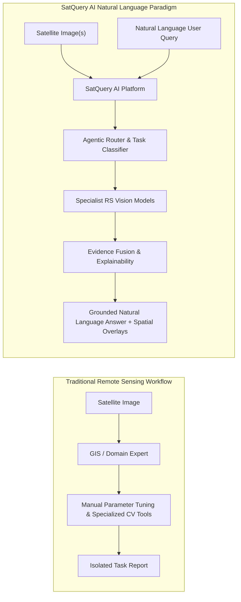

**Current world:**
```
Satellite Image ──► Expert ──► GIS / CV / Remote-Sensing Software ──► Analysis
```

**SatQuery AI ka goal:**
```
Satellite Image + User ka normal English query ──► SatQuery AI ──► Automatic model/tool selection ──► Remote-sensing analysis ──► Answer + visual evidence
```

**Example:**
* User image upload karta hai.
* User poochta hai: *"Is there any urban development in this area?"*
* System:
  $$\text{Image} \longrightarrow \text{VLM / specialist model} \longrightarrow \text{Urban feature detection} \longrightarrow \text{Reasoning} \longrightarrow \text{Answer}$$
* **Output:** *"Yes. Several built-up areas are visible."* Aur ideally system image pe area highlight karega.

---

### 3. Lekin yahan ek bahut important catch hai ⚠️

Agar tum soch rahe ho:
> “Hum Gemini/GPT-4o ko image de denge aur answer le lenge.”
> **❌ WRONG.**

PS explicitly says that a generic LLM/VLM is not sufficient.

**Reason:**
Remote-sensing images ordinary photographs nahi hoti.

Satellite imagery mein:
* multispectral bands hote hain
* SAR ho sakta hai
* different sensors ka behavior different hota hai
* geographic coordinates matter karte hain
* temporal comparisons matter karte hain
* spatial scale matter karta hai
* domain-specific terminology hoti hai

PS specifically remote-sensing adaptation/domain adaptation demand karta hai, and at least one visual or VLM component must be adapted using BigEarthNet.txt or other open-source training data. ([SIH Fit](https://sih-fit.vercel.app/problem/SIH26167?utm_source=chatgpt.com))

---

### 4. Actually SatQuery AI kya hai?

Main isko 5 layers mein samajhta hoon.

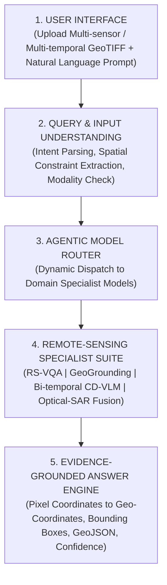

```
┌─────────────────────────────────────┐
│          1. USER INTERFACE          │
│     Upload image + ask question     │
└──────────────────┬──────────────────┘
                   │
                   ▼
┌─────────────────────────────────────┐
│   2. QUERY / INPUT UNDERSTANDING    │
│    What does user actually want?    │
└──────────────────┬──────────────────┘
                   │
                   ▼
┌─────────────────────────────────────┐
│       3. AGENTIC MODEL ROUTER       │
│   Choose correct specialist model   │
└──────────────────┬──────────────────┘
                   │
                   ▼
┌─────────────────────────────────────┐
│     4. REMOTE-SENSING AI TOOLS      │
│ VQA / Caption / Grounding / Change  │
│       Optical-SAR / CV / GIS        │
└──────────────────┬──────────────────┘
                   │
                   ▼
┌─────────────────────────────────────┐
│    5. EVIDENCE-GROUNDED ANSWER      │
│ Text + boxes + masks + confidence   │
│        + execution summary          │
└─────────────────────────────────────┘
```

---

### 5. What exactly does ISRO require?

This is the most important section.
The PS defines four mandatory input/analysis modes.

#### A. Single Image
**Input:**
One optical/multispectral image OR one SAR image.

The system must support:
* visual question answering
* **plus either**
  * captioning / scene description
  * **OR** text-guided region grounding

The PS makes single-image VQA mandatory. ([SIH Fit](https://sih-fit.vercel.app/problem/SIH26167?utm_source=chatgpt.com))

---

### 6. Single-image VQA kya hota hai?

**VQA = Visual Question Answering**

**Simple:**
$$\text{Image} + \text{Question} \longrightarrow \text{Answer}$$

**Example:**
* **Input:** Satellite image of an urban region.
* **Question:** “How many buildings are visible?”
* **Output:** `17 buildings`
* **Or:** “Is there a river?” $\rightarrow$ Output: `Yes.`
* **Or:** “What type of land dominates this region?” $\rightarrow$ Output: `Agricultural land.`

This problem has existed in remote sensing research for years. RSVQA, for example, was created specifically to let users ask natural-language questions over remote-sensing imagery. ([arXiv](https://arxiv.org/abs/2003.07333?utm_source=chatgpt.com))

---

### 7. Second single-image capability

PS says VQA ke saath ek aur capability mandatory hai:

* **Option 1 — Captioning**
  * *Example:* Image $\rightarrow$ Model $\rightarrow$ *"An agricultural area containing several rectangular fields and roads."*

* **Option 2 — Region grounding**
  * *User:* “Show me the residential buildings.”
  * *System:* Image $\rightarrow$ Model $\rightarrow$ Bounding boxes

For SIH, I strongly recommend:
**VQA + Grounding** rather than captioning.

**Why?**
Because grounding gives a much stronger demo:
**Answer + exactly where the answer came from.**

---

### 8. Second major requirement: Multi-temporal analysis

Ab problem interesting hoti hai.

* **Single image tells us:** What is there?
* **But two images tell us:** What changed?

**Suppose:**
* Image A — 2024: Agricultural land
* Image B — 2026: Buildings

User asks: *“What changed?”*
System:
$$\text{Image A} + \text{Image B} \longrightarrow \text{Change Detection} \longrightarrow \text{Change Description} \longrightarrow \text{Answer}$$
Output: *“New built-up areas have appeared in the eastern section.”*

PS specifically requires change understanding from a bi-temporal image pair. ([SIH Fit](https://sih-fit.vercel.app/problem/SIH26167?utm_source=chatgpt.com))

---

### 9. Bi-temporal pair ka matlab

**“Bi-temporal”** = same geographic area, different time.

For example:
* $T_1$ = January 2024
* $T_2$ = January 2026

**Need:** Same Area + Different Time

**Then:**
```
T1 Image ──┐
           ├──► Change Model ──► Change map + description
T2 Image ──┘
```

---

### 10. Change analysis actually kya karega?

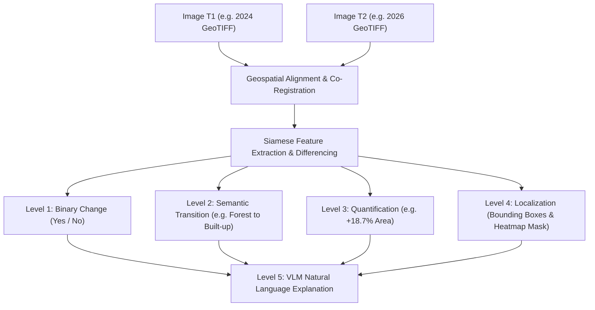

There are multiple levels:

* **Level 1:** Did anything change? $\rightarrow$ `Change = YES / NO`
* **Level 2:** What changed? $\rightarrow$ `Forest → Built-up`, `Water → Land`, `Agriculture → Building`
* **Level 3:** How much changed? $\rightarrow$ `Building area increased by 18%`
* **Level 4:** Where did it change? $\rightarrow$ Bounding boxes / segmentation mask
* **Level 5:** Explain the change $\rightarrow$ *“The increase in built-up area suggests urban expansion.”*

This last step is where our VLM/LLM layer becomes useful.

---

### 11. Existing CDVQA dataset proves this is a real research problem

There is already a benchmark called **CDVQA — Change Detection Visual Question Answering**.

Its public version is built from 2,968 image pairs of $512\times512$ pixels, with more than 122,000 QA pairs. The published split contains:
* **training:** 65,967 QA pairs / 1,600 image pairs
* **validation:** 16,441 QA pairs / 400 image pairs
* **test:** 968 image pairs across two test sets. ([ResearchGate](https://www.researchgate.net/publication/357013644_Change_Detection_Meets_Visual_Question_Answering?utm_source=chatgpt.com))

So we don't need to invent the entire research problem ourselves.

---

### 12. Third major requirement: Optical + SAR

This is where most normal teams will probably struggle.

**Optical imagery:**
Satellite optical imagery is somewhat intuitive. It captures information related to reflected electromagnetic radiation.
```
Visible / multispectral information ──► Color / spectral signatures ──► Land-cover / vegetation / urban features
```

---

### 13. SAR kya hai?

**SAR = Synthetic Aperture Radar**

SAR is fundamentally different. Instead of passive optical imaging:
```
SAR ──► Radar signal ──► Backscatter ──► Structural information
```

**One huge advantage:**
SAR can operate in conditions where optical imagery can be degraded, including cloud cover and at night.

That's why PS wants optical + SAR complementary analysis. The statement explicitly highlights this complementarity. ([SIH Fit](https://sih-fit.vercel.app/problem/SIH26167?utm_source=chatgpt.com))

---

### 14. Optical + SAR pair

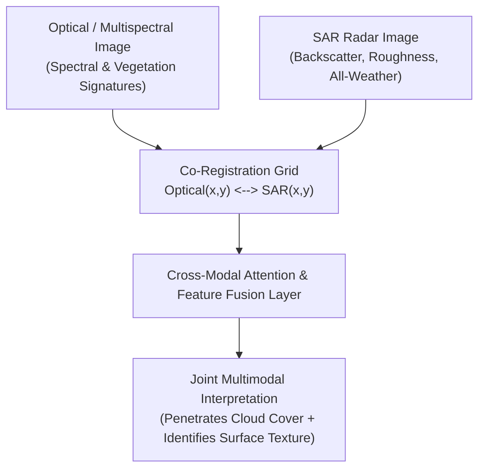

Suppose:
* **Optical says:** *“There is vegetation.”*
* **SAR might provide:** *“There is structural/surface information that complements the optical interpretation.”*

**Together:**
```
Optical + SAR ──► Multimodal fusion ──► Better interpretation
```

The PS specifically requires a co-registered optical/multispectral and SAR image pair for joint analysis. ([SIH Fit](https://sih-fit.vercel.app/problem/SIH26167?utm_source=chatgpt.com))

---

### 15. What does “co-registered” mean?

Bahut important term.

Suppose:
* Optical image: `[ same location ]`
* SAR image: `[ same location ]`

They need to align spatially.
So pixel/region correspondence should approximately mean:
$$\text{Optical}(x,y) \longleftrightarrow \text{SAR}(x,y)$$

Without proper registration, multimodal fusion becomes unreliable.

---

### 16. The fourth and most important requirement: Agentic architecture

This is what I think makes 26167 a potentially very strong SIH PS.

Imagine we have 5 models:
* Model 1 $\rightarrow$ VQA
* Model 2 $\rightarrow$ Grounding
* Model 3 $\rightarrow$ Change Detection
* Model 4 $\rightarrow$ Optical-SAR Fusion
* Model 5 $\rightarrow$ Captioning

User asks: *“What changed between these two images?”*
We shouldn't run all 5.

The system should understand:
$$\text{Question} \longrightarrow \text{Task identification} \longrightarrow \text{“Change analysis”} \longrightarrow \text{Select Change Model} \longrightarrow \text{Run it}$$

---

### 17. That's what “agentic” means here

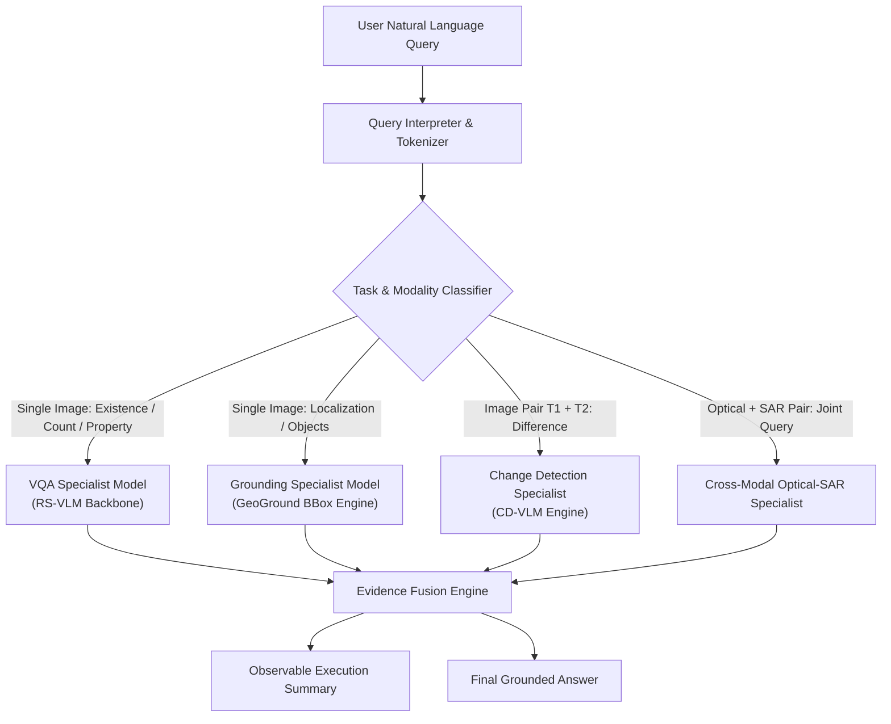

**Not:** “LLM talks like a chatbot.”
**Instead:** AI decides which tool/model should be used.

**Architecture:**
```
                     USER QUERY
                         │
                         ▼
                ┌──────────────────┐
                │Query Interpreter │
                └────────┬─────────┘
                         │
                         ▼
                ┌──────────────────┐
                │ Task Classifier  │
                └────────┬─────────┘
                         │
        ┌────────────────┼────────────────┐
        ▼                ▼                ▼
       VQA           Grounding          Change
        │                │                │
        ▼                ▼                ▼
    VQA Model     Grounding Model    Change Model
        │                │                │
        └────────────────┼────────────────┘
                         ▼
                  Evidence Fusion
                         ▼
                    Final Answer
```

This is the core innovation direction of the PS.
The official statement explicitly says the novelty lies in a query-driven agentic framework that selects appropriate remote-sensing specialist models instead of applying one generic VLM. ([SIH Fit](https://sih-fit.vercel.app/problem/SIH26167?utm_source=chatgpt.com))

---

### 18. Our system should behave like this

* User asks: *“Is there any new construction?”*
* System first asks internally: What kind of task?
* Answer: **Bi-temporal change understanding + Building detection**
* So it calls: **Change Detection Tool + Building Grounding Tool**
* Then:
  $$\text{Results} \longrightarrow \text{Validation} \longrightarrow \text{Evidence aggregation} \longrightarrow \text{Natural-language response}$$

---

### 19. We should NOT expose chain-of-thought

Important technical point.
The PS says: **only observable execution trace is evaluated.**
The internal reasoning text is not required and is not evaluated. ([SIH Fit](https://sih-fit.vercel.app/problem/SIH26167?utm_source=chatgpt.com))

Therefore our UI should show something like:
```
Execution Summary
✓ Input validated
✓ Detected task: Change Analysis
✓ Selected model: Change-VLM-v2
✓ Detected 3 regions of change
✓ Confidence: 0.91
✓ Generated evidence map
```
But don't expose hidden internal reasoning.

---

### 20. Now let's understand the datasets

This is the most important part for implementation.
The PS names four important data resources/benchmarks:
1. **BigEarthNet.txt**
2. **VRSBench**
3. **RSVQA**
4. **CDVQA**

And then there's a fifth evaluation source:
5. **ISRO/SAC private evaluation dataset**

Let's examine each.

---

### 21. Dataset #1 — BigEarthNet.txt

This is the primary adaptation dataset.
The PS explicitly says:
> BigEarthNet.txt will serve as the primary dataset for adapting image-text representations to multisensor remote-sensing data. ([SIH Fit](https://sih-fit.vercel.app/problem/SIH26167?utm_source=chatgpt.com))

This is NOT optional in the spirit of the requirements.
At least one VLM/visual component needs to be adapted using this or other open-source training data.

---

### 22. BigEarthNet.txt — size

Current dataset release:
* **464,044** co-registered Sentinel-1/Sentinel-2 image pairs
* with approximately **9.6 million** text annotations / triplets

The Hugging Face distribution currently exposes approximately:
* **9,553,962 rows**
* and its annotation table is about **467 MB**

The actual image data is much larger; one dataset summary estimates the full text + associated BigEarthNet imagery at roughly **145 GB**, so we should NOT assume the 467 MB file contains the images themselves. ([RSIAG TU Berlin](https://txt.bigearth.net/?utm_source=chatgpt.com))

---

### 23. BigEarthNet.txt contains what?

At a conceptual level:
```
Sentinel-1 SAR image + Sentinel-2 multispectral image + Text annotation + Geospatial metadata
```

It supports many kinds of textual supervision, including:
* captions
* visual question answering
* referring-expression instructions
* spatial relations
* land-use/land-cover information

The dataset website describes 15 tasks across multiple task categories, including presence, area, counting, adjacency, relative position, location, season and climate-zone information. ([RSIAG TU Berlin](https://txt.bigearth.net/?utm_source=chatgpt.com))

---

### 24. BigEarthNet data row ka concept

A row can conceptually look like:
`sample_id | patch_id | S1 name | S2 name | latitude | longitude | country | season | climate zone | input/question | output/answer | task type | category | split`

The current Hugging Face dataset exposes fields such as:
`s1_name`, `patch_id`, `input`, `output`, `type`, `category`, `split`, `latitude`, `longitude`, `country`, `season`, `climate zone`. ([Hugging Face](https://huggingface.co/datasets/BIFOLD-BigEarthNetv2-0/BigEarthNet.txt?utm_source=chatgpt.com))

---

### 25. Very important: why BigEarthNet.txt is useful

Because normal VLMs learn:
$$\text{image} \longleftrightarrow \text{words}$$

But our problem is:
$$\text{remote sensing image} \longleftrightarrow \text{remote sensing concepts}$$

For example:
$$\text{image} \longrightarrow \text{forest} \longrightarrow \text{adjacent to water} \longrightarrow \text{northern region} \longrightarrow \text{season} \longrightarrow \text{land-cover relation}$$

BigEarthNet.txt teaches the model this kind of language grounding.
The dataset authors report consistent performance improvements after fine-tuning VLMs with BigEarthNet.txt. ([RSIAG TU Berlin](https://txt.bigearth.net/?utm_source=chatgpt.com))

---

### 26. Do we train from scratch?

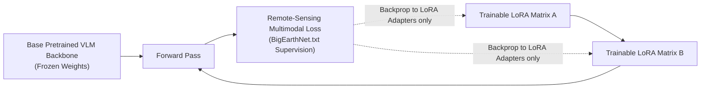

**❌ Absolutely not.**
We don't have to train “SatQuery VLM from zero.” That would be absurd for a hackathon.

**Instead:**
$$\text{Pretrained VLM} \longrightarrow \text{Remote-sensing adaptation} \longrightarrow \text{LoRA / PEFT} \longrightarrow \text{BigEarthNet.txt} \longrightarrow \text{SatQuery specialist VLM}$$

That's much more realistic.

---

### 27. Dataset #2 — VRSBench

**VRSBench** = Versatile Vision-Language Benchmark for Remote Sensing Image Understanding.

It contains:
* 29,614 remote sensing images
* 29,614 human-verified detailed captions
* 52,472 object references
* 123,221 VQA pairs ([GitHub](https://github.com/lx709/VRSBench?utm_source=chatgpt.com))

---

### 28. Why VRSBench?

It's perfect for **Single-image understanding**, especially:
* VQA
* captioning
* grounding

The benchmark covers:
* Object existence
* Object quantity
* Object position
* Object category
* Object color
* Scene type
* Object shape
* Object size
* Object direction
* Reasoning

The released benchmark reports performance for visual grounding and VQA across these categories. ([GitHub](https://github.com/lx709/VRSBench?utm_source=chatgpt.com))

---

### 29. How we use VRSBench

Not primarily as our big training dataset. I'd use it mainly for **Baseline evaluation + model selection**.

**Example:**
* Candidate VLM A $\rightarrow$ VRSBench test $\rightarrow$ Accuracy = X
* Candidate VLM B $\rightarrow$ VRSBench test $\rightarrow$ Accuracy = Y
* Then choose the best candidate.

We can also fine-tune where permitted, but the main value for us is a standardized remote-sensing VLM benchmark.

---

### 30. Dataset #3 — RSVQA

RSVQA is one of the foundational remote-sensing VQA datasets.
The official RSVQA project provides low- and high-resolution datasets. ([RSVQA](https://rsvqa.sylvainlobry.com/?utm_source=chatgpt.com))

---

### 31. RSVQA-LR

* 772 images
* $256 \times 256$ pixels
* 10 m spatial resolution
* 77,232 question-answer pairs

The questions are broadly about:
* object presence
* comparisons
* rural/urban classification
* object counting. ([MDPI](https://www.mdpi.com/2072-4292/16/9/1477?utm_source=chatgpt.com))

**Split:** $\sim 77.8\%$ train, $\sim 11.1\%$ validation, $\sim 11.1\%$ test according to published descriptions. ([MDPI](https://www.mdpi.com/2072-4292/17/3/466?utm_source=chatgpt.com))

---

### 32. RSVQA-HR

There is also a high-resolution version based on very-high-resolution aerial imagery.
The official project provides access to that dataset as well. ([RSVQA](https://rsvqa.sylvainlobry.com/?utm_source=chatgpt.com))

For our architecture, this gives us a useful range:
```
Low-resolution satellite-like imagery + High-resolution aerial imagery
```

---

### 33. Why RSVQA matters for us

It gives a very clean test:
**Can the model understand a remote-sensing image from a natural-language question?**
So this becomes our basic VQA sanity check.

---

### 34. Dataset #4 — CDVQA

This is the temporal component.
**CDVQA = Change Detection Visual Question Answering**

The public dataset has:
* 2,968 image pairs
* Each image: $512 \times 512$
* And: >122,000 QA pairs. ([ResearchGate](https://www.researchgate.net/publication/357013644_Change_Detection_Meets_Visual_Question_Answering?utm_source=chatgpt.com))

---

### 35. CDVQA split

From the published benchmark:
* **Training:** 1,600 image pairs / 65,967 QA pairs
* **Validation:** 400 image pairs / 16,441 QA pairs
* **Test:** 968 image pairs with two test sets totaling 39,686 QA and 31,036 QA with overlap between the two test sets. ([ResearchGate](https://www.researchgate.net/publication/363812759_Change_Detection_Meets_Visual_Question_Answering?utm_source=chatgpt.com))

---

### 36. What questions does CDVQA ask?

Examples:
* *Did the area change?*
* *What type of land-cover changed?*
* *How much did the building area increase?*
* *Which class experienced the largest change?*

This is much more useful for SatQuery than simple image classification.

---

### 37. Dataset #5 — ISRO/SAC evaluation dataset

This one is special.
The PS says final evaluation will additionally use an **ISRO/SAC evaluation dataset**.

The dataset is described as containing:
**Pre-georeferenced and co-registered Cartosat-2S optical + RISAT SAR image pairs** with task-specific:
* reference answers
* labels
* bounding boxes
* masks (as applicable)

And:
> Evaluation annotations will not be disclosed to participating teams. ([SIH Fit](https://sih-fit.vercel.app/problem/SIH26167?utm_source=chatgpt.com))

---

### 38. This changes how we build the system

We cannot overfit to public datasets.
We need:
$$\text{Public datasets} \longrightarrow \text{General remote-sensing capability} \longrightarrow \text{Domain adaptation} \longrightarrow \text{Robust pipeline} \longrightarrow \text{Hidden ISRO evaluation}$$

This is actually good. It discourages gaming the benchmark.

---

### 39. Cartosat-2S + RISAT combination

Our system should therefore be ready for:
* **Optical:** Cartosat-2S
* **SAR:** RISAT

So we should not build something that only accepts RGB images.

---

### 40. Input format requirements

PS defines the supported format as:
* **Geospatial:** GeoTIFF, TIFF
* **Auxiliary:** PNG / JPEG may be accepted only for prescribed public benchmark datasets. ([SIH Fit](https://sih-fit.vercel.app/problem/SIH26167?utm_source=chatgpt.com))

That means our architecture should be built around real geospatial imagery rather than only normal photographs.

---

### 41. Our input pipeline

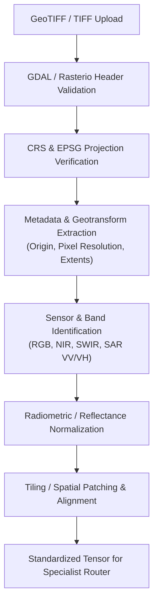

I'd build:
```
Upload ──► Format validation ──► Metadata extraction ──► Sensor identification ──► CRS / projection check ──► Resolution normalization ──► Band handling ──► Geospatial alignment ──► Task routing
```

---

### 42. Why GeoTIFF matters

A normal JPEG mostly gives: `pixels`
GeoTIFF can additionally contain: `pixels + coordinate reference system + geotransform + geographic location + possibly multiple bands`

Therefore our system can eventually answer:
*“Where is the detected change?”* rather than only *“There is a change.”*

---

### 43. What our complete architecture should look like

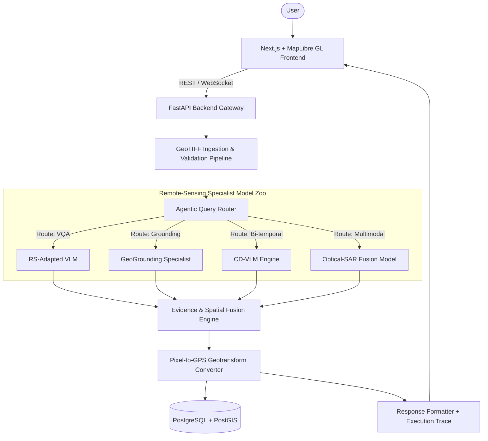

Here is the architecture I would actually recommend:

```
                            USER
                             │
                             ▼
                    ┌───────────────────┐
                    │  Web Application  │
                    │  React / Next.js  │
                    └─────────┬─────────┘
                              │
                              ▼
                    ┌───────────────────┐
                    │  Input Validator  │
                    │   GeoTIFF/TIFF    │
                    │  CRS / metadata   │
                    └─────────┬─────────┘
                              │
                              ▼
                    ┌───────────────────┐
                    │ Query Interpreter │
                    │     VLM / LLM     │
                    └─────────┬─────────┘
                              │
                              ▼
                    ┌───────────────────┐
                    │  Agentic Router   │
                    └─────────┬─────────┘
                              │
         ┌────────────────────┼────────────────────┐
         │                    │                    │
         ▼                    ▼                    ▼
   ┌──────────┐         ┌──────────┐        ┌────────────┐
   │ VQA Tool │         │Grounding │        │   Change   │
   │          │         │   Tool   │        │ Detection  │
   └────┬─────┘         └────┬─────┘        └─────┬──────┘
        │                    │                    │
        └────────────────────┼────────────────────┘
                             │
                             ▼
                    ┌───────────────────┐
                    │ Optical-SAR Tool  │
                    └─────────┬─────────┘
                              │
                              ▼
                    ┌───────────────────┐
                    │  Evidence Fusion  │
                    └─────────┬─────────┘
                              │
                              ▼
                    ┌───────────────────┐
                    │ Answer Generator  │
                    └─────────┬─────────┘
                              │
         ┌────────────────────┼────────────────────┐
         ▼                    ▼                    ▼
    Text Answer          Highlighted           Confidence
                           Regions
         │                    │                    │
         └────────────────────┼────────────────────┘
                              ▼
                    ┌───────────────────┐
                    │  Download Report  │
                    └───────────────────┘
```

---

### 44. Agentic Router — exactly how we should build it

This is one of the most important engineering pieces.

* **Suppose user asks:** “How many buildings are in this image?”
  * Router classifies: `{ "task": "vqa", "modality": "single_image", "needs_grounding": false }`
  * Call: **VQA model**

* **Another question:** “Highlight all stadiums.”
  * Router: `{ "task": "grounding", "modality": "single_image", "needs_boxes": true }`
  * Call: **Grounding model**

* **Another question:** “What changed between these images?”
  * Router: `{ "task": "change_analysis", "modality": "bi_temporal", "needs_change_map": true }`
  * Call: **Change model**

* **Another:** “Use both images to identify information not obvious from the optical image alone.”
  * Router: `{ "task": "cross_modal_analysis", "modalities": ["optical", "sar"] }`
  * Call: **Optical-SAR model**

---

### 45. Router must validate input before calling model

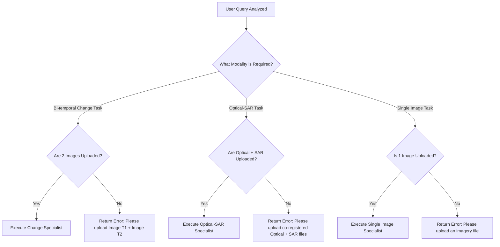

This is important.
Suppose the user uploads one image but asks: *“What changed between these two images?”*
We should **NOT** call the change detector.

**System says:**
> *Change analysis requires a bi-temporal pair. Please upload: Image T1 + Image T2*

This prevents nonsense errors.

---

### 46. We need a tool registry

I would create something like:
```json
{
  "tools": [
    {
      "name": "rs_vqa",
      "input": ["single_image", "question"],
      "output": ["text"]
    },
    {
      "name": "grounding",
      "input": ["single_image", "text"],
      "output": ["boxes", "confidence"]
    },
    {
      "name": "change_vqa",
      "input": ["image_t1", "image_t2", "question"],
      "output": ["text", "change_regions"]
    },
    {
      "name": "optical_sar_analysis",
      "input": ["optical", "sar", "question"],
      "output": ["text", "evidence"]
    }
  ]
}
```
Then the agent chooses tools dynamically.

---

### 47. Model choices

I would not start by training a giant model.
**Instead:** Base VLM

**Potential candidates:**
* Qwen-VL family
* InternVL family
* LLaVA/Open vision models
* Remote-sensing VLMs such as GeoChat-like architectures

Existing research shows that general and remote-sensing-specific models have very different performance on remote-sensing benchmarks, which is exactly why this PS insists on remote-sensing adaptation. ([GitHub](https://github.com/lx709/VRSBench?utm_source=chatgpt.com))

---

### 48. BigEarthNet adaptation strategy

I'd use **LoRA / PEFT**.

**Conceptually:**
$$\text{Pretrained VLM} \longrightarrow \text{Freeze most weights} \longrightarrow \text{Insert LoRA adapters} \longrightarrow \text{Train on BigEarthNet.txt} \longrightarrow \text{Remote-sensing adapted VLM}$$

**Advantages:**
* much lower GPU memory
* faster training
* fewer trainable parameters
* easier experimentation

---

### 49. We don't need all 9.6M annotations

This is critical.
**Do NOT train on the entire dataset first.**

Start with:
$$\text{100K samples} \longrightarrow \text{Baseline} \longrightarrow \text{500K} \longrightarrow \text{1M} \longrightarrow \text{Compare}$$

You want to know: *How much performance gain are we getting per additional training sample?*
This is much more practical.

---

### 50. Recommended BigEarthNet subset

I'd create task-balanced subsets:
* **VQA:** ~50–100k
* **Captioning:** ~50k
* **Spatial reasoning:** ~50k
* **Grounding:** ~50k
* **Optical-SAR:** ~100k+

Then train. You can increase later.

---

### 51. Dataset preprocessing

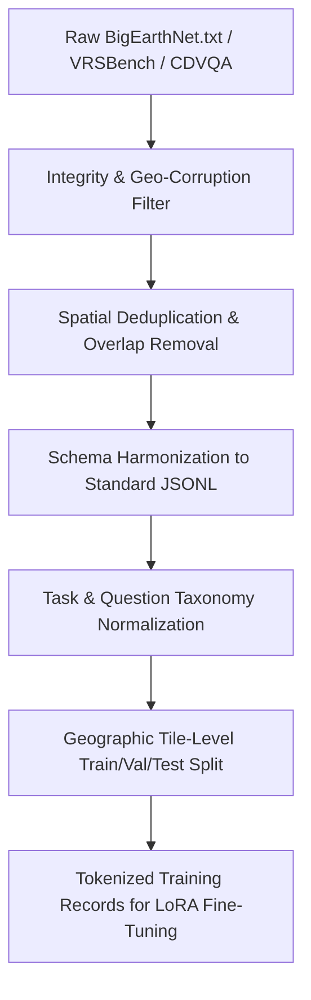

We need:
```
Raw dataset ──► Integrity check ──► Duplicate detection ──► Broken sample removal ──► Task normalization ──► Question normalization ──► Answer normalization ──► Sensor metadata normalization ──► Training format
```

---

### 52. Example training record

I would convert raw data into a unified JSONL format:

```json
{
  "image": {
    "optical": "S2A_....tif",
    "sar": "S1B_....tif"
  },
  "task": "vqa",
  "question": "Is there arable land next to pasture?",
  "answer": "yes",
  "latitude": 52.1,
  "longitude": 13.4,
  "country": "Germany",
  "season": "summer"
}
```

For grounding:
```json
{
  "task": "grounding",
  "query": "Find buildings",
  "boxes": [
    [120, 50, 220, 170]
  ]
}
```

---

### 53. What about the images themselves?

This needs attention.
The BigEarthNet.txt annotation artifact is relatively small (~467 MB), but the corresponding image archives are much larger. The current dataset summary estimates roughly **145 GB** when associated imagery is included. ([Hugging Face](https://huggingface.co/datasets/BIFOLD-BigEarthNetv2-0/BigEarthNet.txt/blob/39a6d9b924c0692e5ed52df06eac3518d1e64d83/BigEarthNet.txt.parquet?utm_source=chatgpt.com))

**So:**
* ❌ Don't download everything to your laptop blindly.
* **Use:** streaming, selective subsets, Hugging Face datasets, cached shards, cloud storage if needed.

---

### 54. Hardware requirement

You don't need a massive $8\times\text{H100}$ cluster for the first prototype.

**For experimentation:**
* **Minimum practical:** $1 \times \text{16–24 GB GPU}$
* **With:** LoRA, mixed precision, gradient accumulation, smaller VLM $\rightarrow$ You can prototype.
* For serious large-scale fine-tuning: multiple GPUs will obviously help.

---

### 55. We can also avoid training our own VQA model at first

Start with:
$$\text{Pretrained remote-sensing VLM} \longrightarrow \text{Prompt engineering} \longrightarrow \text{Baseline}$$

Then:
$$\text{BigEarthNet adaptation} \longrightarrow \text{Improved VLM} \longrightarrow \text{Compare}$$

This gives you an ablation:
* **Baseline:** Generic VLM
* **Model 2:** Remote-sensing pretrained VLM
* **Model 3:** BigEarthNet-adapted VLM
* **Model 4:** Our agentic system

That will look much stronger scientifically.

---

### 56. Evaluation framework

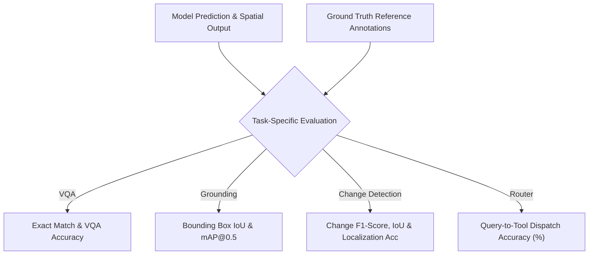

Our system must not just “look good.” We need metrics.

* **VQA:** Measure Accuracy:
  $$\text{Accuracy} = \frac{\text{Correct answers}}{\text{Total questions}}$$
* **Grounding:** Use **IoU (Intersection over Union)**:
  $$\text{IoU} = \frac{\text{Area}(\text{Detected} \cap \text{GroundTruth})}{\text{Area}(\text{Detected} \cup \text{GroundTruth})}$$
* **Change Detection:** Use change classification accuracy, F1, IoU, change localization accuracy.
* **Captioning:** Potentially CIDEr, BLEU, ROUGE, human/LLM-based semantic evaluation. But prioritize task-aligned metrics.
* **Agentic router:** Measure routing accuracy:
  $$\text{Router Accuracy} = \frac{\text{Correct task routing}}{\text{Total queries}} \quad (\text{e.g., } 94.2\%)$$

---

### 57. Cross-modal performance

We can create paired tests:
$$\text{Optical only} \quad \text{vs} \quad \text{SAR only} \quad \text{vs} \quad \text{Optical} + \text{SAR}$$

Then demonstrate:
* Optical VQA accuracy = 71%
* SAR VQA accuracy = 65%
* Fusion accuracy = 81%

Even if numbers differ, that experiment design is excellent.

---

### 58. Evidence-grounded responses

This should be one of our major innovations.
Instead of returning: *“There are buildings.”*
We return:
```
Answer: Yes, 14 buildings were detected.
Evidence: [highlighted regions]
Confidence: 0.91
Model: Remote-Sensing Grounding Model
Coordinates: ...
```
This makes the system much more trustworthy.

---

### 59. Spatial grounding

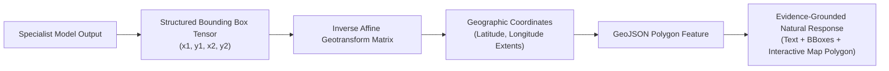

Suppose the user asks: *“Where are the buildings?”*
Our response should contain: **Bounding boxes + pixel coordinates + geographic coordinates**

$$\text{Pixel box: } (x_1, y_1, x_2, y_2) \longrightarrow \text{GeoTransform} \longrightarrow \text{Latitude / Longitude}$$

That makes our system far more valuable to GIS users.

---

### 60. Multi-image reasoning

Suppose: $T_1 = 2020, T_2 = 2024$
User: *“How much did urban development increase?”*

**Pipeline:**
$$\text{T1} \longrightarrow \text{Feature extraction} \longrightarrow \text{T2} \longrightarrow \text{Feature extraction} \longrightarrow \text{Temporal fusion} \longrightarrow \text{Change map} \longrightarrow \text{Area computation} \longrightarrow \text{VLM explanation}$$

**Final:** *“Built-up area increased by approximately 18.7%, primarily in the north-eastern portion.”*

---

### 61. Optical-SAR workflow

Suppose input: `Optical.tif`, `SAR.tif`

**Pipeline:**
$$\text{Optical preprocessing} + \text{SAR preprocessing} \longrightarrow \text{Coregistration check} \longrightarrow \text{Spatial normalization} \longrightarrow \text{Feature extraction} \longrightarrow \text{Cross-modal fusion} \longrightarrow \text{Task-specific model} \longrightarrow \text{Answer}$$

---

### 62. Why we need a specialist model for SAR

Normal VLMs are mostly trained on RGB photographs. SAR is not normal RGB.
Therefore:
$$\text{SAR image} \longrightarrow \text{SAR-specific encoder} \longrightarrow \text{Feature representation} \longrightarrow \text{Fusion}$$
rather than:
$$\text{SAR} \longrightarrow \text{JPEG} \longrightarrow \text{Generic VLM}$$
That shortcut would probably be scientifically weak.

---

### 63. Query types we should support

I'd divide them into:
* **Category A — Observation:** *“What is in this image?”*
* **Category B — Counting:** *“How many buildings?”*
* **Category C — Spatial:** *“Where are the roads?”*
* **Category D — Comparison:** *“Are there more buildings or roads?”*
* **Category E — Temporal:** *“What changed?”*
* **Category F — Quantitative:** *“How much forest was lost?”*
* **Category G — Cross-modal:** *“What additional information does SAR provide?”*
* **Category H — Grounding:** *“Highlight all industrial regions.”*

This makes our system feel like a general interface, rather than a demo with three canned prompts.

---

### 64. Suggested UI

* **Left side:** Upload: Image T1, Image T2, Optical, SAR
* **Center:** Large GIS / image viewer.
* **Right side:** Chat interface:
  ```
  ┌────────────────────────────┐
  │  Ask about this imagery    │
  │                            │
  │  "What changed?"           │
  └────────────────────────────┘
  ```
* **Response:**
  ```
  Change detected: 3 major regions
  Confidence: 92%
  [View evidence] [Show change map] [Export report]
  ```

---

### 65. The demo sequence I would use at SIH

This is extremely important. **Do NOT spend the demo explaining your architecture first.**

1. **Demo 1 — Simple VQA:**
   * Upload image.
   * Ask: *“How many buildings are there?”*
   * Answer + boxes.
2. **Demo 2 — Temporal:**
   * Upload: 2022 & 2025.
   * Ask: *“What changed?”*
   * System shows: Before, After, Change map.
3. **Demo 3 — Optical + SAR:**
   * Upload both.
   * Ask: *“What additional information can SAR reveal here?”*
   * System gives: Optical evidence + SAR evidence + combined interpretation.
4. **Demo 4 — Agentic routing:**
   * Show execution trace:
     $$\text{Question} \longrightarrow \text{Task identified: Change VQA} \longrightarrow \text{Selected: Change Specialist} \longrightarrow \text{Evidence validated} \longrightarrow \text{Answer generated}$$
   * This directly demonstrates the PS's agentic requirement.

---

### 66. What NOT to do

* ❌ **Don't make a generic ChatGPT wrapper:** `Image → GPT → answer`. That will not satisfy the PS properly. The official requirement specifically says generic LLM/VLM without remote-sensing adaptation isn't enough. ([SIH Fit](https://sih-fit.vercel.app/problem/SIH26167?utm_source=chatgpt.com))
* ❌ **Don't train a massive model from scratch:** Waste of time.
* ❌ **Don't download 145 GB immediately:** Start with subsets/streaming.
* ❌ **Don't make only a beautiful UI:** The PS is technically heavy.
* ❌ **Don't support only RGB JPEGs:** You'll fail the actual remote-sensing scope.
* ❌ **Don't ignore SAR:** Optical-SAR analysis is mandatory. ([SIH Fit](https://sih-fit.vercel.app/problem/SIH26167?utm_source=chatgpt.com))
* ❌ **Don't ignore temporal analysis:** Bi-temporal change understanding is mandatory. ([SIH Fit](https://sih-fit.vercel.app/problem/SIH26167?utm_source=chatgpt.com))

---

### 67. Our project modules

I'd divide the implementation into these modules:
* **MODULE 1:** GeoTIFF/TIFF Ingestion
* **MODULE 2:** Remote-Sensing Preprocessing
* **MODULE 3:** Remote-Sensing VLM
* **MODULE 4:** VQA
* **MODULE 5:** Grounding
* **MODULE 6:** Change Detection
* **MODULE 7:** Optical-SAR Fusion
* **MODULE 8:** Agentic Router
* **MODULE 9:** Evidence Fusion
* **MODULE 10:** GIS Visualization
* **MODULE 11:** Evaluation / Benchmarking
* **MODULE 12:** Report Generation

---

### 68. Suggested technology stack

* **Frontend:** Next.js, React, TypeScript, Tailwind, MapLibre / Cesium / OpenLayers (For the imagery viewer: OpenLayers + GeoTIFF support or specialized raster viewer).
* **Backend:** Python, FastAPI
* **ML:** PyTorch, Hugging Face Transformers, PEFT, LoRA, OpenCV, Rasterio, GDAL, GeoPandas, Shapely
* **Agent:** Initially: Custom Python router (rather than overcomplicating with an agent framework). Later: LangGraph if we need richer orchestration.
* **Database:** PostgreSQL + PostGIS (This is much better than MongoDB for geospatial workflows).

---

### 69. Data architecture

```
               POSTGRES + POSTGIS
                       │
       ┌───────────────┼───────────────┐
       │               │               │
     Images        Metadata         Results
       │               │               │
       ▼               ▼               ▼
  Object Store   Geo metadata     AI outputs
```

Images themselves should not be dumped directly into PostgreSQL. Use S3-compatible storage or cloud/object storage.

---

### 70. Model architecture I would target

```
                        Query
                          │
                          ▼
                    Query Encoder
                          │
                          ▼
                    Agentic Router
                          │
         ┌────────────────┼────────────────┐
         ▼                ▼                ▼
        VQA           Grounding          Change
         │                │                │
         ▼                ▼                ▼
       VLM-S          GeoGround          CD-VLM
         │                │                │
         └────────────────┼────────────────┘
                          ▼
                 SAR / Optical Fusion
                          ▼
                    Evidence Fusion
                          ▼
                   Answer Generator
```

---

### 71. The “AI brain” doesn't need to be one giant model

This is actually important. We can use:
$$\text{Small router} + \text{specialized models} + \text{LLM for final language}$$
instead of:
$$\text{Huge model does everything}$$
This is much more controllable.

---

### 72. Model routing example

* **User:** *“Find all water bodies.”* $\rightarrow$ **Router:** `{ "task": "grounding", "tool": "rs_grounding" }`
* **User:** *“Did new buildings appear?”* $\rightarrow$ **Router:** `{ "task": "change_detection", "tool": "cd_vqa" }`
* **User:** *“Compare optical and SAR interpretation.”* $\rightarrow$ **Router:** `{ "task": "cross_modal", "tool": "optical_sar_fusion" }`

---

### 73. How BigEarthNet, VRSBench, RSVQA and CDVQA fit together

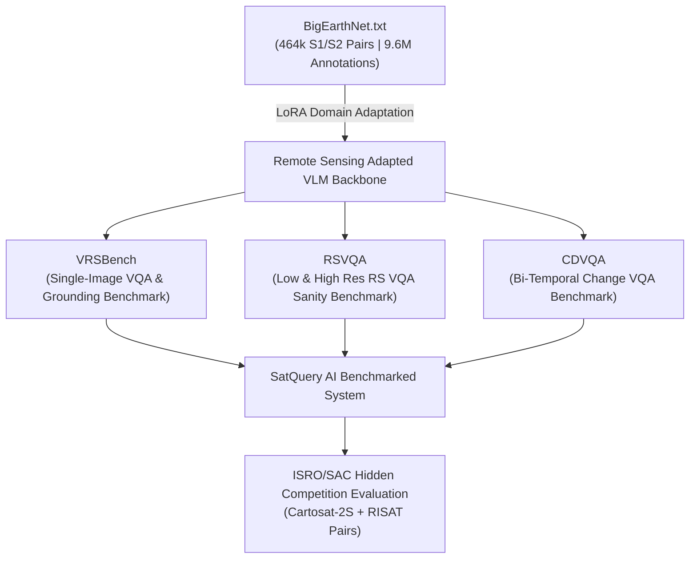

This is perhaps the single most important diagram for the entire project:

```
                    ┌─────────────────┐
                    │ BigEarthNet.txt │
                    │ 9.6M annotations│
                    └────────┬────────┘
                             │
                             ▼ DOMAIN ADAPTATION
                             │
                    ┌─────────────────┐
                    │Remote-SensingVLM│
                    └────────┬────────┘
                             │
         ┌───────────────────┼───────────────────┐
         │                   │                   │
         ▼                   ▼                   ▼
      VRSBench             RSVQA               CDVQA
     Single/VQA          Single VQA          Change VQA
         │                   │                   │
         └───────────────────┼───────────────────┘
                             │
                             ▼ BENCHMARK TESTING
                             │
                    ┌─────────────────┐
                    │Agentic SatQuery │
                    └────────┬────────┘
                             │
                             ▼
                    ┌─────────────────┐
                    │Hidden ISRO Eval │
                    └─────────────────┘
```

---

### 74. Dataset roles in one table

| Dataset | Main purpose | Scale | What we use it for |
| :--- | :--- | :--- | :--- |
| **BigEarthNet.txt** | Multisensor image-text adaptation | 464,044 S1/S2 pairs, ~9.6M annotations | Fine-tuning/domain adaptation |
| **VRSBench** | General RS vision-language understanding | 29,614 images, 123,221 VQA | VQA + grounding benchmark |
| **RSVQA** | Remote-sensing VQA | 772 LR images / 77,232 QA + HR version | Baseline VQA |
| **CDVQA** | Temporal change VQA | 2,968 pairs / >122k QA | Change understanding |
| **ISRO/SAC** | Hidden real-world evaluation | Not public | Final robustness test |

Sources: BigEarthNet.txt official project/Hugging Face dataset card, VRSBench repository/paper, RSVQA project, and CDVQA publication. ([RSIAG TU Berlin](https://txt.bigearth.net/?utm_source=chatgpt.com))

---

### 75. How much data do we actually need?

Although the public resources are huge, our prototype doesn't need to train on everything.
I'd initially use:
* **BigEarthNet.txt:** 200k–500k training records
* **VRSBench:** Use full evaluation or a proper prescribed subset for validation.
* **RSVQA:** Full benchmark is manageable.
* **CDVQA:** Use full train/validation split if compute permits.
* **ISRO/SAC:** We can't access it, so architecture must generalize.

---

### 76. Example training curriculum

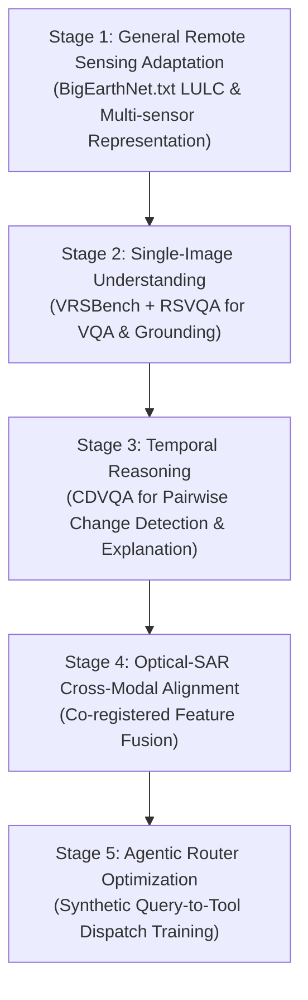

I would train in stages:
* **Stage 1 — General remote sensing adaptation (BigEarthNet.txt):** Train image-text alignment, LULC terminology, spatial concepts, multimodal language.
* **Stage 2 — Single-image understanding (VRSBench + RSVQA):** Train/evaluate VQA, grounding, captioning.
* **Stage 3 — Temporal reasoning (CDVQA):** Train pairwise reasoning, change detection, change explanation.
* **Stage 4 — Optical-SAR (BigEarthNet.txt + available optical-SAR data):** Train/align cross-modal features.
* **Stage 5 — Agentic controller:** Train/define routing using task labels: `query → task → tool`.

---

### 77. How to create our own router dataset

We don't necessarily need a huge ML classifier. We can create a simple dataset:
```json
{ "query": "How many buildings are visible?", "task": "VQA", "input_type": "single" }
{ "query": "What changed between these images?", "task": "CHANGE", "input_type": "bi_temporal" }
{ "query": "Highlight all residential buildings.", "task": "GROUNDING", "input_type": "single" }
```
Maybe 5k–20k synthetic examples are sufficient for the initial router.

---

### 78. Why synthetic router data is okay

Because we're not claiming it is the actual satellite understanding model. The router is just: *what tool should run?*
We can generate many natural-language paraphrases:
* *"What changed?"*
* *"What is different?"*
* *"Compare these."*
* *"Show new structures."*
* *"Identify changes."*
$\longrightarrow$ All map to `CHANGE`.

---

### 79. Security and reliability

For ISRO-style systems I'd add:
* **Input validation:** Don't let malformed GeoTIFF crash pipeline.
* **Model fallback:** If specialist fails, fallback to secondary model.
* **Confidence thresholds:** If confidence too low: *"I am not sufficiently confident."*
* **Evidence requirement:** No answer without supporting model output.

---

### 80. This is how we avoid hallucination

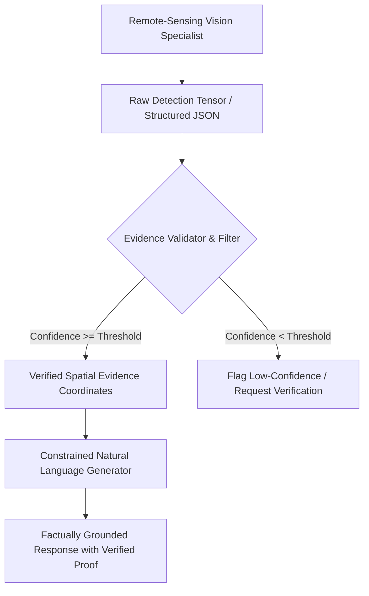

This should be one of our key product differentiators.
Instead of `VLM → answer`, we use:
$$\text{VLM} \longrightarrow \text{Structured result} \longrightarrow \text{Evidence validator} \longrightarrow \text{Answer generator}$$

**For example:**
```json
{
  "detected_objects": 14,
  "confidence": 0.93,
  "regions": [ [x1, y1, x2, y2] ]
}
```
Then the LLM converts this into: *“14 buildings were detected.”* The LLM isn't inventing the count.

---

### 81. Explainability

We should show: **Why this answer?**
* Detected objects: `14 buildings`
* Relevant regions: `5, 9, 12, 14...`
* Model confidence: `93%`

For change:
* Changed region: `North-East quadrant`
* Detected class: `Built-up`
* Change confidence: `89%`

---

### 82. BigEarthNet image-text annotations themselves are not all human-written

This is another subtle point.
The BigEarthNet.txt project describes several annotation-generation methods:
* manual
* template-based
* web-scraped
* LLM-based
* manual quality checking

So we should understand the dataset as structured multimodal supervision, not assume that every text annotation is an individually handwritten human caption. ([RSIAG TU Berlin](https://txt.bigearth.net/?utm_source=chatgpt.com)) This matters when we design validation.

---

### 83. Data leakage concern

This is extremely important.
Because the datasets are geographically structured, random image-level splitting can cause leakage:
* same region
* same satellite tile
* nearby patch
can appear in train and test.

**Better:** geographic split or use official benchmark splits.
RSVQA itself uses tile-level splitting to reduce spatial correlation between train/validation/test. ([ResearchGate](https://www.researchgate.net/publication/341228819_RSVQA_Visual_Question_Answering_for_Remote_Sensing_Data?utm_source=chatgpt.com))

---

### 84. Our internal evaluation should follow this principle

Never randomly split identical/adjacent regions.
**Instead:**
* Region A $\rightarrow$ train
* Region B $\rightarrow$ validation
* Region C $\rightarrow$ test

This gives a more realistic estimate of generalization.

---

### 85. The main research problem

At a high level, PS26167 is solving:
**How do we convert heterogeneous satellite imagery into a natural-language, evidence-grounded interactive reasoning system?**

It's not just: *“Can AI recognize objects?”*
It is: *Can AI understand a question, choose the correct remote-sensing analysis, reason over the right imagery, and explain the answer with evidence?*
That is much more interesting.

---

### 86. Our unique innovation should be this

I would define our project innovation around three layers:
* **Innovation 1 — Agentic model routing:** Question $\rightarrow$ Task identification $\rightarrow$ Specialist model selection.
* **Innovation 2 — Evidence-grounded answers:** AI answer + boxes + masks + coordinates + confidence.
* **Innovation 3 — Cross-modal reasoning:** Optical + SAR + Temporal imagery $\rightarrow$ Unified answer.

These three together produce something more substantial than another VLM wrapper.

---

### 87. Example full interaction

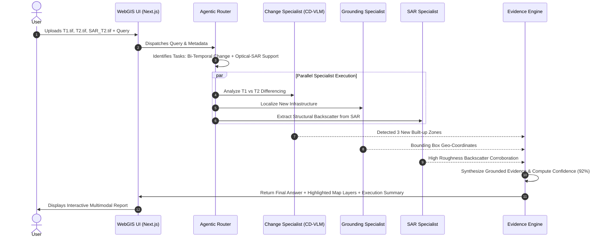

* **User uploads:** `Optical_T1.tif`, `Optical_T2.tif`, `SAR_T2.tif`
* **User asks:** *“What urban changes occurred between T1 and T2, and does the SAR image support the interpretation?”*
* **Step 1:** System checks: `✓ T1 image`, `✓ T2 image`, `✓ SAR available`.
* **Step 2:** Router: Primary task: `bi-temporal change analysis`, Secondary: `cross-modal optical-SAR analysis`.
* **Step 3:** Run: `Change model + Grounding model + SAR specialist`.
* **Step 4:** Results: Change: `new built-up regions`, Grounding: `3 regions`, SAR: `structural backscatter consistent with newly developed built-up areas`.
* **Step 5:** Evidence fusion.
* **Step 6:** Final answer:
  > *“Three new built-up regions were detected between T1 and T2. The largest expansion is located in the eastern sector. The SAR image provides complementary structural evidence consistent with the detected built-up regions.”*
  > *(And image viewer highlights them).*

That is SatQuery AI.

---

### 88. What “winning” implementation would look like

Our goal should not be: *“We fulfilled all four requirements.”*
Goal should be: **“We built a mini remote-sensing analyst.”**
Meaning the judge can interact naturally.

---

### 89. Final system concept

```
                         SATQUERY AI
                              │
         ┌────────────────────┼────────────────────┐
         │                    │                    │
    Single Image          Two Images          Optical+SAR
         │                    │                    │
         ▼                    ▼                    ▼
        VQA               Change VQA          Cross-modal
         │                    │                    │
         └────────────────────┼────────────────────┘
                              ▼
                        Agentic Router
                              ▼
                      Specialist Models
                              ▼
                       Evidence Engine
                              ▼
                   Natural Language Answer
                              │
         ┌────────────────────┼────────────────────┐
         ▼                    ▼                    ▼
        Text                 Map                Evidence
```

---

### 90. The most important dataset takeaway

* **BigEarthNet.txt:** Think of it as **“Remote-sensing language school.”** It teaches the model how satellite imagery relates to land cover, spatial relations, presence, counts, location, season, environment, multisensor imagery (464,044 S1/S2 pairs + ~9.6M annotations). ([RSIAG TU Berlin](https://txt.bigearth.net/?utm_source=chatgpt.com))
* **VRSBench:** Think: **“General remote-sensing VLM exam.”** (29,614 images + 123,221 VQA pairs + grounding/captioning annotations). ([GitHub](https://github.com/lx709/VRSBench?utm_source=chatgpt.com))
* **RSVQA:** Think: **“Classic remote-sensing question-answer test.”** (772 LR images + 77,232 QA pairs, plus HR data). ([MDPI](https://www.mdpi.com/2072-4292/16/9/1477?utm_source=chatgpt.com))
* **CDVQA:** Think: **“What changed?” exam.** (2,968 bi-temporal pairs + >122,000 QA pairs). ([ResearchGate](https://www.researchgate.net/publication/357013644_Change_Detection_Meets_Visual_Question_Answering?utm_source=chatgpt.com))
* **ISRO/SAC:** Think: **“Final real-world boss fight.”** (Cartosat-2S + RISAT co-registered pairs, hidden reference annotations). ([SIH Fit](https://sih-fit.vercel.app/problem/SIH26167?utm_source=chatgpt.com))

---

### 91. Recommended project roadmap


* **Phase 1 — Data engineering:** BigEarthNet, VRSBench, RSVQA, CDVQA $\rightarrow$ Unified schema
* **Phase 2 — Baselines:** Build VQA baseline, Grounding baseline, Change baseline, SAR baseline
* **Phase 3 — Remote-sensing adaptation:** Pretrained VLM $\rightarrow$ BigEarthNet.txt $\rightarrow$ LoRA $\rightarrow$ RS-VLM
* **Phase 4 — Agent:** Query $\rightarrow$ Task classifier $\rightarrow$ Specialist model
* **Phase 5 — Evidence:** Answer + box + mask + coordinates + confidence
* **Phase 6 — Multimodal fusion:** Optical + SAR
* **Phase 7 — WebGIS:** React + MapLibre/OpenLayers/Cesium
* **Phase 8 — Benchmarking:** Run VRSBench, RSVQA, CDVQA and maintain a result table.

---

### 92. What I would put in the README

#### Project Statement:
> SatQuery AI is an agentic vision-language system that allows users to interact with heterogeneous remote-sensing imagery through natural-language queries. Instead of relying on a single generic VLM, SatQuery dynamically selects specialised remote-sensing models for VQA, grounding, temporal change understanding, and optical-SAR analysis, then combines their outputs into evidence-grounded spatial answers.

---

### 93. Final understanding — one paragraph

Agar mujhe tumhe ek paragraph mein samjhana ho:

> PS26167 mein ISRO chahta hai ki hum satellite imagery ke liye ek intelligent AI assistant banayein. User ko GIS ya remote-sensing expert hone ki zarurat na ho; wo normal language mein query kare, jaise “is image mein kitne buildings hain?”, “in dono images mein kya change hua?”, ya “optical aur SAR images se kya additional information milti hai?”. System ko khud samajhna hai ki question kis type ka hai, uske liye appropriate specialist AI model choose karna hai, image(s) analyse karni hain, result ko spatial evidence ke saath validate karna hai, aur final answer dena hai. ISRO specifically chahta hai ki system remote-sensing data par adapted ho, single-image VQA + grounding/captioning kare, bi-temporal change analysis kare, optical-SAR pair analysis kare, aur agentic model selection use kare. BigEarthNet.txt domain adaptation ke liye primary dataset hai, VRSBench aur RSVQA single-image capabilities ke evaluation/training ke liye aur CDVQA temporal change understanding ke liye useful hain; final hidden evaluation Cartosat-2S optical aur RISAT SAR pairs par ISRO/SAC karega. ([SIH Fit](https://sih-fit.vercel.app/problem/SIH26167?utm_source=chatgpt.com))

---

### 94. The single most important thing for our implementation

**Do not build:**
$$\text{Satellite Image} \longrightarrow \text{LLM} \longrightarrow \text{Answer}$$

**Build:**
```
USER QUERY
    │
    ▼
QUERY UNDERSTANDING
    │
    ▼
AGENTIC ROUTER
    │
    ┌──────────────┼──────────────┐
    ▼              ▼              ▼
   VQA         GROUNDING        CHANGE
    │              │              │
    └──────────────┼──────────────┘
                   ▼
       OPTICAL + SAR FUSION LAYER
                   ▼
            EVIDENCE ENGINE
                   ▼
        SPATIAL INTERPRETATION
                   ▼
FINAL ANSWER + MAP EVIDENCE + CONFIDENCE
```

That architecture is the project. The UI, chatbot, map, etc. are just the presentation layer.

And the most important technical insight from the current research is that remote-sensing VLM performance is still materially below the point where “just use a generic multimodal model” is enough, which is exactly why the PS requires adaptation and specialist model orchestration. Existing VRSBench results show substantial differences among general-purpose and remote-sensing models, and BigEarthNet.txt's authors report gains from fine-tuning on their multisensor image-text data. ([GitHub](https://github.com/lx709/VRSBench?utm_source=chatgpt.com))

#### One practical warning:
The ISRO/SAC evaluation dataset is not available to us, and its annotations are explicitly undisclosed. ([SIH Fit](https://sih-fit.vercel.app/problem/SIH26167?utm_source=chatgpt.com)) So our public-dataset work must be designed for generalization, not benchmark memorization.

That is actually where I would make our project stronger: train/adapt on public data, validate rigorously on unseen geographic regions, then make the agentic layer robust to unseen sensor/task combinations.
