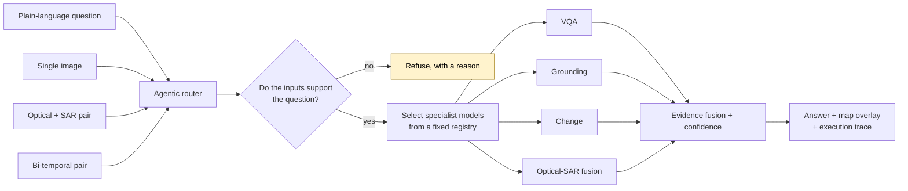

> ### 🛠 Building it? Start with 
>
> A **self-contained** specification: how many models, what each one does, the exact
> Hugging Face IDs and dataset URLs, the architecture of each component, LoRA configs,
> compute requirements, accuracy targets with published anchors, build order and hard rules.
>
> It repeats the necessary context deliberately, so it can be handed to another engineer
> or another AI agent **on its own** and still be actionable.# PS26167 — SatQuery AI

**Smart India Hackathon 2026**
Interactive Vision-Language Assistant for Multimodal Remote Sensing Image Analysis through Text Queries

| | |
|---|---|
| **Problem Statement ID** | 26167 |
| **Organization** | Indian Space Research Organisation (ISRO) |
| **Department** | Department of Space / ISRO |
| **Category** | Software |
| **Theme** | Space Technology |

---

## What this problem asks for




An interactive web application with an agentic remote-sensing backend. A user uploads satellite imagery, asks a question in ordinary language, and the system decides on its own which specialist model to run — then returns an answer with the visual evidence behind it.

Three input modes are required: a single image, a co-registered optical + SAR pair, and a bi-temporal pair from two dates. Five capabilities are mandatory: remote-sensing adaptation, single-image VQA plus one more single-image task, change analysis, cross-modal analysis, and agentic orchestration.

> The governing idea: **do not build a chatbot that looks at satellite images — build a remote-sensing analysis system that happens to accept natural language.**

---

## Contents

```
PS26167/
├── README.md                              you are here
└── docs/
    ├── 00_Official_Problem_Statement.md   authoritative PS text + known data defects
    ├── 01_Complete_Deep_Analysis.md       the full analysis
    └── 03_Model_Specification.md          BUILD CONTRACT — self-contained handoff
```

> ### 🛠 Building it? Start with `docs/03_Model_Specification.md`
>
> A **self-contained** specification: how many models to build, what each one does, the
> exact Hugging Face IDs and dataset URLs, the architecture of every component, LoRA
> configs, compute requirements, accuracy targets with published anchors, build order,
> and the hard rules.
>
> It repeats the necessary context deliberately, so it can be handed to another engineer
> — or another AI agent — **on its own** and still be fully actionable.

### `docs/03_Model_Specification.md`

**6 components. 4 trained. Nothing from scratch.**

| # | Component | Trained? | Serves |
|---|---|---|---|
| M0 | Base VLM (`MBZUAI/geochat-7B`) | No — frozen | Foundation |
| **M1** | **RS-adapted VQA — LoRA on BigEarthNet.txt** | **Yes** | The mandatory adaptation |
| M2 | Grounding — LoRA on VRSBench | Yes | Single-image second task |
| M3 | Change / Change-VQA — LoRA on CDVQA | Yes | Bi-temporal analysis |
| M4 | SAR encoder + late fusion | Yes (light) | Cross-modal |
| M5 | Router — small text classifier | Yes (trivial) | Agentic orchestration |
| M6 | Answer generator | No | Output layer |

Key architectural decision: **one frozen base, three swappable LoRA adapters** — roughly 15 GB of VRAM instead of 60 GB, and adapters swap in milliseconds.

### `docs/00_Official_Problem_Statement.md`

The verbatim problem statement, extracted directly from `sih_2026_problem_statements.json`. **This is the source of truth.** When any other document says "the PS requires X", it is quoting this file.

It also records two defects found in the official data:
- the **judging criteria table is missing** — the published text contains an unreplaced editorial placeholder, so the scoring weights are unknown
- the **`Dataset Link` field is truncated** at 355 characters, cutting off ISRO's guidance for VRSBench, RSVQA and CDVQA

### `docs/01_Complete_Deep_Analysis.md`

The full analysis, in nine parts:

| Part | Covers |
|---|---|
| I — Orientation | The problem in one page; a glossary defining every term from zero |
| II — Requirements | Requirement decomposition, the three input modes, the five mandatory capabilities, and what the statement leaves unsaid |
| III — Domain foundations | Optical and multispectral imagery, SAR, co-registration, GeoTIFF, VQA/captioning/grounding, change detection, and why a generic GPT is not enough |
| IV — Datasets | BigEarthNet.txt, VRSBench, RSVQA, CDVQA, the hidden ISRO/SAC set, and how data leakage silently inflates scores |
| V — Architecture | All six layers, the agentic router, the tool registry, the evidence schema, and the chain-of-thought rule |
| VI — Models and training | LoRA explained, base model selection, the data ladder, the training curriculum, hardware |
| VII — Evaluation | Every metric with its formula, the five-configuration ablation, the results dashboard, the stress-test suite |
| VIII — Build and demo | Build order, interface layout, the five-part demo sequence, Definition of Done, and what not to do |
| IX — Risk | A ten-item risk register and the open questions to resolve before building |

Plus a **requirement traceability matrix** mapping every mandatory requirement to the component that satisfies it and the evidence that proves it to a judge.

Written for someone who has never opened a satellite image. Every term is defined the first time it appears.

---

## Provenance

This analysis merges two earlier drafts that sat in the parent folder:

| Source | Size | Disposition |
|---|---|---|
| `PS26167_Deep_Analysis.md` | 66 KB, 94 sections | Content preserved in full; reorganised, translated to one consistent language, citations re-anchored to the official JSON |
| `PS26167_SatQuery_AI_Deep_Analysis_ULTRA_DETAILED.md` | 147 KB, 94 "Points" | 64% of that file was duplicate boilerplate — eight template blocks repeated up to 94 times. Boilerplate removed; all unique content preserved |

Both were also cleaned of generator artefacts: 43 tracking parameters on URLs, 14 unrendered citation tokens, and 21 invalid private-use Unicode characters.

The originals remain untouched in the parent directory.

---

## Ground rules carried through the analysis

1. Never call a generic VLM "adaptation" — the statement disqualifies it explicitly
2. Never let the language model invent spatial evidence — vision models produce facts, the LLM only phrases them
3. Never fabricate a benchmark number — placeholders stay blank until an experiment fills them
4. Never tune on hidden evaluation data — design for generalisation instead
5. Never treat SAR as a greyscale photograph
6. Never ignore co-registration — but note it is already done on the scored data
7. Never display fake agent reasoning — only the observable execution trace is evaluated
8. Never let the agent execute arbitrary tools — selection comes from a fixed registry
9. Never build the interface before the model pipeline is proven
10. Never pitch "AI" as the innovation — the innovation is the orchestrated, auditable workflow
