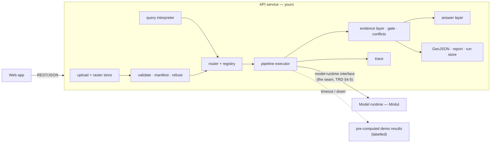

# Backend Build Plan

**Owner: Shreyash.** Scope: the API service and every non-model layer of the pipeline — ingestion and upload, validation and refusal, query understanding, the router and registry, the evidence layer, the answer layer, the execution trace, outputs and reports, the evaluation harness, batch evaluation, persistence, and venue operations. Plus the integration seam with Mridul's model runtime.

Written against `docs/07_PRD.md` and `docs/08_TRD.md` (IDs cited throughout), `docs/05_System_Design.md` and ADR-004/007/008/009 — **not** against the early prototype in this folder. Reuse prototype code where it already meets a requirement; replace it where it doesn't. Items that depend on an open audit finding are marked **[audit X]**.

---

## 0. Principles that shape every line

1. **The answer layer never sees pixels** (ADR-007). It receives validated evidence records and nothing else. Enforce it in the function signature and assert it in a test.
2. **Refuse before running** (VAL-02). Compatibility is checked before any model is touched.
3. **The trace is the product** (ADR-008). Task, tools, parameters, outputs. No reasoning text.
4. **Constraint, not capability** (ADR-004). A plain router over a fixed registry. No agent framework.
5. **Report what was measured** (EVL-01). No number reaches a user, a slide or the dashboard without a run behind it.
6. **Offline at runtime** (OPS-06). No network call after install.

---

## 1. Architecture you are building

**Module layout** (from `05` §3, one file per responsibility):

| Module | Responsibility | TRD |
|---|---|---|
| `raster` | read GeoTIFF/TIFF/PNG/JPEG; CRS, geotransform, bands, sensor role; pixel ↔ EPSG:4326 | ING-02–08 |
| `store` | raster store keyed by `raster_id`; run store | ING-01, OPS-01 |
| `validate` | input manifest; compatibility; co-registration check; refusal messages | VAL-01–08 |
| `intent` | query → structured intent (`08` §4.2) | QRY-01–04 |
| `registry` | the tool table (`08` §4.3) — data, not code paths | RTR-02, CON-02 |
| `router` | classify → validate → select → sequence → plan | RTR-01–09 |
| `runtime` | the model-runtime client: in-process or HTTP, same interface; adapter-pack loader | ARC-01, ADP-05–06, ADP-09 |
| `evidence` | normalised records; geometry; confidence gate; conflicts; aggregate confidence | EVD-01–06 |
| `answer` | templates or constrained LLM (M6) — evidence in, sentence out | ANS-01–05 |
| `trace` | the observable execution summary | TRC-01–05 |
| `report` | GeoJSON and the downloadable report | OUT-01–03 |
| `evaluate` | metrics, ablations, calibration, held-out router, stress suite | EVL-01–11 |
| `batch` | headless manifest-in / results-out mode for evaluators **[audit B1]** | — |
| `server` | HTTP API; serves the built UI; one origin | API-01–13 |

---

## 2. Phase 1 — Submission

Ordered by dependency. Each block ends with its done-check.

### 2.1 Foundation — day 1–2

- **Dependency manifest** (`pyproject.toml` or `requirements.txt`) with pinned versions; the README's demo command works on a clean machine (OPS-04, NFR-14).
- **Test runner** from day one; every MUST·T row gets a test as it is built.
- **Serve the UI and the API from one origin** in every server mode — a judge following the README must see the interface, not a blank page (NFR-14).
- **Honesty corrections due 11 Sep** (`07` §14.2): every ablation row labelled by what actually runs; every composite score printed with its formula (EVL-04, EVL-05); constructed demo scenes disclosed in the README and slides (UI-10).

Done when: clean clone → install → one command → UI loads and `/api/health` answers.

### 2.2 Ingestion and upload — Layer 1

- `POST /api/rasters` — multipart upload with a declared **role** (`optical`, `sar`, `t1`, `t2`) → `{raster_id, summary}` **[audit B5]**. Role is declared by the user, never inferred from band count alone — a 1-band Cartosat panchromatic image is optical, not SAR **[audit B4]**.
- Read CRS, geotransform, bands, GSD, sensor; build the summary shown in the UI (ING-02, ING-09).
- Bands: RGB, NIR, SWIR, pan; SAR polarisations **VV/VH and HH/HV**, single- or dual-pol **[audit B4]**. Missing band → loud error, never a wrong band (ING-04).
- PNG/JPEG only for benchmark data; flagged non-georeferenced (ING-03).
- Limits declared and enforced: max file size, **max pixel count** (TIFF decompression bombs), accepted extensions; filenames never used as paths (API-13) **[audit B10]**.
- Readable, typed errors: *"This file has no coordinate reference system. Change analysis needs georeferenced imagery."* (ING-07).
- Radiometric normalisation per sensor; SAR keeps its own path (ING-05).
- Tiling for rasters larger than a model input — SHOULD now, needed by the finale for sub-metre scenes (ING-06).

Done when: a judge's own GeoTIFF uploads, is described correctly, and a malformed or CRS-less file produces a specific message, not a trace.

### 2.3 Validation and refusal

- Input manifest: count, modality, formats, metadata (VAL-01).
- The superset rule: a single-image task is satisfied by a pair or a bi-temporal set (VAL-04).
- Refusal before any model call, with a remedy (VAL-02, VAL-03) — the refusal matrix in `07` §8.2.
- Co-registration **validated, not solved**: offset in pixels; above tolerance → flagged, confidence lowered, conflict recorded (VAL-05, VAL-06).
- Uploaded and built-in scenes take the **same** path (VAL-07); refusal and success share one response shape (VAL-08).

Done when: *"what changed between these two dates?"* on one image returns a refusal in < 1 s with **no model invoked**, and the trace shows the failed compatibility check (NFR-03).

### 2.4 Query understanding and the router

- `intent`: query → `{task, sub_tasks, modality_required, needs_spatial_evidence, spatial_constraint}` (QRY-01).
- `registry`: four tools (`rs_vqa`, `grounding`, `change_vqa`, `optical_sar`), each with inputs, outputs, adapter and **permitted parameters** — resolve whether `min_region_px` is permitted or not **[audit A2]**.
- `router`: classify → validate against registry `requires` → select → sequence (e.g. cross-modal + grounding; change + building grounding) → plan with clamped parameters (RTR-01–04).
- Acceptance: the five PS representative queries route correctly; **RQ-5** (*"Has the built-up area increased…"*) has no explicit temporal keyword — it must still reach change analysis, and be refused on a single image (RTR-06).
- **Held-out set** (RTR-07): ≥ 200 paraphrases written **before looking at the router's rules**, across the four tasks plus refusal bait, two-tool queries and implicit-temporal phrasing; report accuracy and a confusion matrix. Target ≈ 0.85. Keep it out of any training data.
- The router is wired **after** specialists are measured standing alone (RTR-09).

Done when: RQ-1–RQ-5 pass as tests and the held-out accuracy is reported from a file you wrote blind.

### 2.5 The model-runtime seam — pair with Mridul

- One interface, two transports: in-process (dev) and HTTP (venue) — switching is configuration (ARC-01).
- **Adapter-pack loader** per `08` §4.6: reads `pack.json` + PEFT artefacts, keyed by the registry's adapter names (CON-04).
- **Stub-pack test first** (ADP-06): a fake pack loads, the result reports `engine: neural+classical`, and the trace records which engine ran — before any real weights exist.
- Specialist outputs are converted into evidence records at the boundary; nothing downstream reads raw model output (CON-01).
- **Serving plan per phase** **[audit B2]**: document which component serves each capability at submission (M1 for VQA; the specialist pipeline for grounding, change and cross-modal until M2–M4 land) and switch them as packs arrive.
- Numeric claims come from measurement; when M1's numeric answer disagrees with the measured value, record a conflict and lower confidence **[audit A3]**.

Done when: the stub test passes, and on 22 Sep the real M1 pack loads with a one-line configuration change.

### 2.6 Evidence, answer, trace — Layers 5–6

- **Evidence record** exactly as `08` §4.4: claim, value, unit, confidence, modality, source model + version, geometry, supporting, conflicts, method (EVD-01, EVD-05).
- **Geometry**: EPSG:4326 for georeferenced inputs; **pixel or normalised coordinates for non-georeferenced benchmark inputs and batch output** **[audit A1]**.
- **Gate**: default threshold chosen on a validation set to hit a target abstention precision — not a magic constant **[audit B8]**; area-weighted aggregate confidence, penalised per conflict (EVD-03, EVD-04).
- **Answer layer**: signature takes an evidence set and nothing else; every number in the sentence exists in a passing record (ANS-01, ANS-02); abstains explicitly (ANS-03); mentions surviving conflicts (ANS-05).
- **Descriptive queries** (RQ-1) return a structured scene summary — land-cover shares plus detected object classes — built from evidence, not free text **[audit B3]**.
- **Trace**: each step `{step, detail, ok, ms, data}`; covers validation → task → compatibility → tools → parameters → execution → conflicts → confidence → evidence, or the refusal/abstention (TRC-01, TRC-02); records router kind and engine (TRC-05); **no reasoning text**, asserted by a test (TRC-03).
- Ground truth is readable by `evaluate` alone (EVD-06).

Done when: tests prove the answer layer cannot receive a raster, every answer number is in the evidence, and abstention fires when nothing clears the gate.

### 2.7 Outputs and reports

- `GET /api/runs/{run_id}/geojson` — FeatureCollection in EPSG:4326 that opens in QGIS (OUT-01).
- `GET /api/runs/{run_id}/report` — **PDF generated offline** (WeasyPrint or ReportLab) or a self-contained HTML file: query, answer, evidence per claim with confidence and source model, input metadata, parameters, the trace, and **"what this cannot establish"** (OUT-02) **[audit B10]**.
- Both are produced from the stored run, so they match the screen exactly (OUT-03).

### 2.8 API — the full surface

Proposed paths **[audit B5]** (pending the TRD amendment):

| Method | Path | Returns | TRD |
|---|---|---|---|
| POST | `/api/rasters` | `{raster_id, summary}` | API-01 |
| POST | `/api/query` | result contract (`08` §5.2); body `{query, inputs: {optical?, sar?, t1?, t2?: raster_id}, threshold?}` | API-02, API-11 |
| GET | `/api/runs`, `/api/runs/{id}` | stored runs with trace | API-03 |
| GET | `/api/runs/{id}/geojson`, `/api/runs/{id}/report` | exports | API-04 |
| GET | `/api/health` | version, engine, adapters loaded | API-05 |
| GET | `/api/registry` | the tool table | API-06 |
| GET | `/api/datasets`, `/api/models` | actual local state | API-07 |
| GET | `/api/evaluation` | metrics, both ablations, calibration, formulas | API-08 |
| GET | `/api/scenes/{scene}/{layer}.png` | built-in demo layers | API-09 |
| — | unknown `/api/*` | 404 JSON, never the HTML shell | API-10 |

Errors: `{error: {code, message, remedy}}` — typed, readable, no stack traces (API-12). Version the contract in `/api/health`.

### 2.9 Evaluation harness

- Metrics exactly as `08` §9.1, definitions visible in code and in the dashboard.
- **Two ablations, not one** **[audit B6]**:
  - *Adaptation ablation* — A (base, zero-shot) vs B (M1) on the VRSBench test split. Mridul supplies the runs; you render them.
  - *System ablation* — C (specialists, task named by hand) → D (+ router) → E (+ evidence fusion and gating) on an internal multi-task set of routed queries, bi-temporal pairs and optical–SAR pairs. Each metric shown separately; any composite printed with its formula (EVL-05).
- Cross-modal ablation — optical-only, SAR-only, both (EVL-06), with Mridul.
- Calibration on ≥ 200 predictions, ECE with bins stated (NFR-06) **[audit B8]**.
- Stress suite (EVL-08): held-out regions, small/large targets, contrast, cloud/haze, 2-px misregistration, single-sensor inputs, tiny/huge changes, ambiguous queries, malformed/CRS-less files, mismatched inputs.
- Every figure reproducible from a recorded run (EVL-10); anchors beside every figure (EVL-03).

### 2.10 Persistence

- Every run stored: result, evidence, GeoJSON, environment (version, engine, seed, platform) (OPS-01); deterministic under the seed (OPS-02, NFR-11).
- Filesystem store for the submission; spatial queries (PostGIS or SpatiaLite, stated) are Build-phase (OPS-05, ADR-009).

---

## 3. Phase 2 — Build (Oct–Nov)

| Item | Why | TRD |
|---|---|---|
| **Batch mode** — `satquery batch manifest.json → results.jsonl` (answers, boxes/masks in pixel and geographic coordinates, change maps, traces), offline | ISRO scores the delivered system on its hidden set; this is how an evaluator runs it **[audit B1]** | — |
| Swap in M2, M3, M4 packs as they land; re-run both ablations after each | Each must earn its place (EVL-07) | ADP-05 |
| Trained router (M5) behind the same interface, only if it beats the rules on the held-out set | RTR-08 | RTR-08 |
| Spatial constraints from the query as filters | QRY-02 | QRY-02 |
| Result store with spatial queries | ADR-009 | OPS-05 |
| Tiling and stitching for sub-metre scenes | Cartosat scenes are large | ING-06 |
| Progress streaming over WebSocket for long queries | `05` §2 | — |

---

## 4. Phase 3 — Venue (Nov → Dec)

- `docker compose up` brings everything up cold, first time (OPS-03); model pre-warmed before the judge arrives (NFR-10).
- **Fallback**: model runtime down or slow → staged scenes answered from pre-computed results, **labelled `precomputed: true` in the result and in the trace**; anything else returns an honest degradation notice (ADP-09, TRC-04, NFR-05).
- **Offline audit**: unplug the network, run the full demo; zero outbound calls (OPS-06, NFR-09).
- Latency: < 8 s p95 single-image, < 15 s p95 cross-modal on the venue laptop (NFR-01, NFR-02).
- Rehearse on the **actual venue laptop in November** (`05` §4).

---

## 5. Calendar

| When | Deliverable |
|---|---|
| **11 Sep** | Manifest; one-origin serving; honesty corrections |
| 12–14 Sep | Stub-pack test with Mridul; registry + router; refusal path; RQ-1–RQ-5 tests |
| 13–17 Sep | Upload + validation end to end; evidence + answer + trace contracts |
| 17–19 Sep | Report + GeoJSON; held-out router set; system ablation; calibration |
| **22 Sep** | Real M1 pack serving VQA |
| **24 Sep** | Upload working end to end with the web app |
| Oct–Nov | Batch mode; M2–M4 integration; stress suite; docker compose; venue test |

> **Deadline caveat.** If the portal closes **20 Sep**, freeze on 19 Sep with what passes its tests; 22/24 Sep items move to Build (`07` §14.2).

---

## 6. Definition of done — backend

- [ ] Clean clone → one command → UI + API (NFR-14)
- [ ] Upload with roles; readable errors; limits enforced
- [ ] Refusal < 1 s, no model invoked, visible in the trace
- [ ] RQ-1–RQ-5 route correctly; held-out router accuracy reported
- [ ] Stub pack and real M1 pack load through one interface; engine reported
- [ ] Answer layer provably pixel-free; every answer number in the evidence
- [ ] GeoJSON opens in QGIS; report downloads and stands alone
- [ ] Both ablations and calibration served with formulas and anchors
- [ ] Every run replayable from its record
- [ ] (Build) batch mode; (Finale) offline docker compose with labelled fallback
