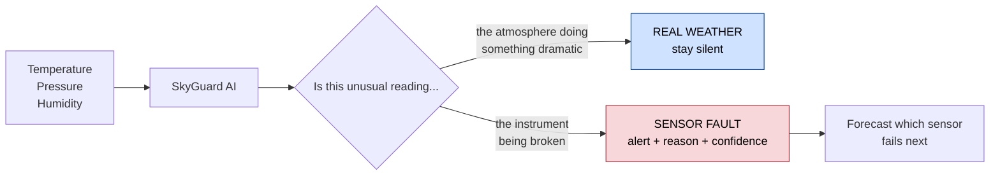

# PS26073 — SkyGuard AI

**Smart India Hackathon 2026**
AI/ML-Based Intelligent Anomaly Detection for Automatic Weather Stations

| | |
|---|---|
| **Problem Statement ID** | 26073 |
| **Organization** | Ministry of Earth Sciences (MoES) |
| **Department** | **India Meteorological Department** |
| **Category** | Software |
| **Theme** | Disaster Management |

---

## What this problem asks for




India runs thousands of unmanned Automatic Weather Stations. Their readings are the initial conditions for weather forecasting, and they feed aviation, agriculture advisories, disaster warnings and the national climate record.

Sensors sitting outdoors for years go wrong — they spike, freeze, lose power, and slowly drift out of calibration. IMD's current defence is threshold-based quality control, which catches a reading of 200°C but completely misses a sensor that has drifted 2°C over eight months, because every individual reading still looks reasonable.

Build a system that catches the faults thresholds cannot see — in real time, using **only temperature, pressure and relative humidity** — while explaining its reasoning, scoring its confidence, and predicting which sensors are about to fail.

> The governing sentence, from the statement itself: *"The system should distinguish between genuine meteorological events and sensor/data anomalies while minimizing false alarms."*
>
> This is not an anomaly detector. It is a discriminator between **the atmosphere doing something dramatic** and **the instrument being broken** — two things with nearly identical statistics and opposite correct responses.

---

## Why this statement

Of the 155 real software problem statements in SIH 2026, this is the most balanced across every practical axis.

| | |
|---|---|
| **Scope** | Three parameters. The narrowest well-specified scope in the set |
| **Rubric** | **Published, with weights summing to exactly 100** — one of only four such statements in 155, and the only one in the entire 30-statement MoES block |
| **Evaluation method** | **Disclosed** — *"to be evaluated in anomaly injected data"*, so a fault-injection harness replicates the real scoring procedure |
| **Data risk** | None. Simulated anomalies are explicitly permitted |
| **Cost** | Entirely free stack. Optional ESP32 ≈ ₹300 |
| **Differentiator** | Sits in plain sight inside the statement's own example use case |

### The rubric

| Criterion | Weight |
|---|---:|
| **Innovation & Novelty** | **25%** |
| Detection Accuracy | 20% |
| Real-Time Capability | 15% |
| Explainability | 10% |
| Scalability | 10% |
| Practical Deployability | 10% |
| Visualization / UI | 5% |
| Energy Efficiency | 5% |

Read its shape: **accuracy is worth only 20%**. IMD already knows the model is commodity — they are buying the system around it. Forty percent carries no research risk at all, and most competing teams will spend everything on the model and leave that 40% on the table.

---

## Contents

```
PS26073/
├── README.md                              you are here
└── docs/
    ├── 00_Official_Problem_Statement.md   authoritative text + rubric + evaluation method
    ├── 01_Complete_Deep_Analysis.md       the full analysis
    └── 02_Execution_Plan.md               the calendar, and what to do this week
```

> ### ⏳ The deadline
>
> **Idea submission on sih.gov.in closes 30 September 2026.** Internal hackathons run
> through September, and students cannot register directly — your college SPOC nominates
> winning teams. Grand Finale is 36 hours in December.
>
> See `docs/02_Execution_Plan.md`. The short version: SIH is three contests with three
> different deliverables, and the first one is won on paper, not in code.

### `docs/00_Official_Problem_Statement.md`

Verbatim text extracted from `sih_2026_problem_statements.json`. **The source of truth.** When the analysis says "the PS requires X", it is quoting this file.

### `docs/02_Execution_Plan.md`

The real calendar from today to the December finale, split into three phases with different deliverables: **Selection** (26 days — a proposal plus enough working code to make it credible), **Build** (October–November, while screening runs), and the **Grand Finale** (36 hours of integration and rehearsal, not construction). Includes week-by-week milestones, team allocation across six roles, go/no-go gates, and the five things that matter this week.

### `docs/01_Complete_Deep_Analysis.md`

Nine parts:

| Part | Covers |
|---|---|
| I — Orientation | The problem in one page; a glossary defining every term from zero |
| II — Requirements | Requirement decomposition, the rubric decoded criterion by criterion, and how they will test you |
| III — Domain foundations | What an AWS is, why bad readings matter, the anomaly taxonomy, real weather vs sensor fault, and the physics of three variables |
| IV — State of practice | WMO's standard checks, Microsoft's WeatherReal algorithms, and a gap analysis showing exactly what neither catches |
| V — Data | Where to get station data, and the fault-injection harness that mirrors their scoring |
| VI — System design | Five-stage architecture, each stage in detail, explainability, sensor health forecasting, edge deployment, stack |
| VII — Innovation | Three angles with their claims and measurements, and how to state the contribution honestly |
| VIII — Evaluation, build & demo | Metrics, a six-row ablation, build order, interface, a six-beat demo script, Definition of Done |
| IX — Risk | Ten-item risk register and the open questions to resolve first |

Plus a **rubric traceability matrix** mapping every scored criterion to the component that earns it and the evidence a judge sees.

Written for someone who has never worked with weather data. No meteorology assumed.

---

## The short version of the strategy

**What already exists.** WMO defines a standard battery of quality-control checks — range, step, persistence, spike, internal consistency, spatial consistency. Microsoft's WeatherReal publishes concrete implementations with real parameters, including a neighbour-station check (300 km radius, 500 m elevation, four directional quadrants, two nearest per quadrant).

**What it misses.** All of it is retrospective, batch, and aimed at gross errors. None of it catches **slow calibration drift**, because no individual reading ever violates a threshold — and drift is the failure mode that silently corrupts the climate record.

**The contribution.** Implement the full published baseline, then add what it lacks:

1. **Spatial drift tracking** — the long-window mean of the residual between a station and its neighbours. Healthy stations sit near zero; drifting stations walk steadily away. Catches drift weeks before any threshold method, and the *same* mechanism distinguishes a real gust front from a broken sensor, because weather is regional and faults are local.
2. **Diurnal-signature health** — track the amplitude and phase of each station's daily cycle. A collapsing amplitude is a drifting sensor, and this needs no neighbours, so it works in the sparse hill districts where the spatial method is weakest.
3. **Degradation forecasting** — project each station's drift trajectory forward into a ranked maintenance queue. This answers the statement's own closing Grand Challenge about a *"self-aware and self-healing weather observation network"*.

**The two demo beats that win it.** Inject a slow drift, show every reading passing every threshold, then show it caught anyway. Then replay a real weather event and show the system correctly staying silent.

---

## Ground rules

1. Build the fault-injection harness first — without labels, nothing downstream can be measured
2. Implement WMO and WeatherReal as the baseline, and say so — it makes the innovation claim measurable instead of asserted
3. Never report only aggregate accuracy — break it out per fault type, including where you scored worst
4. Keep a real-weather control set — the false-alarm rate on it is the most persuasive number you have
5. Learn thresholds per station, never hard-code them globally
6. Flag with a reason, never silently delete — IMD needs the audit trail
7. Always label an imputed value as imputed, with its source
8. Do not let a deep model eat the project — accuracy is worth 20%, and a heavy model costs real-time, energy and explainability
9. Calibrate confidence and measure it — an unvalidated number is worse than none
10. The innovation is drift detection and event discrimination, not the toolkit
