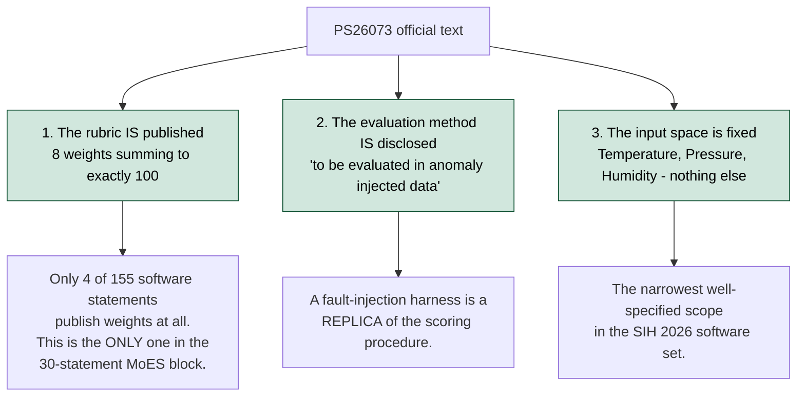

# PS26073 - Official Problem Statement (Authoritative Text)

> **Source of truth.** Extracted verbatim from `sih_2026_problem_statements.json`,
> the official SIH 2026 problem-statement dump, record ID `26073`. Only cosmetic
> changes: HTML entities decoded, ` ` tags converted to line breaks, and the
> mojibake character `�` - a bullet corrupted during the original PDF-to-JSON
> export - replaced with a dash.
>
> **Cite this file, not a third-party website.** When the analysis document states
> "the PS requires X", it is quoting this file.

---

## Record metadata

| Field | Value |
|---|---|
| Problem Statement ID | 26073 |
| Problem Statement Title | AI/ML-Based Intelligent Anomaly Detection for Automatic Weather Stations (AWS) |
| Organization | Ministry of Earth Sciences (MoES) |
| Department | India Meteorological Department |
| Category | Software |
| Theme | Disaster Management |
| Youtube Link | *(empty in source)* |
| Dataset Link | *(empty in source)* |
| Contact info | *(empty in source)* |

---

## Description (verbatim)

- Title SkyGuard AI: Intelligent Real-Time Anomaly Detection System for Temperature, Pressure, and Humidity Sensors in Automatic Weather Stations
- Background Automatic Weather Stations (AWS) are critical components of modern meteorological observation networks. These stations continuously monitor atmospheric parameters and provide real-time data for weather forecasting, climate monitoring, disaster management, aviation, agriculture, and scientific research.However, AWS observations often contain anomalies caused by sensor malfunction,communication failures, calibration drift, power fluctuations, harsh environmental conditions, and data corruption.Erroneous observations can significantly impact weather forecasting accuracy and decision-making systems. Traditional threshold-based quality control methods are often insufficient for identifying complex or hidden anomalies in meteorological data streams.
- Problem Statement Develop an AI/ML-based intelligent anomaly detection system capable of automatically identifying abnormal, inconsistent, or faulty observations from Automatic Weather Stations in real time using only the following parameters:
- Temperature (°C)
- Atmospheric Pressure (hPa)
- Relative Humidity (%)
The system should distinguish between genuine meteorological events and sensor/data anomalies while minimizing false alarms and enabling scalable deployment across large weather observation networks.
- Objectives
- Detect anomalies in real-time AWS data streams.
- Identify sensor faults, spikes, frozen values, and communication errors.
- Learn normal temporal and seasonal patterns of temperature, pressure, and humidity.
- Perform multivariate consistency analysis among atmospheric parameters.
- Provide confidence scores and explainable AI-based reasoning for detected anomalies.
- Predict possible sensor degradation and maintenance requirements.
- Optionally suggest corrected/imputed values for anomalous observations.
- Expected Inputs Participants may use historical AWS datasets, simulated anomalies, or streaming sensor data containing the following meteorological parameters:
Parameter- Unit Temperature - °C Atmospheric Pressure - hPa Relative Humidity - %
- Expected Outputs
- Real-time anomaly alerts
- Severity and confidence scores
- Root-cause classification
- Visualization dashboard
- Sensor health status
- Corrected data estimation (optional)
- Suggested Technologies
- Explainable AI (SHAP/LIME) (Preferable)
- Edge AI for low-power deployment on ESP32
- Evaluation Criteria (To be evaluated in anomaly injected data)
Criteria - Weightage Innovation & Novelty - 25% Detection Accuracy - 20% Real-Time Capability - 15% Explainability - 10% Scalability - 10% Practical Deployability - 10% Visualization/UI - 5% Energy Efficiency - 5%
- Example Use Case An AWS suddenly reports a temperature of 55°C with extremely high humidity and abnormal pressure variation while neighboring stations show normal conditions. The AI system should analyze temporal and spatial consistency, identify the reading as a probable sensor anomaly, generate an alert, and suggest corrective action.
- Grand Challenge Can AI build a self-aware and self-healing weather observation network capable of delivering trustworthy atmospheric data under all environmental conditions?
- Output:
Fully executable code with example usage and a document explaining various use cases

---

## Three things to notice in the text above

**1. The evaluation rubric is published, with weights.** Unlike most SIH 2026 statements,
this one states exactly how it will be scored:

| Criterion | Weight |
|---|---:|
| Innovation & Novelty | 25% |
| Detection Accuracy | 20% |
| Real-Time Capability | 15% |
| Explainability | 10% |
| Scalability | 10% |
| Practical Deployability | 10% |
| Visualization / UI | 5% |
| Energy Efficiency | 5% |

The weights sum to exactly 100. Only four of the 155 software statements in SIH 2026
publish weights at all; this is one of them, and it is the only one in the entire
30-statement Ministry of Earth Sciences block.

**2. The evaluation method is disclosed.** The rubric header reads
*"(To be evaluated in anomaly injected data)"*. Clean observations will have synthetic
faults injected, and the system is scored on what it catches. This means a fault-injection
harness built during development is a replica of the actual scoring procedure.

**3. The input space is fixed at three parameters.** Temperature, atmospheric pressure and
relative humidity. No wind, no rainfall, no radar, no satellite, no model output. This is
the narrowest well-specified scope in the SIH 2026 software set.

---

## Data note

The `Dataset Link` field is empty. The statement itself grants latitude:
*"Participants may use historical AWS datasets, simulated anomalies, or streaming sensor
data."* See Part IV of the analysis document for sources.
