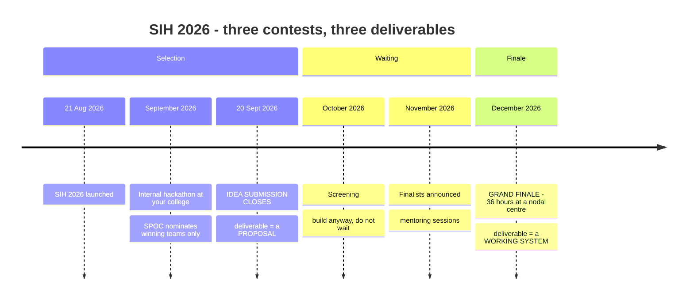
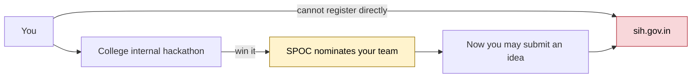
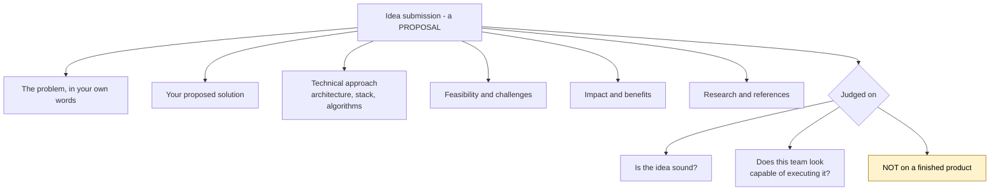
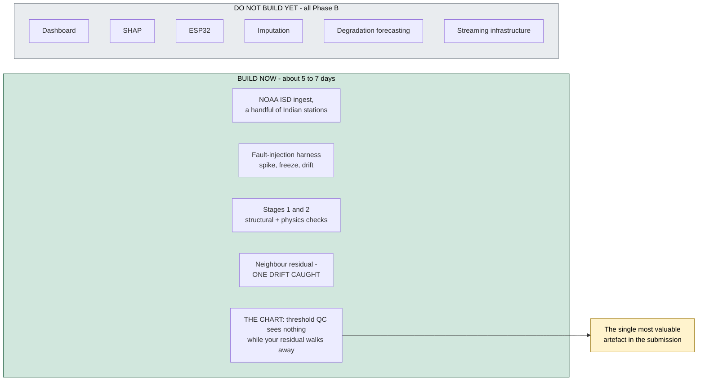
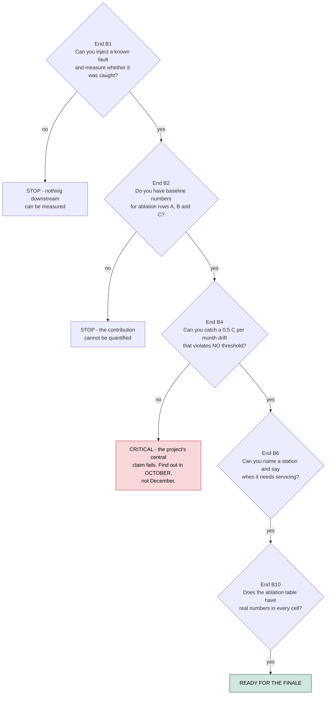

# PS26073 — Execution Plan

**From today (8 September 2026) to the Grand Finale (December 2026)**

> ### ⚠ Deadline corrected — and still needs your confirmation
>
> An earlier draft of this plan used **30 September 2026**, taken from third-party
> reporting on the SIH 2026 timeline. The team's own documents — `BRANCHING.md` and
> `PS26143_Brief.md`, both written from the portal scrape — state **20 September 2026**.
>
> **This plan now assumes 20 September**, because it is the earlier date and the more
> authoritative source. That changes Phase A from 26 days to **12 days**.
>
> **Confirm the real date with your SPOC before relying on either.** If it turns out to
> be 30 September you gain ten days; if you had planned for 30 and it is 20, the
> campaign is over.

---

## The calendar you are actually working against



### The gate you cannot skip



**Confirm the internal hackathon date with your SPOC this week.** It is the real first deadline and it is likely within days.


| Stage | When | What it demands |
|---|---|---|
| SIH 2026 launched | 21 August 2026 | — |
| **Internal hackathon at your college** | **September 2026 — happening now** | Win it. Your SPOC nominates only the winning teams |
| **Idea submission on sih.gov.in** | **closes 20 September 2026** *(per team docs; confirm)* | A proposal, not a product |
| Screening | October 2026 | Nothing to do but wait |
| Finalists announced | November 2026 | Mentoring sessions if selected |
| **Grand Finale — 36 hours** | **December 2026, at a nodal centre** | A working, demonstrable system |

**Today is 8 September. You have 12 days until the portal closes.**

Note the gate you cannot skip: **students cannot register directly.** Your college SPOC nominates teams, and only after the internal hackathon. So the internal hackathon is the real first deadline, and it is likely within days or weeks — confirm the date with your SPOC this week.

### What this means for how you work

The single most common planning error is treating SIH as a 36-hour hackathon. It is not. It is **three separate contests with three different deliverables**, and the first one is won on paper.

```
  Sept  ├─ internal hackathon ─┬─ idea submission ──┐
        │  win a nomination    │  a PROPOSAL         │  ← 12 days
  Oct   │                      │                     ├─ screening (waiting)
  Nov   │                      │                     ├─ finalists announced
  Dec   │                      │                     └─ 36-hour GRAND FINALE
        │                                                a WORKING SYSTEM
```

You are not building a system in the next 12 days. You are building **the argument that you can build it**, backed by enough working code to make the argument credible.

---

## Gate 0 — Decide this week

Both `PS26073/` and `PS26167/` are fully analysed. The submission is per problem statement, so the choice is now blocking everything.

**My recommendation stands: PS26073.** The reasoning, compressed:

| | PS26073 | PS26167 |
|---|---|---|
| Published rubric | **Yes** — 8 weights summing to 100 | No — the criteria table is an unreplaced placeholder |
| Evaluation method | **Disclosed** — anomaly-injected data | Hidden ISRO/SAC set |
| Scope | 3 parameters | 5 capabilities × 3 sensor modalities |
| Data risk | None — simulation permitted | Medium — domain gap to Cartosat/RISAT |
| Difficulty | Medium | Ultra-hard |
| Prestige | Lower | Higher |

If you want the ISRO badge and accept the research risk, take 26167 and I will mirror this plan for it. Otherwise everything below assumes 26073.

**Decide today, 8 September.** With 12 days left there is no slack for an undecided week.

---
---

# Phase A — Selection (now → 20 September)

**Objective: get nominated, then submit an idea that survives screening.**

## A.1 What the idea submission actually is




The portal submission is a **proposal**, submitted through your SPOC after internal nomination. In the standard SIH format it is an idea presentation covering:

- the problem, in your own words
- your proposed solution
- the technical approach — architecture, stack, algorithms
- feasibility and how you address challenges
- impact and benefits
- research and references

**It is judged on whether the idea is sound and the team looks capable of executing it.** Not on a finished product.

Check the exact template on sih.gov.in — it is prescribed and non-negotiable, and the format is usually a slide deck with a fixed page count.

## A.2 What makes a 26073 submission survive screening

Screeners are reading hundreds of proposals for the same problem statement. Yours differentiates on four things, in this order:

**1. You read the rubric and you say so.** Almost nobody will. State the eight weights explicitly and map your solution to each. *"Innovation is weighted 25%; here are our three contributions. Accuracy is 20%; here is our method. Energy is 5%; here is the ESP32 path."* That single slide tells a screener you engaged with the actual statement rather than the title.

**2. You name the gap in the published state of practice.** WMO's standard checks and Microsoft's WeatherReal both catch spikes, frozen values and out-of-range readings. Neither catches **slow calibration drift**, because no individual reading violates a threshold. That paragraph is your entire differentiation, and it comes straight from `01_Complete_Deep_Analysis.md` §13.

**3. You solve their own example.** The statement's example use case — a station reading 55°C while neighbours read normal — is a spatial consistency problem. Show the neighbour-residual mechanism and note that the *same* mechanism distinguishes a real gust front from a broken sensor, which is what their "minimise false alarms" clause demands.

**4. You show something already running.** One screenshot of real data flowing with a real detection beats three slides of architecture. See A.4.

## A.3 The three things to say, and one to avoid

**Say:**
> "IMD's current defence is threshold-based quality control. It catches a reading of 200°C. It cannot catch a sensor that drifted 2°C over eight months, because every reading still looks reasonable — and that drift silently corrupts the climate record."

**Say:**
> "Weather is regional; a sensor fault is local. We track each station against its neighbours, and the residual tells us which one we're looking at."

**Say:**
> "We answer the Grand Challenge in the statement: detect, explain, correct, and forecast which sensor needs a technician before it fails."

**Do not say:** *"We will use AI/ML to detect anomalies."* Every competing proposal says that. It is the null claim.

## A.4 The prototype to have by submission




Not the full system. Enough to prove the core claim is real.

**Minimum viable evidence — roughly 5–7 days of work:**

- [ ] NOAA ISD data ingested for a handful of Indian stations with coordinates
- [ ] The fault-injection harness — spike, freeze, drift (§15 of the analysis)
- [ ] Stage 1 + Stage 2 running: structural checks and the physics checks, including the dew-point-exceeds-temperature test
- [ ] **A drift injected and caught by the neighbour-residual method** — this is the whole proposal in one chart
- [ ] One plot: threshold QC seeing nothing while your residual line walks away from zero

That last chart is the single most valuable artefact in the submission. It is visual, it is unambiguous, and it proves the claim rather than asserting it.

**Do not build in Phase A:** the dashboard, SHAP, the ESP32, imputation, degradation forecasting, streaming infrastructure. All of that is Phase B. Building it now costs you the proposal.

## A.5 The 12 days

Compressed from the original 26-day plan. Two things had to give: the proposal is now
written in parallel with the prototype rather than after it, and the "verify then build"
sequence collapses into a single week.

| Days | Dates | Do |
|---|---|---|
| 1 | **8 Sept** | **Decide the PS today.** Confirm the internal hackathon date with your SPOC. Lock the team of six and the roles |
| 2–4 | 9–11 Sept | Ingest NOAA ISD. **Verify station density over India** — this decides how strong the spatial method can be, and the proposal's central claim rests on it. Start the deck in parallel |
| 5–7 | 12–14 Sept | Fault-injection harness. Stages 1–2. First detections working. Keep writing the deck |
| 8–10 | 15–17 Sept | Neighbour selection + residual tracking. **Get the drift chart** — this is the one artefact the proposal cannot ship without |
| 11 | 18 Sept | Finish the deck against the prescribed template. Rehearse the internal pitch |
| 12 | **19 Sept** | Review, revise, **submit** |

**Submit on 19 September, a day early.** Portal load on deadline day is a known failure mode, and a missed submission ends the campaign regardless of how good the work behind it was.

### What the compression costs you

| | 26-day plan | 12-day plan |
|---|---|---|
| Prototype scope | detection + drift chart + polish | **detection + drift chart only** |
| Proposal writing | dedicated 5 days | written in parallel from day 2 |
| Buffer before submission | 4 days | **1 day** |
| Station-density check | before committing the claim | still first — do not skip it |

If the deadline turns out to be 30 September after all, spend the extra ten days on the
proposal's evidence section and an early start on Phase B — not on widening the prototype.

---
---

# Phase B — Build (October → November)

**Objective: arrive at the finale with a working system, so the 36 hours are integration and polish rather than construction.**

Screening runs through October and finalists are announced in November. **Do not wait for the result to start building.** If you are selected you will have lost six weeks; if you are not, you have a portfolio project and the skills.

## B.1 Build order

From `01_Complete_Deep_Analysis.md` §30, with time budgets:

| Phase | Weeks | Deliverable | Rubric coverage |
|---|---|---|---|
| **B1 — Data & harness** | Oct wk 1 | Full ISD ingest, severity-swept injection, **real-weather control set** | Enables every measurement |
| **B2 — Deterministic stages** | Oct wk 1–2 | WMO battery + WeatherReal algorithms, per-station learned thresholds | Accuracy 20% (baseline rows) |
| **B3 — Temporal** | Oct wk 2–3 | Climatology baseline, then diurnal-signature health tracking | Innovation 25% (angle 2) |
| **B4 — Spatial** | Oct wk 3–4 | Quadrant neighbour selection, residual tracking, **drift detection** | Innovation 25% (angle 1) |
| **B5 — Fusion & explainability** | Nov wk 1 | Confidence calibration, SHAP, root-cause table, imputation | Explainability 10% |
| **B6 — Health forecasting** | Nov wk 2 | Degradation trends → maintenance queue | Innovation 25% (angle 3) |
| **B7 — Streaming & scale** | Nov wk 2–3 | Kafka/Redis path, latency instrumented, load test | Real-time 15%, Scalability 10% |
| **B8 — Dashboard** | Nov wk 3 | The interface from §31 | UI 5% |
| **B9 — Edge** | Nov wk 4 | ESP32 + BME280, quantised, power measured | Energy 5% |
| **B10 — Package & ablation** | Nov wk 4 | Docker Compose, docs, **the six-row ablation table filled in** | Deployability 10% |

**The ordering is not arbitrary.** B1 must precede everything because nothing can be measured without labels. B2 and B3 are the ablation's baseline rows, so they must exist before the contribution can be quantified. B4 is the differentiator and sits where there is still time to iterate. B7–B9 collect 30% of the rubric in low-risk, well-understood work that can absorb schedule compression.

**Never invert B4 and B8.** A polished dashboard over a conventional detector is a mid-table finish.

## B.2 Team allocation

Six members, working in parallel after B1:

| Role | Owns | Phases |
|---|---|---|
| **Data lead** | Ingest, injection harness, control set, splits | B1, ongoing |
| **QC engineer** | Stages 1–2, WMO + WeatherReal implementation | B2 |
| **ML lead** | Temporal model, diurnal tracking, calibration | B3, B5 |
| **Spatial lead** | Neighbour selection, interpolation, **drift detection** | B4, B6 |
| **Platform** | Streaming, storage, Docker, load testing | B7, B10 |
| **Frontend + edge** | Dashboard, ESP32, demo rig | B8, B9 |

B1 is the shared blocker — everyone helps for the first week, then it parallelises cleanly.

## B.3 The gates




Do not advance until each is true:

- **End B1:** you can inject a known fault and measure whether it was caught
- **End B2:** you have the baseline numbers for ablation rows A, B and C
- **End B4:** **you can catch a 0.5 °C/month drift that violates no threshold** ← if this fails, the project's central claim fails and you must know in October, not December
- **End B6:** you can name a station and say when it needs servicing
- **End B10:** the ablation table has real numbers in every cell

---
---

# Phase C — Grand Finale (December, 36 hours)

**Objective: integrate, rehearse, demonstrate. Not build.**

## C.1 What must already be true when you walk in

- [ ] Trained models, versioned and loadable offline
- [ ] The ablation table populated with real measurements
- [ ] Docker Compose bringing the whole stack up with one command
- [ ] Demo dataset staged locally — no reliance on venue internet
- [ ] ESP32 flashed, tested, packed with spare cable and a USB battery
- [ ] The deck built and the five-minute demo script rehearsed end to end
- [ ] Pre-computed results for every demo scenario, as a fallback

## C.2 The 36 hours

| Hours | Do |
|---|---|
| **0–4** | Set up. Bring the stack up on venue hardware. Verify the ESP32 works on venue power and WiFi. **Find the failure modes now** |
| **4–10** | Integration hardening. Fix whatever the new environment broke. Do not add features |
| **10–16** | Demo path rehearsal. Run the five beats repeatedly until they are automatic |
| **16–22** | Buffer for whatever broke, plus polish on the drift visualisation — it is the centrepiece |
| **22–28** | Mentor rounds. Judges circulate; be ready to demo on demand at any moment |
| **28–33** | Final rehearsal. Freeze the code. **No commits after hour 33** |
| **33–36** | Presentation. Rest if you can |

**The rule that matters: no new features after hour 10.** Teams lose the finale by breaking a working system at hour 30 trying to add one more thing.

## C.3 The demo, and the two beats that win it

Five minutes, from `01_Complete_Deep_Analysis.md` §32. Two beats carry the whole thing:

**Beat 3 — the drift.** Inject a slow drift. Show every reading passing every threshold. Show IMD's current method seeing nothing. Then show your residual line walking away and the alert firing weeks early.

**Beat 4 — the non-alarm.** Replay a real gust front. Large, fast, multi-parameter. **The system stays silent** and explains why: the neighbours saw it too.

Everything else is competent execution many teams will match. Those two are what almost nobody will have.

---
---

# Risks to the timeline

| Risk | Impact | Mitigation |
|---|---|---|
| **Internal hackathon date unknown** | Could be days away | Confirm with SPOC **this week** — this is the most urgent unknown |
| **Wrong deadline assumed** | Campaign ends silently | **Confirm 20 vs 30 September with your SPOC today.** Team docs say 20; third-party reporting said 30 |
| **Decision drift on which PS** | Burns the 12 days | Decide today, 8 September |
| **Station density too sparse in ISD** | Weakens the spatial method | Verify in days 4–7, before committing the proposal's central claim |
| **Portal congestion on deadline day** | Campaign ends | Submit 19 September |
| **Waiting for screening results before building** | Six weeks lost | Start Phase B on 1 October regardless |
| **Feature creep at the finale** | Working system broken at hour 30 | Feature freeze at hour 10 |
| **Venue network or power** | Demo fails | Local-only stack, pre-computed fallbacks, USB battery for the ESP32 |
| **Drift detection does not work** | The central claim fails | Gate at end of B4 in October — find out with time to change course |

---

# This week — the only five things that matter

1. **Confirm the internal hackathon date with your SPOC.** Everything else depends on it.
2. **Decide the problem statement** — 26073 or 26167 — by 7 September.
3. **Lock the team of six** and assign the roles in B.2.
4. **Download the official idea-submission template** from sih.gov.in and read what it actually asks for.
5. **Start the NOAA ISD ingest** and check station density over India.

Nothing else is urgent. Everything else has weeks.

---

## Sources for the calendar

- Smart India Hackathon official portal — sih.gov.in
- SIH 2026 launched 21 August 2026
- Idea submission on the portal closes **20 September 2026** per the team's own `BRANCHING.md` and `PS26143_Brief.md`, both written from the portal scrape. Third-party reporting stated 30 September. **The earlier date is assumed here — confirm with your SPOC**
- Internal hackathons run through September 2026; students cannot register directly — the college SPOC nominates winning teams
- Screening October 2026 · finalists announced November 2026 · **Grand Finale: 36 hours, December 2026** at a nodal centre

*Confirm every date against sih.gov.in and your SPOC before planning around it — institution-level dates vary and portal deadlines occasionally move.*
