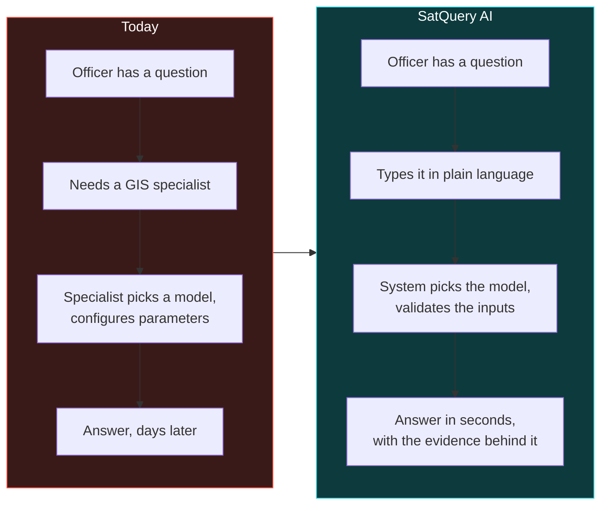

# PS26167 — Product Requirements Document

**SatQuery AI.** Smart India Hackathon 2026 · Indian Space Research Organisation · PS 26167.

| | |
|---|---|
| **Status** | Draft 1 — implementation underway |
| **Owner** | Mridul |
| **Version** | 0.3.0-mvp |
| **Last updated** | 2026-09-10 |
| **Submission deadline** | **20 September 2026** *(per `BRANCHING.md`; confirm with SPOC)* |

---

## 1. The problem, in the user's terms

A district officer wants to know whether construction has increased near a reservoir since 2024.

Today that question costs them a specialist. Remote-sensing imagery exists and much of it is free, but extracting an answer requires knowing which model applies, how sensors behave, how GIS software works, and what parameters to set. The tooling is built one task at a time — one model classifies land cover, another detects buildings, a third counts objects, a fourth detects change — and none of them accepts a question.

**The gap is not model capability. It is that no interface accepts a question.**

---

## 2. Users

| User | Needs | Success looks like |
|---|---|---|
| **District / disaster officer** | An answer without a GIS course | Asks in plain language, gets an answer with a map and a confidence value |
| **Remote-sensing analyst** | Speed on routine questions, with auditability | Skips manual model selection; can inspect exactly what ran and check it |
| **ISRO/SAC evaluator** | Evidence the system is correct, not just fluent | Every claim traces to a measurement; the trace shows what was selected and run |
| **Judge (SIH finale)** | To understand it in ten minutes | The refusal path and the cross-modal recovery are visible in one gesture each |

---

## 3. Scope

### In scope

| # | Capability | Requirement |
|---|---|---|
| 1 | Remote-sensing adaptation of at least one visual component | §5.1 — **mandatory** |
| 2 | Single-image VQA **plus** text-guided grounding | §5.2 — **mandatory** |
| 3 | Bi-temporal change description and change VQA | §5.3 — **mandatory** |
| 4 | Complementary extraction from a co-registered optical–SAR pair | §5.4 — **mandatory** |
| 5 | Agentic selection, sequencing and execution from a fixed registry | §5.5 — **mandatory** |
| 6 | Input compatibility checking, including **refusal** | §5.5 |
| 7 | Evidence-grounded output: geometry, confidence, execution trace, export | Expected Solution |
| 8 | Interactive web application | Expected Solution |

### Explicitly out of scope

| Excluded | Why |
|---|---|
| Research-grade co-registration | The scored data arrives pre-registered — ADR-003 note. Validate, do not solve |
| Captioning | The statement offers a choice; grounding was taken — ADR-002 |
| Authentication, multi-tenancy | Not a deliverable; adds surface with no marks |
| Training new foundation models | LoRA adaptation only — ADR-001 |
| Real-time satellite tasking | Not asked for |
| Mobile app | The deliverable is a GUI or web application |

---

## 4. The product principle

> **Vision models produce the facts. The language layer only phrases them. Never the reverse.**

Enforced structurally, not by discipline: `pipeline.answer()` takes an `EvidenceSet` and no raster, so it cannot invent a number it was never given. A test asserts the signature (ADR-007).

This is the difference between a system a space agency can use and a chatbot that sounds confident.

---

## 5. User stories, with acceptance criteria

### US-1 · Ask a question about one image
> *As an officer, I upload a scene and ask "how many built-up areas are visible?"*

**Accepts when** the answer states a count produced by connected-component labelling; the evidence panel shows the region geometry in EPSG:4326; a confidence value is displayed; the trace names the tool and its parameters.

### US-2 · Locate a feature
> *As an analyst, I ask "highlight the water body".*

**Accepts when** boxes appear on the scene in geographic coordinates; each carries an area in hectares; GeoJSON export opens in QGIS at the right place.

### US-3 · Compare two dates
> *As an officer, I supply two dates and ask what changed.*

**Accepts when** changed regions are reported with area; the change is classified semantically (construction vs regrowth) rather than only detected; the built-up trend is quantified in percentage points.

### US-4 · Use both sensors — the differentiator
> *As an analyst, I ask the system to use optical and SAR together.*

**Accepts when** the answer states what each sensor contributed **separately**, quantifies the cloud fraction blinding the optical scene, and reports the built-up area **recovered by SAR beneath that cloud** — information neither sensor provides alone.

### US-5 · Be refused when the question cannot be answered — the trust story
> *As a judge, I upload one image and ask what changed between two dates.*

**Accepts when** the system refuses; the trace shows the compatibility check failing; **no model is invoked**; the message says what to upload instead.

### US-6 · Be told when the system is unsure
> *As an officer, I ask about something not in the scene.*

**Accepts when** the system abstains rather than answering, and says so.

### US-7 · See what data and models are actually in use
> *As a judge, I want to know which datasets this is built on.*

**Accepts when** all four named public datasets plus the hidden ISRO/SAC set are listed with purpose, scale, source, and **their real local state** — not an aspirational list.

---

## 6. Non-functional requirements

| ID | Requirement | Target | Verified by |
|---|---|---|---|
| NFR-1 | Single-image query latency | < 8 s p95 on the venue laptop | `elapsed_ms` in every result |
| NFR-2 | Cross-modal query latency | < 15 s p95 | measured: ~185 ms at 512 px |
| NFR-3 | Refusal latency | < 1 s, no model invoked | measured: ~0 ms |
| NFR-4 | Operates with no network | mandatory | no runtime external calls |
| NFR-5 | Inference VRAM when adapters load | ≤ 8 GB at 4-bit | ADR-001 |
| NFR-6 | Runs with no GPU at all | mandatory | classical path, measured |
| NFR-7 | Malformed raster produces a readable error | no stack trace to the user | `raster.read` raises typed errors |
| NFR-8 | Deterministic under a recorded seed | mandatory | `save_run` records seed and environment |
| NFR-9 | Confidence is calibrated | ECE reported | `evaluate.expected_calibration_error` |
| NFR-10 | Cold start to first answer | < 60 s | `docker compose up` |

---

## 7. What exists today

Measured, not asserted — run `python -m satquery.cli selftest` and `eval`.

| Capability | State | Evidence |
|---|---|---|
| Raster ingestion, GeoTIFF + geotransform | **working** | round-trip test passes |
| Co-registration validation | **working** | phase correlation; detects a 6 px shift |
| Grounding (water, vegetation, built, bare) | **working** | vegetation IoU 0.99, water within 0.5 pp of truth |
| SAR structure detection | **working** | F1 0.931 against the true built-up class |
| Change detection | **working** | F1 0.768 against the true change mask |
| Cross-modal recovery | **working** | quantifies area recovered beneath cloud |
| Router classify + validate + refuse | **working** | 100% dispatch accuracy on 19 labelled queries |
| Evidence gating and abstention | **working** | ECE 0.033 |
| Web application with 3D modality stack | **working** | React 19, Three.js 0.186, builds clean |
| **LoRA adapters (M1–M3)** | **not trained** | needs a 24 GB GPU — the one genuine gap |

**The honest position:** every architectural requirement is implemented and measured. The neural adaptation required by §5.1 is specified, budgeted and wired, and needs GPU time that has not yet been spent.

---

## 8. Release plan

| Milestone | Date | Contents |
|---|---|---|
| **M1 — submission** | **19 Sept 2026** | Working system, this document set, the ablation. Submit a day early |
| M2 — adapters trained | Oct 2026 | M1–M3 LoRA on BigEarthNet.txt, VRSBench, CDVQA |
| M3 — benchmarked | Nov 2026 | VRSBench / RSVQA / CDVQA numbers against published anchors |
| M4 — finale | Dec 2026 | Integration, rehearsal, venue fallback |

---

## 9. Risks

| Risk | Impact | Mitigation |
|---|---|---|
| No GPU before the deadline | §5.1 unproven neurally | The classical path is real and measured; the neural slot is wired and documented |
| Domain gap to Cartosat/RISAT | Public scores may not transfer | Optimise robustness, not benchmark peak; stress-test suite |
| Judging weights unknown | Cannot optimise | Balance across all five mandatory capabilities |
| Synthetic imagery misread as a fake demo | Credibility | Disclose prominently in the UI; state exactly what is real |
| Venue has no network | Demo fails | No runtime external calls; verified |

---

## 10. Related

| Document | Covers |
|---|---|
| [`00_Official_Problem_Statement.md`](00_Official_Problem_Statement.md) | The authoritative requirement |
| [`08_TRD.md`](08_TRD.md) | Atomic, testable, traced requirements |
| [`05_System_Design.md`](05_System_Design.md) | C4, deployment, runtime views |
| [`03_Model_Specification.md`](03_Model_Specification.md) | The six model components |
| [`06_Design_System.md`](06_Design_System.md) | Visual identity and the 3D policy |
| [`ADR/`](ADR/) | Why each structural choice was made |
