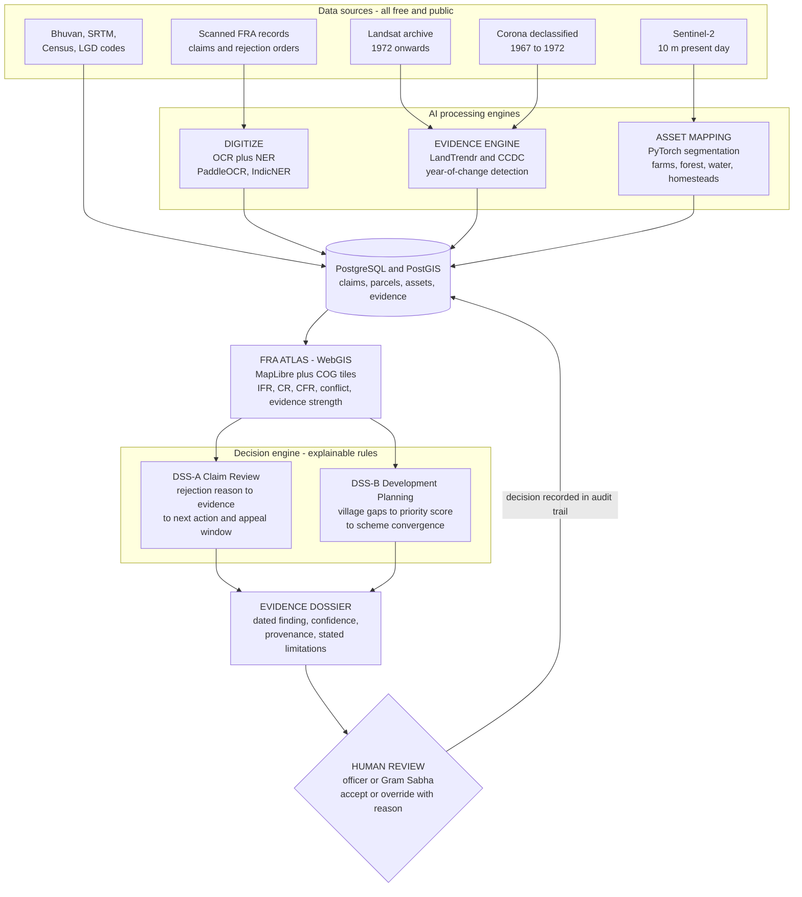
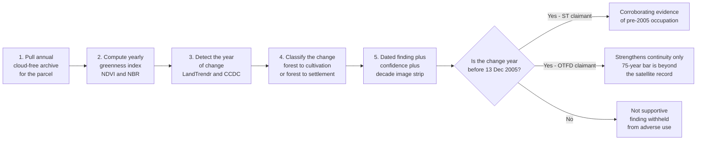
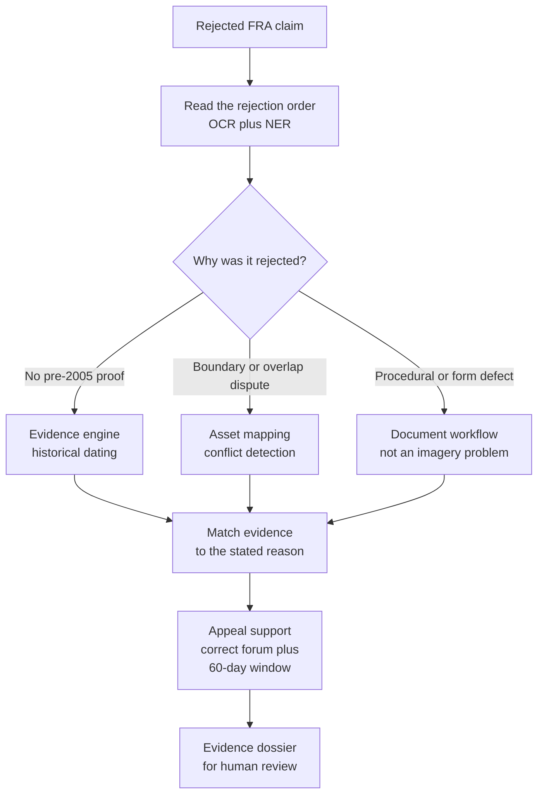
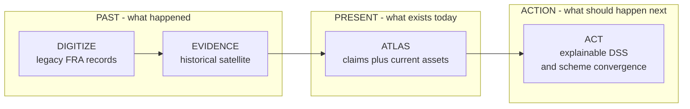
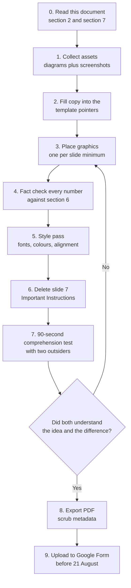

# SAAKSHYA — PPT Master Content Pack (build-ready)

**For:** the teammate(s) building the deck, even if you do not understand the project yet.
**Output:** exactly **6 slides**, exported as **PDF**, uploaded to the Google Form by **21 Aug**.
**Template:** `SIH2026-IDEA-Presentation Internal Hackathon-Format.pptx`. **Do not change the heading pointers.** Delete slide 7 (Important Instructions) before export.

---

## 0. HOW TO USE THIS DOCUMENT

1. Read **§2 (the project in 200 words)** once — that is enough to build slides.
2. Each slide below gives you: **PURPOSE · TEMPLATE POINTERS (do not edit) · LAYOUT sketch · EXACT COPY (paste-ready) · VISUAL SPEC · WHY IT MATTERS · MISTAKES TO AVOID**.
3. Never invent numbers. Only the 9 facts in **§8** may appear on the deck.
4. Read **§9 (banned words)** before writing anything yourself. Wrong wording makes us look like we claim legal authority we do not have.

---

## 1. TEMPLATE FACTS (confirmed from the actual template file)

**Every content slide already has this chrome — leave it exactly as is:**
- **Top-left:** an oval with the **team name** (e.g. `BugHeBug`) — appears on slides 2–6
- **Top-centre:** the slide heading in bold serif caps (`IDEA TITLE`, `TECHNICAL APPROACH`, …)
- **Top-right:** the SIH 2026 logo
- **Bottom:** blue footer bar `Inetrnal Hackathon - SIH26 Idea submission @ VIT Bhopal University- Template` + slide number *(the typo "Inetrnal" is theirs — leave it, do not "fix" the template)*

**The 6 mandated slides, in this exact order — you cannot reorder them:**

| # | Heading (fixed) | Pointers you must answer (fixed) |
|---|---|---|
| 1 | **TITLE PAGE** | Problem Statement Title / Theme / PS Category / Team ID / Team Name |
| 2 | **IDEA TITLE** | Proposed Solution — detailed explanation · how it addresses the problem · innovation & uniqueness |
| 3 | **TECHNICAL APPROACH** | Technologies to be used · Methodology & process (flow charts / images / working prototype) |
| 4 | **FEASIBILITY AND VIABILITY** | Feasibility analysis · potential challenges & risks · strategies to overcome them |
| 5 | **IMPACT AND BENEFITS** | Potential impact on target audience · benefits (social, economic, environmental…) |
| 6 | **RESEARCH AND REFERENCES** | Details / links of reference & research work |

**Official instructions (slide 7):** max 6 slides incl. title · avoid paragraphs, use points/diagrams/infographics/pictures · keep explanation precise and easy to understand · idea must be unique and novel · use only the provided template without changing the idea-detail pointers · **save as PDF** and upload to the Google Form — no PPT/Word accepted.

### About "blind" assessment — corrected
The **team name and Team ID DO go on the deck** (the template requires them, and the name appears on every slide). The team name acts as your **codename** — that *is* the blind mechanism. What must **not** appear: **member names, roll numbers, photos, or personal identifiers**. Keep the deck anonymous at the *person* level, not the team level.

**Form fields already decided:**
- Problem Statement ID **25108**
- Title: *Development of AI-powered FRA Atlas and WebGIS-based Decision Support System (DSS) for Integrated Monitoring of Forest Rights Act (FRA) Implementation* (States: MP, Tripura, Odisha, Telangana)
- Theme **Miscellaneous** · Category **Software** · Organisation **Ministry of Tribal Affairs (MoTA)**

---

## 2. THE PROJECT IN 200 WORDS (read this first)

India's **Forest Rights Act, 2006 (FRA)** lets tribal and forest-dwelling families legally own the forest land they have lived on — **if** they can show they occupied it **before 13 December 2005**. Most have no documents that old, so claims get **rejected**: about **47,901 community claims** nationally.

**SAAKSHYA** does four things:
1. **Digitizes** legacy FRA paperwork (claims, rejection orders) into structured records.
2. **Reconstructs historical evidence** — reads free satellite archives back to **1972** (Landsat) and **1967** (declassified Corona) to detect the *year* a patch of forest became farmland or a settlement. A year before 2005 is **corroborating evidence** for the family's claim.
3. **Maps everything on an FRA Atlas** (WebGIS): granted / pending / rejected claims plus today's forest, farms, water, homesteads, roads, boundary conflicts.
4. **Supports decisions** — explains why a claim was rejected and what evidence answers it, and which schemes a recognised village should get first.

**SAAKSHYA never decides anything legally.** It produces dated, confidence-scored, auditable evidence for a **human** officer or Gram Sabha to review.

**One-line story:** *"SAAKSHYA connects what happened, what exists today, and what should happen next."*

---

## 3. RUBRIC → SLIDE MAP (8 criteria, none orphaned)

| Criterion | Earned on |
|---|---|
| 1 Problem understanding & relevance | Slide 2 (problem block), Slide 1 |
| 2 Innovativeness & uniqueness | Slide 2 (2×2 matrix + uniqueness bullets) |
| 3 Technical feasibility & approach | Slide 3 (method + prototype), Slide 4 |
| 4 Social / business impact | Slide 5 |
| 5 Scalability & sustainability | Slide 4 (scale path + free data) |
| 6 Tech-stack justification | Slide 3 (stack table with reasons) |
| 7 Clarity of presentation | All — 1 graphic per slide, no paragraphs, one visual language |
| 8 Evidence, validation & outcomes | Slide 3 (real dossier artifact), Slide 4 (validation targets), Slide 6 (references) |

---

## 4. DESIGN SYSTEM

The template is **white with black serif headings**. Keep that chrome. Design **inside the body area** only.

- **Body panels:** white or very light grey `#F4F6F4` cards with thin borders. Keep it clean and readable — this is a document, not a poster.
- **Accent colours (use consistently, they carry meaning):**
  - Green `#1F7A4C` = evidence found / granted / positive
  - Amber `#D98A2B` = the 2005 cutoff / caution / pending
  - Red `#C0392B` = rejected / problem
  - Navy `#1F3864` = headings/labels (matches the template's blue)
- **Fonts:** keep the template's serif for headings; use one clean sans (Calibri/Arial) for body. Two fonts max.
- **Rules:** ≥1 original graphic per slide · no paragraph over 2 lines · no clip-art · no emoji as icons · big numbers get big type.
- **Screenshots** from the prototype may be dark — that is fine, they read as product screenshots inside a white slide.

---

---

## 5. ARCHITECTURE DIAGRAMS (Mermaid — render, export, paste)

**How to use these:** open <https://mermaid.live>, paste a block, then **Actions → Export PNG** (set scale 2–3× for print quality). Drop the PNG into the slide noted for each diagram. Do not retype the diagram into PowerPoint shapes — the exported image is cleaner and faster.

> If Mermaid is unavailable, the ASCII sketches inside each slide section below are the fallback.

**Pre-rendered PNGs are already in `SIH/deck-assets/` — you can paste them straight in, no rendering needed:**

| File | Use on |
|---|---|
| `01_system_architecture.png` (portrait) / `01b_system_architecture_landscape.png` (wide — better for 16:9) | Slide 3 |
| `02_evidence_pipeline.png` | Slide 3 |
| `03_claim_journey.png` | Slide 2 |
| `04_four_pillars.png` | Slide 2 |
| `05_build_phases.png` | Slide 4 |
| `06_deck_workflow.png` | internal use — how to build the deck |
| `10_evidence_dossier.png` | Slide 3 — real prototype output |
| `11_atlas_overlays.png` | Slide 3 or 5 — FRA Atlas screenshot |
| `12_kaal_evidence_screen.png` | Slide 3 — evidence screen |
| `13_officer_dashboard.png` | Slide 5 — officer view |

Only re-render if you edit a diagram's text.


### 5.1 — System architecture  → use on **SLIDE 3 (Technical Approach)**



**Say this about it:** data flows left-to-right through AI engines into one spatial database, surfaces on the FRA Atlas, drives two decision modes, and always ends at a **human** who accepts or overrides — the decision is logged back as an audit trail.

---

### 5.2 — Evidence engine pipeline  → use on **SLIDE 3**, beside the decade strip



**Say this about it:** the branch is the honesty of the system — the same pipeline gives a different, weaker answer for OTFD claimants, and refuses to produce an adverse finding when the evidence does not support the claim.

---

### 5.3 — Rejected-claim journey  → use on **SLIDE 2 (how it addresses the problem)**



**Say this about it:** we do not pretend satellites solve everything — only two of the five rejection reasons are imagery problems. The system routes the rest to the document workflow. That honesty is a scoring point.

---

### 5.4 — Past → Present → Action (the four pillars)  → use on **SLIDE 2**, top strip



**Say this about it:** this is the one-line story of the whole project, drawn. If a judge remembers only one image, make it this one.

---

### 5.5 — Implementation workflow (build phases)  → use on **SLIDE 4 (Feasibility)**

```mermaid
flowchart LR
    subgraph PH1["Phase 1 - Evidence spike"]
        A1["Select district<br/>confirm archive coverage"]
        A2["Run change detection<br/>on real parcels"]
        A3["Generate first<br/>evidence dossier"]
    end
    subgraph PH2["Phase 2 - Spatial core"]
        B1["PostGIS schema<br/>claims and parcels"]
        B2["WebGIS Atlas<br/>with FRA layers"]
    end
    subgraph PH3["Phase 3 - Document AI"]
        C1["OCR and NER on<br/>claims and orders"]
        C2["Rejection-reason<br/>classification"]
    end
    subgraph PH4["Phase 4 - Decision layer"]
        D1["DSS-A claim review"]
        D2["DSS-B development planning"]
    end
    subgraph PH5["Phase 5 - Scale"]
        E1["Second district"]
        E2["Four PS states"]
    end
    A1 --> A2 --> A3 --> B1
    B1 --> B2 --> C1
    C1 --> C2 --> D1
    D1 --> D2 --> E1 --> E2
```



**Say this about it:** scope is staged, not simultaneous. One district end-to-end before any second district — that is the answer to "is this too big for six people?"

---

# SLIDE 1 — TITLE PAGE

**PURPOSE:** Identify the problem statement and land the idea's promise in one line.

**TEMPLATE POINTERS (fill, do not rename):** Problem Statement Title · Theme · PS Category · Team ID · Team Name

**LAYOUT**
```
   VIT Bhopal University                       [SIH 2026 logo]
   INTERNAL HACKATHON 2026
   TITLE PAGE

   • Problem Statement Title: ...
   • Theme: Miscellaneous                     [ SIH brain-bulb
   • PS Category: Software                      graphic — keep ]
   • Team ID: VITBSIH26-___
   • Team Name: ___________

   [one line under the bullets:]
   SAAKSHYA — AI-powered FRA Evidence-to-Action Intelligence Platform
```

**EXACT COPY**
- `Problem Statement Title: Development of AI-powered FRA Atlas and WebGIS-based Decision Support System (DSS) for Integrated Monitoring of Forest Rights Act (FRA) Implementation (States: Madhya Pradesh, Tripura, Odisha, Telangana)`
- `Theme: Miscellaneous`
- `PS Category: Software`
- `Team ID: ` *(your registered ID)*
- `Team Name: ` *(your registered team name)*
- Optional one-liner beneath: `SAAKSHYA — AI-powered FRA Evidence-to-Action Intelligence Platform · connecting what happened, what exists today, and what should happen next.`

**VISUAL SPEC:** Keep the template's brain/bulb SIH graphic and logo. Do not add a photo background — this slide is meant to be plain.

**WHY IT MATTERS:** "Saakshya" is Sanskrit for **evidence** — the whole project in one word. Say that if asked.

**MISTAKES:** Do not shorten the official PS title. Do not add member names or the college crest beyond what the template already prints.

---

# SLIDE 2 — IDEA TITLE (Proposed Solution)

**PURPOSE:** The heaviest slide. It must carry the **problem**, the **solution**, and the **uniqueness** — because the template gives no separate problem slide.

**TEMPLATE POINTERS (keep all three, in this order):**
- `Detailed explanation of the proposed solution`
- `How it addresses the problem`
- `Innovation and uniqueness of the solution`

**LAYOUT**
```
IDEA TITLE:  SAAKSHYA — FRA Evidence-to-Action Intelligence Platform

+-- Detailed explanation ------------------+  +-- 2x2 UNIQUENESS MATRIX ----+
| 4 pillars, left to right:                |  |        Gram-Sabha facing    |
|  DIGITIZE -> EVIDENCE -> ATLAS -> ACT    |  |  (empty) |  * SAAKSHYA      |
|  4 small icons + 1 line each             |  |  --------+---------------   |
+------------------------------------------+  |  existing|  (empty)        |
                                              |  portals |                 |
+-- How it addresses the problem ----------+  |        Officer facing       |
|  47,901 rejected  ->  4 gaps -> 4 fixes  |  | x: forward delivery <->     |
+------------------------------------------+  |    backward evidence        |
                                              +-----------------------------+
+-- Innovation & uniqueness ---------------+
|  3 bullets + PS-compliance ribbon        |
+------------------------------------------+
```

**EXACT COPY — Idea title line**
`SAAKSHYA — an AI-powered FRA Evidence-to-Action Intelligence Platform`

**EXACT COPY — Detailed explanation of the proposed solution** (4 pillars)
- `DIGITIZE — AI reads scanned FRA claims and rejection orders (OCR + NER) into structured, searchable records`
- `EVIDENCE — reconstructs historical land-use from satellite archives (Landsat 1972→, Corona 1967→) to date when forest became farmland or settlement`
- `ATLAS — a WebGIS FRA Atlas layering IFR/CR/CFR claims with forest, agriculture, water, homesteads, roads and boundary-conflict zones`
- `ACT — an explainable Decision Support System: claim-review support, plus village-gap based scheme convergence`
- Flow line beneath: `PAST → PRESENT → ACTION`

**EXACT COPY — How it addresses the problem**
- `Problem: FRA records are scattered and non-digitized; there is no centralised FRA Atlas; satellite asset mapping is not linked to FRA data; and there is no DSS for scheme convergence`
- `Human cost: 47,901 community forest-rights claims (CFR/CFRR) rejected nationally — the deciding evidence, proof of pre-2005 occupation, is exactly what families cannot produce (MoTA Monthly Progress Report, Mar 2026)`
- `SAAKSHYA response: digitize the records → reconstruct the missing historical evidence → unify everything on one Atlas → turn it into explainable, auditable decisions`
- Punchline (large): `The land is theirs. The proof is missing.`

**EXACT COPY — Innovation and uniqueness**
- `Existing systems move forward: granted title → scheme delivery. SAAKSHYA also moves backward: rejected/disputed claim → historical evidence → human review. No shipped FRA tool works in that direction.`
- `Time-depth as the differentiator: 50+ years of free archives used as corroborating evidence, not just a current-year map.`
- `Trust by design: every output carries confidence, provenance and stated limitations — and a mandatory human decision step.`
- **PS-compliance ribbon** (small strip along the bottom): `(a) Digitization ✓  (b) Satellite asset mapping ✓  (c) WebGIS FRA Atlas ✓  (d) DSS / scheme convergence ✓`

**VISUAL SPEC:**
- **2×2 matrix:** x-axis `forward scheme delivery ←→ backward evidence recovery`; y-axis `officer-facing ←→ Gram-Sabha-facing`. Grey dots labelled *existing FRA portals/dashboards* bottom-left; one green star labelled **SAAKSHYA** top-right; other quadrants visibly empty.
- **4 pillars:** four small icons in a row (document → satellite → map → checklist) with an arrow between each.
- Keep the whole slide to ~60% text, 40% graphics.

**WHY IT MATTERS:** The matrix shows the innovation *geometrically* instead of asserting it. The ribbon is the anti-disqualification shield: it proves at a glance we cover all four things the problem statement demands.

**MISTAKES:**
- Do not print all five internal module names (KAAL, SEEMA, VAANI, NYAYA, SETU). Use the four pillar words instead.
- Label 47,901 as **community claims (CFR/CFRR)** — not total FRA rejections.
- Do not write "nobody has ever done this" — write **"no shipped FRA tool does this"**.

---

# SLIDE 3 — TECHNICAL APPROACH

**PURPOSE:** Show the technology **and** prove the hard part works, using a real prototype image. Carries Criteria 3, 6 and part of 8.

**TEMPLATE POINTERS:**
- `Technologies to be used (e.g. programming languages, frameworks, hardware)`
- `Methodology and process for implementation (Flow Charts / Images / working prototype)`

**LAYOUT**
```
TECHNICAL APPROACH

+-- Technologies -------------------+  +-- Methodology (flow) ------------+
| GEE | LandTrendr/CCDC | PyTorch   |  | 1 archive pull -> 2 yearly       |
| PostGIS | MapLibre | PaddleOCR    |  |   greenness -> 3 detect year of  |
| FastAPI + React | JSON rules      |  |   change -> 4 classify -> 5      |
| (each with a one-line WHY)        |  |   dated evidence + confidence    |
+-----------------------------------+  +----------------------------------+

+-- Working prototype (real output) ---------------------------------+
|  [decade strip 1967..2005..now]  [breakpoint chart]  [dial 0.91]   |
|  [screenshot: evidence dossier PDF]   [screenshot: FRA Atlas]      |
+--------------------------------------------------------------------+
HONEST LIMITS: 30-80 m resolution · ST vs OTFD · supplementary evidence (Rule 13)
```

**EXACT COPY — Technologies (keep the "why", that is what is graded)**

| Layer | Technology | Why this one |
|---|---|---|
| Historical archive & compute | Google Earth Engine (+ rasterio, xarray) | 50-year petabyte archive at zero storage cost; cannot be self-hosted |
| Change detection | LandTrendr / CCDC | Peer-reviewed temporal-segmentation algorithms — not hand-rolled |
| Present-day asset mapping | PyTorch segmentation (U-Net / DeepLab) on Sentinel-2 (10 m) | 10 m is where farms, water and homesteads are actually separable |
| Spatial database | PostgreSQL + PostGIS | Native geometry ops for overlap and boundary-conflict detection |
| WebGIS / map | MapLibre GL + COG tiles + PMTiles | Open-source, no licence lock-in, supports offline packs |
| Document AI | PaddleOCR / Tesseract + IndicNER | Handles Devanagari / Odia / Telugu forms and rejection orders |
| Decision rules | Declarative JSON rule base | FRA amendments become configuration, not code changes |
| Application | FastAPI + React | Python-native (shares the ML stack); component UI for dual-user views |

- Rejected alternatives (one line — shows judgement): `Not ArcGIS — licence cost, undeployable at Gram Sabha level. Not object detection (YOLO) on Landsat — the task is change over time, not object recognition.`

**EXACT COPY — Methodology (5 steps, as a flow chart)**
1. `Pull annual cloud-free satellite archive for the claim area (Landsat 1972→; Corona 1967→ for the earliest period)`
2. `Compute a yearly greenness index (NDVI / NBR) for the parcel`
3. `Detect the year of change using LandTrendr / CCDC temporal segmentation`
4. `Classify the change: forest → cultivation or forest → settlement`
5. `Output a dated finding + confidence score + decade image strip → evidence dossier for human review`

**EXACT COPY — Working prototype caption**
`Working prototype output: land converted ~1996 — before the 13-Dec-2005 cutoff. Confidence 0.91. Generated by our running system on demo data.`

**EXACT COPY — honest-limit chips (keep all three, they earn marks)**
- `Resolution 30–80 m: detects cultivation patches and settlement clusters, not individual huts`
- `ST: the pre-2005 bar lies inside the satellite record. OTFD: the ~75-year bar is beyond any satellite — evidence strengthens continuity, it does not establish the requirement`
- `Legal status: supplementary evidence under Rule 13 (FRA Rules, amd. 2012) — never a standalone determination of rights`

**VISUAL SPEC:**
- **Decade strip:** 7 squares labelled 1967 / 1975 / 1985 / 1995 / **2005** / 2015 / now — first grey (Corona is B&W), next green (forest), last tan (farmland). Outline 2005 in amber, label `legal cutoff`. This one graphic explains the whole method.
- **Breakpoint chart:** line high on the left, sharp drop, flat and low on the right. Red dashed vertical at the drop = `breakpoint 1996`; amber dotted vertical = `2005`. The point: the drop is **left of** 2005.
- **Dial:** half-circle gauge ~91% filled, big `0.91`, caption `confidence`.
- **Screenshots:** use `saakshya/out/dossier_FRA-DND-0007.png` (evidence dossier) and the Atlas page from `localhost:8080`. Label them `working prototype`.

**WHY IT MATTERS (explain in your own words if asked):** Satellites photograph the same land every year. Forest is very green; farmland is less green and changes seasonally. Plot greenness per year and the year it drops is the year forest became farm. If that year is before 2005, it supports the claim. LandTrendr/CCDC are established algorithms that find that year — we are applying a proven method to a new problem, not inventing one.

**MISTAKES:** Never write "proves" — write **corroborates / supports / reconstructs evidence**. Do not hide the limits; the three chips are what make an expert trust the rest.

---

# SLIDE 4 — FEASIBILITY AND VIABILITY

**PURPOSE:** Convince the assessor a 6-person team can actually build and scale this. Carries Criteria 3, 5 and part of 8.

**TEMPLATE POINTERS:**
- `Analysis of the feasibility of the idea`
- `Potential challenges and risks`
- `Strategies for overcoming these challenges`

**LAYOUT**
```
FEASIBILITY AND VIABILITY

+-- Feasibility -------------------+  +-- Risks -> Strategies -----------+
| • data cost Rs 0 (all public)    |  | risk 1 -> mitigation 1           |
| • proven algorithms, not new     |  | risk 2 -> mitigation 2           |
|   research                       |  | risk 3 -> mitigation 3           |
| • prototype already running      |  | risk 4 -> mitigation 4           |
| • 1 district -> 4 states path    |  +----------------------------------+
+----------------------------------+
+-- Validation targets (label as TARGETS) --------------------------+
| +-3 yr dating · >=80% reason extraction · IoU · negative control  |
+-------------------------------------------------------------------+
```

**EXACT COPY — Analysis of feasibility**
- `Data is free and public: Landsat (1972→), Corona declassified imagery (1967–72), Sentinel-2, ISRO Bhuvan, SRTM/CartoDEM, Census village directory + LGD codes, MoTA progress reports — data cost ₹0, recurring cost is compute only`
- `Algorithms are proven, not speculative: LandTrendr / CCDC are established, peer-reviewed change-detection methods available on Google Earth Engine`
- `Cloud compute removes the hardware barrier: Earth Engine processes the archive; no local storage of petabyte imagery`
- `A working prototype already exists: FRA Atlas (WebGIS), evidence engine output, appeal decision panel and generated evidence dossier`
- `Scope is controlled: one district end-to-end first (Dindori, MP), then the four PS-named states (MP, Tripura, Odisha, Telangana) — the same architecture scales without redesign`

**EXACT COPY — Challenges & risks → strategies** (use exactly these; one table)

| Challenge / risk | Strategy to overcome |
|---|---|
| Cloud cover and missing years in the satellite archive | Use dry-season (Nov–Mar) composites; publish the valid-observation count per year; never silently interpolate a gap |
| Coarse resolution in the oldest imagery (~79 m in the 1970s) | Claim only patch-scale cultivation and settlement clusters; use Corona (~1.8 m) for the earliest period; state the limit on screen |
| Per-claim records and rejection orders are not openly available | Begin with one district using curated/synthetic data, clearly labelled; the document-digitization module is the on-ramp for real records |
| Risk of the AI being wrong or over-trusted | Confidence score on every output, negative controls in testing, full provenance, and a mandatory human accept/override with recorded reason |
| Sensitive location data could be misused | Public tier shows village-level aggregates only; parcel-level geometry is role-gated and consent-gated |

**EXACT COPY — Validation (header must contain the word *targets*)**
> `Expected outcomes — validation targets, to be measured in the pilot`
- `Year-of-change accuracy: within ±3 years of hand-labelled reference on ≥70% of a labelled sample`
- `Rejection-reason extraction: ≥80% correct category on a held-out set of orders`
- `Asset segmentation: per-class IoU reported (not a single aggregate accuracy)`
- `Negative control: on continuous dense forest the engine must return "no change detected" — it must never fabricate a change`
- `End-to-end: one claim boundary in → one complete evidence dossier out`

**VISUAL SPEC:** Two columns (feasibility bullets | risk→strategy table), then a full-width strip for validation targets. Use small green ticks for feasibility and amber warning marks for risks. Keep it to one page — no wall of text.

**WHY IT MATTERS:** Assessors punish two things hardest — unjustified technology and invented results. This slide answers both: everything is free/proven, and every number is openly a **target**, not an achievement.

**MISTAKES:** Do **not** present accuracy figures as already achieved. The word **target** must be visible on the slide.

---

# SLIDE 5 — IMPACT AND BENEFITS

**PURPOSE:** Say who benefits and how much. Carries Criterion 4.

**TEMPLATE POINTERS:**
- `Potential impact on the target audience`
- `Benefits of the solution (social, economic, environmental, etc.)`

**LAYOUT**
```
IMPACT AND BENEFITS

+-- Target audience (4 chips) ----------------------------------+
| tribal families | district officers | forest/revenue | MoTA   |
+---------------------------------------------------------------+

+-- Benefits (4 columns) ---------------------------------------+
| SOCIAL      | ECONOMIC     | GOVERNANCE   | ENVIRONMENTAL     |
| rights      | scheme       | auditable    | CFR forests       |
| restored    | targeting    | decisions    | better managed    |
+---------------------------------------------------------------+

BIG NUMBER: DAJGUA - 22 lakh FRA patta holders targeted
```

**EXACT COPY — Potential impact on the target audience**
- `Tribal & forest-dwelling families — receive a documented, dated evidence bundle to support a rejected or disputed claim, instead of being turned away for missing paperwork`
- `District Tribal-Welfare / DAJGUA officers — one screen instead of four departments; a prioritised queue of claims and villages instead of manual file-by-file review`
- `Forest & Revenue departments — boundary overlaps and conflict zones become visible before they become disputes`
- `MoTA / State planning — district-level visibility of FRA implementation gaps and scheme convergence`

**EXACT COPY — Benefits**
- `SOCIAL — supports restoration of rightful forest rights for families who cannot produce decades-old documents; the Gram Sabha view puts the same evidence in the villager's own language`
- `ECONOMIC — better-targeted scheme convergence for recognised patta holders (PM-KISAN, Jal Jeevan Mission, MGNREGA, DAJGUA); DAJGUA alone targets 22 lakh FRA patta holders across 17 ministries with a ₹79,156 crore outlay`
- `GOVERNANCE — every recommendation carries its reasons, evidence, confidence and an officer override, creating an auditable decision trail instead of an opaque one`
- `ENVIRONMENTAL — recognised Community Forest Resource rights are linked to community-led forest management; the Atlas also tracks forest cover and land-use change over time`
- `TIME — a fragmented, multi-department evidence search becomes a single guided workflow`

**VISUAL SPEC:** Four beneficiary chips with simple line icons across the top. Four benefit columns beneath with a coloured header each. One big number treatment for **22 lakh FRA patta holders**. Optionally a small before/after strip: *scattered records across 4 departments* → *one Atlas + evidence dossier*.

**WHY IT MATTERS:** Slide 3 proved the science; this slide shows it changes real outcomes for named groups — that is exactly what Criterion 4 asks for ("clearly identifies beneficiaries, use cases and tangible benefits").

**MISTAKES:** Do not claim a number of claims we will "win" — we cannot know that. Speak in terms of support, targeting and visibility. Keep the officer first-class; the problem statement names officials as the primary users.

---

# SLIDE 6 — RESEARCH AND REFERENCES

**PURPOSE:** Show the idea rests on real law, real data and real literature. Feeds Criterion 8 (evidence) and 1 (relevance).

**TEMPLATE POINTER:** `Details / Links of the reference and research work`

**EXACT COPY — group into four blocks with short labels**

**Legal & policy basis**
- `The Scheduled Tribes and Other Traditional Forest Dwellers (Recognition of Forest Rights) Act, 2006 — Sec 4(3) pre-13-Dec-2005 occupation; Sec 6(2)/6(4) appeal to SDLC/DLC within 60 days`
- `Forest Rights Rules, 2008 (amended 6 Sep 2012) — Rule 13 admissible evidence (satellite imagery is supplementary, any two evidences); Rule 12A(11) committees cannot insist on a particular form of evidence`
- `Ministry of Tribal Affairs — Monthly Progress Report on FRA implementation (Mar 2026): 47,901 CFR/CFRR claims rejected — tribal.nic.in`
- `Dharti Aaba Janjatiya Gram Utkarsh Abhiyan (DAJGUA) — PIB release PRID 2061196: ₹79,156 crore, 17 ministries, focus on 22 lakh FRA patta holders`

**Satellite data sources**
- `USGS / NASA Landsat programme — continuous global coverage since 1972 (earthexplorer.usgs.gov)`
- `USGS EROS declassified imagery — Corona KH-4B, ~1.8 m, 1967–1972`
- `Copernicus Sentinel-2 — 10 m multispectral, 2015→`
- `ISRO Bhuvan geoportal — Indian thematic and LULC layers (bhuvan.nrsc.gov.in)`
- `Census of India village directory + LGD codes (lgdirectory.gov.in)`

**Methods & literature**
- `Kennedy et al., LandTrendr — temporal segmentation of Landsat time-series for land-cover change detection; implementation on Google Earth Engine (Remote Sensing, 2018)`
- `Zhu & Woodcock, CCDC — Continuous Change Detection and Classification of land cover using Landsat time-series`
- `Google Earth Engine — planetary-scale geospatial analysis platform (earthengine.google.com)`
- `PostGIS spatial database documentation — topology and overlap analysis (postgis.net)`

**Problem-context sources**
- `Ministry of Tribal Affairs, PS 25108 — problem statement text and objectives (sih.gov.in)`
- `Reporting on FRA rejection patterns and community forest rights implementation (Down To Earth, Oxfam India, Vidhi Centre for Legal Policy)`

**VISUAL SPEC:** Plain, four labelled blocks, small type, two columns. No graphic needed — this slide is meant to look like a reference list.

**MISTAKES:** Do not list a source you have not actually opened. Do not cite a court judgment unless a teammate has the case name, year and paragraph in hand (see §8).

---

## 6. VERIFIED FACTS (the only numbers allowed on the deck)

| # | Fact | Source | Caution |
|---|---|---|---|
| 1 | FRA recognises rights of forest-dwellers occupying land **before 13 Dec 2005** | FRA 2006 Sec 4(3) | — |
| 2 | Appeals: Gram Sabha → SDLC → DLC, each within **60 days** | FRA 2006 Sec 6(2), 6(4) | — |
| 3 | **47,901** CFR/CFRR claims rejected nationally | MoTA MPR Mar 2026 (via Down To Earth) | Say **community claims**, not total FRA rejections |
| 4 | Rule 13 (amd. 6 Sep 2012): satellite imagery is one of several admissible evidences; **supplementary, may not replace**; any **two** evidences | MoTA FAQ / FRA Rules | Never call it decisive |
| 5 | SDLC/DLC **cannot insist** on a particular form of evidence | Rule 12A(11) | — |
| 6 | Landsat imaging Earth since **1972** | NASA / USGS | ~79 m in earliest MSS era; 30 m from 1982 |
| 7 | Corona **KH-4B**, ~**1.8 m**, flew **1967–1972** | USGS EROS | Not "1960–72 at 1.8 m" — earlier cameras were coarser |
| 8 | **LandTrendr / CCDC** detect the *year* of land-cover change | MDPI Remote Sensing 2018; GEE catalog | — |
| 9 | **DAJGUA** — ₹79,156 crore, 17 ministries, **22 lakh** FRA patta holders | PIB PRID 2061196 | PS text says "3 ministries"; the mission spans 17 |

**Do NOT put on the deck:**
- Any claim that a court reversed an FRA rejection *because of* satellite evidence *(unless a teammate produces case name + year + paragraph)*
- "Pre-2005 proof is the most common rejection reason" *(ranking unverified)*
- "First in India" / "nobody has done this"
- Any accuracy figure presented as already achieved

---

## 7. WORDS — BANNED / REQUIRED

**BANNED (these imply we claim legal authority):**
- ❌ "SAAKSHYA proves the claim / proves ownership / proves occupation"
- ❌ "AI decides whether the claim is valid"
- ❌ "automatically approves or rejects claims"
- ❌ "100% accurate", "guaranteed"

**REQUIRED phrasing:**
- ✅ "reconstructs historical spatial evidence"
- ✅ "corroborating / supplementary evidence"
- ✅ "supports human, administrative and legal review"
- ✅ "confidence indicates evidence strength, not legal validity"
- ✅ "the officer or Gram Sabha makes the decision"

**Memorise this sentence:**
> **SAAKSHYA does not adjudicate forest rights. It produces an auditable, confidence-scored evidence bundle for human review.**

---

## 8. GLOSSARY

| Term | Plain meaning |
|---|---|
| **FRA** | Forest Rights Act, 2006 — the law giving forest-dwellers land rights |
| **IFR / CR / CFR** | Individual / Community / Community-Forest-Resource right — the three claim types |
| **Patta** | The land-title document received if a claim is approved |
| **Gram Sabha** | Village assembly — verifies claims first |
| **SDLC / DLC** | Sub-Divisional / District Level Committee — approval and appeal levels |
| **2005 cutoff** | 13 Dec 2005; occupation must predate this |
| **ST / OTFD** | Scheduled Tribe / Other Traditional Forest Dweller — OTFD must show a much longer (~75 yr) occupation |
| **WebGIS / Atlas** | An interactive browser map with switchable data layers |
| **NDVI** | A greenness number from satellite imagery; high = dense vegetation |
| **Breakpoint** | The year the satellite record shows the land changed |
| **LandTrendr / CCDC** | Standard algorithms that find that year in a satellite time-series |
| **Landsat / Sentinel-2 / Corona** | Satellite archives (1972→ / 2015→ / 1967–72 declassified) |
| **Rule 13** | FRA rule listing acceptable evidence; satellite imagery is supplementary |
| **DAJGUA** | Dharti Aaba Janjatiya Gram Utkarsh Abhiyan — tribal village development mission |
| **DSS** | Decision Support System — software that recommends, with reasons, for a human to approve |
| **Provenance** | The record of where evidence came from and how it was processed |

---

## 9. DECK PRODUCTION WORKFLOW (how to build it professionally)

### Roles — assign these before anyone opens PowerPoint

| Role | Owns | Deliverable |
|---|---|---|
| **Deck owner** (1 person) | The file. Nobody else edits the master. | Final PDF |
| **Content writer** (1) | Pastes copy from §Slides, keeps it inside the pointer structure | Text on all 6 slides |
| **Diagram maker** (1) | Renders the Mermaid blocks in §5, exports PNGs | 4–5 diagram PNGs |
| **Prototype capture** (1) | Screenshots from `localhost:8080` + the dossier PNG | 3 labelled screenshots |
| **Fact checker** (1) | Verifies every number against §6; strikes anything unsourced | Signed-off fact list |
| **Reviewer** (1) | Runs the 90-second comprehension test with outsiders | Pass/fail + fixes |

> **Rule:** one master file, one owner. Everyone else supplies assets and comments — never simultaneous edits.

### Build order (do not skip steps)



### Professional-finish checklist (the difference between a 3 and a 5 on Clarity)

- **Alignment:** every text block and image snaps to the same left margin. Turn on gridlines/guides in PowerPoint (`View → Guides`).
- **One type scale:** heading, sub-heading, body, caption — four sizes only, used consistently on all six slides.
- **Whitespace:** if a slide feels full, cut words, do not shrink the font. Nothing below ~14 pt.
- **Consistent captions:** every image gets a caption in the same style and position (e.g. small italic, bottom-left).
- **Label demo assets:** every screenshot carries `illustrative demo data`.
- **Colour discipline:** green/amber/red only carry the meanings defined in §4 — never decorative.
- **Icons:** one family, one stroke weight. No mixing clip-art with line icons. No emoji.
- **Diagram export:** PNG at 2–3× scale so text stays crisp when printed; never a screenshot of a screen showing a diagram.
- **Numbers:** big numbers get big type and a caption underneath naming the source.
- **Last pass:** view the deck at 50% zoom. If a slide is unreadable at that size, it is too dense.

### Common failure modes to avoid

| Failure | Fix |
|---|---|
| Paragraph blocks of text | Convert to ≤2-line bullets — the instructions forbid paragraphs |
| Renaming or deleting template pointers | Restore them exactly; this is an explicit instruction |
| Screenshots pasted at odd sizes | Fix a standard image width and reuse it |
| Different fonts on different slides | One heading font, one body font, whole deck |
| Numbers with no source | Either cite it from §6 or remove it |
| Uploading a PPTX | Export PDF — PPT/Word are rejected outright |

---

## 10. FINAL CHECKLIST

**Content**
- [ ] Exactly 6 slides; slide 7 (Important Instructions) deleted
- [ ] Template heading pointers unchanged on every slide
- [ ] Team name oval, SIH logo and blue footer left intact on slides 2–6
- [ ] Every number on the deck appears in §6
- [ ] No paragraph longer than 2 lines
- [ ] ≥1 original graphic per slide
- [ ] Slide 2 has the 4 pillars, the 2×2 matrix and the PS-compliance ribbon
- [ ] Slide 3 has the flow chart, prototype screenshots and the three honest-limit chips
- [ ] Slide 4 accuracy figures are labelled **targets**
- [ ] Slide 6 references are grouped and real
- [ ] The word "proves" appears **nowhere**

**Compliance**
- [ ] Team ID + Team Name filled on slide 1 (these are required)
- [ ] **No member names, roll numbers or photos anywhere**
- [ ] Exported as **PDF** (no PPT/DOCX)
- [ ] PDF metadata scrubbed (`exiftool -all= deck.pdf`) so no author name leaks
- [ ] Uploaded to the Google Form before **21 Aug**

**Comprehension test (best predictor of the score)**
- [ ] Give the PDF to two people outside the team for **90 seconds**. Each must state, in one sentence, (a) what the project does and (b) what makes it different. If they cannot, simplify Slide 2 and Slide 3 — do not add more text.

---

*Companions: `SAAKSHYA_Explained.md` (plain-language explainer + demo script) · `SAAKSHYA_2.0_Changes.md` (strategy revision) · `SAAKSHYA_Concept_Review.md` (facts ledger). Prototype: `saakshya/app` → `http://localhost:8080`.*
