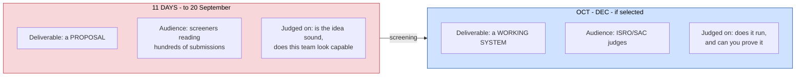
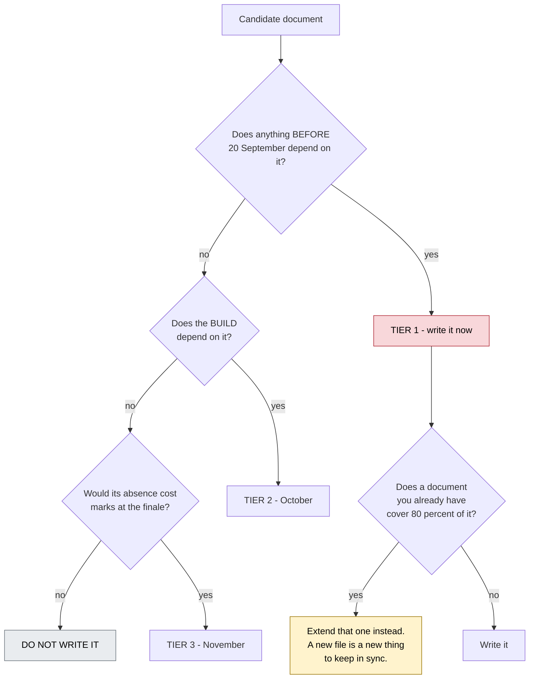
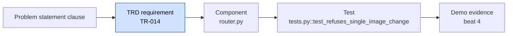
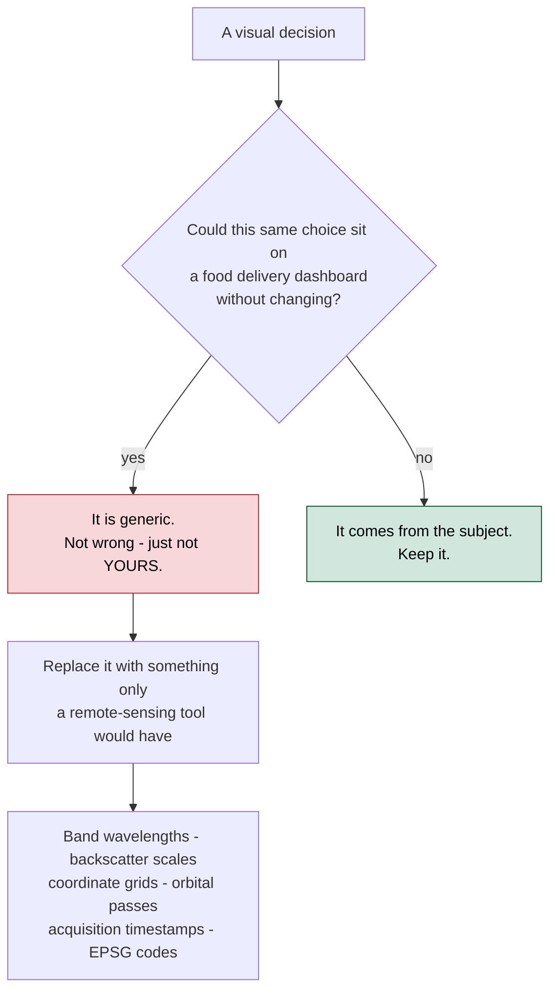
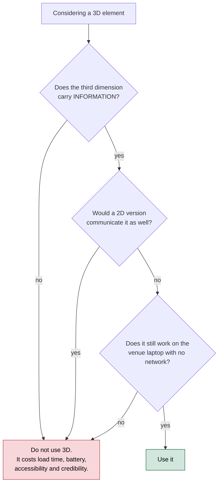
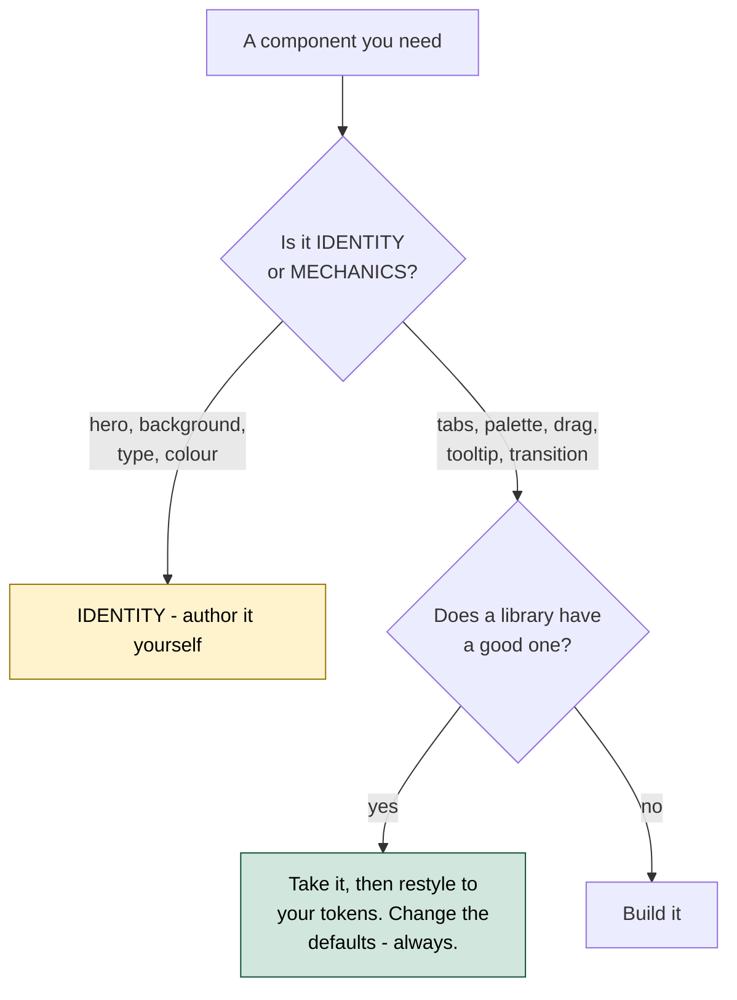
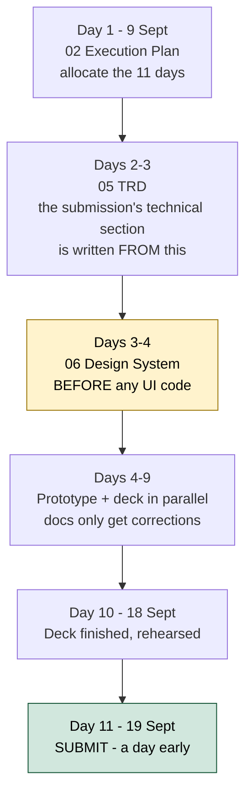

# PS26167 — Documentation Plan & Design Direction

**What to write, in what order, and what to cut.** Plus the UI direction, because half the documents below only exist to protect it.

> **Historical snapshot — read `10_Decision_Record.md` first for anything current.** Written 9 September, one day before the `cebd3d1` restructure. Its predictions did not all hold: it recommends against ever writing a PRD ("a third copy that drifts") and reality now has one at `07_PRD.md`, for reasons `07_PRD.md`'s own header explains (a two-person ownership split that did not exist on 9 Sept). It plans a TRD at `05`; the TRD that was actually written lives at `08`, and `05` became `05_System_Design.md`, which this plan never anticipated. `02_Execution_Plan.md` was never written under that name — `10_Decision_Record.md` §8's checkpoint table now does that job. Its `mvp/` path references (§2, §6) predate the flattening restructure and are dead links. Treat everything in §4 (the design direction) as live and unaffected by any of this; treat §0–§3 and §5–§6 as a record of what was planned, not what exists.

---

## 0. The constraint that decides everything

**Today is 9 September 2026. The portal closes 20 September. You have 11 days.**

That single fact reorganises this entire plan. The instinct behind "how much doc do I need" is to enumerate everything a serious software project carries — PRD, TRD, ADRs, data spec, API contract, test plan, runbook, design system, UI spec. Fifteen or more documents. That set is correct for a six-month product and **actively harmful for an eleven-day sprint**, because every hour spent on a document nobody reads before 20 September is an hour not spent on the prototype that gets you nominated.

So this plan does two things at once:

1. **Lists the full set** — every document the project will eventually need
2. **Ranks it against 11 days** — what must exist by 20 September, what waits for October, what to never write at all



A document written for the second column and delivered in the first column is waste. That is the whole analysis.

> **Deadline caveat:** 20 September comes from `BRANCHING.md` and `PS26143_Brief.md`, both written from the portal scrape. Third-party reporting said 30 September. **Confirm with your SPOC.** This plan assumes the earlier date because the asymmetry is brutal — ten days gained if wrong the safe way, campaign over if wrong the other way.

---

## 1. The decision tree — does this document earn its place?

Run every candidate document through this before writing a word of it.



**The merge branch is the one most teams miss.** You already have a 105 KB analysis and a 37 KB model specification. Most "missing" documents are actually sections that belong inside those, and splitting them out creates two files that drift apart within a week.

---

## 2. The full document set, tiered

### Tier 0 — already exists

| # | Document | Size | Status |
|---|---|---|---|
| 00 | `00_Official_Problem_Statement.md` | 12 KB | ✅ authoritative PS text + data defects |
| 01 | `01_Complete_Deep_Analysis.md` | 115 KB | ✅ domain, datasets, architecture, evaluation, risk |
| 03 | `03_Model_Specification.md` | 38 KB | ✅ the build contract — 6 components, sources, configs |
| — | `mvp/README.md` | 4 KB | ✅ scaffold, module map, build order |

**That is already more than most SIH teams will have on 20 September.** The gap is not analysis. It is the three documents below.

### Tier 1 — must exist by 20 September

| # | Document | Effort | Why it cannot wait |
|---|---|---|---|
| **02** | `02_Execution_Plan.md` | 3 h | The 11 days have to be allocated, or they evaporate |
| **05** | `05_TRD.md` | 6 h | The submission's "technical approach" section is written *from* this |
| **06** | `06_Design_System.md` | 5 h | Written **before** any UI code. See §4 — this is the document that prevents the generic look |
| — | **The submission deck** | 8 h | The actual deliverable. Prescribed template on sih.gov.in |

**Total: about 22 hours of writing across 11 days.** That is one person, roughly two hours a day, while the rest of the team builds. It fits.

### Tier 2 — October, once screening is running

| # | Document | Why it waits |
|---|---|---|
| 07 | `07_UI_Specification.md` | Screen-by-screen. Meaningless until the design system exists and the pipeline returns real shapes |
| 08 | `08_Data_Engineering_Spec.md` | Ingestion, harmonisation, the geographic split. Needed when you actually run training, not to describe it |
| 09 | `09_Training_Runbook.md` | The commands, seeds, checkpoints, what to do when a run dies at 3 a.m. Written *while* training, never before |
| 10 | `10_Evaluation_Protocol.md` | Metrics and the A–E ablation. Currently §37–§38 of `01`. Extract when you start filling in real numbers |
| 11 | `11_API_Contract.md` | Endpoints and schemas. Extract from the TRD once the routes stop moving |

### Tier 3 — November, if selected

| # | Document | Purpose |
|---|---|---|
| 12 | `12_Demo_Script.md` | The five-minute run, beat by beat. Currently §43 of `01`; extract when you rehearse |
| 13 | `ADR/NNN-*.md` | Architecture decision records — one page each, only for decisions you had to argue about |
| 14 | `14_Limitations.md` | What is real and what is simulated. **Non-negotiable if any part of the demo is synthetic** |

### Never write these

| Document | Why not |
|---|---|
| A separate PRD | `01` §1–§6 and `03` §0 already state the problem, the users, the scope and the mandatory capabilities. A PRD would be a third copy that drifts |
| A test plan | `mvp/satquery/tests.py` is the test plan. A document describing tests you have not written is fiction |
| A deployment guide | The deliverable is *"codes and models including test and demonstration"*, not a production deployment. `docker compose up` in a README is enough |
| A user manual | If a judge needs a manual to use it in five minutes, the interface has failed |
| A project charter, RACI, or comms plan | Six students on a hackathon. Talk to each other |

---

## 3. What goes in each Tier 1 document

### 02 — Execution Plan

Mirror `Mridul/PS26073/docs/02_Execution_Plan.md`, which already exists and is structurally correct. Three phases with different deliverables: Selection (11 days, a proposal), Build (Oct–Nov), Grand Finale (36 hours, integration not construction).

What changes for 26167: the prototype target. For PS26073 it was a drift-detection chart. Here it is **one working single-image VQA call against a remote-sensing-adapted model**, plus the number showing adaptation improved it. That is the evidence the proposal rests on.

### 05 — TRD (Technical Requirements Document)

You asked for "the latest TRD". Modern practice has moved away from the old waterfall TRD — a 60-page specification written before any code — toward something much shorter and testable.

**A 2026 TRD is a contract, not a description.** Every requirement is:

- **Atomic** — one requirement, one line, one ID
- **Testable** — a pass/fail check exists, not a judgement call
- **Traced** — links back to a problem-statement clause and forward to the component that satisfies it
- **Versioned** — requirements change; the document records that they did



Structure, roughly 10–14 pages:

| Section | Content |
|---|---|
| 1. Scope and context | Two paragraphs. Point at `00` and `01`, do not restate them |
| 2. Functional requirements | `TR-001…` one line each, grouped by the five mandatory capabilities |
| 3. Non-functional requirements | Latency p50/p95, VRAM ceiling, offline operation, model licence |
| 4. Interface requirements | Input formats, refusal conditions, output schema, the execution trace |
| 5. Data requirements | Sources, splits, the geographic-split rule, what is never committed |
| 6. Constraints and assumptions | The hidden evaluation set, the unknown rubric, the venue machine |
| 7. Traceability matrix | Requirement → component → test → demo beat |
| 8. Verification | How each requirement is proven, and by whom |

**The traceability matrix is the reason to write a TRD at all.** `01` has a requirement matrix already; the TRD's version adds the *test* column, which is what turns "we built it" into "here is the check that proves it."

### 06 — Design System

This is the document you actually care about, so §4 covers it in full.

---

## 4. The design direction

You named three constraints: **use Three.js**, **the typography must not be basic**, and **no basic glassmorphism**. All three are right, and all three are easy to get wrong in the same way.

### 4.1 The failure mode to design against

Every hackathon satellite-imagery project looks like this: a dark navy background, a glass card with `backdrop-filter: blur(12px)`, Inter or Space Grotesk, a purple-to-blue gradient somewhere, a floating-particle hero, and a map squeezed into a panel on the right.

It reads as *generic* not because any one choice is bad, but because the set of choices is the default set. The way out is not "more effects". It is **grounding the interface in the subject's own world.**



The subject here is unusually rich: **radar backscatter in decibels, spectral bands with real wavelengths, sub-metre ground sample distance, coordinate reference systems, acquisition times in UTC, orbital passes.** An interface that uses that vocabulary as *material* — real units on real axes, sensor metadata visible rather than hidden — reads as instrumentation rather than as a template. And it costs nothing extra, because the data is already there.

### 4.2 Where Three.js earns its place, and where it does not

This is the decision that separates a tool from a tech demo.



**Where 3D genuinely earns it in this product:**

| Surface | What the third dimension encodes | Library |
|---|---|---|
| **The modality stack** ⭐ | Optical and SAR as two separable planes in space, with the fusion result between them. Drag to pull them apart | `@react-three/fiber` + `drei` |
| **The temporal stack** | T1 and T2 as depth-offset layers, the change mask floating between them | same |
| **Orientation globe** | Where on Earth this scene is — a small, always-visible anchor | `react-globe.gl` or `r3f-globe` |

That first one is worth dwelling on. Requirement 5.4 asks you to demonstrate that optical and SAR carry **complementary** information. Most teams will show that as a table of numbers. Showing it as two physical planes a judge can pull apart, with the fusion between them, makes the mandatory requirement *visible in one gesture*. **That is 3D serving the specification, not decorating it.**

**Where 3D is a liability:** particle-field heroes, spinning wireframe globes with no data on them, animated shader backgrounds behind text, a 3D logo. Each costs load time and says nothing.

### 4.3 React Bits and 21st.dev — the rule for using them

Both are excellent, and both carry the same risk.

| | React Bits | 21st.dev |
|---|---|---|
| What | 165+ animated components — backgrounds, text effects, animations | 12,000+ community components, shadcn registry format |
| Tech | Motion, GSAP, Three.js, OGL shaders | React + Tailwind, composes with shadcn/ui primitives |
| Install | CLI copies **source into your project**, no dependency added | shadcn CLI, or an AI-ready prompt |
| Risk | Its shader backgrounds — Silk, Iridescence, LiquidChrome — are **instantly recognisable** | The most-bookmarked hero blocks appear on hundreds of sites |

Because both copy source rather than adding a dependency, you are free to edit anything. Which leads to the rule:

> ### Borrow interaction. Author identity.
>
> Take **mechanics** from these libraries — a well-built command palette, tab transitions, a scroll-linked reveal, a good drag interaction. These are solved problems and rebuilding them wastes days.
>
> Never take **identity** — the hero, the background, the type treatment, the colour system. The moment a judge recognises a component, your product becomes "the one that used React Bits."



Practical: `ModelViewer` and `AnimatedContent` from React Bits are useful. `Iridescence` and `LiquidChrome` are the trap — beautiful, and the exact thing the brief means by "basic things".

### 4.4 Beyond glassmorphism

Your instinct is right, and 2026 practice agrees. Glass has not disappeared — it has become **selective and surgical**, applied only to genuinely floating surfaces (a modal, a command palette, a toolbar over the map) and never as a general card treatment.

What replaces it as the primary structural device:

| Device | What it does here |
|---|---|
| **Spatial depth** | Elevation, overlap and scale communicate hierarchy — what is primary, what is context. On a map interface this is literal: basemap → imagery → overlays → controls |
| **Bento grids** | Asymmetric modular cards. Large card = the map. Small cards = trace, confidence, metadata. Dense without noise |
| **Data density as an aesthetic** | Instrument panels, not marketing cards. Show the CRS, the band count, the acquisition time. Density signals competence to a technical judge |
| **Selective glass** | Only the floating toolbar over the map, and the command palette. Nowhere else |

### 4.5 Typography

Avoid Inter, Space Grotesk and Poppins — not because they are bad, but because they are the default of every AI-generated interface, and a judge who has seen forty submissions has seen them forty times.

Variable fonts are the 2026 direction: type that the interface tunes at runtime across weight, width and optical size.

**Recommended pairing for this product:**

| Role | Face | Why |
|---|---|---|
| **Display** | **Bricolage Grotesque** | Genuinely variable — optical size *and* width axes. Distinctive without being decorative. Not yet overused |
| **Body / UI** | **IBM Plex Sans** | Institutional, technical, designed for engineering documentation. Reads as ISRO-adjacent rather than startup-adjacent |
| **Data / mono** | **IBM Plex Mono** | Coordinates, EPSG codes, timestamps, confidence values, the execution trace — all of it is *data* and should be set as data |

All three are on Google Fonts and free. The Plex family shares a design language, so the pairing is coherent rather than accidental.

**The rule that matters more than the choice:** anything that is a *value* — a latitude, a band number, a backscatter figure, a model version — gets the mono face and `font-variant-numeric: tabular-nums`. That single decision does more for the "instrument, not template" feel than any background effect.

### 4.6 What `06_Design_System.md` must contain

Write this **before** any UI code, because retrofitting a design system onto built screens never works.

| Section | Content |
|---|---|
| 1. Direction | One paragraph: what this interface is, in the subject's own terms. Written to be argued with |
| 2. Colour tokens | Complete light palette on `:root`, dark redefinition. Semantic colours (valid / degraded / refused) **separate** from the accent |
| 3. Typography | The three faces, the type scale, and the tabular-numerals rule |
| 4. Spatial system | Elevation levels, what each means, when glass is permitted (the answer is: twice) |
| 5. Layout | The bento composition. Map primary, trace always visible, metadata in the margin |
| 6. Motion | What animates, what does not, and `prefers-reduced-motion` |
| 7. 3D policy | §4.2's decision tree, plus the three approved surfaces |
| 8. Component sourcing | §4.3's rule, plus a list of what was borrowed and from where |
| 9. Anti-patterns | The specific list of things not to do, so a teammate at 2 a.m. does not reintroduce them |

---

## 5. Writing order for the 11 days



**Design system on day 3–4, not day 9.** It is upstream of every UI decision the team makes for the next three months. Written late, it documents whatever accidentally happened instead of directing it.

**Submit on 19 September.** Portal load on deadline day is a known failure mode, and a missed submission ends the campaign regardless of the work behind it.

---

## 6. Summary — the honest answer

**You asked how much documentation you need. The answer is three documents and a deck.**

```
ALREADY HAVE     00 · 01 · 03 · mvp/README        169 KB
WRITE NOW        02 · 05 TRD · 06 Design System   ~22 hours
                 + the submission deck
WAIT             07-11  (October)
WAIT LONGER      12-14  (November)
NEVER            PRD · test plan · deploy guide · user manual · charter
```

The temptation with eleven days left is to write more documents, because writing feels like progress and building is uncomfortable. Resist it. **The single most valuable artefact you can produce before 20 September is not a document at all** — it is one screenshot of a remote-sensing-adapted model answering a real question about a real satellite image, next to the same question answered worse by the unadapted model.

Every document above exists to get you to that screenshot, or to protect what you build after it.

---

## 7. Sources

- [React Bits](https://reactbits.dev) — 165+ animated React components; Motion, GSAP, Three.js, OGL; CLI copies source in
- [21st.dev](https://21st.dev) — 12,000+ community components in shadcn registry format, React + Tailwind
- [react-globe.gl](https://github.com/vasturiano/react-globe.gl) and [r3f-globe](https://github.com/vasturiano/r3f-globe) — globe visualisation on Three.js / react-three-fiber
- [react-visgl-maplibre](https://github.com/Trapar-waves/react-visgl-maplibre) — Three.js + deck.gl + MapLibre geospatial template
- 2026 UI direction — selective glass, spatial depth, bento grids, variable fonts: [Pixelmatters](https://www.pixelmatters.com/insights/7-UI-design-trends-to-watch-in-2026), [Tubik](https://blog.tubikstudio.com/ui-design-trends-2026/)
- Project documents — `00_Official_Problem_Statement.md`, `01_Complete_Deep_Analysis.md`, `03_Model_Specification.md`
