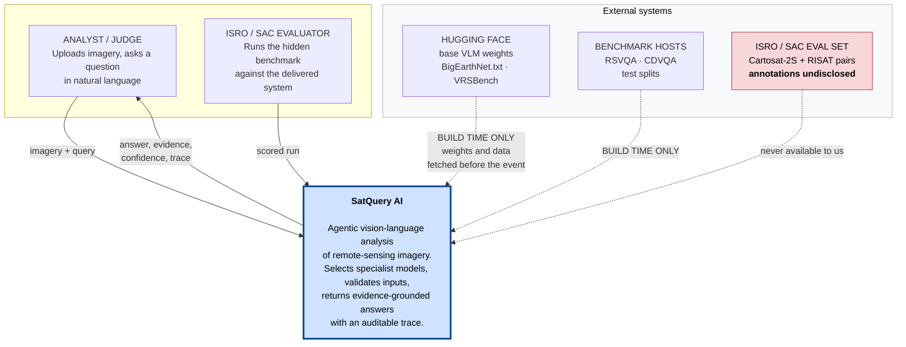
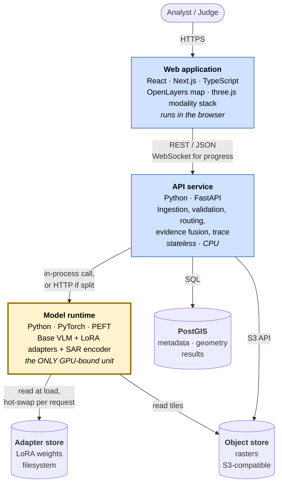
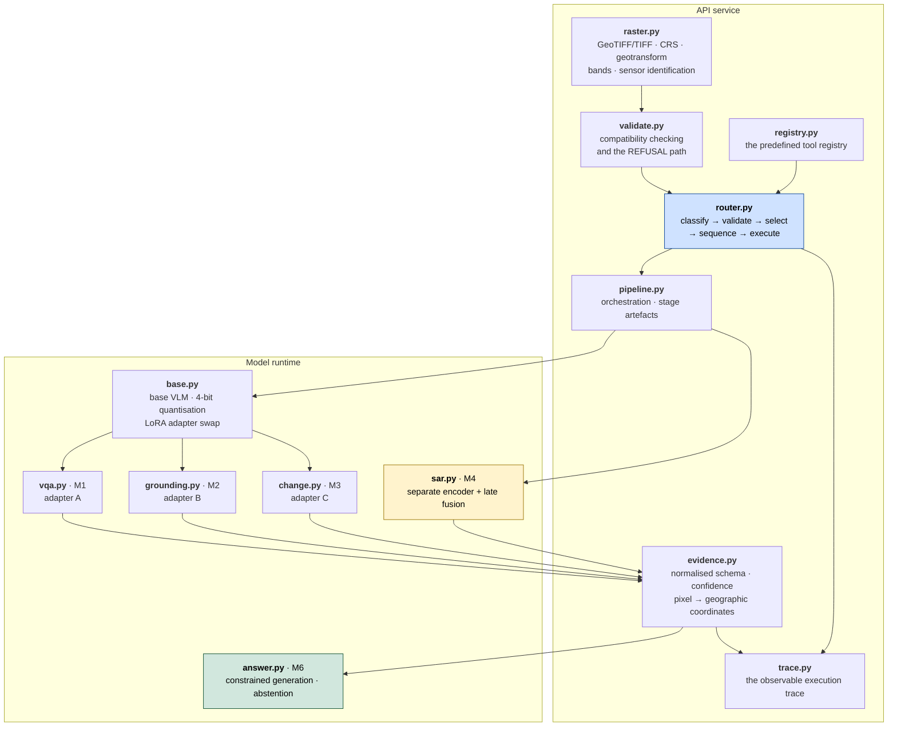
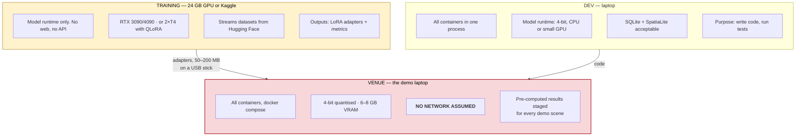
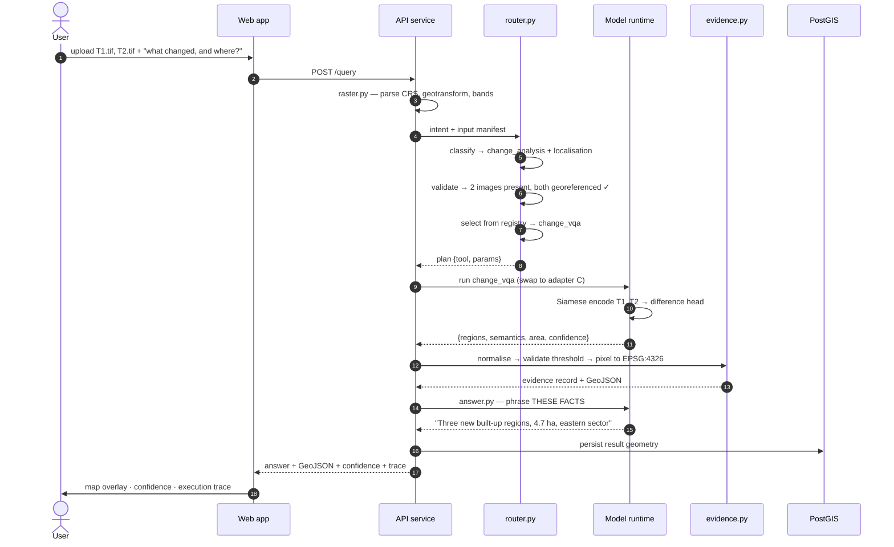
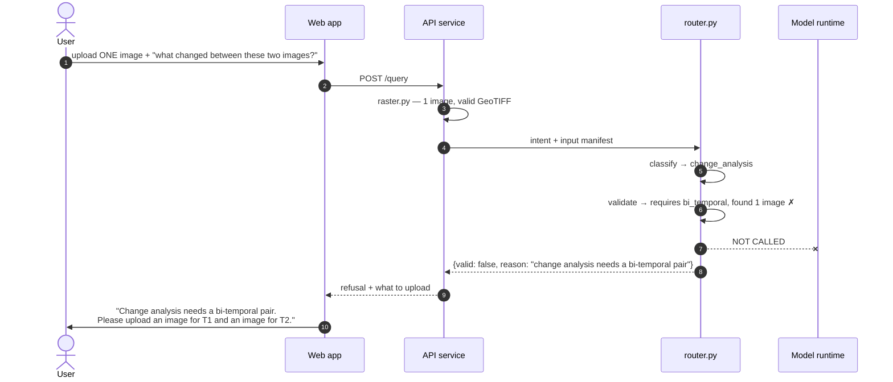
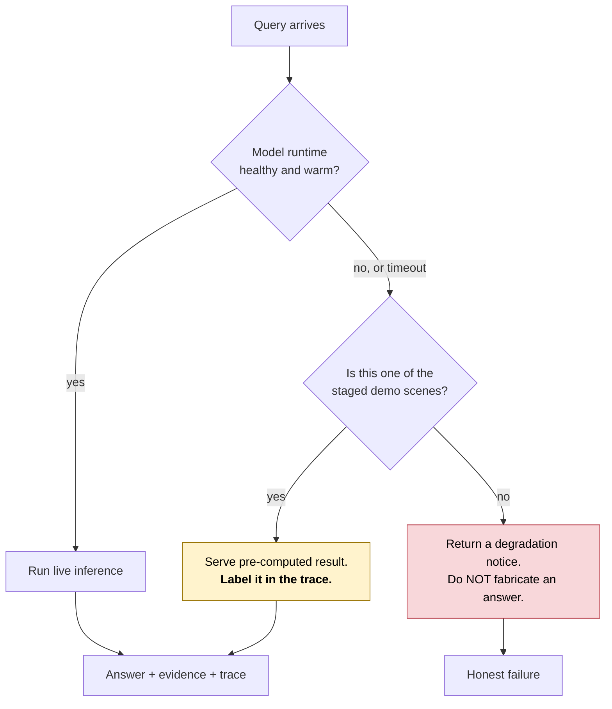

# PS26167 — System Design

**Structure and behaviour.** What the pieces are, how they connect, where they run, and what happens when a request arrives.

For *why* any of it is this way, see [`ADR/`](ADR/). For what each model is and how it is trained, see [`03_Model_Specification.md`](03_Model_Specification.md). This document does not repeat either.

---

## 0. How to read this

The structure is described with the **C4 model** — four levels of zoom, of which three are useful here.

| Level | Question it answers | In this document |
|---|---|---|
| **1 · Context** | Who uses the system, what does it depend on? | §1 |
| **2 · Container** | What are the separately deployable units? | §2 |
| **3 · Component** | What is inside each container? | §3 |
| 4 · Code | What are the classes? | **Deliberately omitted** — see §8 |

Then two views that C4 does not cover but this project needs: **deployment** (§4 — three environments with genuinely different constraints) and **runtime** (§5 — what actually happens per request, including the refusal path).

---

## 1. Level 1 — System context

The whole system as one box. This level exists to make the **boundary** and the **external dependencies** visible, which no other diagram in this project currently does.

### The two facts this diagram exists to state

**Every external dependency is build-time, not run-time.** Weights and datasets are fetched before the event. Once fetched, the system runs with no network at all. That is not an incidental property — it is the requirement that makes a venue demo survivable, and it is invisible unless somebody draws this diagram.

**The evaluation set is outside the boundary and stays there.** Cartosat-2S and RISAT pairs with undisclosed annotations. You cannot tune against it, which is why the objective is distribution robustness rather than benchmark peak, and why the stress-test suite in `01` §40 exists.

---

## 2. Level 2 — Containers

Separately deployable units and the protocols between them.

| Container | Technology | Scaling | Fails how |
|---|---|---|---|
| Web application | React, Next.js, OpenLayers, three.js | CDN, stateless | Degrades to no map — the answer text still renders |
| API service | Python, FastAPI | Horizontal, stateless | Total outage |
| **Model runtime** | PyTorch, PEFT, bitsandbytes | **Vertical — bound by VRAM** | **Falls back to pre-computed results** |
| PostGIS | PostgreSQL 16 + PostGIS 3 | Single instance is ample | Results not persisted; live query still answers |
| Object store | MinIO or S3 | — | No imagery can be read — hard failure |
| Adapter store | Filesystem, 50–200 MB per adapter | — | Base model only, degraded accuracy |

### Why the model runtime is its own container

This is the load-bearing decision on this diagram, and it is architectural rather than cosmetic.

The model runtime is the only unit that needs a GPU, the only one with a multi-second warm-up, and the only one that can exhaust memory. **Isolating it behind a clean interface is precisely what makes the venue fallback possible** — if it fails or is too slow, the API service serves pre-computed results for the demo scenes and the rest of the system is unaware.

Collapse it into the API service and that escape hatch disappears. See §4.

In development it can run in-process for convenience; the interface is defined so that splitting it is a configuration change rather than a rewrite.

---

## 3. Level 3 — Components

Inside the two containers that carry logic. Modules map one-to-one onto files in `satquery/` (flattened to repo root in the `cebd3d1` restructure — this section predates that move and originally said `mvp/satquery/`).

### Two structural properties worth naming

**`sar.py` hangs off `pipeline.py`, not off `base.py`.** That is ADR-003 made visible — the SAR encoder is the one model outside the shared base, because backscatter is not reflectance and a photograph-trained encoder misreads it.

**`answer.py` is downstream of `evidence.py`, never of a model.** That is ADR-007 made visible. There is no arrow from any vision model directly to the answer generator, because the language layer never sees pixels — only validated evidence records.

An architecture diagram earns its keep when a rule is checkable by following arrows. Both of these are.

---

## 4. Deployment view

Three environments with genuinely different constraints. C4 does not cover this and it matters more here than the component diagram does.

### The venue environment is the one that decides the outcome

| Constraint | Consequence for the design |
|---|---|
| No network | Every weight, dataset sample and map tile is local. No CDN font, no remote basemap, no model download |
| 6–8 GB VRAM | 4-bit quantisation is mandatory, not an optimisation |
| One machine | `docker compose up` must bring up everything, first time, cold |
| Ten-minute slot | p95 latency budget is seconds. Warm the model before the judge arrives |
| Hostile Wi-Fi | Pre-computed results for every demo scene, served when the model runtime is slow or down |

**Test on the actual laptop in November, not in December.** The gap between "runs on my machine" and "runs on the venue machine" is where hackathon demos die, and it is discovered only by doing it.

---

## 5. Runtime view

What actually happens between the user pressing enter and evidence appearing on the map.

### 5.1 Nominal — a bi-temporal change query

Note step 15: `answer.py` is handed **facts**, not the image. The area figure of 4.7 ha came from a vision model and was validated before any sentence was written about it.

### 5.2 The refusal path

The behaviour most competing systems will not have, and the one worth fifteen seconds of the demo.

**No model is invoked.** A system without this validation runs the change model on a duplicated input and returns a confident, meaningless answer — which is exactly what the statement's *"check the number, modality, format, metadata, and compatibility of the input images"* clause exists to prevent.

### 5.3 The degraded path — venue fallback

**Label the cache in the trace.** A pre-computed result presented as live inference is a fabrication, and an undisclosed one is the kind of thing that ends a project's credibility when found. Disclosed, it reads as engineering prudence.

---

## 6. Cross-cutting concerns

| Concern | Where it lives | Rule |
|---|---|---|
| **Coordinate integrity** | `raster.py`, `evidence.py` | Every spatial output carries its CRS. Pixel coordinates never leave the API service |
| **Confidence** | `evidence.py` | Every claim carries one, and it is calibrated and measured — not decorative |
| **Auditability** | `trace.py` | Every request emits a trace. Never chain-of-thought — ADR-008 |
| **Abstention** | `answer.py` | Below threshold, decline. Measure abstention precision alongside accuracy |
| **Failure** | all | Flag with a reason, never silently drop. A malformed GeoTIFF produces a readable error, not a stack trace |
| **Determinism** | `pipeline.py` | Record the seed. A demo that cannot be replayed cannot be debugged |

---

## 7. Quality attribute scenarios

Non-functional requirements written as testable scenarios rather than adjectives. *"The system should be fast"* cannot be checked; these can.

| # | Scenario | Measure |
|---|---|---|
| QA-1 | A judge submits a single-image VQA query on the venue laptop with no network. | Answer with evidence in **< 8 s at p95** |
| QA-2 | A judge submits a bi-temporal change query on the same machine. | Answer with change geometry in **< 15 s at p95** |
| QA-3 | A judge uploads one image and asks a change question. | Refusal with a reason in **< 1 s**, no model invoked |
| QA-4 | A malformed GeoTIFF with no CRS is uploaded. | Readable error naming the missing field. **No crash** |
| QA-5 | The model runtime is unavailable during the demo. | Staged scenes still answer, labelled as pre-computed in the trace |
| QA-6 | The system reports confidence 0.9 on a set of queries. | It is correct on **≈ 90%** of them. Expected calibration error reported |
| QA-7 | The model runtime is loaded on a 6 GB laptop GPU. | Loads and serves at 4-bit **without OOM** |
| QA-8 | An adapter is swapped between two consecutive requests. | Swap adds **< 200 ms** |

These belong in the TRD's non-functional section and are repeated here because they constrain the design, not just the implementation.

---

## 8. What this document deliberately omits

**C4 Level 4 — code and class diagrams.** Excluded on principle, not to save time. It is the only level that duplicates something already machine-readable, so it is the level that rots fastest and misleads worst once it has. The module map in §3 stops at file granularity; below that, `satquery/` is the documentation.

**A separate SAD, arc42, or 4+1 document.** Those templates are rearrangements of §1–§5 plus content that lives in the TRD and the ADRs. Producing one would be a third copy of material that already exists twice.

**Security and threat modelling.** Out of scope: no authentication, no multi-tenancy, no untrusted uploads beyond the demo path. Revisit if the system is ever exposed beyond a demo.

---

## 9. Related documents

| Document | Answers |
|---|---|
| [`00_Official_Problem_Statement.md`](00_Official_Problem_Statement.md) | What ISRO actually asked for — the source of truth |
| [`01_Complete_Deep_Analysis.md`](01_Complete_Deep_Analysis.md) | Domain foundations, datasets, evaluation, risk |
| [`03_Model_Specification.md`](03_Model_Specification.md) | What each model is, its data, its training config, its targets |
| [`04_Documentation_Plan.md`](04_Documentation_Plan.md) | Which documents exist, which are deferred, the design direction |
| [`ADR/`](ADR/) | **Why** each structural choice was made, and what was rejected |
| [`../README.md`](../README.md) | The package, module map and build order |
