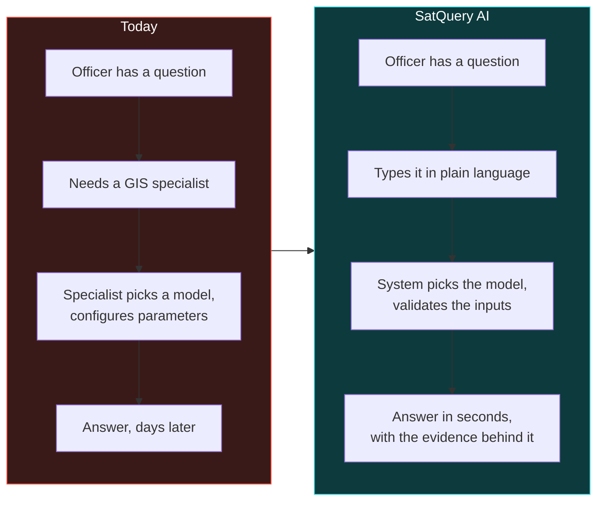

# PS26167 — Product Requirements Document

**SatQuery AI.** Smart India Hackathon 2026 · Indian Space Research Organisation · PS 26167.

| | |
|---|---|
| **Status** | PS26167 is the sole submission (`10_Decision_Record.md`). M1 in progress. Two-owner split active — see §7a |
| **Owner** | **Mridul** — remote-sensing adaptation, specialist model quality (§5.1–§5.4) · **Shreyash** — orchestration, infra, interface, data/evaluation integrity (§5.5 and everything not a model) |
| **Version** | 0.4.0-mvp |
| **Last updated** | 2026-09-11 |
| **Submission deadline** | **Unresolved — see the flag below.** `PS26143_Brief.md` and `BRANCHING.md` both say **20 September 2026** for the SIH portal generally. `10_Decision_Record.md` §8 lays out checkpoints running to **30 September**. Nobody has reconciled these. Treat 20 Sep as binding until someone confirms otherwise with the SPOC — `OPEN-3` in `08_TRD.md` has carried this open since before this document existed and it is now the single highest-leverage unknown in the schedule |

---

## 1. The problem, in the user's terms

A district officer wants to know whether construction has increased near a reservoir since 2024.

Today that question costs them a specialist. Remote-sensing imagery exists and much of it is free, but extracting an answer requires knowing which model applies, how sensors behave, how GIS software works, and what parameters to set. The tooling is built one task at a time — one model classifies land cover, another detects buildings, a third counts objects, a fourth detects change — and none of them accepts a question.

**The gap is not model capability. It is that no interface accepts a question.**

---

## 2. Users

| User | Needs | Success looks like |
|---|---|---|
| **District / disaster officer** | An answer without a GIS course | Asks in plain language, gets an answer with a map and a confidence value |
| **Remote-sensing analyst** | Speed on routine questions, with auditability | Skips manual model selection; can inspect exactly what ran and check it |
| **ISRO/SAC evaluator** | Evidence the system is correct, not just fluent | Every claim traces to a measurement; the trace shows what was selected and run |
| **Judge (SIH finale)** | To understand it in ten minutes | The refusal path and the cross-modal recovery are visible in one gesture each |
| **The other owner, reading this half of the build** | To know exactly what changed without re-deriving it from a diff | Every capability row below states its owner; `10_Decision_Record.md` §9 rule 1 — report what was measured |

---

## 3. Scope

### In scope

| # | Capability | Requirement | Owner |
|---|---|---|---|
| 1 | Remote-sensing adaptation of at least one visual component | §5.1 — **mandatory** | Mridul |
| 2 | Single-image VQA **plus** text-guided grounding | §5.2 — **mandatory** | Mridul (model), Shreyash (dispatch) |
| 3 | Bi-temporal change description and change VQA | §5.3 — **mandatory** | Mridul (model), Shreyash (dispatch) |
| 4 | Complementary extraction from a co-registered optical–SAR pair | §5.4 — **mandatory** | Mridul (model), Shreyash (dispatch) |
| 5 | Agentic selection, sequencing and execution from a fixed registry | §5.5 — **mandatory** | Shreyash |
| 6 | Input compatibility checking, including **refusal** | §5.5 | Shreyash |
| 7 | Evidence-grounded output: geometry, confidence, execution trace, export | Expected Solution | Shreyash |
| 8 | Interactive web application | Expected Solution | Shreyash |
| 9 | Input **upload** — a file actually reaches the system | Defined Input Scope — **mandatory, currently absent** | Shreyash |

Row 9 is new in this revision. It was not a scope line before because nothing in `docs/00` was read as requiring it explicitly — the external review (`09_External_Review_And_Recommendation.md` §4.1) is the reason it is here now: the PS's own words are *"Input upload and compatibility checking"*, and today there are zero `<input type=file>` elements anywhere in the interface.

### Explicitly out of scope

| Excluded | Why |
|---|---|
| Research-grade co-registration | The scored data arrives pre-registered — ADR-003 note. Validate, do not solve |
| Captioning | The statement offers a choice; grounding was taken — ADR-002 |
| Authentication, multi-tenancy | Not a deliverable; adds surface with no marks |
| Training new foundation models | LoRA adaptation only — ADR-001 |
| Real-time satellite tasking | Not asked for |
| Mobile app | The deliverable is a GUI or web application |
| RSVQA / CDVQA benchmark loaders for M1 | Deferred to M2–M3 per `10_Decision_Record.md` §7 |
| Full BigEarthNet imagery (155 GB) | Corpus decision is VRSBench for M1 — §4 of the decision record |

---

## 4. The product principle

> **Vision models produce the facts. The language layer only phrases them. Never the reverse.**

Enforced structurally, not by discipline: `pipeline.answer()` takes an `EvidenceSet` and no raster, so it cannot invent a number it was never given. A test asserts the signature (ADR-007).

This is the difference between a system a space agency can use and a chatbot that sounds confident. It is also, not coincidentally, the same principle the external review invokes for the *evaluation* layer: a metric measured on its own construction, or a label that overstates what ran, is the documentation-layer version of the same defect (`10_Decision_Record.md` §9, rules 1–2). Product honesty and code honesty are one requirement, not two.

---

## 5. User stories, with acceptance criteria

### US-1 · Ask a question about one image
> *As an officer, I upload a scene and ask "how many built-up areas are visible?"*

**Accepts when** the answer states a count produced by connected-component labelling; the evidence panel shows the region geometry in EPSG:4326; a confidence value is displayed; the trace names the tool and its parameters.

### US-2 · Locate a feature
> *As an analyst, I ask "highlight the water body".*

**Accepts when** boxes appear on the scene in geographic coordinates; each carries an area in hectares; GeoJSON export opens in QGIS at the right place.

### US-3 · Compare two dates
> *As an officer, I supply two dates and ask what changed.*

**Accepts when** changed regions are reported with area; the change is classified semantically (construction vs regrowth) rather than only detected; the built-up trend is quantified in percentage points.

### US-4 · Use both sensors — the differentiator
> *As an analyst, I ask the system to use optical and SAR together.*

**Accepts when** the answer states what each sensor contributed **separately**, quantifies the cloud fraction blinding the optical scene, and reports the built-up area **recovered by SAR beneath that cloud** — information neither sensor provides alone.

### US-5 · Be refused when the question cannot be answered — the trust story
> *As a judge, I upload one image and ask what changed between two dates.*

**Accepts when** the system refuses; the trace shows the compatibility check failing; **no model is invoked**; the message says what to upload instead.

### US-6 · Be told when the system is unsure
> *As an officer, I ask about something not in the scene.*

**Accepts when** the system abstains rather than answering, and says so.

### US-7 · See what data and models are actually in use
> *As a judge, I want to know which datasets this is built on.*

**Accepts when** all four named public datasets plus the hidden ISRO/SAC set are listed with purpose, scale, source, and **their real local state** — not an aspirational list.

### US-8 · Hand the system an actual file — currently fails
> *As an evaluator, I have a GeoTIFF pair on my own machine and want to run the system against it, not the bundled synthetic scene.*

**Accepts when** a `POST` upload route accepts GeoTIFF/TIFF, calls `raster.read()` (which already exists and is already tested — `raster.py:263`), runs the same compatibility manifest as the synthetic path, and either proceeds or refuses on the same terms as US-5. **Today this story fails at the first step**: there is no route to call. This is `TR-007` below, owner Shreyash, checkpoint 24 Sep.

---

## 6. Non-functional requirements

| ID | Requirement | Target | Verified by | Owner |
|---|---|---|---|---|
| NFR-1 | Single-image query latency | < 8 s p95 on the venue laptop | `elapsed_ms` in every result | Shreyash |
| NFR-2 | Cross-modal query latency | < 15 s p95 | measured: ~90 ms | Shreyash |
| NFR-3 | Refusal latency | < 1 s, no model invoked | measured: ~0 ms | Shreyash |
| NFR-4 | Operates with no network | mandatory | no runtime external calls | Shreyash |
| NFR-5 | Inference VRAM when adapters load | ≤ 8 GB at 4-bit | **not yet measurable — no adapter exists** | Mridul |
| NFR-6 | Runs with no GPU at all | mandatory | classical path, measured | Shreyash |
| NFR-7 | Malformed raster produces a readable error | no stack trace to the user | `raster.read` raises typed errors | Shreyash |
| NFR-8 | Deterministic under a recorded seed | mandatory | `save_run` records seed and environment | Shreyash |
| NFR-9 | Confidence is calibrated | ECE reported | `evaluate.expected_calibration_error` | Joint — Shreyash owns the harness, Mridul owns whether the number stays good once a neural specialist is in the loop |
| NFR-10 | Cold start to first answer | < 60 s | `docker compose up` | Shreyash |
| NFR-11 | **Router accuracy is reported only on a held-out set** | accuracy figure must come from paraphrases not used to write `router.py`'s patterns | **not yet met** — see §7a and `09_External_Review…` §5.1 | Shreyash |

---

## 7. What exists today

Measured, not asserted — run `python -m satquery.cli selftest` and `eval`. This table is corrected against the external review (`09_External_Review_And_Recommendation.md`, reviewed commit `2d55bd3`); three rows changed wording from the previous revision because the old wording was itself a finding.

| Capability | State | Evidence | Owner going forward |
|---|---|---|---|
| Raster ingestion, GeoTIFF + geotransform | **working** | round-trip test passes | Shreyash |
| Co-registration validation | **working** | phase correlation; detects a 6 px shift | Shreyash |
| Grounding (water, vegetation, built, bare) | **working, classical** | vegetation IoU 0.9958, water IoU 1.0000 | Mridul |
| SAR structure detection | **working, classical** | F1 0.9450 against the true built-up class | Mridul |
| Change detection | **working, classical** | F1 0.7698 against the true change mask | Mridul |
| Cross-modal recovery | **working, classical** | quantifies area recovered beneath cloud | Mridul |
| Router classify + validate + refuse | **working, but the accuracy figure is not a metric yet** | 1.0000 on the 19 `ROUTER_CASES` — all 19 are matched by the 4 hand-written regexes those cases were written to match. Held-out accuracy: **not measured** | Shreyash |
| Evidence gating and abstention | **working** | ECE 0.0328 | Shreyash |
| Web application with 3D modality stack | **working** | React 19, Three.js 0.186, builds clean | Shreyash |
| **The built UI, served without FastAPI installed** | **broken** | `server.py`'s stdlib fallback has no static-file branch; `/` returns 404 on the numpy+Pillow-only install the README advertises | Shreyash |
| **File upload** | **absent** | zero `<input type=file>` in the interface; `raster.read()` is called by nothing outside `tests.py` | Shreyash |
| **LoRA adapters (M1)** | **not trained; no neural code exists at all** | no `torch`, `transformers` or `peft` anywhere in `satquery/`; `Pipeline(adapters=...)` accepts a pack at all 13 call sites and none pass one | Mridul |

**The honest position, restated:** the orchestration, evidence and interface architecture is real and measured. The model layer is real *classically* — it is not a placeholder — but requirement §5.1 asks specifically for **adaptation**, and nothing adapted exists yet. Two smaller things were also overstated in the previous revision of this document and are fixed above: the router figure was presented as an accuracy metric when it is a construction check, and the "not yet measurable" framing on adapters now makes clear that framing is not a rounding error, it is the whole of requirement 1.

### §7a — the ownership split, made explicit

The team is two people with disjoint skill: Mridul is the ML specialist, Shreyash does everything the PS needs that is not model training. That split maps cleanly onto the gap analysis above — the row that says "not yet measurable" or "not trained" is Mridul's row; the row that says "broken" or "absent" is a plumbing gap and is Shreyash's row. Nothing in the current gap list requires both people in the same file at the same time except one seam, and it is worth naming precisely so neither person blocks on the other longer than necessary:

**The seam:** `Pipeline(adapters=...)` — `specialists.py:105` declares the flag, `pipeline.py:112` sets it, and it is read by the `method` property. Mridul owns what goes *into* that dict (the trained pack, its loading code). Shreyash owns the 13 call sites that currently pass nothing (`evaluate.py:326`, `cli.py:98`, `cli.py:105`, `server.py:133`, nine in `tests.py`). Agree the dict's shape once — model name → adapter path or loaded object — before either side is finished, per `10_Decision_Record.md` §6's instruction to write a stub-adapter test *before* real weights exist. That test is the contract between the two halves; write it early and both people can build against it independently.

---

## 8. Release plan

Replaces the previous milestone table with the dated checkpoints in `10_Decision_Record.md` §8, which is more specific and is the file both owners are asked to keep current.

| Date | Must exist | Owner | If missing |
|---|---|---|---|
| **11 Sep** *(today)* | Stdlib server fix; ablation-row-A relabel; `capability` formula captioned; cloud placement disclosed on the slide | Shreyash | trivial — no excuse, per the decision record's own words |
| **13 Sep** | **Zero-shot VQA baseline on VRSBench, measured, both candidate bases** | Mridul | the real gate — needs no GPU, no training. If this slips, the whole neural track slips |
| **18 Sep** | Training run complete or clearly converging | Mridul | reduce scope, or ship the classical path with honest framing per §7 above |
| **22 Sep** | Adapted number, stated gain (not absolute), adapter pack wired into `Pipeline(adapters=...)` | Joint — Mridul delivers the pack, Shreyash wires the call sites against the stub contract from §7a | stop adding scope; consolidate what works |
| **24 Sep** | Upload endpoint (`TR-007`) working end to end | Shreyash | — |
| **20 or 30 Sep** *(unresolved — see header)* | Submission | — | resolve this date before 18 Sep or the training checkpoint above is scheduled against the wrong deadline |

M2 (grounding refinement), M3 (change adapter), M4 (optical–SAR adapter) are explicitly post-submission per the decision record §7 and are not scheduled here.

---

## 9. Risks

| Risk | Impact | Mitigation | Owner |
|---|---|---|---|
| No trained adapter before the deadline | §5.1 unproven neurally — the one disqualifying gap | Zero-shot baseline first (13 Sep gate), classical path stands on its own if training slips | Mridul |
| Domain gap to Cartosat/RISAT | Public scores may not transfer to the hidden ISRO/SAC set | Optimise robustness, not benchmark peak; stress-test suite | Mridul |
| Judging weights unknown — PS ships an unfilled placeholder table | Cannot optimise toward a target | Balance across all five mandatory capabilities, per decision record §3 | Shreyash (product framing), Mridul (model balance) |
| Submission date conflicting between sources (20 Sep vs 30 Sep) | Every downstream checkpoint in §8 is scheduled against an unconfirmed date | Confirm with SPOC before 13 Sep; escalate now, not later | Shreyash |
| A judge follows the README on a clean install and sees a 404 | Kills the first impression before the model is ever reached | `TR-087` — fix the stdlib static-file path | Shreyash |
| Router's 1.0000 accuracy read as a real metric by a judge | Credibility collapse once one number is caught — review's central warning | Build and report the held-out set (`NFR-11`) before presenting the figure anywhere | Shreyash |
| Synthetic imagery misread as a fake demo | Credibility | Disclose prominently in the UI; state exactly what is real, including *why* the cloud sits where it sits (`scene.py:223`) | Shreyash |
| Venue has no network | Demo fails | No runtime external calls; verified | Shreyash |

---

## 10. Related

| Document | Covers |
|---|---|
| [`00_Official_Problem_Statement.md`](00_Official_Problem_Statement.md) | The authoritative requirement |
| [`08_TRD.md`](08_TRD.md) | Atomic, testable, traced requirements — now with an Owner column per row |
| [`09_External_Review_And_Recommendation.md`](09_External_Review_And_Recommendation.md) | The technical audit this revision corrects against |
| [`10_Decision_Record.md`](10_Decision_Record.md) | What is settled, what is open, and the dates — the file to keep current |
| [`05_System_Design.md`](05_System_Design.md) | C4, deployment, runtime views |
| [`03_Model_Specification.md`](03_Model_Specification.md) | The six model components, and the published-anchor targets in decision record §3 |
| [`06_Design_System.md`](06_Design_System.md) | Visual identity and the 3D policy |
| [`ADR/`](ADR/) | Why each structural choice was made |
